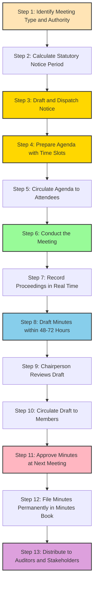
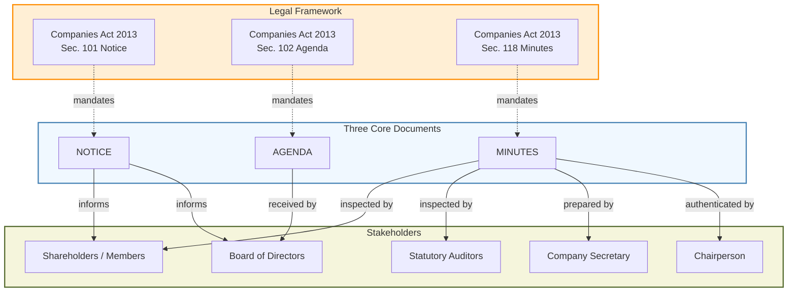
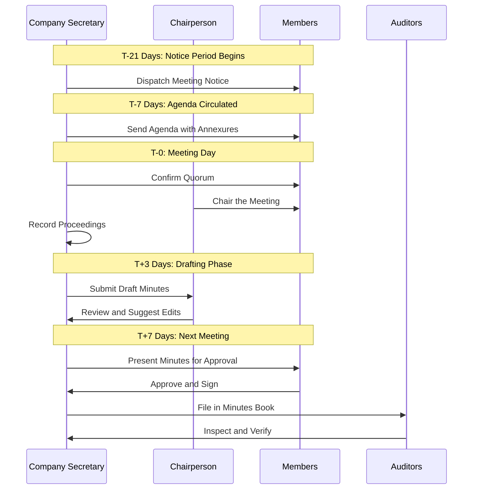
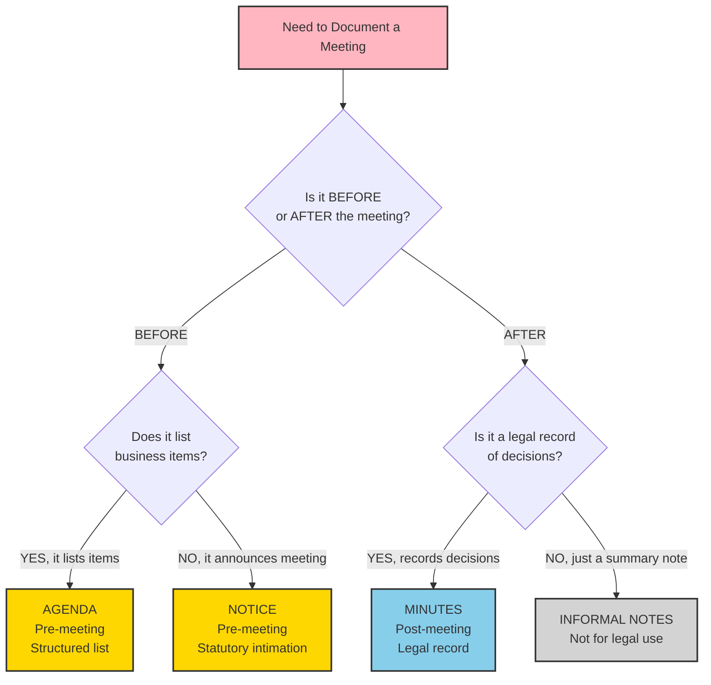

# Meeting Documentation – Notice, Agenda, and Minutes

<!-- SECTION_1_START -->
# Meeting Documentation – Notice, Agenda, and Minutes

## 1.1 Core Technical Definition

In KTU 2024 Scheme terminology (aligned with the *Organizational Behaviour and Business Communication* syllabus), **Meeting Documentation** refers to the **structured set of formal written records** that govern, guide, and preserve the conduct of organizational meetings. It is broadly classified into three primary documents:

- **Notice** — A formal advance intimation issued to eligible participants informing them *when, where, and why* a meeting is convened.
- **Agenda** — A pre-distributed, sequentially ordered *list of items* to be transacted during the meeting.
- **Minutes** — A post-meeting, *authenticated written record* of what was discussed, decided, and actioned.

> [!IMPORTANT]
> **KTU Syllabus Highlight (Module 4):** These three documents form the *communicative backbone* of corporate meetings and are routinely tested as **7-mark and 14-mark application-based questions** in the End Semester Evaluation (ESE).

---

## 1.2 Intuitive Overview & Real-World Analogy

Imagine a **family wedding ceremony** as an analogy to a corporate board meeting:

| Corporate Document | Family Analogy | Purpose |
|---|---|---|
| **Notice** | The **wedding invitation card** | Tells guests the **date, time, venue, and dress code** in advance |
| **Agenda** | The **printed ceremony program booklet** | Lists the sequence of rituals — *welcoming, vows, reception* — in order |
| **Minutes** | The **wedding videographer's edited album** | A permanent record of who attended, what was said, and what decisions (vows/promises) were made |

> [!NOTE]
> **Key Insight:** Just as a wedding without an invitation causes confusion, and without a program causes disorder, and without a video loses memories — a meeting without these three documents lacks **legal validity, operational clarity, and institutional memory**.

---

## 1.3 Visualization Control – Document Flow Concept

> [!VISUALIZATION CONTROL]
> **Concept:** Linear lifecycle of meeting documentation along a horizontal time axis $t$ (in days).
>
> **Desmos Input Equations:**
> - $x = -2$ (Notice issued, $t = -2$ days)
> - $x = 0$ (Agenda circulated, $t = 0$)
> - $x = 7$ (Meeting conducted, $t = 7$ days)
> - $x = 10$ (Minutes approved, $t = 10$ days)
>
> **Visual Description:** Plot four labelled points on the $x$-axis. Connect them with directional arrows. The student should observe a **chronological progression**: notice precedes agenda, agenda precedes meeting, and meeting precedes minutes. The time gap between notice and meeting is called the **"notice period"** — a *legally mandated interval* in statutory meetings.

---

## 1.4 Why These Documents Matter in Engineering Organizations

Even in a technically driven KTU engineering graduate's career, these documents are essential:

- **Project Review Meetings** require a notice to call all stakeholders, an agenda to structure technical discussions, and minutes to record design decisions.
- **IEEE Student Branch Meetings**, **Hackathon Committees**, and **Startup Board Meetings** in Kerala's tech ecosystem (e.g., Technopark Trivandrum, Infopark Kochi) all use these formats.
- **Companies Act 2013** (Sections 101, 102, 118) makes proper notice and minutes **statutory obligations** for companies, with non-compliance attracting penalties.
</mm:think><!-- SECTION_2_END -->

<!-- SECTION_2_START -->
# Deep Theoretical Analysis & KTU High-Yield Formula Sheet

## 2.1 The Meeting Documentation Triad — Logical Breakdown

### 2.1.1 NOTICE (Pre-Meeting Document)

**Definition (KTU Rigorous):** A notice is a *formal written communication* issued by an **authorized convenor** (e.g., Company Secretary, Board Chairperson, HoD) to **eligible participants** specifying the **date, time, venue, and business** of a forthcoming meeting, dispatched with a **statutorily sufficient notice period**.

**Step-by-Step Operational Logic:**

1. **Identify the Authority** — Who is empowered to call the meeting? (Board, Managing Director, Secretary)
2. **Determine the Notice Period** — Statutory meetings (AGM, EGM) require a minimum of **21 clear days** notice under the Companies Act 2013, Section 101. Board meetings typically require **7 days**.
3. **Draft the Content** — Include organizational heading, notice number, date, salutation, body, and signature block.
4. **Select the Mode of Dispatch** — Email, registered post, courier, or in-hand delivery with acknowledgement.
5. **Maintain the Record** — Retain proof of dispatch (postal receipt, email log) for legal audit trails.

> [!NOTE]
> **Critical Rule:** *Clear days* means **excluding the day of sending and the day of meeting**. For example, a 21-day notice sent on 1st March means the earliest valid meeting date is **23rd March**.

---

### 2.1.2 AGENDA (Pre-Meeting Document)

**Definition:** An agenda is a *structured, prioritized list of items* of business to be transacted at a meeting, prepared by the **secretary or convenor** and circulated **along with or prior to the notice**.

**Operational Logic Steps:**

1. **Consult the Chairperson** to confirm priority items.
2. **Review Previous Minutes** to identify pending action items to be tabled.
3. **Gather Reports** (Financial, Audit, Project) that need formal presentation.
4. **Order Items** in a *logical hierarchy* — routine to special, informational to decisional.
5. **Allocate Time Slots** to prevent overruns.
6. **Circulate** with sufficient lead time (ideally 48–72 hours before the meeting).

> [!IMPORTANT]
> **KTU Exam Tip:** Agenda items are numbered, and the sequence **must** follow the standard order: *Quorum confirmation → Previous minutes approval → Matters arising → Reports → New business → Any other matter with permission → Closing*. Deviation costs marks.

---

### 2.1.3 MINUTES (Post-Meeting Document)

**Definition:** Minutes are the **official, legal, written record** of the **proceedings, deliberations, resolutions, and action items** of a meeting, prepared by the **minute-taker (usually the Secretary)** and **approved at the next meeting**.

**Operational Logic Steps:**

1. **Record in Real-Time** during the meeting using shorthand, digital tools, or voice-to-text.
2. **Capture Four Critical Elements:**
   - What was **discussed** (narrative)
   - What was **decided** (resolutions)
   - Who is **responsible** for action (action owner)
   - What is the **deadline** (target date)
3. **Draft the Minutes** within **48–72 hours** while memory is fresh.
4. **Circulate the Draft** to the Chairperson for review.
5. **Approve Formally** at the next meeting by resolution.
6. **File Permanently** in the Minutes Book (physically signed) and digital archive.

> [!NOTE]
> **Legal Note:** Once approved, minutes become *conclusive evidence* in court. They can be inspected by members (Companies Act 2013, Section 119) and auditors.

---

## 2.2 KTU Formula Sheet — Meeting Documentation Components

> [!IMPORTANT]
> **Master this table for all 3-mark and 7-mark questions on this topic.**

| Document | Essential Components (in order) | Legal Backing |
|---|---|---|
| **Notice** | (1) Organization letterhead/name, (2) Notice number, (3) Date of issue, (4) Day, date, time, venue of meeting, (5) Type of meeting (AGM/EGM/Board), (6) Brief mention of business, (7) Signature of authorized signatory, (8) Distribution list | Companies Act 2013, Sec. 101 |
| **Agenda** | (1) Organization name, (2) Meeting type, (3) Date, time, venue, (4) Sequence of items (numbered), (5) Time allocation per item, (6) Reference documents annexure, (7) Prepared by (Secretary) | Internal best practice + Companies Act Sec. 102 |
| **Minutes** | (1) Organization name, (2) Meeting type, (3) Date, time, venue, (4) List of attendees and absentees, (5) Quorum confirmation, (6) Item-by-item record, (7) Resolutions with numbers, (8) Action items with owners and deadlines, (9) Closing time, (10) Signature of Chairperson and Secretary | Companies Act 2013, Sec. 118 |

---

## 2.3 Distinguishing Features — Comparative Analysis

| Parameter | Notice | Agenda | Minutes |
|---|---|---|---|
| **Timing** | Before meeting | Before meeting | After meeting |
| **Purpose** | To call/announce | To guide/structure | To record/preserve |
| **Audience** | Eligible members | Attendees | Members, auditors, regulators |
| **Legal Status** | Statutory prerequisite | Procedural aid | Statutory record |
| **Prepared By** | Secretary/Convenor | Secretary/Convenor | Secretary |
| **Approved By** | Not approved | Not approved (circulated) | Chairperson and members (next meeting) |
| **Format Tone** | Formal, directive | Formal, list-based | Formal, narrative-descriptive |

---

## 2.4 Real-World Engineering and Business Utility

- **Corporate Boardrooms (MNCs in Kerala):** Infopark-based companies use these three documents to ensure board decisions on product roadmaps are legally binding and auditable.
- **Academic Institutions (KTU Affiliated Colleges):** Departmental review meetings, Board of Studies meetings, and academic council meetings all follow this triad.
- **Legal Compliance:** Any *startup incorporated under the Companies Act* in Kerala must file minutes for board meetings and AGMs with the Registrar of Companies (RoC).
- **Dispute Resolution:** Minutes serve as *primary evidence* in shareholder disputes, tax assessments, and contract arbitrations.
- **Project Management (PMP/Agile Contexts):** Sprint review meetings and stakeholder meetings follow modified versions of this triad — making it a universally applicable skill.
</mm:think><!-- SECTION_2_END -->

<!-- SECTION_3_START -->
# Step-by-Step Derivations, Drafting Templates & Implementation

## 3.1 The Meeting Notice — Exhaustive Drafting Guide

### 3.1.1 Standard Template (Statutory Format)

Below is the **full operational template** that KTU examiners expect in a 7-mark notice drafting question. Every line is mandatory.

```text
┌─────────────────────────────────────────────────────────────────┐
│                   [ORGANIZATION LETTERHEAD]                     │
│         Regd. Office: .............................              │
│         CIN / Reg. No.: ............................            │
├─────────────────────────────────────────────────────────────────┤
│                                                                 │
│  Ref. No.:  TECH/2024-25/MEETING/012                            │
│  Date    :  15th October 2024                                   │
│                                                                 │
│  TO,                                                            │
│  All Members of the Board of Directors / Shareholders / HoD      │
│                                                                 │
│  SUBJECT: NOTICE OF THE [TYPE] MEETING                          │
│                                                                 │
│  Sir/Madam,                                                     │
│                                                                 │
│  NOTICE is hereby given that the [TYPE] Meeting of              │
│  [Organization Name] will be held on:                           │
│                                                                 │
│      Day   :  Tuesday                                           │
│      Date  :  05th November 2024                                │
│      Time  :  10:30 AM (IST)                                    │
│      Venue :  Conference Hall A, Block 3, Campus               │
│                                                                 │
│  The business to be transacted at the meeting shall be as per   │
│  the Agenda circulated herewith / as per Annexure-I.            │
│                                                                 │
│  Kindly make it convenient to attend.                           │
│                                                                 │
│                                                                 │
│  For [Organization Name]                                         │
│  Sd/-                                                           │
│  [Name and Designation]                                          │
│  [Authorized Signatory]                                          │
│                                                                 │
│  Distribution:                                                  │
│  1. All Board Members                                            │
│  2. Company Secretary                                            │
│  3. Statutory Auditors (for AGM)                                 │
│                                                                 │
└─────────────────────────────────────────────────────────────────┘
```

### 3.1.2 Component-Wise Justification (Valuation Key)

| Line | Why It Appears | KTU Marks |
|---|---|---|
| Organization letterhead | Establishes legal identity | 1 mark |
| Reference number | Enables document tracking | 0.5 mark |
| Date of issue | Critical for "clear days" calculation | 1 mark |
| Addressee line | Confirms recipient eligibility | 0.5 mark |
| Subject line | Quick reference for filing | 0.5 mark |
| Day, Date, Time, Venue | Statutory mandatory quartet | 2 marks |
| Agenda reference | Links notice to business | 0.5 mark |
| Signature block | Authoritative authentication | 1 mark |
| Distribution list | Proof of service | 0.5 mark |

---

## 3.2 The Agenda — Exhaustive Drafting Guide

### 3.2.1 Standard Format (Industry-Best-Practice)

```text
┌─────────────────────────────────────────────────────────────────┐
│                    AGENDA                                       │
│                                                                 │
│         [ORGANIZATION NAME]                                     │
│   [Type] Meeting — 05th November 2024 at 10:30 AM              │
│         Venue: Conference Hall A                                │
│                                                                 │
│   Prepared by: Ms. Anjali Menon, Company Secretary              │
│   Approved by: Dr. R. Krishnan, Chairperson                     │
├─────────────────────────────────────────────────────────────────┤
│                                                                 │
│  S.No.   TIME      ITEM OF BUSINESS                  REFERENCE  │
│  ─────────────────────────────────────────────────────────────  │
│  1.      10:30 AM  Call to Order and Welcome        --          │
│                                                                 │
│  2.      10:35 AM  Confirmation of Quorum            Sec. 103    │
│                                                                 │
│  3.      10:40 AM  Confirmation and Approval of      Annexure-I  │
│                    Minutes of the Previous Meeting               │
│                                                                 │
│  4.      10:50 AM  Matters Arising from the         --          │
│                    Previous Minutes                             │
│                                                                 │
│  5.      11:00 AM  Presentation of the              Annexure-II │
│                    Quarterly Financial Report                   │
│                                                                 │
│  6.      11:20 AM  Approval of the Annual Budget    Annexure-III│
│                    for FY 2024-25                               │
│                                                                 │
│  7.      11:50 AM  Project Status Update:           Annexure-IV │
│                    "Smart Campus Initiative"                     │
│                                                                 │
│  8.      12:10 PM  Any Other Matter with the        --          │
│                    Permission of the Chair                       │
│                                                                 │
│  9.      12:20 PM  Vote of Thanks and Adjournment   --          │
│                                                                 │
│  ─────────────────────────────────────────────────────────────  │
│  Total Estimated Duration: 1 hour 50 minutes                    │
│                                                                 │
└─────────────────────────────────────────────────────────────────┘
```

### 3.2.2 Component-Wise Justification

| Column | Function | KTU Insight |
|---|---|---|
| **S.No.** | Provides reference for minutes | Cross-referencing in minutes is mandatory |
| **Time** | Time-boxing — keeps meeting on track | KTU examiners test this in 7-mark questions |
| **Item of Business** | Precise description (no vague titles) | "Discuss budget" $\to$ Loses marks. Use "Approval of Annual Budget for FY 2024-25" |
| **Reference** | Annexure mapping for pre-read | Shows organizational maturity |

---

## 3.3 The Minutes — Exhaustive Drafting Guide

### 3.3.1 Standard Narrative + Resolution Format

```text
┌─────────────────────────────────────────────────────────────────┐
│                  MINUTES OF THE MEETING                         │
│                                                                 │
│             [ORGANIZATION NAME]                                 │
│   [Type] Meeting held on 05th November 2024                     │
│                                                                 │
├─────────────────────────────────────────────────────────────────┤
│                                                                 │
│  DATE     : 05th November 2024                                  │
│  TIME     : 10:30 AM to 12:35 PM (IST)                          │
│  VENUE    : Conference Hall A, Main Campus                      │
│  CHAIRED BY: Dr. R. Krishnan, Chairperson                       │
│  MINUTE-TAKER: Ms. Anjali Menon, Company Secretary              │
│                                                                 │
│  ATTENDEES (Members Present):                                   │
│    1. Dr. R. Krishnan       — Chairperson                       │
│    2. Prof. S. Nair         — Director (Academics)              │
│    3. Ms. Lakshmi Pillai    — Independent Director              │
│    4. Mr. Vivek Thomas      — CFO                               │
│    5. Ms. Anjali Menon      — Company Secretary                 │
│                                                                 │
│  REGRETS (Absent with Leave):                                   │
│    1. Dr. P. Iyer           — Director (Research)               │
│                                                                 │
│  QUORUM : Confirmed (5 of 6 members present)                    │
│                                                                 │
├─────────────────────────────────────────────────────────────────┤
│  ITEM NO. 1 — CALL TO ORDER                                    │
│  ─────────────────────────────────────────────────────────────  │
│  The Chairperson, Dr. R. Krishnan, called the meeting to       │
│  order at 10:30 AM and welcomed all members.                    │
│                                                                 │
│  ITEM NO. 2 — CONFIRMATION OF QUORUM                           │
│  ─────────────────────────────────────────────────────────────  │
│  The Company Secretary confirmed that the quorum, as            │
│  required under the Articles of Association, was present.       │
│                                                                 │
│  ITEM NO. 3 — APPROVAL OF PREVIOUS MINUTES                     │
│  ─────────────────────────────────────────────────────────────  │
│  The Minutes of the previous meeting held on 10th September     │
│  2024 were circulated earlier. No amendments were proposed.     │
│                                                                 │
│  RESOLUTION No. BM/2024-25/011:                                 │
│  "RESOLVED THAT the Minutes of the meeting held on              │
│  10th September 2024 be and are hereby approved and             │
│  signed by the Chairperson as a true and correct record."       │
│                                                                 │
│  Proposed by: Prof. S. Nair                                     │
│  Seconded by: Ms. Lakshmi Pillai                                │
│  Status: APPROVED UNANIMOUSLY                                   │
│                                                                 │
│  ITEM NO. 4 — MATTERS ARISING                                   │
│  ─────────────────────────────────────────────────────────────  │
│  4.1 Pending Action: Recruitment for the post of Project        │
│      Manager — CFO Mr. Vivek Thomas reported that three         │
│      candidates have been shortlisted and final interviews      │
│      are scheduled for 20th November 2024.                     │
│                                                                 │
│  4.2 Pending Action: Budget allocation for the Smart Campus     │
│      Initiative — Status reported under Item No. 7.             │
│                                                                 │
│  ITEM NO. 5 — QUARTERLY FINANCIAL REPORT                        │
│  ─────────────────────────────────────────────────────────────  │
│  The CFO, Mr. Vivek Thomas, presented the unaudited             │
│  financial results for Q2 of FY 2024-25. Key highlights:        │
│  • Total Revenue: INR 4.2 Crores (12% growth YoY)              │
│  • Operating Margin: 18%                                        │
│  • R&D Spend: 9% of revenue                                     │
│  The Board noted the report with appreciation.                  │
│                                                                 │
│  ITEM NO. 6 — APPROVAL OF ANNUAL BUDGET FOR FY 2024-25         │
│  ─────────────────────────────────────────────────────────────  │
│  After detailed deliberation, the Board considered the          │
│  proposed annual budget of INR 18.5 Crores (Annexure-III).     │
│                                                                 │
│  RESOLUTION No. BM/2024-25/012:                                 │
│  "RESOLVED THAT the Annual Budget for FY 2024-25 amounting      │
│  to INR 18.5 Crores be and is hereby approved, with the         │
│  proviso that capital expenditure on the Smart Campus           │
│  Initiative shall not exceed INR 3.2 Crores without             │
│  further Board approval."                                        │
│                                                                 │
│  Proposed by: Mr. Vivek Thomas                                  │
│  Seconded by: Prof. S. Nair                                     │
│  Status: APPROVED UNANIMOUSLY                                   │
│                                                                 │
│  ITEM NO. 7 — PROJECT STATUS UPDATE: SMART CAMPUS INITIATIVE   │
│  ─────────────────────────────────────────────────────────────  │
│  The Project Lead, Prof. S. Nair, presented the status of       │
│  the Smart Campus Initiative (Phase-I). The Board expressed     │
│  satisfaction with the 67% completion rate.                    │
│                                                                 │
│  ACTION ITEM: Prof. S. Nair to submit a revised Phase-II        │
│  proposal by 30th November 2024.                                │
│                                                                 │
│  ITEM NO. 8 — ANY OTHER MATTER                                  │
│  ─────────────────────────────────────────────────────────────  │
│  No other matter was raised.                                    │
│                                                                 │
│  ITEM NO. 9 — ADJOURNMENT                                       │
│  ─────────────────────────────────────────────────────────────  │
│  The meeting concluded at 12:35 PM with a Vote of Thanks        │
│  proposed by the Chairperson.                                   │
│                                                                 │
│  NEXT MEETING: 15th December 2024, 10:30 AM                      │
│                                                                 │
├─────────────────────────────────────────────────────────────────┤
│                                                                 │
│  Prepared by:           Approved and Confirmed by:              │
│                                                                 │
│  Sd/-                    Sd/-                                   │
│  Ms. Anjali Menon        Dr. R. Krishnan                       │
│  Company Secretary       Chairperson                            │
│  Date: 07/11/2024        Date: 15/12/2024                       │
│                                                                 │
│  DISTRIBUTION: All Board Members, Statutory Auditors,            │
│  Internal Audit Committee                                       │
│                                                                 │
└─────────────────────────────────────────────────────────────────┘
```

### 3.3.3 Component-Wise Valuation Key (Minutes Question — 14 Marks)

| Component | Marks Allocated by KTU Examiner |
|---|---|
| Organization name and meeting type | 1 mark |
| Date, time, venue, chairperson, minute-taker | 1.5 marks |
| Attendees and absentees with quorum | 1.5 marks |
| Item-wise proceedings (narrative) | 4 marks |
| Resolutions with proposed/seconded/result | 4 marks |
| Action items with owners and deadlines | 1 mark |
| Adjournment and next meeting mention | 0.5 mark |
| Signature block (Secretary + Chairperson) | 0.5 mark |

---

## 3.4 Practical Laboratory Worksheet — Writing a Meeting Notice

**Task:** Draft a meeting notice for the **Annual General Meeting (AGM)** of *GreenTech Innovations Pvt. Ltd.*, to be held on **15th December 2024 at 11:00 AM** at the registered office in Technopark, Trivandrum. The CFO is the authorized signatory.

**Solution Framework:**

1. Identify meeting type: **AGM**
2. Calculate notice period: 21 clear days before 15/12/2024 means notice must be issued by **23rd November 2024** (or earlier).
3. Use statutory format with CIN (Corporate Identity Number) on letterhead.
4. Reference agenda items: Approval of accounts, declaration of dividend, appointment of auditors, re-appointment of retiring director.
5. Sign by **Mr. Arjun Pillai, CFO and Authorized Signatory**.

> [!TIP]
> **Practical Exam Hack:** If the question does not specify the meeting type, infer it from the context. Words like "Annual," "Quarterly Results," "Budget Approval" suggest a **Board Meeting** or **AGM**. Words like "Urgent," "Special Resolution" suggest an **Extraordinary General Meeting (EGM)**.

---

## 3.5 Common Errors and How to Avoid Them (Tabular Reference)

| Error Type | Common Mistake | Correct Practice |
|---|---|---|
| Notice | "Meeting will be held soon" | "Meeting will be held on 15th Dec 2024 at 11:00 AM" |
| Notice | Forgetting reference to agenda | Always mention "as per the Agenda annexed" |
| Agenda | Writing vague titles | Use action-oriented precise titles |
| Agenda | Wrong order | Always: Quorum $\to$ Previous Minutes $\to$ Reports $\to$ New Business $\to$ AOB $\to$ Adjournment |
| Minutes | Writing verbatim dialogues | Use summary narrative and resolutions |
| Minutes | Omitting resolutions | Every decision $\to$ A resolution with number |
| Minutes | Missing action items | Always include Owner + Deadline |
| All three | Missing signature | Secretary + Chairperson signatures mandatory |
</mm:think><!-- SECTION_3_END -->

<!-- SECTION_4_START -->
# Structural Diagrams & Schematics

## 4.1 Mermaid Diagram 1 — Meeting Documentation Lifecycle (Flowchart)



**Color Legend:**
- 🟡 **Yellow nodes** = Pre-meeting documents (Notice, Agenda)
- 🟢 **Green node** = The actual meeting event
- 🔵 **Blue node** = Post-meeting document creation (Minutes drafting)
- 🔴 **Pink node** = Approval and finalization
- 🟣 **Purple node** = Final distribution

---

## 4.2 Mermaid Diagram 2 — Document Architecture (Block Diagram)

```mermaid
flowchart LR
    subgraph PRE["PRE-MEETING PHASE"]
        direction TB
        doc1["NOTICE\nStatutory Intimation\n21 / 7 Days Advance"]
        doc2["AGENDA\nStructured List of Business\nSent with or after Notice"]
    end

    subgraph DUR["DURING MEETING PHASE"]
        direction TB
        doc3["REAL-TIME RECORDING\nShorthand / Digital Notes\nVoice-to-Text Capture"]
    end

    subgraph POST["POST-MEETING PHASE"]
        direction TB
        doc4["MINUTES DRAFT\nPrepared by Secretary\nReviewed by Chairperson"]
        doc5["APPROVED MINUTES\nConfirmed at Next Meeting\nSigned by Chair and Secretary"]
        doc6["MINUTES BOOK\nPermanent Legal Record\nAvailable for Inspection"]
    end

    doc1 -->|"informs"| doc2
    doc2 -->|"guides"| doc3
    doc3 -->|"transcribed into"| doc4
    doc4 -->|"reviewed and revised"| doc5
    doc5 -->|"bound and filed"| doc6

    PRE --> DUR
    DUR --> POST

    style PRE fill:#FFF8DC,stroke:#8B4513,stroke-width:3px
    style DUR fill:#E0FFE0,stroke:#006400,stroke-width:3px
    style POST fill:#E6E6FA,stroke:#4B0082,stroke-width:3px
```



---

## 4.3 Mermaid Diagram 3 — Document Relationship Graph



---

## 4.4 Mermaid Diagram 4 — Time-Based Sequencing



---

## 4.5 Mermaid Diagram 5 — Comparative Decision Tree for Document Type


</mm:think><!-- SECTION_4_END -->

<!-- SECTION_5_START -->
# KTU 2024 Scheme Examination Question Bank & Topic Recap

## 5.1 Part A Questions (3 Marks Each)

### Question 1: `[KTU University Exam - July 2024]`
**Define a Meeting Notice and list any four essential components of a valid meeting notice.**

**Model Answer (Valuation Key: 3 Marks):**

> **Definition (1 Mark):** A Meeting Notice is a formal written communication issued by an authorized person (e.g., Company Secretary) to eligible participants, informing them in advance about the **date, time, venue, and business** of a forthcoming meeting, with a statutorily sufficient notice period.
>
> **Four Essential Components (2 Marks — 0.5 each):**
> 1. **Name and Address of the Organization** on the letterhead
> 2. **Reference Number and Date of Issue** for tracking
> 3. **Day, Date, Time, and Venue** of the meeting (the statutory quartet)
> 4. **Signature of the Authorized Signatory** (Secretary, Director, Chairperson)

---

### Question 2: `[KTU University Exam - Dec 2023]`
**Distinguish between an Agenda and Minutes. Mention any three points of distinction.**

**Model Answer (Valuation Key: 3 Marks):**

| Parameter | Agenda | Minutes |
|---|---|---|
| **Timing** | Prepared *before* the meeting (1 Mark) | Prepared *after* the meeting (1 Mark) |
| **Purpose** | Lists the items of business to be transacted | Records what was *actually* discussed and decided |
| **Approval** | Not approved; merely circulated | Formally approved at the next meeting |

> **Conclusion (1 Mark):** While the agenda is a *forward-looking roadmap*, the minutes are a *backward-looking legal record*. Together, they form the pre-meeting and post-meeting pillars of meeting documentation.

---

## 5.2 Part B Questions (14 Marks) — Module Internal Choice

### Question A: `[KTU University Exam - July 2024]` (14 Marks)

**Draft a formal Notice and Agenda for the Annual General Meeting (AGM) of *CyberShield Technologies Pvt. Ltd.*, a start-up incorporated under the Companies Act 2013, to be held on 20th December 2024 at 3:00 PM at the registered office in Infopark, Kochi. The business to be transacted includes: (a) Approval of Audited Financial Statements for FY 2023-24, (b) Declaration of Final Dividend, (c) Appointment of Statutory Auditors for FY 2024-25, and (d) Any other matter with the permission of the Chair.**

**Sub-part (a): Draft the Notice (7 Marks)**

**Model Solution:**

```text
┌─────────────────────────────────────────────────────────────────┐
│            CYBERSHIELD TECHNOLOGIES PVT. LTD.                   │
│         Regd. Office: Tower B, 4th Floor, Infopark              │
│         Kakkanad, Kochi – 682042, Kerala                        │
│         CIN: U72200KL2021PTC067123                              │
├─────────────────────────────────────────────────────────────────┤
│                                                                 │
│  Ref. No.: CST/AGM/2024/N-007                                  │
│  Date    : 28th November 2024                                   │
│                                                                 │
│  TO,                                                            │
│  All the Members / Shareholders of the Company                  │
│                                                                 │
│  SUBJECT: NOTICE OF THE 3RD ANNUAL GENERAL MEETING              │
│                                                                 │
│  NOTICE is hereby given that the 3rd Annual General Meeting     │
│  of the Members of CyberShield Technologies Pvt. Ltd. will      │
│  be held on:                                                    │
│                                                                 │
│      Day   :  Friday                                            │
│      Date  :  20th December 2024                                │
│      Time  :  3:00 PM (IST)                                     │
│      Venue :  Registered Office, Tower B, Infopark, Kochi       │
│                                                                 │
│  The business to be transacted at the meeting is as per the     │
│  Agenda annexed herewith (Annexure-I).                          │
│                                                                 │
│  A member entitled to attend and vote at the meeting is         │
│  entitled to appoint a proxy, who need not be a member,         │
│  to attend and vote on his/her behalf. The proxy form must      │
│  reach the Registered Office not less than 48 hours before      │
│  the meeting.                                                   │
│                                                                 │
│  For CyberShield Technologies Pvt. Ltd.                         │
│  Sd/-                                                           │
│  Ms. Divya Rajagopal                                            │
│  Company Secretary & Compliance Officer                         │
│                                                                 │
│  Encl: Agenda (Annexure-I), Proxy Form, Attendance Slip         │
│  Place: Kochi | Date: 28/11/2024                                 │
│                                                                 │
└─────────────────────────────────────────────────────────────────┘
```

**Valuation Key for Sub-part (a) — 7 Marks:**

| Component | Marks |
|---|---|
| Organization letterhead with CIN and registered office | 1 |
| Reference number and date of issue (28/11/2024) | 1 |
| Addressee line and subject line | 0.5 |
| Day, Date, Time, Venue (statutory quartet) | 2 |
| Reference to annexed agenda | 0.5 |
| Proxy clause (statutory requirement) | 1 |
| Signature with designation of authorized signatory | 1 |

---

**Sub-part (b): Draft the Agenda (7 Marks)**

**Model Solution:**

```text
┌─────────────────────────────────────────────────────────────────┐
│                       AGENDA                                    │
│                                                                 │
│        CYBERSHIELD TECHNOLOGIES PVT. LTD.                       │
│     3rd Annual General Meeting — 20th December 2024             │
│           Time: 3:00 PM | Venue: Registered Office              │
│                                                                 │
│   Prepared by: Ms. Divya Rajagopal, Company Secretary           │
│   Approved by: Mr. Hari Govind, Chairperson                     │
├─────────────────────────────────────────────────────────────────┤
│                                                                 │
│  S.No.   TIME      ITEM OF BUSINESS                  REFERENCE  │
│  ─────────────────────────────────────────────────────────────  │
│  1.      3:00 PM   Call to Order and Welcome          --          │
│                                                                 │
│  2.      3:05 PM   Confirmation of Quorum             Sec. 103   │
│                                                                 │
│  3.      3:10 PM   To receive, consider, and          Annexure-I │
│                    approve the Audited Financial                │
│                    Statements of the Company for               │
│                    the Financial Year ended                     │
│                    31st March 2024, together with              │
│                    the Reports of the Board of                 │
│                    Directors and Auditors thereon.              │
│                                                                 │
│  4.      3:30 PM   To declare a Final Dividend of     Annexure-II│
│                    INR 2.50 per equity share (10%)             │
│                    for the Financial Year 2023-24.              │
│                                                                 │
│  5.      3:45 PM   To appoint M/s. Varma and          Annexure-III│
│                    Associates, Chartered Accountants,          │
│                    as the Statutory Auditors of the             │
│                    Company for FY 2024-25, and to              │
│                    fix their remuneration.                      │
│                                                                 │
│  6.      4:00 PM   To transact any other business     --          │
│                    which may properly be transacted            │
│                    at an Annual General Meeting, with          │
│                    the permission of the Chair.                │
│                                                                 │
│  7.      4:15 PM   Vote of Thanks and Adjournment     --          │
│                                                                 │
│  ─────────────────────────────────────────────────────────────  │
│  Total Estimated Duration: 1 hour 15 minutes                    │
│                                                                 │
│  Notes:                                                         │
│  1. A member may appoint a proxy. The Proxy Form (Form MGT-11)  │
│     must reach the Registered Office 48 hours before the AGM.   │
│  2. Members are requested to bring the Attendance Slip          │
│     attached to the Notice.                                     │
│  3. Corporate members are requested to send a certified         │
│     copy of the Board Resolution authorizing their              │
│     representative.                                             │
│                                                                 │
└─────────────────────────────────────────────────────────────────┘
```

**Valuation Key for Sub-part (b) — 7 Marks:**

| Component | Marks |
|---|---|
| Heading with organization name and meeting type | 1 |
| Date, time, venue in header | 0.5 |
| Sequential order (Quorum $\to$ Minutes $\to$ Business $\to$ AOB $\to$ Adjournment) | 1.5 |
| Time allocation for each item | 0.5 |
| Precise wording of business items (a, b, c, d covered) | 2 |
| Reference to annexures (Financial Statements, Dividend Rate, Auditor Appointment) | 0.5 |
| Statutory notes (Proxy, Attendance, Corporate representation) | 1 |

---

### Question B: `[KTU University Exam - Dec 2023]` (14 Marks)

**Draft the Minutes of the 3rd Annual General Meeting of CyberShield Technologies Pvt. Ltd. held on 20th December 2024, where:**
- **The CFO presented the financial highlights and recommended a final dividend of INR 2.50 per share.**
- **The Board proposed the re-appointment of M/s. Varma and Associates as Statutory Auditors.**
- **Two shareholders raised queries about R\&D spending and export revenue.**
- **Both queries were satisfactorily addressed by the CFO.**
- **All resolutions were passed unanimously.**

**Sub-part (a): Draft the header and attendees section (7 Marks)**

**Model Solution:**

```text
┌─────────────────────────────────────────────────────────────────┐
│           MINUTES OF THE MEETING                                │
│                                                                 │
│         CYBERSHIELD TECHNOLOGIES PVT. LTD.                      │
│     3rd Annual General Meeting held on 20th December 2024       │
│                                                                 │
├─────────────────────────────────────────────────────────────────┤
│                                                                 │
│  DATE        : 20th December 2024                               │
│  TIME        : 3:00 PM to 4:30 PM (IST)                         │
│  VENUE       : Registered Office, Tower B, Infopark, Kochi      │
│  CHAIRED BY  : Mr. Hari Govind, Chairperson & Managing Director │
│  MINUTE-TAKER: Ms. Divya Rajagopal, Company Secretary           │
│                                                                 │
│  MEMBERS PRESENT (5 of 5):                                      │
│    1. Mr. Hari Govind         — Chairperson & MD                │
│    2. Ms. Sneha Iyer          — Director (Technical)            │
│    3. Mr. Arjun Pillai        — Director (Finance) / CFO        │
│    4. Ms. Lakshmi Krishnan    — Independent Director            │
│    5. Ms. Divya Rajagopal     — Company Secretary               │
│                                                                 │
│  SHAREHOLDERS PRESENT (Total: 47 representing 78% holding):     │
│    (Detailed attendance slip maintained separately)             │
│                                                                 │
│  PROXIES PRESENT (8):                                            │
│    (Proxy register maintained and forms filed - MGT-11)         │
│                                                                 │
│  QUORUM : Confirmed (78% shareholding present, exceeding the    │
│           minimum 25 members / 5% shareholding requirement)     │
│                                                                 │
│  INVITEES / AUDITORS:                                           │
│    1. Mr. Suresh Varma, M/s. Varma and Associates,              │
│       Statutory Auditors (retiring)                             │
│                                                                 │
└─────────────────────────────────────────────────────────────────┘
```

**Valuation Key for Sub-part (a) — 7 Marks:**

| Component | Marks |
|---|---|
| Organization name, meeting type, date in header | 1 |
| Date, time, venue, chairperson, minute-taker | 1.5 |
| List of members present with designation | 1.5 |
| Shareholders and proxies mentioned with quorum confirmation | 2 |
| Auditors / invitees listed | 0.5 |
| Mention of MGT-11 proxy form filing | 0.5 |

---

**Sub-part (b): Draft the proceedings and resolutions (7 Marks)**

**Model Solution:**

```text
├─────────────────────────────────────────────────────────────────┤
│  ITEM NO. 1 — CALL TO ORDER                                    │
│  ─────────────────────────────────────────────────────────────  │
│  The Chairperson, Mr. Hari Govind, called the meeting to       │
│  order at 3:00 PM and welcomed all members and shareholders.    │
│                                                                 │
│  ITEM NO. 2 — CONFIRMATION OF QUORUM                           │
│  ─────────────────────────────────────────────────────────────  │
│  The Company Secretary confirmed the presence of the           │
│  requisite quorum under Section 103 of the Companies Act,      │
│  2013.                                                          │
│                                                                 │
│  ITEM NO. 3 — APPROVAL OF AUDITED FINANCIAL STATEMENTS         │
│  ─────────────────────────────────────────────────────────────  │
│  The CFO, Mr. Arjun Pillai, presented the Audited Financial    │
│  Statements for FY 2023-24. Key highlights:                    │
│  • Total Revenue: INR 12.8 Crores (28% YoY growth)             │
│  • Profit After Tax: INR 2.1 Crores                             │
│  • Export Revenue: 34% of total revenue                         │
│  • R&D Spending: 11% of revenue                                 │
│                                                                 │
│  Queries raised by shareholders:                                │
│  (a) Mr. R. Menon (Shareholder) asked about the justification  │
│      for the 11% R&D spend and its projected impact.           │
│      The CFO clarified that the spend is aligned with the       │
│      product roadmap and is expected to yield IP filings by     │
│      Q3 of FY 2024-25.                                         │
│  (b) Ms. P. Varma (Shareholder) asked about strategies to      │
│      scale export revenue to 50% in two years.                 │
│      The CFO presented a market expansion plan covering        │
│      Southeast Asia and the EU, and assured the shareholders   │
│      of focused execution.                                     │
│                                                                 │
│  Both queries were addressed to the satisfaction of the         │
│  members present.                                               │
│                                                                 │
│  RESOLUTION No. AGM/2024-25/001:                                │
│  "RESOLVED THAT the Audited Financial Statements of the         │
│  Company for the Financial Year ended 31st March 2024,          │
│  including the Balance Sheet, Statement of Profit and Loss,    │
│  Cash Flow Statement, and the Reports of the Board of          │
│  Directors and Auditors thereon, as placed before the           │
│  meeting, be and are hereby received, considered, and           │
│  approved."                                                     │
│                                                                 │
│  Proposed by : Mr. Arjun Pillai                                 │
│  Seconded by : Ms. Sneha Iyer                                   │
│  Voting      : Show of hands — UNANIMOUS                       │
│  Result      : APPROVED                                         │
│                                                                 │
│  ITEM NO. 4 — DECLARATION OF FINAL DIVIDEND                    │
│  ─────────────────────────────────────────────────────────────  │
│  The CFO recommended a Final Dividend of INR 2.50 per equity    │
│  share (10% on face value of INR 10), subject to shareholder   │
│  approval. The total outflow would be approximately             │
│  INR 25 Lakhs.                                                  │
│                                                                 │
│  RESOLUTION No. AGM/2024-25/002:                                │
│  "RESOLVED THAT a Final Dividend of INR 2.50 per equity share  │
│  (10%) on the paid-up equity share capital of the Company be   │
│  and is hereby declared for the Financial Year ended           │
│  31st March 2024, and that the same be paid to the members     │
│  whose names appear in the Register of Members as on            │
│  10th December 2024."                                           │
│                                                                 │
│  Proposed by : Ms. Lakshmi Krishnan                             │
│  Seconded by : Mr. Arjun Pillai                                 │
│  Voting      : Show of hands — UNANIMOUS                       │
│  Result      : APPROVED                                         │
│                                                                 │
│  ITEM NO. 5 — APPOINTMENT OF STATUTORY AUDITORS                │
│  ─────────────────────────────────────────────────────────────  │
│  The Board, on the recommendation of the Audit Committee,      │
│  proposed the re-appointment of M/s. Varma and Associates,     │
│  Chartered Accountants (FRN: 004512S), as the Statutory         │
│  Auditors of the Company for FY 2024-25, at a remuneration     │
│  of INR 4.5 Lakhs plus applicable taxes and out-of-pocket      │
│  expenses.                                                      │
│                                                                 │
│  RESOLUTION No. AGM/2024-25/003:                                │
│  "RESOLVED THAT pursuant to Sections 139, 141, and other        │
│  applicable provisions of the Companies Act, 2013, M/s.         │
│  Varma and Associates, Chartered Accountants (FRN: 004512S),    │
│  be and are hereby re-appointed as the Statutory Auditors      │
│  of the Company to hold office from the conclusion of this     │
│  Annual General Meeting until the conclusion of the 8th        │
│  Annual General Meeting, at a remuneration of INR 4.5 Lakhs    │
│  plus taxes and out-of-pocket expenses, as may be incurred     │
│  in connection with the audit."                                 │
│                                                                 │
│  Proposed by : Ms. Sneha Iyer                                   │
│  Seconded by : Mr. R. Menon (Shareholder)                       │
│  Voting      : Show of hands — UNANIMOUS                       │
│  Result      : APPROVED                                         │
│                                                                 │
│  ITEM NO. 6 — ANY OTHER MATTER                                  │
│  ─────────────────────────────────────────────────────────────  │
│  No other matter was raised with the permission of the Chair.   │
│                                                                 │
│  ITEM NO. 7 — ADJOURNMENT                                       │
│  ─────────────────────────────────────────────────────────────  │
│  The meeting was concluded at 4:30 PM with a Vote of Thanks    │
│  proposed by the Chairperson to all attendees.                  │
│                                                                 │
│  NEXT AGM: 19th December 2025, 3:00 PM                           │
│                                                                 │
├─────────────────────────────────────────────────────────────────┤
│                                                                 │
│  Prepared by:           Approved and Confirmed by:              │
│                                                                 │
│  Sd/-                    Sd/-                                   │
│  Ms. Divya Rajagopal     Mr. Hari Govind                        │
│  Company Secretary       Chairperson & Managing Director        │
│  Date: 22/12/2024        Date: 19/12/2025                       │
│                                                                 │
└─────────────────────────────────────────────────────────────────┘
```

**Valuation Key for Sub-part (b) — 7 Marks:**

| Component | Marks |
|---|---|
| Item-wise narrative of proceedings (financial presentation) | 1.5 |
| Recording of shareholder queries and CFO responses | 1 |
| Three resolutions with full wording, proposed/seconded, and result | 3 |
| AOB item handled (No other matter raised) | 0.5 |
| Adjournment and next AGM date mentioned | 0.5 |
| Signature block (Secretary and Chairperson with dates) | 0.5 |

---

## 5.3 KTU Examiner's Valuation Warning / Pitfall Callout

> [!WARNING]
> **Common Mark-Loss Pitfalls in Meeting Documentation Questions:**
>
> 1. **Missing the Statutory Quartet** — Students often write "Tomorrow at 10 AM" instead of the full **Day, Date, Time, Venue**. This loses **2 marks instantly**.
>
> 2. **Vague Agenda Titles** — "To discuss budget" is incomplete. Use "To consider and approve the Annual Budget for FY 2024-25 amounting to INR 18.5 Crores." The KTU examiner allocates **2 marks** for precise agenda wording.
>
> 3. **Missing Resolutions in Minutes** — Students write narratives but forget to frame them as **formal resolutions** with proposed-by, seconded-by, and voting result. This costs **3–4 marks** in a 7-mark sub-question.
>
> 4. **Forgetting Action Items** — Every decision in the minutes must have an **action owner and a deadline**. Omission loses 1 mark.
>
> 5. **Wrong Order in Agenda** — Always follow: Quorum $\to$ Previous Minutes $\to$ Reports $\to$ New Business $\to$ AOB $\to$ Adjournment. Reversing the order loses 1.5 marks.
>
> 6. **No Signature Block** — Minutes without the **Chairperson's and Secretary's signatures with dates** are considered incomplete and lose 0.5 mark.
>
> 7. **Writing Verbatim Dialogues in Minutes** — Minutes must be a **summary narrative**, not a transcript. Writing long dialogues loses presentation marks.

---

## 5.4 Topic Recap & Important Things to Remember

> [!IMPORTANT]
> **High-Density Rapid Revision Checklist**

### A. Definitions (Mandatory Recall)
- **Notice:** Statutory pre-meeting intimation with date, time, venue, and business.
- **Agenda:** Pre-meeting structured list of items of business.
- **Minutes:** Post-meeting formal legal record of proceedings, decisions, and actions.

### B. Statutory Backing (Companies Act 2013)
- **Section 101** — Notice of Meetings (21 clear days for AGM/EGM)
- **Section 102** — Contents of Notice and Agenda
- **Section 103** — Quorum requirements
- **Section 118** — Maintenance of Minutes

### C. Critical Numerical Thresholds
- **21 clear days** — Statutory notice period for AGM/EGM
- **7 days** — Typical notice for Board Meetings
- **48 hours** — Proxy form filing deadline
- **15 minutes** — Standard grace period after scheduled start time

### D. Mandatory Components Cheat Sheet
- **Notice:** Letterhead $\to$ Ref. No. $\to$ Date $\to$ To/Subject $\to$ Day/Date/Time/Venue $\to$ Agenda Reference $\to$ Signature $\to$ Distribution
- **Agenda:** Header $\to$ S.No. $\to$ Time $\to$ Item of Business $\to$ Reference $\to$ Notes
- **Minutes:** Header $\to$ Date/Time/Venue $\to$ Attendees/Quorum $\to$ Item Narrative $\to$ Resolutions (Proposed/Seconded/Result) $\to$ Action Items $\to$ Adjournment $\to$ Signatures

### E. Standard Agenda Order (Memorize)
1. Call to Order and Welcome
2. Confirmation of Quorum
3. Approval of Previous Minutes
4. Matters Arising from Previous Minutes
5. Reports (Financial, Audit, Project)
6. New Business Items
7. Any Other Matter (with Chair's permission)
8. Vote of Thanks and Adjournment

### F. Key Resolutions Format (Memorize)
> "RESOLVED THAT $\dots$ be and is hereby $\dots$"
> Proposed by: $\vert$ Name $\vert$ Seconded by: $\vert$ Name $\vert$ Result: UNANIMOUS / MAJORITY

### G. Common Pitfalls to Avoid
- ❌ No statutory quartet in notice
- ❌ Vague agenda titles
- ❌ Missing resolutions in minutes
- ❌ No action items or deadlines
- ❌ No signature block
- ❌ Verbatim dialogues in minutes

### H. Engineering Career Relevance
- Project review meetings in tech companies
- IEEE / professional society meetings
- Startup board meetings in Kerala's tech parks
- Academic council and Board of Studies meetings
- Statutory requirement for all incorporated companies

### I. Mnemonic for Memorization — **N-A-M**
- **N**otice = **N**otification (before)
- **A**genda = **A**rrangement (before, guides order)
- **M**inutes = **M**emory (after, records what happened)

### J. Key Formula for Notice Period
$$\text{Earliest Meeting Date} = \text{Notice Dispatch Date} + \text{Notice Period} + 1 \text{ day}$$

> **Final Exam Mantra:** *"Notice announces. Agenda arranges. Minutes memorialize."*
</mm:think><!-- SECTION_5_END -->
