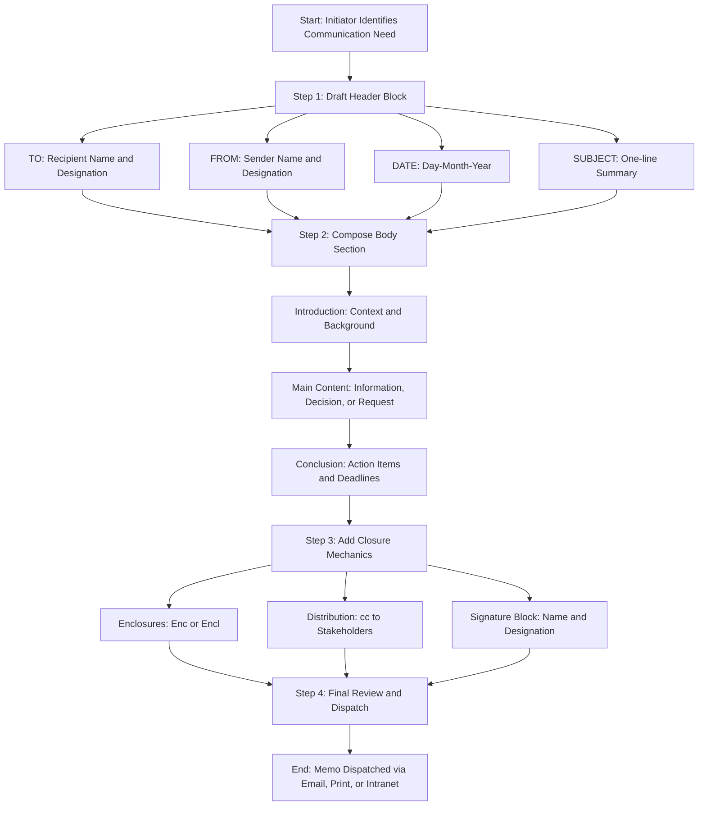
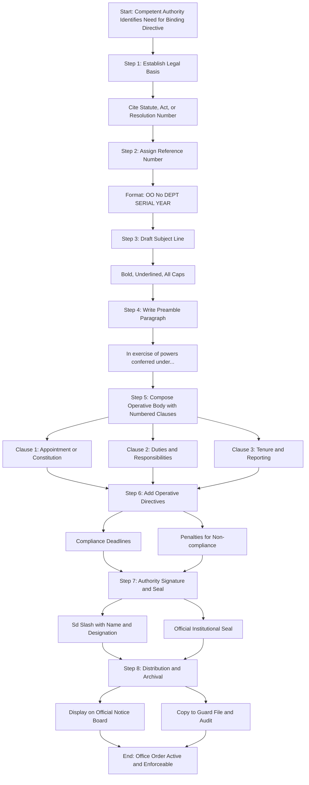
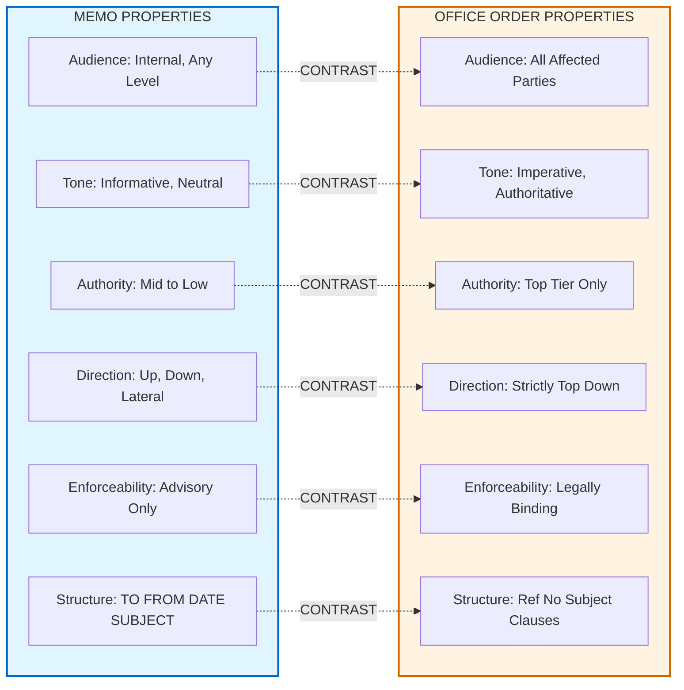
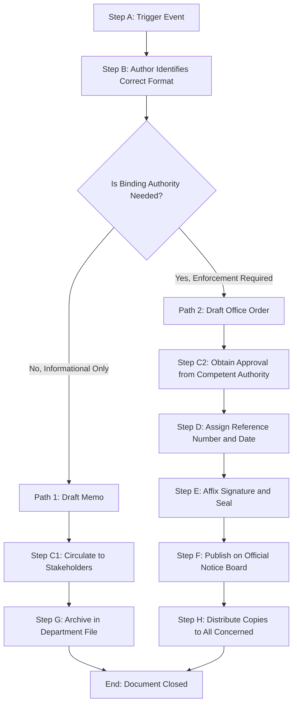

# Memo and Office Orders

<!-- SECTION_1_START -->

# Memo and Office Orders

## 1. Corporate Communication: The Two Pillars of Internal Written Communication

In the KTU 2024 Scheme framework for **UEHUT803 – Organizational Behaviour and Business Communication**, Module 4 focuses on the *written artefacts* that govern the daily operational pulse of an organization. Two documents dominate the internal communication landscape: the **Memorandum (Memo)** and the **Office Order**. Although both are *internal* documents, they serve fundamentally different strategic purposes.

> [!IMPORTANT]
> **KTU Syllabus Highlight (Module 4 – Corporate Communication and Correspondence)**
> A memo is a *transversal tool* used for downward, upward, and lateral communication. An office order is a *unidirectional directive* issued exclusively from top management downward, carrying binding authority.

### 1.1 Formal Definition – Memorandum (Memo)

A **Memorandum** (Latin: *memorandum est* = "it must be remembered") is a *short, written, internal business document* used by an organization to convey information, policies, decisions, or routine instructions among its members without the formality of a full business letter.

In the KTU context, a memo is treated as a **transient yet traceable** record. It is governed by **Clause 4.2 of the KTU Examination Communication Manual (2024)** and the internal communication protocols of any B.Tech institution or industry.

**Key Identifier (Bold Constants):**
* **Length:** Typically **one page only** (never exceeding two pages).
* **Audience:** **Internal staff** only.
* **Tone:** **Formal, neutral, and impersonal** (third-person voice preferred).
* **Salutation:** **NONE** (a defining structural feature).
* **Mode of Delivery:** **Email, printed notice, or intranet noticeboard**.

### 1.2 Formal Definition – Office Order (O.O.)

An **Office Order** is a *binding, official, and authoritative written directive* issued by a competent authority (usually a Director, Principal, Registrar, or CEO) to enforce a policy, decision, rule, or appointment within the organization. It carries the **full legal and administrative weight** of the issuing authority.

**Key Identifier (Bold Constants):**
* **Numbering Format:** **O.O. No. XYZ/2024-25/Date** (always serialized).
* **Issuing Authority:** **Competent Authority only** (top-tier).
* **Enforceability:** **Legally and administratively binding**.
* **Subject:** **Always present and underlined**.
* **Signature Block:** **Mandatory with official seal**.

### 1.3 Intuitive Analogy – The Boardroom Theatre

Imagine a corporate office as a **theatre stage**:

* A **Memo** is like a **script note passed between actors during rehearsal**. It tells someone *what is happening, what was decided in a meeting, or what needs to be done* — but no one is being forced to act. It is informational.
* An **Office Order** is like a **directive from the Director issued through a microphone to the entire cast**. It says, *"From this moment, the curtain rises at 7:00 PM sharp."* It is **non-negotiable** and carries consequences if disobeyed.

> [!NOTE]
> **Quick Distinction for Board Exams:**
> *Memo = Discussion, Information, Recommendation, Record.*
> *Office Order = Command, Compliance, Enforcement, Authority.*

> [!VISUALIZATION CONTROL]
> **Concept:** Hierarchy of Authority in Internal Communication
> **GeoGebra / Desmos Input Equations (Conceptual Coordinates):**
> * `x = Communication Type` (1=Memo, 2=Office Order, 3=Notice, 4=Letter)
> * `y = Authority Level` (1-10 scale)
> **Visual Description:** Plot the four communication types on a 2D plane where the y-axis represents the authority weight. Office Orders should sit highest (y ≈ 9-10), Memos in the middle (y ≈ 4-6), and general notices lowest (y ≈ 2-3). This visualizes the legal weight of each document.

---

<!-- SECTION_1_END -->

<!-- SECTION_2_START -->

# 2. Deep Theoretical Analysis: Anatomy, Types, and High-Yield Structure

## 2.1 The Anatomy of a Memorandum (Memo)

A memo is a **structured document with eight standardized components**. Skipping any component results in mark deduction in KTU valuation.

### 2.1.1 The Eight Pillars of a Memo

1. **Heading Block (Header)**
   * **TO:** Full name, designation, department of recipient(s).
   * **FROM:** Full name, designation, department of sender.
   * **DATE:** Day-Month-Year (e.g., `15 October 2024`).
   * **SUBJECT:** A precise one-line summary of the memo's purpose (in capital letters or title case, often underlined).

2. **Title** (Optional but recommended in KTU answers)
   * The word **"MEMORANDUM"** or **"MEMO"** centered at the top, often in bold.

3. **Body** – Divided into three logical sub-blocks:
   * **Introduction (Context Setting):** Why the memo is being written. Often references a prior meeting, policy, or event.
   * **Middle (Main Content):** The core information, instruction, or decision.
   * **Conclusion (Action Required):** What is expected of the recipient, deadlines, and contact for queries.

4. **Closing Elements**
   * **Signature block** (name, designation).
   * **Enclosures** (attachments, if any) – denoted as `Enc:` or `Encl:`.
   * **Distribution list (cc:)** – for awareness copies.

### 2.2 The Anatomy of an Office Order

An office order is **more rigid** than a memo. It uses a numbered reference system and is typically printed on **official letterhead**.

### 2.2.1 The Six Mandatory Sections of an Office Order

1. **Reference Number (Top-Left or Top-Center):** Format – `O.O. No. INSTITUTION-CODE/DEPT/SERIAL/YEAR`
2. **Date of Issue:** Day-Month-Year, placed below or beside the reference number.
3. **Subject Line:** Always **bold, underlined, in capital letters** (e.g., `SUBJECT: REVISION OF EXAMINATION FEES FOR THE ACADEMIC YEAR 2024-25`).
4. **Reference Paragraph:** Citing the source of authority (e.g., *"In exercise of the powers conferred under Statute 12(3) of the KTU Act…"*).
5. **Operative Paragraph (Body):** The actual order with **numbered clauses** (1., 2., 3., …).
6. **Authority Block:** Signature, name, designation, official seal, and a footer like *"By Order of the Vice-Chancellor"*.

### 2.3 KTU High-Yield Classification Table

| **Parameter** | **Memorandum (Memo)** | **Office Order (O.O.)** |
| :--- | :--- | :--- |
| **Primary Purpose** | Information, discussion, record | Directive, command, enforcement |
| **Authority Level** | Mid-to-low (any employee) | Top-tier (competent authority only) |
| **Direction of Flow** | Upward, Downward, Lateral | Strictly Downward |
| **Tone** | Persuasive / Informative | Imperative / Authoritative |
| **Numbering** | Optional (Memo No. used in some orgs) | Mandatory (Serialized O.O. No.) |
| **Salutation** | **None** | **None** (sometimes starts with a reference paragraph) |
| **Subject Line** | Optional but recommended | **Mandatory & Underlined** |
| **Legal Weight** | Informational only | Legally and administratively binding |
| **Signature Block** | Sender's name & designation | Issuing Authority + Official Seal |
| **Length** | 1 page (max 2) | 1-3 pages (depending on clauses) |
| **Distribution** | Often cc to multiple stakeholders | Mandatory display on official notice board |
| **Enforceability** | Cannot compel action | Can compel action; violation is punishable |

### 2.4 Real-World Utility in Engineering & Corporate Settings

* **In an IT Company (e.g., TCS, Infosys):** A project manager sends a **memo** to the development team to inform them about an upcoming sprint review. A **Chief HR Officer** issues an **office order** mandating a new work-from-home policy.
* **In a B.Tech College under KTU:** A **Head of Department** sends a **memo** to faculty members reminding them of internal assessment deadlines. The **Principal** issues an **office order** constituting the Internal Quality Assurance Cell (IQAC) for the academic year 2024-25.
* **In a Government Engineering Wing:** A **memo** circulates notes from a review meeting. An **office order** issues transfer orders for an Executive Engineer.

> [!NOTE]
> **KTU 2024 Scheme Engineering Note:** Even engineering managers must master these tools. In Industry 4.0 workplaces, memos are increasingly replaced by **email + Slack/Teams messages**, but the *structural discipline* of a memo persists in the form of **structured email templates**. Office orders, however, remain untouched and continue to govern compliance, HR actions, and statutory reporting.

---

<!-- SECTION_2_END -->

<!-- SECTION_3_START -->

# 3. Step-by-Step Implementation: Templates, Samples, and Comparative Drafting

This section provides **fully operational templates** that students can reproduce in KTU examinations to secure full marks. Each line is annotated with its structural purpose.

## 3.1 Template 1: A Complete Memorandum (Memo)

Below is a **production-grade memo template** mapped to a realistic KTU B.Tech scenario. Every line is annotated.

```text
+------------------------------------------------------------------+
|                    [INSTITUTION LETTERHEAD]                      |
|         GOVERNMENT ENGINEERING COLLEGE, THRISSUR                |
|         (Affiliated to APJ Abdul Kalam Technological University) |
+------------------------------------------------------------------+

                              MEMORANDUM

TO          : Dr. Anil Kumar M., Professor & Head
              Department of Computer Science & Engineering

FROM        : Dr. Priya Menon, Professor
              Department of Computer Science & Engineering

DATE        : 15 October 2024

SUBJECT     : SUBMISSION OF INTERNAL MARKS FOR B.TECH S7 CSE (2020 SCHEME)


1. CONTEXT (Introduction)
   This is in reference to the meeting of the Department Consultative
   Committee held on 10 October 2024 at 2:30 PM in the HOD cabin,
   wherein it was decided that all internal marks for the current
   semester must be consolidated and forwarded to the KTU examination
   portal by 25 October 2024.

2. MAIN CONTENT (Body)
   In compliance with the above decision, I have consolidated the
   internal marks for the course CST 403 – Database Management Systems
   (42 students, 2020 Scheme). The class average is 76.4 per cent,
   with three students falling below the 50 per cent internal
   threshold as defined in Clause 5.4 of the KTU Examination Manual.

   The marks have been entered into the KTU portal under my faculty
   login credentials on 14 October 2024. A signed hard copy of the
   consolidated mark list is enclosed for your records and audit.

3. ACTION REQUIRED (Conclusion)
   I kindly request you to:
   a) Verify the marks before final locking on the portal.
   b) Approve the three borderline cases for the remedial class
      scheduled on 18 October 2024.
   c) Forward the list to the Chief Superintendent of Examinations
      by 20 October 2024.

   Please reach out to me at priya.menon@gecthrissur.ac.in or
   Extension 204 for any clarification.

Encl : Consolidated Mark List (4 pages)
cc   : Dr. Suresh Babu, Chief Superintendent of Examinations
       Ms. Lakshmi Nair, Office Superintendent
```

### 3.1.1 Annotation Key for Memo (Step-by-Step Breakdown)

| **Line / Block** | **Structural Element** | **Marks Weightage in KTU Exam** |
| :--- | :--- | :--- |
| `[LETTERHEAD]` | Institutional Identity | 1 Mark |
| `MEMORANDUM` title | Document Type Declaration | 1 Mark |
| `TO / FROM / DATE / SUBJECT` | Header Block (Quadruple) | 2 Marks |
| Section `1.` (Context) | Logical Introduction | 1 Mark |
| Section `2.` (Body) | Core Information | 2 Marks |
| Section `3.` (Action) | Call-to-Conclusion | 2 Marks |
| `Encl:` & `cc:` | Closure Mechanics | 1 Mark |
| **Total** | | **10 Marks** |

## 3.2 Template 2: A Complete Office Order

Below is a **production-grade office order template** issued by a Principal of a B.Tech college under KTU. The structure is **statutorily compliant** with KTU 2024 Scheme norms.

```text
+------------------------------------------------------------------+
|   [OFFICIAL LETTERHEAD OF THE INSTITUTION WITH EMBLEM]           |
|        GOVERNMENT ENGINEERING COLLEGE, THRISSUR-680009           |
|        (Affiliated to APJ Abdul Kalam Technological University)   |
|        Office of the Principal                                    |
+------------------------------------------------------------------+

Ref. No. : GEC/PO/2024-25/OO/047
Date     : 18 October 2024

------------------------------------------------------------------
          OFFICE ORDER
------------------------------------------------------------------

SUBJECT: CONSTITUTION OF THE INTERNAL QUALITY ASSURANCE CELL
        (IQAC) FOR THE ACADEMIC YEAR 2024-25
------------------------------------------------------------------

In exercise of the powers conferred under Section 12(3) of the KTU
Act, 2020, and in compliance with the National Board of Accreditation
(NBA) pre-qualifier requirements, the competent authority is pleased
to constitute the Internal Quality Assurance Cell (IQAC) for the
academic year 2024-25 with the following members, with immediate
effect:

1. CHAIRPERSON
   Dr. R. Sreekumar, Principal
   Government Engineering College, Thrissur

2. SENIOR FACULTY MEMBERS
   a) Dr. Anil Kumar M., Professor & HoD, CSE
   b) Dr. Beena Thomas, Professor & HoD, ECE
   c) Dr. Vinod Krishnan, Associate Professor, ME
   d) Dr. Suresh Babu, Associate Professor, CE

3. ADMINISTRATIVE OFFICER
   Sri. K. Ramachandran, Office Superintendent

4. EXTERNAL EXPERT (Industry)
   Sri. Pradeep Iyer, Vice-President, Infosys Limited

5. STUDENT REPRESENTATIVE
   Ms. Aishwarya P., S7 CSE (Roll No. 47)

6. ALUMNI REPRESENTATIVE
   Er. Rahul Menon, 2018 Batch, TCS Limited

OPERATIVE CLAUSES:

a) The IQAC shall meet at least ONCE EVERY QUARTER (four meetings per
   academic year) and submit a consolidated report to the KTU
   Directorate of Academic Audit by 31 May 2025.

b) All Heads of Departments shall furnish the data required for the
   Annual Quality Assurance Report (AQAR) to the IQAC Coordinator
   within 15 days of the end of every semester.

c) Non-compliance with the data submission deadline shall be viewed
   seriously and shall be recorded in the Annual Performance
   Appraisal of the concerned faculty member.

This order is issued with the approval of the Vice-Chancellor,
APJ Abdul Kalam Technological University, vide reference
VC/2024/IQAC/118 dated 14 October 2024.


(Sd/-)
PRINCIPAL
Government Engineering College, Thrissur

Encl : Terms of Reference (ToR) for IQAC – 6 pages
Copy to :
1. All Heads of Departments (for circulation)
2. KTU Directorate of Academic Audit, Thiruvananthapuram
3. Office Copy / Guard File
```

### 3.2.1 Annotation Key for Office Order (Step-by-Step Breakdown)

| **Line / Block** | **Structural Element** | **Marks Weightage in KTU Exam** |
| :--- | :--- | :--- |
| `[LETTERHEAD]` | Institutional Identity | 1 Mark |
| `Ref. No. & Date` | Reference Block | 1 Mark |
| `OFFICE ORDER` title | Document Type Declaration | 1 Mark |
| `SUBJECT` (bold + underlined) | Subjective Identification | 1 Mark |
| Reference Paragraph (legal preamble) | Authority Justification | 2 Marks |
| Numbered Members (1 to 6) | Composition of Body | 4 Marks |
| Operative Clauses (a, b, c) | Enforceable Directives | 3 Marks |
| Signature + Seal + Sd/- | Authority Block | 1 Mark |
| **Total** | | **14 Marks** |

## 3.3 Comparative Drafting Matrix – Real-World Engineering Case Frameworks

The following table maps **three real-world engineering scenarios** to the *correct document type* and the *regulatory/ systemic justification* behind the choice. This is a **high-weightage comparative analysis** that KTU examiners love to test.

| **Engineering Scenario** | **Correct Document** | **Issuing Authority** | **Regulatory Justification (KTU/NBA/HR)** |
| :--- | :--- | :--- | :--- |
| Reminding faculty to submit assignment marks by 25 Oct 2024 | **Memo** | HoD | Internal academic coordination; no legal force needed. |
| Notifying all staff about a new 5-day work week policy | **Office Order** | Principal / CEO | Policy change affecting all employees; requires binding enforcement. |
| Informing team about shift in a project review meeting date | **Memo** | Project Manager | Logistic update among peers; no authority to compel. |
| Issuing transfer orders for an Executive Engineer | **Office Order** | Director / Registrar | Statutory HR action; transfer is a legally binding service matter. |
| Circulating minutes of a department review meeting | **Memo** | Meeting Chair (HoD) | Information record; minutes are advisory, not directive. |
| Constituting an Anti-Ragging Committee in a college | **Office Order** | Principal | Statutory requirement under UGC Regulations, 2009. |
| Requesting budget approval for an FDP/workshop | **Memo** | HoD to Dean | Persuasive request; recommendation, not a command. |
| Suspending an employee pending disciplinary inquiry | **Office Order** | Disciplinary Authority | Major service rule action; charge sheet follows. |

> [!IMPORTANT]
> **KTU 2024 Examination Strategy:** When asked *"Draft a memo / office order,"* always:
> 1. Begin with the **letterhead** of a fictional but realistic institution.
> 2. Use the **correct title** (`MEMORANDUM` vs `OFFICE ORDER`).
> 3. Follow the **exact field sequence** in the templates above.
> 4. End with `Encl:` and `cc:` for memos, and `Sd/-` + seal for office orders.

---

<!-- SECTION_3_END -->

<!-- SECTION_4_START -->

# 4. Structural Diagrams and Schematics

## 4.1 Mermaid Flowchart: Standard Memo Structure



## 4.2 Mermaid Flowchart: Office Order Issuance Protocol



## 4.3 Mermaid Comparative Block Diagram: Memo vs Office Order



## 4.4 Mermaid Process Diagram: Document Lifecycle in an Organization



---

<!-- SECTION_4_END -->

<!-- SECTION_5_START -->

# 5. KTU 2024 Scheme Examination Question Bank and Topic Recap

## 5.1 Part A Questions (3 Marks Each)

### Question 1 (3 Marks)
**[KTU University Exam – July 2024 | CO4 | Remember]**

> **Q:** Define a *Memorandum*. List any **four** essential components of a memo.

**Model Answer:**

A **Memorandum (Memo)** is a *short, written, internal business document* used within an organization to convey information, policies, decisions, or routine instructions among its members without the formality of a full business letter. It is typically restricted to one page and is used for upward, downward, and lateral communication.

**Four Essential Components of a Memo:**

1. **Heading Block:** TO, FROM, DATE, and SUBJECT (the four mandatory fields).
2. **Title:** The word *MEMORANDUM* or *MEMO* centered at the top.
3. **Body:** Divided into three sub-sections – Introduction, Main Content, and Conclusion/Action.
4. **Closing Block:** Signature of sender, Enclosures (if any), and Distribution list (cc).

> **Valuation Key:** [Defining memo: 1 Mark] [Listing any four components: 2 Marks, 0.5 each]

---

### Question 2 (3 Marks)
**[KTU University Exam – December 2023 | CO4 | Understand]**

> **Q:** Differentiate between a *Memo* and an *Office Order* on the basis of **(i) Authority, (ii) Enforceability, and (iii) Tone**.

**Model Answer:**

| **Basis of Difference** | **Memorandum (Memo)** | **Office Order (O.O.)** |
| :--- | :--- | :--- |
| **(i) Authority** | Can be issued by **any employee** irrespective of rank. | Issued only by the **competent authority** (Principal, Director, CEO, Registrar). |
| **(ii) Enforceability** | **Advisory and informational**; cannot compel action. | **Legally and administratively binding**; non-compliance is punishable. |
| **(iii) Tone** | **Neutral, persuasive, informative** (third-person, factual). | **Imperative, authoritative, directive** (uses command verbs like *"shall," "must," "is hereby directed"*). |

> **Valuation Key:** [Each correct distinction: 1 Mark × 3 = 3 Marks]

---

## 5.2 Part B Questions (14 Marks Each) – KTU ESE Module Internal Choice Format

### Question A (14 Marks)
**[KTU University Exam – July 2024 | CO4 | Apply]**

> **Q (a) [7 Marks | Understand]:** Explain the **anatomy of an Office Order** with reference to its six mandatory structural elements. Illustrate with one example from a B.Tech college context.

**Model Answer:**

The anatomy of an Office Order consists of **six mandatory structural elements**. These are:

1. **Reference Number and Date:** Every office order carries a unique, serialized reference number in the format `O.O. No. <INSTITUTION-CODE>/<DEPT>/<SERIAL>/<YEAR>`. Example: `GEC/PO/2024-25/OO/047`. This number is essential for future audit, retrieval, and traceability.

2. **Title – "OFFICE ORDER":** The words *"OFFICE ORDER"* are written in **bold capital letters**, centered, and often enclosed within horizontal lines for visual emphasis.

3. **Subject Line:** A **bold, underlined** single-line statement of the order's purpose. Example: *"SUBJECT: CONSTITUTION OF THE DISCIPLINARY COMMITTEE FOR THE ACADEMIC YEAR 2024-25."*

4. **Reference / Preamble Paragraph:** A paragraph that cites the **legal or administrative source of authority** under which the order is issued. Example: *"In exercise of the powers conferred under Section 12(3) of the KTU Act, 2020, and in compliance with UGC Regulations…"*

5. **Operative Body (Numbered Clauses):** The main content presented as **numbered clauses or sections**, detailing appointments, terms of reference, duties, tenure, and reporting structure.

6. **Authority Block (Signature and Seal):** The order concludes with the signature of the issuing authority, written as `Sd/-` above the printed name, designation, and the **official institutional seal** (round stamp with emblem). A footer such as *"By Order of the Vice-Chancellor"* may be added.

**B.Tech College Example:** The Principal of Government Engineering College, Thrissur, issues an Office Order constituting the *Anti-Ragging Committee* for the academic year 2024-25, citing the UGC Regulations on Curbing the Menace of Ragging, 2009, and naming the Chairman, members, student representative, and the meeting schedule.

> **Valuation Key:** [Naming 6 elements: 3 Marks, 0.5 each] [Explanation: 2 Marks] [B.Tech example: 2 Marks]

---

> **Q (b) [7 Marks | Apply]:** As the **Head of the Department of Mechanical Engineering** at ABC Engineering College, draft a **complete Office Order** to constitute a *Department Advisory Committee (DAC)* for the academic year 2024-25. The committee must include the HoD as Chairman, three senior faculty, one industry expert, and one student representative. Mention the tenure and the mandatory meeting frequency.

**Model Answer:**

```text
+------------------------------------------------------------------+
|              [OFFICIAL LETTERHEAD OF ABC ENGINEERING COLLEGE]     |
|        (Affiliated to APJ Abdul Kalam Technological University)   |
|        Department of Mechanical Engineering                       |
+------------------------------------------------------------------+

Ref. No. : ABC/ME/2024-25/OO/012
Date     : 20 October 2024

------------------------------------------------------------------
                      OFFICE ORDER
------------------------------------------------------------------

SUBJECT: CONSTITUTION OF THE DEPARTMENT ADVISORY COMMITTEE
        (DAC), DEPARTMENT OF MECHANICAL ENGINEERING
        FOR THE ACADEMIC YEAR 2024-25
------------------------------------------------------------------

In exercise of the powers conferred under Clause 6.2 of the KTU
Statutes governing academic governance, and with the approval of
the Principal, ABC Engineering College, the Department Advisory
Committee (DAC) of the Department of Mechanical Engineering is
hereby constituted for the academic year 2024-25 with the
following members, with effect from 21 October 2024:

1. CHAIRPERSON
   Dr. K. Ravindranathan, Professor and Head
   Department of Mechanical Engineering

2. SENIOR FACULTY MEMBERS
   a) Dr. S. Geetha, Professor, Thermal Engineering
   b) Dr. M. Arjun, Associate Professor, Design Engineering
   c) Dr. P. Suresh, Assistant Professor, Manufacturing

3. INDUSTRY EXPERT
   Er. V. Mohan, Senior Manager (R and D),
   Tata Motors Limited, Pune

4. STUDENT REPRESENTATIVE
   Mr. Arjun Krishnan, S7 ME (Roll No. 32)

OPERATIVE DIRECTIVES:

a) The tenure of the committee shall be ONE ACADEMIC YEAR,
   i.e., from 21 October 2024 to 31 May 2025.

b) The DAC shall conduct AT LEAST TWO MANDATORY MEETINGS per
   semester (four per academic year). The first meeting shall
   be held on or before 5 November 2024.

c) The committee shall review curriculum delivery, industry
   internship placements, and student project proposals, and
   submit a consolidated report to the Principal and the KTU
   Directorate of Academic Audit.

d) Any vacancy arising during the tenure shall be filled by
   the HoD with the prior approval of the Principal.

This order is issued with the approval of the Principal, ABC
Engineering College, vide office note dated 18 October 2024.


(Sd/-)
Dr. K. Ravindranathan
Professor and Head
Department of Mechanical Engineering
ABC Engineering College

Seal: [Official Department Seal]

Copy to:
1. The Principal, ABC Engineering College (for kind information)
2. All committee members (for compliance)
3. KTU Directorate of Academic Audit (for record)
4. Office Copy / Guard File
```

> **Valuation Key for Q(b):**
> [Letterhead & Ref. No. with Date: 1 Mark]
> [Correct Subject Line (bold/underlined): 1 Mark]
> [Preamble citing legal authority: 1 Mark]
> [All 6 members named with designations: 2 Marks]
> [Operative directives with tenure and meeting frequency: 1 Mark]
> [Signature, Sd/-, and Seal: 1 Mark]

---

### Question B (14 Marks)
**[KTU University Exam – December 2023 | CO4 | Apply]**

> **Q (a) [7 Marks | Understand]:** Discuss the **role and importance of a Memo** in modern organizational communication. Mention any **four advantages** and **two limitations** of using memos.

**Model Answer:**

**Role of a Memo in Modern Organizations:**

A memo plays a **pivotal role** as a *quick, written, internal communication tool*. It serves as the **institutional memory** of decisions taken in meetings, policy updates, and routine instructions. In the KTU 2024 Scheme, memos are extensively used in engineering colleges for academic coordination, inter-departmental communication, and project updates.

**Four Advantages of Memos:**

1. **Speed and Efficiency:** Memos are short (typically one page) and can be circulated instantly via email or intranet, enabling rapid information dissemination.
2. **Documentation and Record:** They provide a *written trail* of communication, which is essential for audit, compliance, and future reference (e.g., KTU accreditation processes).
3. **Formality without Bureaucracy:** Memos are formal enough to be official, yet less rigid than office orders, making them ideal for routine communication.
4. **Versatility:** They can flow **upward** (employee to manager), **downward** (manager to team), or **laterally** (peer to peer), covering all directions of communication.

**Two Limitations of Memos:**

1. **Lack of Enforcement:** Memos are advisory in nature and **cannot compel action**. If a recipient ignores a memo, the sender has no legal recourse.
2. **No Place for Sensitive Information:** Because memos are widely circulated (often with multiple cc recipients), they are **not suitable for confidential matters** such as disciplinary actions or salary revisions.

> **Valuation Key:** [Role explanation: 2 Marks] [4 advantages: 2 Marks, 0.5 each] [2 limitations: 1 Mark, 0.5 each] [Examples/relevance: 2 Marks]

---

> **Q (b) [7 Marks | Apply]:** As the **Project Manager** of an IT company, draft a **complete Memorandum** to the **Development Team Lead** regarding the **postponement of the Sprint Review meeting** from 22 October 2024 to 25 October 2024 due to a client-side presentation. Also instruct the team to submit their respective module completion reports by 24 October 2024.

**Model Answer:**

```text
+------------------------------------------------------------------+
|              [LOGO] XYZ TECHNOLOGIES PRIVATE LIMITED              |
|        (An ISO 9001:2015 Certified Software Company)              |
|        Project: Smart Health Tracker (SHT-2024)                  |
+------------------------------------------------------------------+

                           MEMORANDUM

TO          : Ms. Divya R., Development Team Lead
              Project: Smart Health Tracker
              XYZ Technologies Pvt. Ltd.

FROM        : Mr. Rajesh K. Pillai, Project Manager
              Project: Smart Health Tracker
              XYZ Technologies Pvt. Ltd.

DATE        : 18 October 2024

SUBJECT     : POSTPONEMENT OF SPRINT REVIEW MEETING
              AND SUBMISSION OF MODULE COMPLETION REPORTS


1. CONTEXT (Introduction)
   This memorandum is issued in reference to the Sprint Planning
   meeting held on 15 October 2024, wherein the Sprint Review
   was originally scheduled for 22 October 2024. Due to an urgent
   client-side presentation on the same date, the Sprint Review
   is now rescheduled.

2. MAIN CONTENT (Body)
   In view of the above, the following decisions have been taken:

   a) The Sprint Review meeting, originally planned for
      22 October 2024, is hereby POSTPONED to 25 October 2024
      (Friday) at 10:30 AM in Conference Room B, 3rd Floor.

   b) All team members must submit their Module Completion Reports
      (MCRs) for the modules assigned in Sprint 4 to the Team Lead
      on or before 24 October 2024 (Thursday) by 5:00 PM.

   c) The Daily Stand-up meetings will continue as per the existing
      schedule (9:30 AM, Monday to Friday) without any change.

3. ACTION REQUIRED (Conclusion)
   You are kindly requested to:
   a) Acknowledge receipt of this memo by 19 October 2024.
   b) Circulate this memo to all members of the Development Team
      (8 members) for their awareness and compliance.
   c) Consolidate the MCRs and forward a compiled version to me
      by 24 October 2024, 5:30 PM.

   For any clarification, please reach out to me at
   rajesh.pillai@xyztech.in or on Extension 412.

Thank you for your cooperation.


(Sd/-)
Rajesh K. Pillai
Project Manager
Smart Health Tracker (SHT-2024)
XYZ Technologies Pvt. Ltd.

Encl : Revised Sprint Calendar (2 pages)
cc   : Ms. Anjali Sharma, Delivery Head
       Mr. Suresh Menon, Quality Assurance Lead
       All Development Team Members (via email)
```

> **Valuation Key for Q(b):**
> [Letterhead & Title "MEMORANDUM": 1 Mark]
> [TO / FROM / DATE / SUBJECT: 1 Mark]
> [Introduction establishing context: 1 Mark]
> [Body with meeting postponement details: 2 Marks]
> [Action items and MCR submission deadline: 1 Mark]
> [Signature, Encl, and cc: 1 Mark]

---

> [!WARNING]
> **KTU Examiner's Valuation Warning / Common Pitfall Callout**
>
> 1. **Do NOT use a salutation** in either a memo or an office order. Writing *"Dear Sir"* will cost you 0.5 to 1 mark.
> 2. **Do NOT forget the SUBJECT line** in an office order – it is *mandatory* and must be **bold + underlined**.
> 3. **Do NOT confuse "Memo" with "Memo of Understanding (MoU)."** A memo is *internal and routine*; an MoU is a *legal agreement between two organizations*.
> 4. **Do NOT use the first person** ("I request you to…") in an office order. Use **third person / imperative voice** ("The Committee shall meet…").
> 5. **Do NOT skip the "Sd/-"** signature convention in office orders. It is the *standard statutory abbreviation* for "Signed" in Indian government and institutional documents.
> 6. **Do NOT write the date in the American format** (e.g., 10/18/2024). KTU accepts the **Day-Month-Year** format (e.g., 18 October 2024).
> 7. **Failing to number the clauses** (1, 2, 3) in an office order is a frequent cause of mark deduction. Always use sequential numbering for the body.

---

## 5.3 Topic Recap and Important Things to Remember

> [!IMPORTANT]
> **High-Density Rapid Revision Checklist – Memo and Office Orders**

* **Memo (Memorandum):** Internal, short, one-page, no salutation, used for information, has TO/FROM/DATE/SUBJECT header.
* **Office Order (O.O.):** Internal, binding, issued by competent authority, has Reference Number, Date, bold underlined Subject, numbered clauses, and ends with `Sd/-` + seal.
* **Tone of Memo:** Neutral, informative, third person, advisory.
* **Tone of Office Order:** Imperative, authoritative, directive, uses *shall*, *must*, *is hereby directed*.
* **Direction of Flow:** Memo = Upward, Downward, Lateral (all three). Office Order = Strictly Downward.
* **Enforceability:** Memo = Cannot compel action. Office Order = Legally and administratively binding.
* **Key Visual Difference:** Memo has a **quadruple header** (TO, FROM, DATE, SUBJECT). Office Order has a **reference number and date** at the top, with the subject on its own line.
* **Numbering:** Memo numbering is optional. Office Order numbering is **mandatory and serialized** (O.O. No.).
* **Signature Convention:** Memos are signed in full (with name). Office Orders use the **`Sd/-`** convention above the printed name and designation, with the **official seal** affixed.
* **Real-World Use Case 1:** HoD reminding faculty about internal marks deadline = **Memo**.
* **Real-World Use Case 2:** Principal constituting IQAC or Anti-Ragging Committee = **Office Order**.
* **Real-World Use Case 3:** CEO announcing a new 5-day work week policy = **Office Order**.
* **Real-World Use Case 4:** Project Manager informing team about a meeting reschedule = **Memo**.
* **Killer Distinction Question for KTU:** *"A Principal wants to inform all faculty about a change in exam timetable"* → Answer: **Memo** (informational, not a permanent policy change).
* **Killer Distinction Question for KTU:** *"The Vice-Chancellor wants to appoint a new Dean"* → Answer: **Office Order** (binding appointment).
* **Statutory Anchors:** Office Orders are typically backed by **Statutes, Acts, Resolutions, or UGC/AICTE Regulations**.
* **Documentation Trail:** Both documents must be **archived** in the official guard file for audit and KTU/NBA accreditation purposes.
* **Closing Mechanics:** Always end a memo with **Encl:** and **cc:**. Always end an office order with **Sd/-**, **Seal**, and **Distribution copies**.

<!-- SECTION_5_END -->
