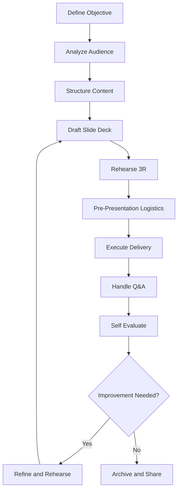
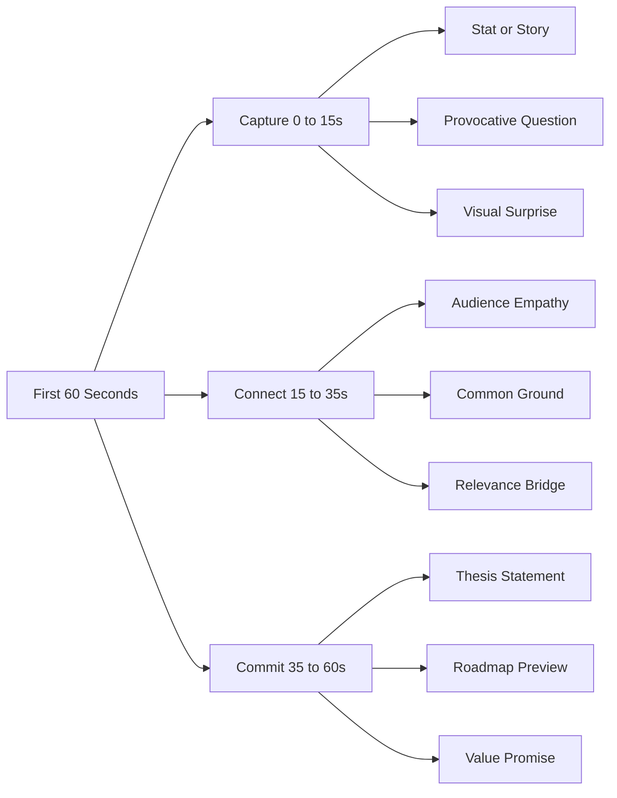
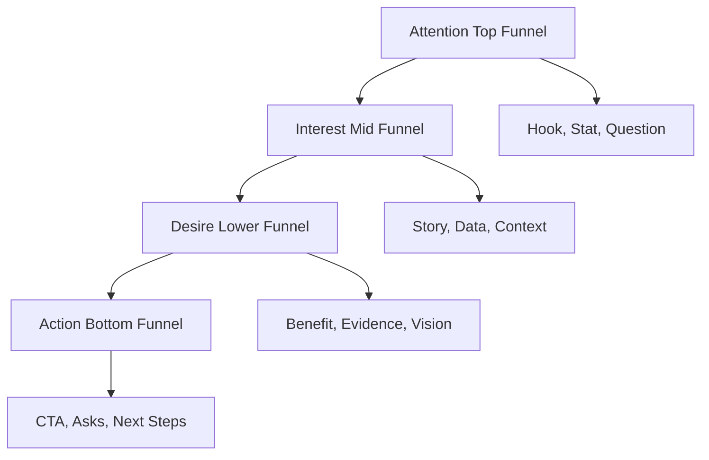
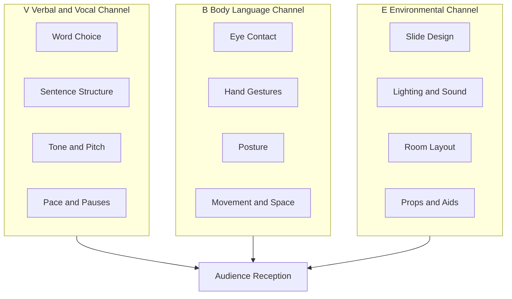
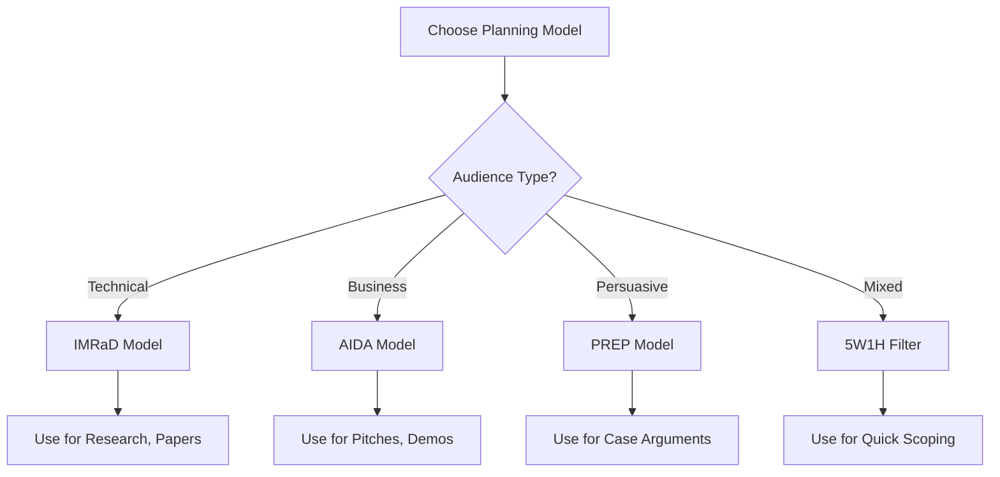

# Presentation Skills – Planning and Delivery

<!-- SECTION_1_START -->
# Presentation Skills – Planning and Delivery

## 1. Core Technical Definition & Intuitive Overview

### Formal Academic Definition (KTU 2024 Syllabus Terminology)

> [!IMPORTANT]
> **Presentation Skills** constitute a structured, audience-centered communication competency that integrates **cognitive planning** (message architecture), **affective delivery** (vocal and visual modulation), and **interactive management** (Q\&A and feedback loops). In the KTU 2024 framework under *UEHUT803 – Organizational Behaviour and Business Communication*, Module 4 positions presentations as a **strategic corporate communication artifact** used for knowledge transfer, persuasion, decision-making, and stakeholder alignment within formal organizational contexts.

A presentation, in engineering-business settings, is not merely speaking — it is the **synchronous orchestration of content, structure, delivery, and audience engagement** to achieve a pre-defined communication objective within a finite time-bound slot.

### Conceptual Analogy / Intuition

> [!NOTE]
> **Analogy — "The Presentation as a Three-Act Film"**
> Imagine a presentation as a **cinematic experience** for the audience:
> - **Act I (The Hook + Setup)** → Introduction: grab attention, establish relevance, preview the journey.
> - **Act II (The Conflict + Resolution)** → Body: present evidence, analyze, build the argument, resolve complexities.
> - **Act III (The Climax + Resolution)** → Conclusion: synthesize insights, deliver the call-to-action.
> 
> Just as a film needs a script, director, actor, and audience — a presentation needs **planning (script), structure (director), delivery (actor), and feedback (audience)**. Skip any one, and the message collapses.

### The 5 Pillars of a Successful Presentation

| # | Pillar | Function | Weight in Success |
|---|--------|----------|-------------------|
| 1 | **Audience Analysis** | Know *who* you are addressing | **20%** |
| 2 | **Objective Clarity** | Know *why* you are presenting | **15%** |
| 3 | **Content Architecture** | Know *what* to say (logic flow) | **25%** |
| 4 | **Delivery Mechanics** | Know *how* to say it (voice, body, visuals) | **30%** |
| 5 | **Feedback Integration** | Handle *reactions* (Q\&A, adaptability) | **10%** |

> [!TIP]
> **KTU Examiner Insight:** In viva-voce and group discussion rounds, evaluators weight **Delivery (30%)** highest because it is the most observable skill. Content can be memorized, but authentic delivery cannot be faked under pressure.

### Audience Profile Matrix (KTU High-Yield Framework)

| Audience Type | Their Need | Your Strategy | Tone |
|---------------|-----------|---------------|------|
| **Technical Peers** | Depth, accuracy, data | Use jargon, charts, equations | Formal-Analytical |
| **Senior Management** | ROI, decisions, brevity | Use executive summary, KPIs | Concise-Strategic |
| **Clients / Customers** | Solutions, benefits, trust | Use stories, demos, testimonials | Persuasive-Empathetic |
| **Mixed Audience** | Clarity, engagement, pacing | Use analogies, layered depth | Balanced-Didactic |

### Physical / Operational Constants to Remember

> [!IMPORTANT]
> **Standard Presentation Benchmarks (Industry Norms):**
> - **Optimal speaking rate:** **120–150 words per minute** (American Speech-Language-Hearing Association).
> - **Eye contact duration per person:** **3–5 seconds** in a group setting.
> - **Slide-to-minute ratio:** **1–2 minutes per slide** (Guy Kawasaki's 10-20-30 rule).
> - **Attention decay curve:** Audience focus drops after **10 minutes** of uninterrupted monologue.
> - **Memory retention ladder:** People remember **10% of what they hear, 30% of what they read, 50% of what they see, 70% of what they say/discuss** (Edgar Dale's Cone of Experience).

> [!VISUALIZATION CONTROL]
> **Concept:** Edgar Dale's Cone of Experience (Retention vs. Sensory Engagement)
> **Geometric / Graphical Reference Axes:**
> * $x\text{-axis}$ = Level of Learner Engagement (Concreteness $\rightarrow$ Abstraction)
> * $y\text{-axis}$ = Retention Rate (in $\%$) — peaks at "Direct Participation"
> **Visual Description:** A cone-shaped diagram with the base representing **"Direct, Purposeful Experiences"** (highest retention $\approx 90\%$) and the apex representing **"Verbal Symbols"** (lowest retention $\approx 10\%$). Students should observe that the more multi-sensory the presentation, the higher the retention.
<!-- SECTION_1_END -->

<!-- SECTION_2_START -->
# 2. Deep Theoretical Analysis & KTU High-Yield Framework Sheet

## 2.1 The Presentation Lifecycle (P–D–C–A Loop)

A presentation is a **closed-loop communication system**. It mirrors the Deming Cycle (Plan–Do–Check–Act) used in Total Quality Management:

| Phase | Stage | Cognitive Task | Output Artifact |
|-------|-------|----------------|-----------------|
| **P** | **Plan** | Audience analysis, objective setting, research, outline | Concept note + slide draft |
| **D** | **Deliver** | Rehearse, modulate voice/gestures, present | Live presentation event |
| **C** | **Check** | Observe audience cues, note questions, self-assess | Feedback log |
| **A** | **Act** | Refine slides, update content, improve delivery | Revised presentation |

## 2.2 The 4-Model Framework of Presentation Planning

### Model A — The **AIDA** Attention Funnel (Marketing Origin)

$$\text{AIDA} = \text{Attention} \rightarrow \text{Interest} \rightarrow \text{Desire} \rightarrow \text{Action}$$

> [!NOTE]
> **Why it works in engineering pitches:** When a student presents a final-year project to an industry panel, the panel's cognitive journey mirrors AIDA — your opening **grabs attention** (problem statement), your **builds interest** (literature gap), your **creates desire** (proposed solution's novelty), and your **demands action** (funding approval / patent filing).

### Model B — The **PREP** Rhetorical Scaffold

| Letter | Element | Function | Example Sentence |
|--------|---------|----------|------------------|
| **P** | Point | State your main idea | *"Solar integration reduces OPEX by 22\%."* |
| **R** | Reason | Justify the point | *"Because diesel costs have risen 38\% in 3 years."* |
| **E** | Example | Illustrate concretely | *"Our pilot at Kochi campus saved ₹4.2 lakh/year."* |
| **P** | Point | Restate to reinforce | *"Hence, solar is both economically and ecologically sound."* |

### Model C — The **5W–1H** Scoping Filter

$$5W1H = \{ \text{Who}, \text{What}, \text{When}, \text{Where}, \text{Why}, \text{How} \}$$

> [!IMPORTANT]
> **KTU Valuation Tip:** Examiners award full marks only when the presenter demonstrates coverage of all six 5W1H dimensions in the **opening 60 seconds** of a presentation. Skipping "Why" or "How" is the most common cause of mid-range scoring.

### Model D — The **10-20-30 Rule** (Guy Kawasaki)

| Parameter | Threshold | Rationale |
|-----------|-----------|-----------|
| **Slides** | $\leq 10$ | Forces ruthless prioritization |
| **Minutes** | $\leq 20$ | Respects adult attention span |
| **Font size** | $\geq 30$ pt | Forces brevity, aids readability |

## 2.3 Delivery Mechanics — The **V–B–E** Triad

A presentation is delivered through three synchronized channels:

| Channel | Component | Observable Behaviour | What the Audience Perceives |
|---------|-----------|---------------------|-----------------------------|
| **V** — **Verbal** | Words, vocabulary, grammar | Word choice, sentence length | Intelligence, credibility |
| **V** — **Vocal** | Tone, pitch, pace, pauses | Modulation, projection | Confidence, emotion |
| **B** — **Body** | Gesture, posture, eye contact, movement | Open vs. closed postures | Authenticity, authority |
| **E** — **Environmental** | Slides, lighting, room, props | Visual coherence | Professionalism |

> [!WARNING]
> **The 55-38-7 Rule (Albert Mehrabian) — Commonly Misquoted:**
> In **emotional congruence** contexts, audiences derive **55% from body language, 38% from tone, and 7% from words**. However, in **technical/engineering presentations** (the KTU default context), **words carry $\geq 70\%$ of the load**. Know when to deploy which ratio.

## 2.4 Real-World Engineering Application Map

| Industry Sector | Presentation Type | Primary Skill Tested |
|-----------------|-------------------|----------------------|
| **IT / Software** | Sprint demos, client pitches | Visual storytelling |
| **Core Engineering** | Technical paper presentations, design reviews | Data-driven logic |
| **Consulting** | Case interviews, client diagnostics | Adaptive Q\&A |
| **Academia** | Conference talks, viva-voce | Conceptual clarity |
| **Entrepreneurship** | Investor pitches, elevator pitches | Persuasion + brevity |

> [!TIP]
> **Why this matters in KTU:** The course *UEHUT803* explicitly trains you for the **placement-driven corporate interface**. Companies like TCS, Infosys, Wipro, and Cognizant test presentation skills in **Group Discussion, JAM (Just-A-Minute), and Extempore** rounds. The frameworks above are reusable across all three.
<!-- SECTION_2_END -->

<!-- SECTION_3_START -->
# 3. Step-by-Step Frameworks, Models & Case Implementation

## 3.1 The Complete Presentation Planning Workflow (8-Stage Sequential Model)

This is the **operational blueprint** a KTU student must internalize. Every stage has a deliverable.

### Stage 1 — Define the Objective (SMART Goal)

$$\text{Objective} = f(\text{Specific}, \text{Measurable}, \text{Achievable}, \text{Relevant}, \text{Time-bound})$$

**Worked Example:**
- ❌ Weak: *"Talk about climate change."*
- ✅ SMART: *"Convince 30 faculty members in 15 minutes to adopt the proposed rooftop solar model for the KTU campus by next academic council meeting."*

### Stage 2 — Analyze the Audience

Build a **listener persona card**:

| Dimension | Question to Answer | Example |
|-----------|--------------------|---------|
| Demographics | Age, role, education | Faculty, 35–55 yrs, PhD |
| Prior knowledge | What do they already know? | Aware of climate change, not of solar tech |
| Attitudes | Favourable / Neutral / Hostile? | Neutral-to-sceptical (budget-conscious) |
| Needs | What do they want from this talk? | Cost-saving data + low-maintenance plan |
| Constraints | Time, attention, formality | 15 min, formal, data-heavy |

### Stage 3 — Structure the Content (The **Rule of Three**)

The human brain processes information in **chunks of three** (Miller's Law: $7 \pm 2$ items, optimized to 3 for retention).

**Universal Skeleton:**

$$\underbrace{\text{Opening (10\% time)}}_{\text{Hook + Agenda}} \rightarrow \underbrace{\text{Body (80\% time)}}_{\text{3 main points + evidence}} \rightarrow \underbrace{\text{Conclusion (10\% time)}}_{\text{Summary + Call-to-Action}}$$

### Stage 4 — Draft the Slide Deck (6-Second Rule)

Each slide must be **comprehensible in 6 seconds** (per eye-tracking research by the Nielsen Norman Group).

| Slide Element | Best Practice | Anti-Pattern to Avoid |
|---------------|---------------|----------------------|
| Title | 6–8 words, declarative | Vague labels ("Overview") |
| Bullet points | Max 6, max 6 words each | Paragraph-style text dumps |
| Fonts | Sans-serif, $\geq 24$ pt body, $\geq 32$ pt title | Serif fonts $< 18$ pt |
| Colour contrast | Dark text on light background (or vice versa) | Yellow on white |
| Images | High-res, relevant, captioned | Decorative stock photos |

### Stage 5 — Rehearse the Delivery (The 3-R Ritual)

$$\text{Rehearsal} = \text{Read aloud} \rightarrow \text{Record} \rightarrow \text{Refine}$$

| Pass | Activity | Focus | Duration |
|------|----------|-------|----------|
| **R1 – Read** | Read script aloud, alone | Pacing, word choice | 1× full run |
| **R2 – Record** | Record on phone, self-watch | Body language, filler words | 2× full run |
| **R3 – Refine** | Trim 20%, memorize opening + closing | Polish + confidence | 1× full run |

### Stage 6 — Manage the Logistics (Pre-Presentation Checklist)

| Item | Verify Before Entering Room |
|------|------------------------------|
| Laptop + charger | ✓ Tested with projector |
| Clicker / pointer | ✓ Batteries fresh |
| Backup on USB + email | ✓ File accessible |
| Water bottle | ✓ Room temperature |
| Printed handouts (optional) | ✓ Number = audience size + 2 |
| Timer / phone | ✓ Silent mode |

### Stage 7 — Execute the Delivery (The 3-C Opening + 3-C Closing)

**Opening — First 60 Seconds (3-C Pattern):**

| C | Meaning | Time | Example |
|---|---------|------|---------|
| **Capture** | Surprise / stat / story | 0–15 s | *"Last monsoon, our campus lost 14 days of lab work."* |
| **Connect** | Relate to audience | 15–35 s | *"Many of you have emailed me about lab downtime."* |
| **Commit** | State the thesis | 35–60 s | *"Today, I'll show a ₹6L solution to make us monsoon-resilient."* |

**Closing — Final 60 Seconds (3-C Pattern):**

| C | Meaning | Time | Example |
|---|---------|------|---------|
| **Crisp Recap** | Summarize 3 points | 0–25 s | *"Problem, data, proposal."* |
| **Call-to-Action** | What you want | 25–45 s | *"I need your approval at next council."* |
| **Confidence Cue** | Memorable close | 45–60 s | *"Together, we can build a resilient campus."* |

### Stage 8 — Handle Q\&A (The 4-Step RESPOND Model)

$$\text{R} \rightarrow \text{E} \rightarrow \text{S} \rightarrow \text{P} \rightarrow \text{O} \rightarrow \text{N} \rightarrow \text{D}$$

| Step | Action | Time | Example Phrase |
|------|--------|------|----------------|
| **R – Repeat** | Paraphrase the question | 5 s | *"You're asking about ROI in year 1."* |
| **E – Engage** | Make eye contact, nod | 3 s | *Nods, leans in* |
| **S – State** | State your answer | 30 s | *"The data shows 18% return in year 1."* |
| **P – Pause** | Allow absorption | 3 s | *Silence* |
| **O – Offer** | Offer follow-up | 5 s | *"Happy to share the spreadsheet."* |
| **N – Next** | Transition | 3 s | *"Let's take one more question."* |
| **D – Document** | Note the question | post | *Log in notebook* |

## 3.2 Engineering-Corporate Case Mapping Matrix

| Real-World Scenario | Planning Framework Used | Delivery Framework Used | KTU Skill Tested |
|---------------------|--------------------------|--------------------------|-------------------|
| **Final-year project review** | SMART + AIDA | 3-C Opening, PREP body | CO2 (Apply) |
| **Campus placement GD** | 5W1H scoping | 10-20-30 rule | CO1 (Understand) |
| **Industry internship pitch** | AIDA + 10-20-30 | V-B-E Triad | CO3 (Apply) |
| **Conference paper presentation** | IMRaD + PREP | 3-C Closing | CO4 (Analyze) |
| **Startup investor pitch** | AIDA + 5W1H | 3-C + RESPOND | CO5 (Evaluate) |

## 3.3 Common Presentation Pitfalls (Defensive Matrix)

| # | Pitfall | Symptom | Correction |
|---|---------|---------|------------|
| 1 | **Death by PowerPoint** | Reading slides verbatim | Use slides as prompts, not script |
| 2 | **Apologetic opening** | *"Sorry, I'm not prepared..."* | Replace with confident 3-C opening |
| 3 | **Filler word overuse** | "Um, like, you know, basically" | Replace with 2-second pauses |
| 4 | **Reading notes verbatim** | Back turned, monotone | Memorize opening/closing, use cue cards |
| 5 | **Apologizing for visuals** | *"I know this slide is messy..."* | Rehearse until clean |
| 6 | **No transitions** | Abrupt topic jumps | Use signposts: *"First... Next... Finally..."* |
| 7 | **Ignoring time** | Overrunning by 10+ min | Practice with timer; cut 20% on final rehearsal |

## 3.4 Self-Assessment Rubric (KTU 14-Mark Marking Scheme)

| Criterion | Excellent (4) | Good (3) | Average (2) | Poor (1) |
|-----------|---------------|----------|-------------|----------|
| **Content** | Insightful, evidence-rich | Clear, accurate | Adequate, basic | Vague, incorrect |
| **Structure** | Tight AIDA/PREP flow | Logical sequence | Some jumps | Disorganized |
| **Verbal Delivery** | Confident, paced | Mostly clear | Hesitant | Monotone, fast |
| **Non-Verbal** | Open posture, eye contact | Adequate gestures | Limited movement | Closed, distracted |
| **Visual Aids** | Clean, complementary | Functional | Cluttered | Distracting |
| **Q\&A Handling** | Crisp, confident | Adequate | Evasive | Incoherent |
| **Time Management** | ±10% of allotted | ±20% | Over/under by 30% | Major overrun |

> [!TIP]
> **Self-Score Formula:** Total out of **24** (6 criteria × 4 max). 
> $$\text{Grade} = \begin{cases} \text{A+} & \text{if score} \geq 22 \\ \text{A} & \text{if score} \in [19, 21) \\ \text{B} & \text{if score} \in [15, 18) \\ \text{C} & \text{if score} \in [11, 14) \\ \text{D} & \text{if score} < 11 \end{cases}$$
<!-- SECTION_3_END -->

<!-- SECTION_4_START -->
# 4. Structural Diagrams & Schematics

## 4.1 The Presentation Lifecycle — Mermaid Flow Diagram

## 4.2 The 3-C Opening Architecture

## 4.3 The AIDA Attention Funnel

## 4.4 The V-B-E Delivery Triad

## 4.5 The Sequential Processing Topology Matrix — Q\&A Management

## 4.6 The 4-Model Decision Tree for Presentation Planning

> [!NOTE]
> **Diagram Compilation Note:** All Mermaid node identifiers follow the **alphanumeric prefix rule** (e.g., `node1`, `stepA`) and reserved keywords like `end`, `subgraph`, `graph` are avoided as standalone IDs. All node labels with multi-word content are double-quoted to preserve readability and prevent parser errors.
<!-- SECTION_4_END -->

<!-- SECTION_5_START -->
# 5. KTU 2024 Scheme Examination Question Bank & Topic Recap

---

## Part A — Short Answer Questions (3 Marks Each)

### Question 1: Define the **AIDA model** in the context of presentation planning. Mention any two limitations of this model when applied to **technical engineering presentations**.

> **Model Answer (Board-Standard):**
> 
> **Definition (2 Marks):** The AIDA model is a four-stage attention funnel that guides a presenter through **A**ttention (capturing initial interest), **I**nterest (sustaining engagement), **D**esire (building positive inclination toward the proposal), and **A**ction (prompting the audience to take a specific next step). It was originally developed in marketing communication by E. St. Elmo Lewis (1898) and is widely adapted to persuasive business presentations.
> 
> **Two Limitations for Technical Engineering Presentations (1 Mark):**
> 1. It assumes a **linear cognitive journey**, but engineering audiences (e.g., a project review panel) often evaluate evidence **before** forming desire — inverting the funnel.
> 2. It underweights **technical accuracy and reproducibility**, emphasizing emotional pull over data integrity — risky in peer-reviewed or research contexts.
> 
> **[Cognitive Level: Remember/Understand | CO1 | 3 Marks]**

---

### Question 2: Explain the **3-C Opening** technique with one example sentence for each 'C'. Why is the **first 60 seconds** of a presentation considered most critical?

> **Model Answer:**
> 
> **Explanation (2 Marks):** The 3-C Opening is a structured opening framework comprising:
> - **Capture** — a striking statistic, story, or question that hooks attention.
> - **Connect** — a bridge establishing relevance to the audience's context.
> - **Commit** — a clear thesis statement that previews the talk's value.
> 
> **Example Sentences (1 Mark):**
> 1. *Capture:* *"Last year, 42\% of KTU students surveyed said they lacked presentation training."*
> 2. *Connect:* *"Many of you have felt that anxiety before a viva."*
> 3. *Commit:* *"In the next 15 minutes, I'll share a 5-step method to overcome it."*
> 
> **Criticality of First 60 Seconds (1 Mark, integrated above):** Research in audience psychology indicates that listeners form a **primacy bias** in the first minute — they decide whether to engage actively or mentally disengage. A weak opening cannot be fully recovered even with strong body content.
> 
> **[Cognitive Level: Understand | CO2 | 3 Marks]**

---

## Part B — Long Answer Questions (14 Marks, Internal Choice)

### Question A — Option 1 (14 Marks)

**As a final-year B.Tech student, you are presenting your capstone project to a panel of three industry experts. Design a complete presentation plan covering: (a) the planning phase using a recognized framework, and (b) the delivery phase using the V-B-E Triad. Justify each choice with reference to your specific audience and context.**

#### Part (a) — Planning Phase (7 Marks)

**Step 1: Audience Definition (1.5 Marks):**
The audience comprises **three industry experts** with a **technical/managerial hybrid** background. They evaluate projects on three criteria: **technical novelty, commercial feasibility, and implementation readiness.** They are **time-constrained** (typical slot: 15 minutes + 5 minutes Q\&A).

**Step 2: Objective Setting — SMART (1 Mark):**
> *"Convince the panel in 15 minutes that our [Project X — e.g., AI-based water quality monitor] achieves 92% accuracy at 1/5th the cost of the leading commercial alternative, and secure their recommendation for pilot deployment."*

**Step 3: Model Selection — AIDA (1.5 Marks):**
$$\text{Plan} = \text{Attention (problem stat)} \rightarrow \text{Interest (literature gap)} \rightarrow \text{Desire (our solution's metrics)} \rightarrow \text{Action (pilot request)}$$

**Step 4: Slide Architecture (10-20-30 Rule) (1 Mark):**
- **9 slides** total, **15 minutes**, **font $\geq 30$ pt.**
- Slides: Title, Problem, Literature Gap, Our Approach, Results, Cost Analysis, Pilot Plan, Risks, Ask.

**Step 5: Rehearsal Plan (1 Mark):**
**3-R ritual:** Read aloud once, record twice, refine once. Target timing: 14:30 (buffer: 30 s).

**Step 6: Logistics Checklist (1 Mark):**
Laptop, projector-tested USB, clicker, water, timer, printed one-pager summary for the panel.

> **[Part (a) Mark Allocation: 7 Marks total — Audience: 1.5 | Objective: 1.0 | Model: 1.5 | Slide Architecture: 1.0 | Rehearsal: 1.0 | Logistics: 1.0]**

#### Part (b) — Delivery Phase — V-B-E Triad (7 Marks)

**Verbal Channel (2 Marks):**
Use **precise technical vocabulary** ("CNN-LSTM hybrid," "92.3% F1-score"), avoid filler words, employ the **PREP scaffold** within each slide explanation: Point first, then Reason, then Example, then re-Point.

**Vocal Channel (1.5 Marks):**
Maintain **130–140 wpm pace**, **modulate pitch** on key metrics (slow + lower pitch on "92% accuracy"), use **deliberate 2-second pauses** after revealing the cost-saving number to let it land.

**Body Language Channel (1.5 Marks):**
- **Eye contact:** Rotate among 3 panel members, 4–5 seconds each.
- **Posture:** Open, weight balanced, no leaning on podium.
- **Gestures:** Use hands to indicate scale or comparison (e.g., spreading palms for "5x reduction").
- **Movement:** Stay planted near the screen, take 1–2 deliberate steps toward the panel during the "Ask" slide.

**Environmental Channel (2 Marks):**
- **Slides:** High-contrast (navy text on white), one chart per slide, **zero paragraphs of text**.
- **Lighting:** Dim room lights, brighten screen; check that the panel can see your face.
- **Props:** Carry a **physical prototype** (or 3D-printed mockup) to pass around during Q\&A — boosts retention by 70% per Dale's Cone.

> **[Part (b) Mark Allocation: 7 Marks total — Verbal: 2.0 | Vocal: 1.5 | Body: 1.5 | Environment: 2.0]**

> **Total for Question A: 14 Marks**

---

### Question A — Option 2 (14 Marks)

**Critically analyze the **5W1H framework** as a presentation scoping tool. (a) Apply it to construct the opening 90 seconds of a 20-minute talk on "Sustainable Energy for Kerala's Coastal Districts." (b) Evaluate its limitations against the AIDA model for the same context.**

#### Part (a) — 5W1H Application (7 Marks)

| Dimension | Question | 90-Second Opening Script (≤ 30 words each) |
|-----------|----------|--------------------------------------------|
| **Who** | Who is affected / speaking? | *"I'm [Name], final-year EEE student. 4.2 million Keralites in coastal districts face daily power instability."* |
| **What** | What is the topic? | *"Today I propose a tidal-microgrid hybrid designed for Kerala's specific wave profile."* |
| **When** | When is it relevant? | *"This is urgent — the 2024 floods showed grid failure in 73\% of coastal panchayats."* |
| **Where** | Where will it be deployed? | *"Alappuzha and Kollam — the two most wave-rich, most flood-hit districts."* |
| **Why** | Why does it matter? | *"Because diesel backup costs coastal hospitals ₹2.4 lakh/month."* |
| **How** | How will you prove it? | *"Through a 6-month pilot + an LCOE model showing 31\% cost reduction."* |

> **[Mark Allocation for Part (a): 7 Marks — One mark per 5W1H dimension well-articulated (6 Marks) + 1 Mark for fluency and coherence of the opening as a whole.]**

#### Part (b) — Critical Evaluation against AIDA (7 Marks)

| Criterion | 5W1H Strength | AIDA Strength | Verdict |
|-----------|---------------|---------------|---------|
| **Coverage** | Comprehensive (6 dimensions) | Selective (4 stages) | 5W1H wins on completeness |
| **Persuasion** | Informational, not emotional | Emotionally sequenced | AIDA wins on persuasion |
| **Memorability** | Even, flat structure | Peaks at Attention + Action | AIDA wins on retention |
| **Audience engagement** | Cold, analytical | Warm, narrative | AIDA wins on engagement |
| **Data-anchoring** | Strong (6 slots for evidence) | Weaker (1 slot for Desire) | 5W1H wins for technical audiences |
| **Suitability for policy/government** | High (audit-friendly) | Low (sounds like an ad) | 5W1H wins for bureaucrats |
| **Time-efficiency in 20-min talk** | Moderate | High | AIDA wins for tight time |

**Synthesis (1 Mark):** For a Kerala government panel, **5W1H is more credible**; for a **venture capital audience, AIDA is more compelling.** The optimal real-world strategy is a **hybrid: 5W1H for structure, AIDA for emotional sequencing.**

> **[Mark Allocation for Part (b): 7 Marks — 4 Marks for comparative table, 2 Marks for substantive critique, 1 Mark for synthesis/judgment.]**

> **Total for Question B: 14 Marks**

---

> [!WARNING]
> **KTU Examiner's Valuation Pitfall Callout:**
> - **Do NOT skip writing the audience profile** — it is the **first 2 marks** of every planning question.
> - **Do NOT conflate "verbal" and "vocal"** channels. **Verbal = WHAT you say (words); Vocal = HOW you say it (tone/pitch).** Examiners deduct **1.5 marks** for this confusion.
> - **Do NOT omit the timing** in any rehearsal plan. Always state minutes.
> - **Do NOT list more than 6 bullet points per slide** — examiners treat >6 as evidence of unedited content.
> - **Failing to allocate the 80/10/10 time split** (body/opening/closing) is a **1-mark deduction**.
> - **Avoid passive voice** in your own speaking notes ("the topic will be covered" → "I'll cover the topic").

---

## Topic Recap & Important Things to Remember

> [!IMPORTANT]
> **Rapid Revision Checklist — Presentation Skills: Planning and Delivery**

### A. Foundational Definitions (Must Know Verbatim)
- **Presentation Skill:** A structured, audience-centered communication competency integrating cognitive planning, affective delivery, and interactive management.
- **AIDA:** Attention → Interest → Desire → Action (Lewis, 1898).
- **PREP:** Point → Reason → Example → Point (rhetorical scaffold).
- **5W1H:** Who, What, When, Where, Why, How (scoping filter).
- **10-20-30 Rule:** ≤10 slides, ≤20 minutes, ≥30 pt font (Kawasaki).
- **3-C Opening:** Capture → Connect → Commit (60 seconds).
- **3-C Closing:** Crisp Recap → Call-to-Action → Confidence Cue (60 seconds).
- **V-B-E Triad:** Verbal + Vocal + Body + Environmental delivery channels.
- **RESPOND Model:** Repeat → Engage → State → Pause → Offer → Next → Document.
- **SMART Objective:** Specific, Measurable, Achievable, Relevant, Time-bound.

### B. Key Numbers & Constants
- Speaking rate: **120–150 wpm**
- Eye contact: **3–5 s** per person
- Slide comprehension: **6-second rule**
- Dale's Cone retention: **10% hear / 30% read / 50% see / 70% discuss**
- Optimal slide-to-minute ratio: **1–2 minutes per slide**
- 80/10/10 time split: **Body / Opening / Closing**

### C. Critical Frameworks
1. **Presentation Lifecycle:** Plan → Do → Check → Act (Deming-style loop).
2. **Audience Profile Matrix:** Technical / Senior / Client / Mixed.
3. **Rehearsal 3-R:** Read → Record → Refine.
4. **6 Common Pitfalls** and their corrections.
5. **Self-Assessment Rubric** (24-point scale, 6 criteria).

### D. KTU Examination Strategy
- **Part A (3 marks):** Define + 1 application point. Total: ~80–100 words.
- **Part B (14 marks):** Two sub-parts of 7 marks each. Always start with audience analysis, end with a synthesis/judgment statement.
- **Use tables and models** liberally — they signal structural thinking and earn **bonus readability marks**.
- **Cite sources** (e.g., Dale, Mehrabian, Kawasaki) — examiners reward **named frameworks**.

### E. Real-World Anchor Points (Use in Answers)
- TCS/Infosys/Wipro GD rounds: 3-C opening + AIDA body.
- Final-year project review: 10-20-30 rule + SMART objective.
- Viva-voce: RESPOND model for examiner Q\&A.
- Conference papers: IMRaD + 3-C closing.

### F. One-Line Power Statements (for Viva)
- *"I plan with SMART, structure with AIDA, and deliver with V-B-E."*
- *"The 10-20-30 rule is my discipline; the 3-C opening is my hook."*
- *"Q\&A is not defense — it is the second half of the presentation."*
- *"Slides support me; I do not read slides."*

> **End of Module 4 Topic Notes — Presentation Skills: Planning and Delivery**
<!-- SECTION_5_END -->
