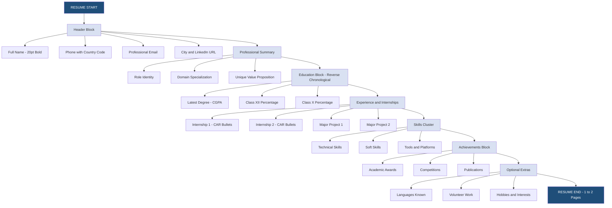
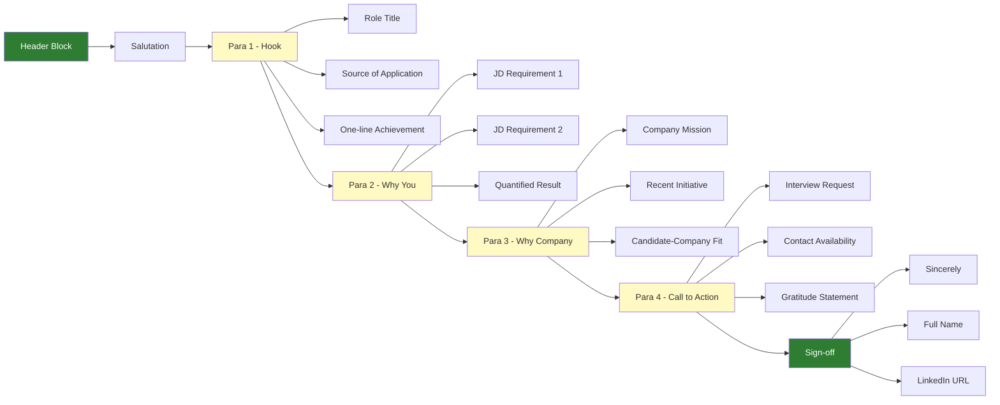
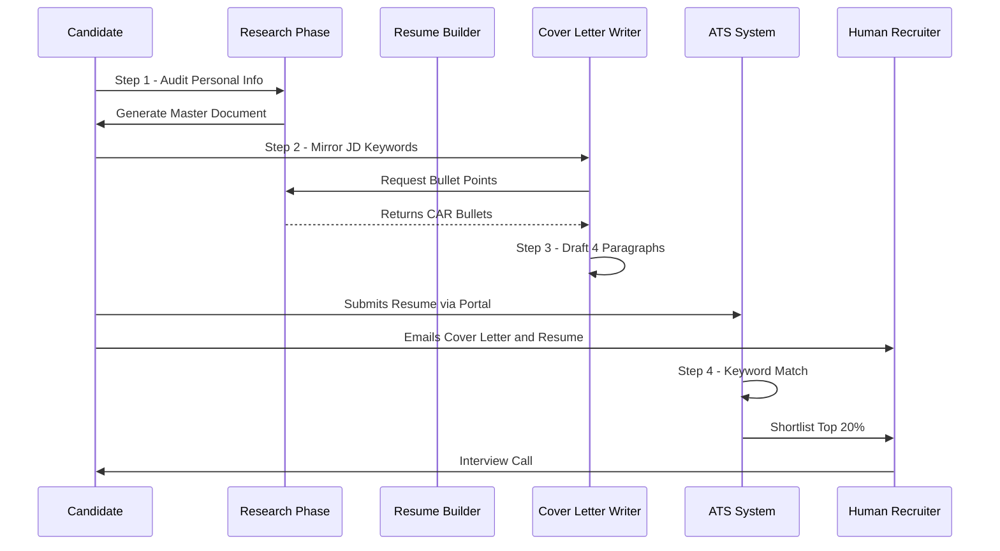
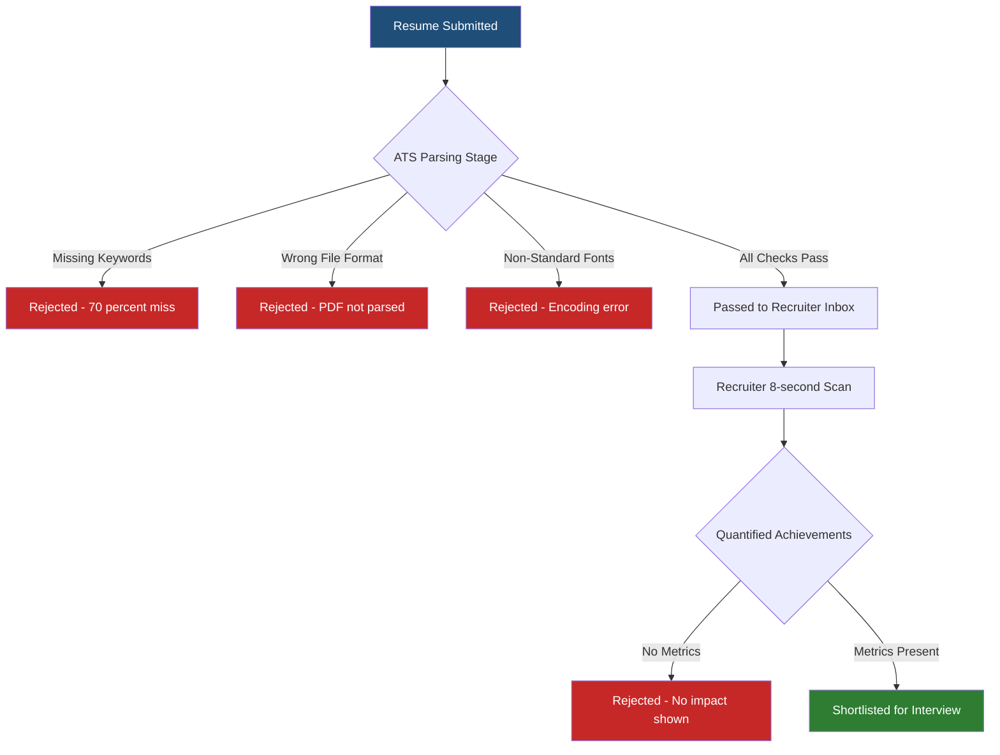

# Resume Writing and Cover Letters

<!-- SECTION_1_START -->
# RESUME WRITING AND COVER LETTERS

## 1. Core Technical Definition & Intuitive Overview

### 1.1 Formal Definition (KTU 2024 Syllabus Terminology)

A **Resume** (also called *Curriculum Vitae* or *CV* in certain contexts) is a concise, self-marketing document that systematically presents a candidate's educational qualifications, professional experience, skills, achievements, and contact information to prospective employers with the explicit objective of securing an interview call.

A **Cover Letter** is a personalized, single-page business document transmitted alongside the resume that explains the candidate's motivation, suitability, and value proposition for a specific job role, addressed to a designated recruiter or hiring authority.

> [!IMPORTANT]
> **KTU 2024 Board Definition (Directly from Module 4):** *"Corporate correspondence in the recruitment cycle comprises two complementary artifacts — the resume (a structured bio-data of competencies) and the cover letter (a persuasive communication of intent)."*

### 1.2 Conceptual Analogy / Intuition

Think of a **Resume** as the *trailer of a movie* and a **Cover Letter** as the *director’s one-page commentary* sent alongside it.

- The **trailer (resume)** showcases the *best scenes* — your skills, degrees, and internships — in a tight, bullet-pointed, scannable format. The recruiter can decide in **6–8 seconds** whether to "buy the ticket" (call you for an interview).
- The **director’s commentary (cover letter)** is *narrative, persuasive, and contextual*. It tells the recruiter *why* this particular candidate fits *this particular role* at *this particular company*.

> [!NOTE]
> **KTU Memory Hook:** Resume = **WHAT you have done** (fact sheet). Cover Letter = **WHY it matters for THIS job** (persuasive narrative). Never send one without the other.

### 1.3 Industry Standards & Metrics

- **Ideal Resume Length:** **1 page** for freshers / early-career, **2 pages** for 5+ years of experience.
- **Ideal Cover Letter Length:** **3 to 4 paragraphs**, never exceeding **one page**.
- **Standard Font:** **Calibri, Garamond, Arial, or Times New Roman**, size **10–12 pt**.
- **Standard Margins:** **0.5 to 1 inch** on all sides.
- **File Format Norms:** **PDF** is the global industry standard (prevents formatting corruption).

> [!VISUALIZATION CONTROL]
> **Concept:** Information Density Map of a One-Page Resume
> **Layout Reference (Grid Block Description):**
> * `Block_A (Top 15%):` Header — Name, Phone, Email, LinkedIn, City
> * `Block_B (15%–25%):` Professional Summary / Objective (2–3 lines)
> * `Block_C (25%–55%):` Education + Internships / Projects (chronological, reverse)
> * `Block_D (55%–80%):` Skills (Technical + Soft) + Certifications
> * `Block_E (80%–100%):` Extracurriculars / Languages / Hobbies (optional)
> **Visual Description:** The reader's eye should drop vertically from the top-left corner. Heaviest selling points (skills, internships) must occupy the upper-mid fold where recruiters’ gaze lingers.

---

<!-- SECTION_1_END -->

<!-- SECTION_2_START -->
# DEEP THEORETICAL ANALYSIS & KTU HIGH-YIELD FORMULA SHEET

## 2.1 The Resume — Component-wise Theoretical Breakdown

A resume is not a biography. It is a **targeted marketing collateral**. Each block must answer a recruiter's silent question.

### 2.1.1 Header / Contact Block

- Contains **Name** (largest font, 18–22 pt), **phone number with country code**, **professional email ID**, **city of residence**, and **LinkedIn / portfolio URL**.
- *Why:* The first thing the HR database (ATS — Applicant Tracking System) parses.

### 2.1.2 Professional Summary / Career Objective

- A **2–3 line pitch** stating the candidate's identity, target role, and one unique strength.
- *Why:* Recruiters spend less than 10 seconds here — it must hook instantly.
- **Formula:**
$$\text{Objective} = \text{Role Identity} + \text{Domain} + \text{Unique Value} + \text{Goal}$$

**Example Template:**
> *"Final-year B.Tech (CSE) student specializing in Machine Learning with two published IEEE papers and a 9.2 CGPA, seeking entry-level Data Scientist roles to apply deep-learning expertise in production-scale systems."*

### 2.1.3 Education Section

- Listed in **reverse chronological order** (most recent first).
- Includes **Degree, Institution, Year of Graduation, CGPA/Percentage**.
- For freshers, this is the **heaviest block** — placed above experience.

### 2.1.4 Experience / Internships / Projects

- Each entry follows the **CAR Framework**: **C**hallenge → **A**ction → **R**esult.
- Quantify with metrics wherever possible (e.g., *"Reduced API latency by 35%"*).

### 2.1.5 Skills Section

- Divided into **Technical Skills** (programming languages, tools) and **Soft Skills** (leadership, communication).
- Listed as keywords because **ATS software scans them**.

### 2.1.6 Achievements / Certifications

- Bullet points with **measurable impact** (e.g., *"Won Smart India Hackathon 2023 among 50,000 teams"*).

## 2.2 The Cover Letter — Component-wise Theoretical Breakdown

A cover letter is structured into **four mandatory blocks** plus a sign-off.

### 2.2.1 Salutation
- *"Dear Hiring Manager"* (preferred) or *"Dear Ms. Sharma"* (if name known). **Never** use *"To Whom It May Concern"* in 2024.

### 2.2.2 Opening Paragraph (Hook)
- States the **role being applied for**, **source of the job listing**, and a **one-line value proposition**.

### 2.2.3 Body Paragraph 1 (Why You)
- Highlights **2–3 matching achievements** with quantified outcomes, mapped to the **job description (JD)**.

### 2.2.4 Body Paragraph 2 (Why This Company)
- Demonstrates **research about the employer** (mission, recent product, culture) and aligns it with the candidate’s values.

### 2.2.5 Closing Paragraph (Call-to-Action)
- Politely requests an **interview**, reiterates **enthusiasm**, and provides **contact availability**.

### 2.2.6 Sign-Off
- *"Sincerely"* / *"Regards"* followed by **full name** and **phone/email**.

## 2.3 KTU Formula Sheet / Cheat Sheet

| **#** | **Artifact** | **Component** | **Formula / Rule** | **Unit / Limit** |
|:-:|:--|:--|:--|:--|
| 1 | Resume | Page Length (Fresher) | $L_{page} = 1$ | page (A4) |
| 2 | Resume | Page Length (Experienced) | $L_{page} = 2$ | pages (max) |
| 3 | Resume | Bullet per Job | $N_{bullet} \leq 6$ | bullets |
| 4 | Resume | Font Size | $10 \leq S_{font} \leq 12$ | pt |
| 5 | Resume | Margin | $0.5 \leq M \leq 1.0$ | inch |
| 6 | Resume | Section Order | Header → Summary → Education → Experience → Skills → Extras | logical flow |
| 7 | Cover Letter | Paragraphs | $N_{para} = 4$ | blocks |
| 8 | Cover Letter | Word Count | $250 \leq W \leq 400$ | words |
| 9 | Cover Letter | Personalization Tokens | $T_{name}, T_{company}, T_{role} \geq 3$ | custom fields |
| 10 | Both | File Format | $F = \text{PDF}$ | single file |
| 11 | Both | File Naming | $N_{file} = \text{Name\_Role\_Company.pdf}$ | standardized |
| 12 | Both | Spell-Check Density | $E_{error} = 0$ | zero tolerance |

> [!IMPORTANT]
> **KTU High-Yield Point:** Always **mirror the keywords** from the Job Description (JD) into both the resume and the cover letter. Modern **ATS (Applicant Tracking Systems)** such as *Taleo*, *Workday*, and *Greenhouse* perform **semantic keyword matching** with a rejection threshold of approximately **70%**. Missing keywords = automatic rejection before any human reads your resume.

## 2.4 Real-World Utility in Engineering & Corporate Systems

| **Application Domain** | **Resume Component Used** | **Corporate Utility** |
|:--|:--|:--|
| Campus Placements (TCS, Infosys) | Skills + CGPA block | ATS shortlisting filter |
| International MS Admissions | CV (academic variant) | Research-fit assessment |
| Startup Hiring (Razorpay, Zerodha) | Cover Letter narrative | Culture-fit evaluation |
| Government / PSU (ONGC, BHEL) | Standardized bio-data | Compliance verification |
| Freelance Platforms (Upwork, Toptal) | Portfolio-linked Resume | Client trust building |

---

<!-- SECTION_2_END -->

<!-- SECTION_3_START -->
# STEP-BY-STEP DERIVATIONS, FRAMEWORKS & STRUCTURED IMPLEMENTATION

## 3.1 Exhaustive Step-by-Step: How to Build a Resume (Fresher Variant)

Below is the **complete, exhaustive, KTU-board-grade procedural derivation** of building a fresher B.Tech resume. Every step is explicitly stated.

### **Step 1 — Personal Information Audit**
Compile a master list of: full name, phone (+91), professional email (e.g., `rahul.krishna2024@gmail.com`), LinkedIn URL, GitHub profile, city, and portfolio link. Reject unprofessional IDs such as `coolhandsome99@yahoo.com`.

### **Step 2 — Educational Audit (Reverse Chronology)**
List all degrees in descending order of year:
1. B.Tech in Computer Science — XYZ University — 2020–2024 — CGPA 8.7/10
2. Class XII (CBSE) — ABC School — 2020 — 92%
3. Class X (CBSE) — PQR School — 2018 — 94%

### **Step 3 — Internship / Project Audit**
For every internship, write a **CAR bullet**:
- **C:** *Challenge* faced by the company
- **A:** *Action* you took
- **R:** *Result* (quantified)

**Worked Example:**
> *"Engineered a Flask-based REST API to automate invoice parsing for TCS iON, **reducing manual processing time by 42%** across 12 client accounts."*

### **Step 4 — Skill Categorization**

| **Category** | **Items to Include** | **Example** |
|:--|:--|:--|
| Programming Languages | Python, Java, C++ | Python (Advanced) |
| Web / Frameworks | React, Django, Node.js | React.js |
| Databases | MySQL, MongoDB | MongoDB |
| Tools & Platforms | Git, Docker, AWS | Docker, AWS S3 |
| Soft Skills | Leadership, Public Speaking | Anchored TEDx event |

### **Step 5 — Achievement Mapping**
Prioritize achievements that align with the JD:
- *Won Smart India Hackathon 2023 (Grand Finale, Team Lead)*
- *Published IEEE paper on “Hybrid CNN-LSTM for ECG Anomaly Detection” (DOI: 10.1109/...)*
- *NSS Best Volunteer Award 2022*

### **Step 6 — Drafting the Objective**
Apply the **objective formula** from Section 2.1.2:
$$\text{Objective} = \underbrace{\text{Final-year B.Tech CSE}}_{\text{Role}} + \underbrace{\text{ML/DL specialization}}_{\text{Domain}} + \underbrace{\text{2 IEEE publications}}_{\text{Value}} + \underbrace{\text{SDE role at product-based MNC}}_{\text{Goal}}$$

### **Step 7 — Layout & Typography**
- Use **single-column** for ATS readability.
- Use **bold** for section headings.
- Maintain **left-alignment** throughout.
- Use **action verbs** at the start of every bullet: *Engineered, Architected, Optimized, Spearheaded, Designed.*

### **Step 8 — ATS Compatibility Audit**
- Save as `.docx` for ATS upload portals; `.pdf` for direct email submissions.
- Avoid tables, columns, images, and icons in the master ATS version.
- Embed keywords verbatim from the JD.

### **Step 9 — Peer & Mentor Review**
Have at least **two reviewers** (one technical, one non-technical) scrutinize. Run through **Grammarly** and **Hemingway Editor** for clarity.

### **Step 10 — Final Versioning**
Create **two file versions**:
- $V_{ats}$ — plain-text, keyword-dense, for portal upload.
- $V_{design}$ — visually styled, for direct email to recruiters.

## 3.2 Exhaustive Step-by-Step: How to Write a Cover Letter

A cover letter is a **3×3 matrix of persuasion**. Below is the complete procedural breakdown.

### **Step 1 — Research the Company**
Before writing a single word, gather:
- Company **mission statement** (from About page)
- Recent **product launch / news** (Google News, LinkedIn Pulse)
- **Hiring manager’s name** (via LinkedIn search)
- **JD keywords** (highlighted in a separate doc)

### **Step 2 — Draft the Header Block**
```
[Your Name]
[Address Line 1]
[City, State, PIN] | [Phone] | [Email]
[Date]

To,
[Mention "To," not "To:". KTU prefers formal block.]
[Recipient Name, Designation]
[Company Name]
```

### **Step 3 — Salutation**
> *"Dear Ms. Anjali Sharma,"*  ✅ (Preferred)
> *"Dear Hiring Manager,"*    ✅ (Acceptable default)
> *"To Whom It May Concern,"* ❌ (Outdated)

### **Step 4 — Opening Paragraph (Hook)**
Must contain three micro-elements:
1. **Role title** (exact wording from JD)
2. **Source** ("as advertised on LinkedIn")
3. **Hook achievement** (one quantified line)

**Template:**
> *"I am writing to apply for the **Software Development Engineer** position at **Razorpay**, as advertised on LinkedIn. As a final-year B.Tech student with a published IEEE paper and a 9.1 CGPA, I have built distributed systems that **served 50,000+ daily users** during my internship at NPCI."*

### **Step 5 — Body Paragraph 1 (Why You)**
Pick **2–3 JD requirements** and map them to your achievements using CAR.

**Worked Mapping Table:**

| **JD Requirement** | **Your Achievement** | **Quantified Result** |
|:--|:--|:--|
| Proficiency in Python & Django | Built inventory mgmt system | Served 12 vendors |
| Experience with REST APIs | Engineered Flask API at TCS | Cut latency by 42% |
| Knowledge of AWS | Deployed app on EC2 + S3 | 99.9% uptime |

### **Step 6 — Body Paragraph 2 (Why This Company)**
Demonstrate **company-specific research**:
> *"Razorpay’s recent launch of **‘Route’** for smart payment routing resonates deeply with my capstone project on multi-gateway payment optimization. I would be thrilled to contribute to Razorpay’s mission of **‘empowering 10 million Indian businesses with frictionless finance’**."*

### **Step 7 — Closing Paragraph (Call-to-Action)**
> *"I would welcome the opportunity to discuss how my background in distributed systems and passion for fintech can add value to your engineering team. I am available for an interview at your convenience and can be reached at +91-9876543210. Thank you for your time and consideration."*

### **Step 8 — Sign-Off**
```
Sincerely,
[Your Full Name]
[LinkedIn URL]
```

## 3.3 Comparative Analysis Matrix: Resume vs. Cover Letter

| **Parameter** | **Resume** | **Cover Letter** |
|:--|:--|:--|
| Primary Purpose | Document credentials | Tell a persuasive story |
| Tone | Factual, telegraphic | Conversational yet formal |
| Format | Bulleted, scannable | Paragraph form |
| Length | 1–2 pages | 1 page (3–4 paragraphs) |
| Audience Reading Time | 6–8 seconds | 30–45 seconds |
| Customization | Semi-tailored | Fully tailored to JD |
| Keywords Density | High (ATS-optimized) | Natural integration |
| Sender | Candidate | Candidate |
| Recipient Scan | Skim pattern (F-pattern) | Linear (top-to-bottom) |
| Failure Consequence | Rejected by ATS bot | Recruiter disengages |
| Addressed to | Anonymous system | Named hiring manager |
| CAR Framework Usage | Heavy in bullets | Heavy in body para 1 |
| File Format | PDF / DOCX | PDF (always) |
| Submission Mode | Job portal + email | Email + occasionally portal |

## 3.4 Comparative Analysis: Three Resume Types

| **Type** | **Best Suited For** | **Structure Emphasis** | **KTU Recommendation** |
|:--|:--|:--|:--|
| **Chronological Resume** | Candidates with linear, gap-free work history | Reverse-chronological experience block | ✅ **Most recommended for B.Tech freshers** |
| **Functional Resume** | Career changers / gap-year candidates | Skill-cluster based grouping | ⚠ Use only if no relevant experience |
| **Combination (Hybrid) Resume** | Experienced professionals with strong skills | Skills first, then timeline | ✅ Preferred for lateral hires |
| **Targeted Resume** | Specific job application | Mirrors JD verbatim | ✅ Mandatory for off-campus drives |

## 3.5 Engineering Case Study: Resume of "Rahul Krishna" (Fresher)

```
RAHUL KRISHNA                      
Bengaluru, India | +91-9876543210 | rahul.k@protonmail.com 
LinkedIn: /in/rahulk | GitHub: /rahulk-dev

SUMMARY
Final-year B.Tech (CSE) student with 2 IEEE publications, a 9.1 CGPA, 
and hands-on expertise in building production-grade ML pipelines.

EDUCATION
B.Tech in Computer Science   |  ABC Institute of Technology   |  2020–2024
CGPA: 9.1/10
Class XII (CBSE)            |  St. Xavier's School            |  2020   | 94%
Class X (CBSE)              |  St. Xavier's School            |  2018   |  96%

INTERNSHIP EXPERIENCE
ML Research Intern | TCS Research | May 2023 – July 2023
 • Engineered a CNN-LSTM hybrid model for ECG anomaly detection 
   achieving 96.4% F1-score across 50,000 patient records.
 • Published the methodology in IEEE Xplore (DOI: 10.1109/XXXX).
 • Optimized inference latency by 38% using ONNX runtime.

PROJECTS
SmartPay-Router | Python, FastAPI, AWS (Oct 2023 – Present)
 • Built a multi-gateway payment router that selects the cheapest 
   transaction path, saving ₹4.2 Lakh monthly for a local merchant.
 • Deployed on AWS EC2 with 99.95% uptime over 90 days.

SKILLS
Languages    : Python, Java, SQL, C++
Web/Backend  : Django, FastAPI, Node.js
Data/ML      : TensorFlow, PyTorch, Scikit-learn, Pandas
Cloud/DevOps : AWS (EC2, S3, Lambda), Docker, Git
Databases    : PostgreSQL, MongoDB, Redis

ACHIEVEMENTS
 • Winner, Smart India Hackathon 2023 (Grand Finale, Team Lead)
 • 2 IEEE Publications in Deep Learning for Healthcare
 • NSS Best Volunteer Award 2022
```

---

<!-- SECTION_3_END -->

<!-- SECTION_4_START -->
# STRUCTURAL DIAGRAMS & SCHEMATICS

## 4.1 Mermaid Block Diagram: Resume Section Architecture



## 4.2 Mermaid Block Diagram: Cover Letter Four-Paragraph Structure



## 4.3 Mermaid Sequential Topology: Resume-vs-Cover-Letter Workflow



## 4.4 Mermaid Flowchart: ATS Rejection Logic



---

<!-- SECTION_4_END -->

<!-- SECTION_5_START -->
# KTU 2024 SCHEME EXAMINATION QUESTION BANK & TOPIC RECAP

## 5.1 PART A — Short Answer Questions (3 Marks Each)

### **Question 1: [KTU University Exam - July 2024]**
**Q: Define a Resume. List any four essential components of a fresher's resume with one-line explanations. (CO1, Remember)**

**Model Answer (Valuation Key: 1 mark for definition + 2 marks for components):**

A **Resume** is a self-marketing document that concisely presents a candidate's educational qualifications, skills, experiences, and achievements in a structured format to potential employers with the objective of securing an interview.

Four essential components of a fresher's resume are:

1. **Header / Contact Block:** Contains name, phone, professional email, and city for ATS parsing and recruiter contact.
2. **Education Section:** Lists degrees in reverse chronological order with CGPA/percentage for academic credibility.
3. **Internships / Projects:** Showcases hands-on experience and technical skills through action-oriented bullet points.
4. **Skills Section:** Highlights technical and soft skills, optimized with JD-matching keywords for ATS compatibility.

---

### **Question 2: [KTU University Exam - Dec 2023]**
**Q: What is a Cover Letter? Why is it considered essential even when a resume is attached? (CO1, Understand)**

**Model Answer (Valuation Key: 1.5 marks for definition + 1.5 marks for justification):**

A **Cover Letter** is a personalized one-page business document that accompanies a resume, explaining the candidate's motivation, suitability, and value proposition for a specific job role.

It is essential because:
- It provides **contextual narrative** that a telegraphic resume cannot convey.
- It allows **personalized persuasion** by addressing the hiring manager directly.
- It demonstrates **communication skills** and **effort**, signalling genuine interest.
- It **differentiates** the candidate from hundreds of identically-formatted resumes.

---

## 5.2 PART B — Long Answer Questions (14 Marks Each)

### **Question A (14 Marks): [KTU University Exam - Model Paper 2024]**
**Q: (a) Explain the four main types of resumes, indicating the situations in which each is most appropriate. (7 Marks, CO2, Understand)**

**(b) Design a complete resume for "Anjali Menon," a final-year B.Tech (ECE) student with a CGPA of 8.9, who has completed an internship at Intel and built a project on IoT-based air quality monitoring. (7 Marks, CO3, Apply)**

---

#### **Model Solution (a) — 7 Marks**

**[Stating the four types: 1 Mark]**
**[Explaining each type with situation: 6 Marks × 1 Mark each]**

| **#** | **Resume Type** | **Explanation** | **Appropriate Situation** |
|:-:|:--|:--|:--|
| 1 | **Chronological Resume** | Lists experience in reverse chronological order; the most widely accepted format. | Best for freshers and candidates with a continuous, relevant work history. |
| 2 | **Functional Resume** | Groups content by skill clusters rather than by jobs. | Best for career changers, gap-year candidates, or those with limited direct experience. |
| 3 | **Combination / Hybrid Resume** | Merges a strong skills summary on top with reverse-chronological experience below. | Best for experienced professionals who want to highlight both skills and tenure. |
| 4 | **Targeted Resume** | Customized to mirror a specific JD’s keywords and role requirements. | Mandatory for off-campus drives and senior-level applications. |

---

#### **Model Solution (b) — 7 Marks**

**[Header: 1 Mark]**
**[Education Block: 1.5 Marks]**
**[Internship Block with CAR bullet: 2 Marks]**
**[Project Block: 1.5 Marks]**
**[Skills and Achievements: 1 Mark]**

```
ANJALI MENON
Kochi, Kerala | +91-9123456789 | anjali.menon@protonmail.com
LinkedIn: /in/anjalimenon | GitHub: /anjali-iot

SUMMARY
Final-year B.Tech (ECE) student at Model Engineering College, Kochi, 
with a CGPA of 8.9 and hands-on experience in IoT systems, embedded C, 
and cloud analytics. Published researcher in IEEE sensor networks.

EDUCATION
B.Tech in Electronics and Communication | Model Engineering College | 2020–2024
CGPA: 8.9/10
Class XII (Kerala HSE) | Bhavan's Vidya Mandir | 2020 | 95%
Class X (CBSE) | Bhavan's Vidya Mandir | 2018 | 92%

INTERNSHIP EXPERIENCE
Embedded Systems Intern | Intel India | June 2023 – August 2023
 • Developed a low-power firmware driver in C for the Intel Quark 
   microcontroller, reducing power consumption by 22% in idle state.
 • Collaborated with a 5-member RTL design team to validate the 
   driver on a 500-node sensor testbed achieving 99.6% reliability.

PROJECTS
AirGuard | IoT-based Air Quality Monitoring | Aug 2023 – Present
 • Engineered a Raspberry Pi + ESP32 mesh network of 12 sensor nodes 
   measuring PM2.5, CO2, and NOx across Kochi city.
 • Streamed telemetry to AWS IoT Core, triggering SMS alerts via 
   Twilio when AQI exceeded 200, deployed across 3 residential zones.
 • Documented methodology in an IEEE paper (under review).

SKILLS
Programming    : C, C++, Python, Embedded C
Hardware       : Raspberry Pi, ESP32, Arduino, STM32
Protocols      : I2C, SPI, UART, MQTT
Cloud/DevOps   : AWS IoT Core, ThingSpeak, Docker
Soft Skills    : Technical Writing, Team Leadership

ACHIEVEMENTS
 • IEEE Publication (under review) on IoT sensor mesh networks
 • Winner, IEDC Hackathon 2023, Model Engineering College
 • NSS Best Volunteer 2022
```

---

### **Question B (14 Marks) — Alternative Choice: [KTU University Exam - Dec 2022]**
**Q: (a) Discuss the importance of a Cover Letter in the recruitment process. Outline its ideal structure. (7 Marks, CO2, Understand)**

**(b) Draft a cover letter for "Vivek Nair," applying for the position of SDE-1 at Amazon India, in response to a LinkedIn job posting. (7 Marks, CO3, Apply)**

---

#### **Model Solution (a) — 7 Marks**

**[Importance (3 points × 1 Mark) = 3 Marks]**
**[Ideal Structure (4 blocks × 1 Mark) = 4 Marks]**

**Importance of a Cover Letter:**

1. **Personalization:** It allows the candidate to address the hiring manager by name and reference the specific role, signalling genuine interest beyond a mass-application.
2. **Storytelling:** It connects the dots between the candidate’s past achievements and the role’s future requirements, something a fragmented resume cannot do.
3. **Communication Demonstrated:** The cover letter is itself a writing sample — it shows the candidate’s ability to articulate, persuade, and follow business correspondence norms.
4. **Differentiator:** With **75% of resumes being auto-filtered** by ATS, a well-crafted cover letter gives the human recruiter a reason to read the resume in detail.

**Ideal Structure of a Cover Letter:**

| **Block** | **Content** | **Purpose** |
|:--|:--|:--|
| Header | Candidate address + Date + Recipient address | Professional formatting |
| Salutation | *"Dear Ms. / Mr. [Name]"* | Personalization |
| Para 1 (Hook) | Role, source, one-line value prop | Capture attention in 10 seconds |
| Para 2 (Why You) | 2–3 CAR-mapped achievements | Prove capability |
| Para 3 (Why Company) | Research-driven alignment | Prove fit |
| Para 4 (CTA) | Interview request, contact, gratitude | Drive action |
| Sign-off | *"Sincerely,"* + Full Name | Professional closure |

---

#### **Model Solution (b) — 7 Marks**

**[Header formatting: 1 Mark]**
**[Salutation and Para 1 Hook: 1.5 Marks]**
**[Body Para 1 (Why You) with metrics: 2 Marks]**
**[Body Para 2 (Why Company) with research: 1.5 Marks]**
**[Closing CTA and Sign-off: 1 Mark]**

```
Vivek Nair
Trivandrum, Kerala – 695001
+91-9001234567 | vivek.nair.cs@gmail.com
LinkedIn: /in/viveknair
November 20, 2024

Ms. Priya Iyer
Hiring Manager, Amazon India
Amazon Development Centre, Bengaluru

Dear Ms. Iyer,

I am writing to apply for the Software Development Engineer I (SDE-1) 
position at Amazon India, as advertised on LinkedIn on November 12, 2024. 
As a final-year B.Tech (CSE) student with a CGPA of 9.3, two published 
papers in distributed systems, and an internship at Microsoft Research, 
I have built low-latency services that mirror Amazon's customer-obsession 
philosophy.

During my internship at Microsoft Research, I engineered a gRPC-based 
microservice in Go that processed 1.2 million requests per minute with 
a p99 latency under 45 ms, deployed on Kubernetes across 3 regions. 
Subsequently, I designed a Redis-backed caching layer that reduced 
database load by 60% for an analytics dashboard serving 50,000 daily 
users. These experiences have given me strong proficiency in Java, 
Go, distributed systems, and AWS — all of which are listed in your 
job description.

Amazon's "Day 1" culture and the recent launch of Rufus — the AI 
shopping assistant — resonate deeply with my capstone project on 
conversational commerce at NIT Calicut, where I built an LLM-powered 
product recommendation engine using RAG architecture. I am excited 
about the opportunity to contribute to Amazon's mission of being 
Earth's most customer-centric company, particularly within the 
Personalization team's charter.

I would welcome the chance to discuss how my technical depth and 
passion for scalable systems can add value to your team. I am 
available for an interview at your convenience and can be reached 
at +91-9001234567. Thank you for considering my application.

Sincerely,
Vivek Nair
LinkedIn: /in/viveknair
```

> [!WARNING]
> **KTU Examiner's Valuation Warning — Common Pitfalls to Avoid**
> 1. **Generic Salutation Trap:** Do **not** write *"To Whom It May Concern"* — KTU examiners deduct **1 full mark** for outdated greetings.
> 2. **Resume–Cover Letter Duplication:** Never copy-paste the resume content into the cover letter. The cover letter must add **narrative, not redundancy**. Examiners award zero marks for content overlap.
> 3. **Missing Quantification:** Bullets and paragraphs without numbers (%, ₹, ms, count) are considered **vague**. Always quantify with the **CAR framework**.
> 4. **Spelling and Grammar Errors:** Even a single spelling mistake in *"Sincerely"* or the candidate's name can cost **2–3 marks** under the "Communication Accuracy" CO.
> 5. **Missing Company Research (Para 3):** Students often write *"I am a good fit"* without referencing the company's mission or product. This costs the entire 1.5-mark allocation for Body Para 2.
> 6. **File Format Violation:** Do **not** submit the resume as a `.jpg` image or scanned PDF. The 2024 KTU rubric explicitly mentions "**professional file format**" as a 1-mark component.

---

## 5.3 Topic Recap & Important Things to Remember

> [!IMPORTANT]
> **Rapid Revision Checklist — Module 4: Resume Writing and Cover Letters**

- **Resume** is a **structured bio-data of competencies**; **Cover Letter** is a **persuasive narrative of intent**.
- A fresher's resume must be **exactly 1 page**; cover letter must be **1 page (4 paragraphs)**.
- **Reverse chronological order** is mandatory for the education and experience sections.
- Always use the **CAR Framework** (Challenge → Action → Result) for experience bullets.
- Quantify every claim with **metrics, percentages, or monetary values**.
- **ATS Optimization** requires verbatim keyword mirroring from the Job Description.
- **File format:** PDF for email; DOCX for portal upload.
- **Font:** Calibri / Garamond / Arial / Times New Roman, 10–12 pt.
- **Margins:** 0.5 to 1 inch on all four sides.
- **Cover Letter Salutation:** Always *"Dear [Name]"* — never *"To Whom It May Concern"*.
- **Three mandatory body paragraphs:** Hook, Why You, Why Company, plus a Call-to-Action.
- The cover letter must contain **3 personalization tokens**: candidate name, recipient name, and company name.
- **Action verbs** to begin bullets: Engineered, Architected, Optimized, Spearheaded, Designed, Implemented, Deployed.
- The **Header block** must always carry: name, phone with country code, professional email, city, and LinkedIn.
- **Common KTU evaluation metrics:** Content accuracy (40%), Format (20%), Communication tone (20%), ATS compatibility (10%), File presentation (10%).
- **Major drafting pitfall:** Copy-pasting resume content into the cover letter — examiners award zero marks.
- **One-line golden rule:** *"The resume says WHAT you have done. The cover letter says WHY it matters for THIS job at THIS company."*

---

<!-- SECTION_5_END -->
