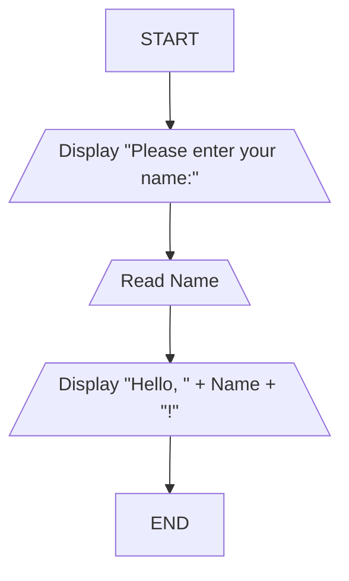
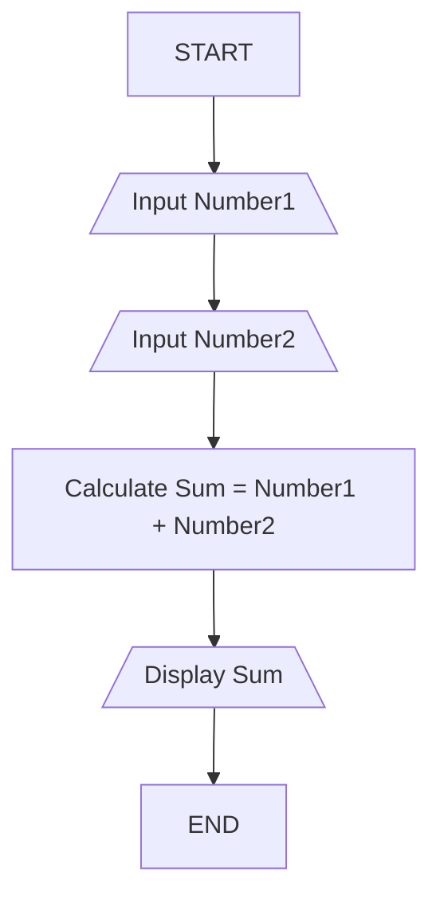

# Module 4: Computational Approaches to Problem-Solving

Welcome to Module 4! We're diving into the heart of *computational thinking* and how it empowers us to tackle problems, big and small, using a computer's logic. This module is all about understanding the *process* of problem-solving from a computational perspective. We won't be writing complex Python code just yet, but we'll lay the groundwork by understanding the *thinking* behind it. This is crucial for achieving our Course Outcomes, especially **CO1** (using computing as a model for solving real-world problems) and **CO4** (interpreting problem-solving strategies).

## What is a Computational Approach to Problem-Solving?

Imagine you have a messy room. How do you clean it? You don't just start shoving things randomly into drawers, right? You probably have a strategy: gather all the clothes, fold them, put them away; pick up all the books, stack them; throw away trash. That systematic approach you use in real life? That's very similar to a computational approach to problem-solving.

A **computational approach** is essentially a structured, step-by-step method for breaking down a problem and finding a solution, leveraging the capabilities of a computer. It's about thinking like a computer scientist, even before you write a single line of code. As Maureen Sprankle and Jim Hubbard highlight in their book "Problem Solving & Programming Concepts," effective problem-solving involves understanding the problem thoroughly and then devising a clear plan. This is precisely what we're going to explore.

Think of it as building a recipe. If you want to bake a cake, you don't just guess. You follow a recipe with specific ingredients and precise steps. A computational approach to problem-solving is like creating that recipe for any problem.

### The Core Idea: Decomposing and Abstracting

At its heart, a computational approach involves two key ideas:

1.  **Decomposition:** This means breaking down a large, complex problem into smaller, more manageable sub-problems. Imagine trying to build a house. You don't think about the entire house at once. You break it down: foundation, walls, roof, plumbing, electrical, etc. Each of these is a smaller problem that can be solved more easily.

    *   **Analogy:** Think about packing for a trip. Instead of trying to pack everything at once, you might think: "First, I need to pack clothes. Then, toiletries. Then, electronics." Each category is a sub-problem.

    This ties directly into **CO2**: "Articulate a problem before attempting to solve it and prepare a clear and accurate model to represent the problem." Decomposition is a vital part of articulating and modeling.

2.  **Abstraction:** This is about focusing on the essential details and ignoring the irrelevant ones. When you're designing the "pack clothes" sub-problem, you don't need to worry about the electrical wiring of the house. You focus only on the clothes.

    *   **Analogy:** When you use a smartphone app like a calculator, you just input numbers and operations. You don't need to know *how* the processor adds those numbers, or how the screen displays them. You abstract away the complex inner workings and focus on the user interface and the desired outcome.

    George Pólya, in his timeless work "How to Solve It," emphasizes understanding the problem and devising a plan. Abstraction is a key part of that "plan" – it helps us focus on what's truly important.

## Visualizing the Problem-Solving Process: Diagrams and Algorithms

So, how do we represent these computational approaches? We use tools that help us visualize our thinking before we translate it into code. The two primary tools we'll look at are **flowcharts** and **pseudocode**.

### 1. Flowcharts: The Visual Blueprint

A **flowchart** is a graphical representation of a step-by-step procedure or process. It uses standard symbols to depict different actions or decisions. Think of it as a map for your solution. This is where **CO4** really comes into play – interpreting these visual strategies.

Let's look at some basic flowchart symbols and what they mean:

*   **Terminator (Oval/Rounded Rectangle):** This marks the beginning or end of a process. Every flowchart needs a clear start and an end.

    ```
       +-------+
       | START |
       +-------+
          |
          v
       +-----+
       | END |
       +-----+
    ```

*   **Process (Rectangle):** This represents a single step or action in the algorithm. It's where something happens.

    ```
       +-----------------+
       | Calculate Total |
       +-----------------+
    ```

*   **Input/Output (Parallelogram):** This symbol is used for getting data into the process (input) or displaying results (output).

    ```
       +-----------------+
       | Read Number     |
       +-----------------+
          or
       +-----------------+
       | Display Result  |
       +-----------------+
    ```

*   **Decision (Diamond):** This is crucial! It represents a point where a question is asked, and based on the answer (usually "yes" or "no," or "true" or "false"), the flowchart branches off in different directions.

    ```
       +-----------------+
       | Is X > 10?      |
       +-----------------+
           /       \
          /         \
         Yes       No
        /           \
       ...         ...
    ```

*   **Flow Lines (Arrows):** These connect the symbols and show the direction of the process.

**Example: A Simple "Greeting" Program**

Let's say we want to create a simple process that asks for a user's name and then greets them.

Imagine this visually:

1.  **Start** (Oval)
2.  **Display "Please enter your name:"** (Parallelogram - Output)
3.  **Read Name** (Parallelogram - Input)
4.  **Display "Hello, " + Name + "!"** (Parallelogram - Output)
5.  **End** (Oval)

Here's how that might look in a simplified flowchart:



See how it flows logically from one step to the next? This visual representation helps us ensure we haven't missed any steps and that the logic is sound. This directly supports **CO3**: "Utilize effective algorithms to solve the formulated models." A flowchart *is* a representation of an algorithm.

### 2. Pseudocode: The Human-Readable Algorithm

While flowcharts are great for visualization, they can sometimes be cumbersome for complex processes. That's where **pseudocode** comes in. Pseudocode is a plain-language description of the steps in an algorithm. It uses a mix of natural language and programming-like keywords, but it's not a real programming language. It’s designed to be understandable by humans without needing to know a specific programming syntax.

Think of it as a detailed plan written in English (or your preferred language), but structured in a way that's easy to convert into code. As Guttag John V mentions in "Introduction to Computation and Programming using Python," starting with a clear, high-level description is essential.

Let's translate our "Greeting" example into pseudocode:

```
// Start of the greeting process
BEGIN

  // Step 1: Prompt the user to enter their name
  OUTPUT "Please enter your name:"

  // Step 2: Read the name entered by the user
  INPUT userName

  // Step 3: Construct and display the greeting message
  OUTPUT "Hello, " + userName + "!"

// End of the greeting process
END
```

Notice how it's structured:

*   `BEGIN` and `END` clearly mark the start and finish.
*   `OUTPUT` is like displaying something to the user.
*   `INPUT` is like getting information from the user.
*   `userName` is a placeholder for the data.
*   Comments (`//`) are used for explanations.

This pseudocode is much easier to read and understand than a complex flowchart, yet it still describes the exact same process. It's a bridge between human thought and computer execution. This is fundamental for **CO3** – preparing the algorithm before coding.

## Everyday Problem-Solving Examples

Let's ground these concepts with everyday analogies, as suggested by authors like Donald Treffinger et al. in "Creative Problem Solving." Computational thinking isn't just for computers; it's a way of thinking!

### Example 1: Making a Sandwich

Imagine you want to make a peanut butter and jelly sandwich.

*   **Problem:** Hungry, need a sandwich.
*   **Decomposition:**
    *   Get bread.
    *   Get peanut butter.
    *   Get jelly.
    *   Get knife.
    *   Spread peanut butter.
    *   Spread jelly.
    *   Put slices together.
*   **Abstraction:** We don't need to worry about the molecular structure of the bread or the viscosity of the jelly, just that we need to spread them.
*   **Flowchart (Simplified):**

    ```mermaid
    graph TD
        A[START: Make Sandwich] --> B[/Get 2 slices of bread\]
        B --> C[/Get peanut butter and jelly jars, knife\]
        C --> D[/Open PB jar\]
        D --> E[/Spread PB on one slice\]
        E --> F[/Open Jelly jar\]
        F --> G[/Spread Jelly on other slice\]
        G --> H[/Put slices together, spread sides inward\]
        H --> I[END: Sandwich Ready!]
    ```

*   **Pseudocode:**

    ```
    BEGIN MakeSandwich

      OUTPUT "Gather ingredients and tools."
      INPUT breadSlices, peanutButter, jelly, knife

      OUTPUT "Prepare the bread."
      OUTPUT "Spread peanut butter on one slice."
      OUTPUT "Spread jelly on the other slice."
      OUTPUT "Combine the slices."

      OUTPUT "Sandwich is ready!"

    END MakeSandwich
    ```

This simple task demonstrates how we naturally break down problems and follow steps.

### Example 2: Planning a Route to a New Place

You're going to a friend's house for the first time.

*   **Problem:** Get to friend's house.
*   **Decomposition:**
    *   Find out the address.
    *   Check traffic.
    *   Decide on the mode of transport (car, public transit, walking).
    *   Determine the best route.
    *   Navigate.
*   **Abstraction:** You focus on street names, turns, and destinations, not on the specific mechanics of your car's engine or the internal workings of the GPS system.
*   **Flowchart (Conceptual for Route Planning):**

    ```mermaid
    graph TD
        A[START: Get to Friend's House] --> B[/Get Friend's Address\]
        B --> C[/Choose Mode of Transport (e.g., Car)\]
        C --> D{Is destination known?}
        D -- Yes --> E[/Use GPS/Map to find route\]
        D -- No --> F[/Ask friend for directions/address\]
        F --> E
        E --> G[/Follow the route, making turns as needed\]
        G --> H{Arrived at Destination?}
        H -- Yes --> I[END: Reached Friend's House]
        H -- No --> G
    ```

*   **Pseudocode (Simplified Navigation):**

    ```
    BEGIN NavigateRoute

      OUTPUT "Start at current location."
      OUTPUT "Follow the given route."

      LOOP until destination reached:
        OUTPUT "Proceed straight."
        IF intersection is reached:
          OUTPUT "Check next turn."
          IF turn is Left:
            OUTPUT "Turn Left."
          ELSE IF turn is Right:
            OUTPUT "Turn Right."
          END IF
        END IF
      END LOOP

      OUTPUT "You have arrived!"

    END NavigateRoute
    ```

These examples show how the principles of decomposition and abstraction, visualized through flowcharts or described in pseudocode, are fundamental to problem-solving in a computational manner. This directly relates to **CO1** and **CO2**, as we are modeling real-world situations using these computational thinking techniques.

## Connecting to Course Outcomes

Let's quickly recap how this module’s focus on diagrammatic and algorithmic explanations directly supports our course objectives:

*   **CO1: Utilize computing as a model for solving real-world problems.** By understanding flowcharts and pseudocode, we are learning to represent real-world problems in a structured, computational way. This is the first step to using computing as a problem-solving tool.
*   **CO2: Articulate a problem before attempting to solve it and prepare a clear and accurate model to represent the problem.** Flowcharts and pseudocode are our "models." They force us to articulate each step and detail of a problem before we even think about writing code. This is the essence of defining and modeling.
*   **CO3: Utilize effective algorithms to solve the formulated models and translate algorithms into executable programs.** Flowcharts and pseudocode *are* the algorithms. They are the effective methods we use to solve the models we've formulated. Later, we will translate these into Python programs.
*   **CO4: Interpret the problem-solving strategies, a systematic approach to solving computational problems, and essential Python programming skills.** This module directly introduces these strategies and systematic approaches. Learning to read and create flowcharts and pseudocode is learning the foundational "programming skills" of thinking computationally.

## Key Takeaways

Remember these points as you move forward:

*   **Computational thinking** is a structured way to solve problems, breaking them into smaller parts (decomposition) and focusing on what's important (abstraction).
*   **Flowcharts** provide a visual map of your solution using standard symbols.
*   **Pseudocode** offers a human-readable, step-by-step description of an algorithm.
*   Both tools help us plan and communicate our problem-solving strategies *before* we write code.
*   This structured approach is universal and applies to many real-world scenarios, not just programming.

Understanding these introductory concepts is the bedrock upon which all our future Python programming will be built. You're learning to *think* like a programmer!

---

## Sample Questions and Answers

Here are some questions to test your understanding, covering both concepts and how they might appear in an exam context:

**Question 1 (Conceptual):** What are the two main principles of computational thinking that help us approach problems? Explain each briefly.

**Answer:** The two main principles are:
1.  **Decomposition:** Breaking down a large, complex problem into smaller, more manageable sub-problems.
2.  **Abstraction:** Focusing on the essential details of a problem while ignoring irrelevant information.

**Reasoning:** This question tests the foundational understanding of the core ideas discussed in the module. It's a direct recall of key definitions.

**Question 2 (Diagrammatic/Algorithmic):** Draw a flowchart and write pseudocode for a simple process that takes two numbers as input, adds them together, and displays the result.

**Answer:**

**Flowchart:**



**Pseudocode:**

```
BEGIN AddTwoNumbers

  OUTPUT "Enter the first number:"
  INPUT number1

  OUTPUT "Enter the second number:"
  INPUT number2

  SET sum = number1 + number2

  OUTPUT "The sum is: " + sum

END AddTwoNumbers
```

**Reasoning:** This question assesses the ability to translate a simple computational task into both visual (flowchart) and textual (pseudocode) algorithmic representations. It tests the application of basic flowchart symbols and pseudocode keywords.

**Question 3 (Connecting to COs):** How does learning to create flowcharts and pseudocode help achieve Course Outcome CO2: "Articulate a problem before attempting to solve it and prepare a clear and accurate model to represent the problem"?

**Answer:** Flowcharts and pseudocode act as the "models" required by CO2.
*   Creating a flowchart forces you to visually break down the problem into sequential steps, decisions, and inputs/outputs, thereby articulating each part.
*   Writing pseudocode provides a textual, structured description of these steps.
Both activities require you to think through the problem thoroughly, identify its components, and represent them clearly and accurately before any actual programming begins, fulfilling the outcome's requirement to articulate and model the problem.

**Reasoning:** This is an exam-oriented question that requires students to link the module's content directly to a specific Course Outcome. It shows understanding of *why* these tools are taught.

**Question 4 (Conceptual/Analogy):** Imagine you are instructing a robot to make toast. Using the principles of decomposition and abstraction, describe the steps a robot might need to follow in pseudocode.

**Answer:**

```
BEGIN MakeToast

  // Decomposition: Break down into fetching, toasting, and serving

  // Step 1: Fetch Bread (Sub-problem)
  OUTPUT "Locate bread bin."
  OUTPUT "Open bread bin."
  OUTPUT "Take out two slices of bread."
  OUTPUT "Close bread bin."
  OUTPUT "Place bread slices near toaster."

  // Step 2: Toast Bread (Sub-problem)
  OUTPUT "Check if toaster is plugged in."
  OUTPUT "Insert bread slices into toaster slots."
  OUTPUT "Set toaster to desired level (e.g., 3)."
  OUTPUT "Press the lever down."
  // Abstraction: We don't need to know the heating element's temperature,
  // just that it's toasting.
  OUTPUT "Wait until toast pops up."

  // Step 3: Serve Toast (Sub-problem)
  OUTPUT "Carefully remove hot toast from toaster."
  OUTPUT "Place toast on a plate."
  OUTPUT "Toast is ready."

END MakeToast
```

**Reasoning:** This question uses a relatable analogy (a robot) to test the application of decomposition and abstraction in a pseudocode format. It encourages thinking about the necessary steps and what information is essential versus what can be abstracted away.
