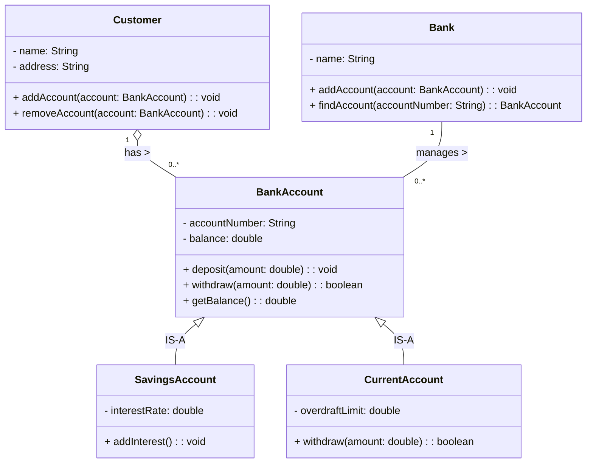

## Module 1: Introduction to Object-Oriented Programming (OOP) and Object Modeling with UML

### Topic: Object Modeling Using Unified Modeling Language (UML)

This module introduces the fundamental concepts of Object-Oriented Programming (OOP) and how to model them using the Unified Modeling Language (UML). We will explore the core principles of OOP and then delve into specific UML diagrams: the Use Case Diagram and the Class Diagram.

---

### 1. Basic Object-Oriented Concepts

Object-Oriented Programming (OOP) is a programming paradigm that is based on the concept of "objects," which can contain data in the form of fields (often known as attributes or properties) and code in the form of procedures (often known as methods or behaviors). OOP aims to make programs more modular, reusable, and easier to maintain.

**Key Concepts and Definitions:**

*   **Object:** An object is an instance of a class. It represents a real-world entity or a concept. An object has a state (defined by its attributes) and behavior (defined by its methods).
    *   **Example:** In a banking system, a `BankAccount` object could represent a specific account with attributes like `accountNumber`, `balance`, and methods like `deposit()` and `withdraw()`.
    *   **Reference:** Herbert Schildt's "Java: The Complete Reference" emphasizes that objects are the fundamental building blocks of OOP systems.

*   **Class:** A class is a blueprint or a template for creating objects. It defines the common attributes and methods that all objects of that type will have.
    *   **Example:** The `BankAccount` class would define the common structure for all bank accounts.
    *   **Reference:** Rajib Mall's "Fundamentals of Software Engineering" highlights classes as the primary mechanism for structuring and organizing software.

*   **Encapsulation:** The bundling of data (attributes) and methods that operate on that data within a single unit (class). Encapsulation also involves controlling access to the data, often by making attributes private and providing public methods to access or modify them. This protects data from unintended modification and improves code maintainability.
    *   **Key Terms:** Data hiding, abstraction.
    *   **Example:** In the `BankAccount` class, the `balance` attribute might be private, and access would be provided through public `getBalance()` and `setBalance()` methods.
    *   **Reference:** Deitel & Deitel's "Java How to Program, Early Objects" strongly advocates for encapsulation as a cornerstone of robust object-oriented design.

*   **Abstraction:** The process of representing complex reality in a simpler form. In OOP, abstraction means exposing only the essential features of an object while hiding the unnecessary details.
    *   **Example:** When you drive a car, you interact with the steering wheel, accelerator, and brakes. You don't need to know the intricate details of how the engine works to drive it. The car's interface provides abstraction.
    *   **Reference:** Ali Bahrami's "Object Oriented Systems Development using the Unified Modeling Language" discusses abstraction as a means to manage complexity.

*   **Inheritance:** A mechanism that allows a new class (subclass or derived class) to inherit properties (attributes) and behaviors (methods) from an existing class (superclass or base class). This promotes code reuse and establishes a hierarchical relationship between classes.
    *   **Key Terms:** Superclass, subclass, base class, derived class, IS-A relationship.
    *   **Example:** A `SavingsAccount` class could inherit from the `BankAccount` class, gaining all its attributes and methods, and also adding its own specific features like `interestRate`.
    *   **Reference:** Herbert Schildt's book provides detailed explanations and examples of inheritance in Java.

*   **Polymorphism:** The ability of an object to take on many forms. In OOP, it means that a method can perform different actions depending on the object it is called on. This is often achieved through method overriding and method overloading.
    *   **Key Terms:** Method overriding, method overloading, "many forms."
    *   **Example:** A `calculateInterest()` method might behave differently for a `SavingsAccount` than for a `CurrentAccount`, even though both inherit from `BankAccount`.
    *   **Reference:** Balagurusamy's "Programming JAVA a Primer" offers clear illustrations of polymorphism in action.

---

### 2. UML Diagrams

The Unified Modeling Language (UML) is a standardized graphical notation used for visualizing, specifying, constructing, and documenting the artifacts of a software system. It provides a common language for developers, architects, and stakeholders to communicate about the design of a system.

**Key Concepts and Definitions:**

*   **UML Diagram:** A visual representation of a software system. There are various types of UML diagrams, each serving a different purpose.
    *   **Reference:** The entire set of UML diagrams serves as a blueprint for software development, as discussed in Barclay & Savage's "Object Oriented Design with UML and Java."

---

### 3. Use Case Diagram

A Use Case Diagram is a behavioral diagram that shows a system's functionality from an end-user's perspective. It describes how external actors interact with the system to achieve specific goals.

**Key Concepts and Definitions:**

*   **Actor:** A role played by a user or another system that interacts with the system. Actors are typically represented by stick figures.
    *   **Example:** In an ATM system, `Customer` and `BankTeller` would be actors.
    *   **Reference:** Ali Bahrami's book often uses examples of banking and other business systems to illustrate actors.

*   **Use Case:** A set of actions performed by a system that yields an observable result of value to a particular actor. Use cases are typically represented by ovals.
    *   **Example:** In an ATM system, `Withdraw Cash`, `Check Balance`, `Deposit Funds` are use cases.

*   **System Boundary:** A box that encloses all the use cases, representing the scope of the system being modeled. Actors are placed outside the boundary.

*   **Relationships:**
    *   **Association:** A relationship between an actor and a use case, indicating that the actor interacts with the use case. Represented by a solid line.
    *   **Include (<<include>>):** One use case incorporates the behavior of another use case. This is used to factor out common behavior. Represented by a dashed arrow with the `<<include>>` stereotype.
        *   **Example:** `Login` use case might be included by `Withdraw Cash` and `Check Balance`.
    *   **Extend (<<extend>>):** One use case extends the behavior of another use case under certain conditions. This represents optional or conditional behavior. Represented by a dashed arrow with the `<<extend>>` stereotype.
        *   **Example:** `Apply Discount` use case might extend `Purchase Item` use case if the customer has a coupon.
    *   **Generalization (Inheritance):** An actor or use case inherits properties from another actor or use case. Represented by a solid arrow with a hollow arrowhead.
        *   **Example:** `Registered Customer` could be a generalization of `Customer`.

**Example: ATM System Use Case Diagram**

```mermaid
graph LR
    actor Customer
    actor BankTeller

    rectangle ATM_System {
        usecase "Withdraw Cash" as UC1
        usecase "Check Balance" as UC2
        usecase "Deposit Funds" as UC3
        usecase "Login" as UC4
        usecase "Validate Card" as UC5
        usecase "Dispense Cash" as UC6
    }

    Customer -- "Interacts with" --> UC1
    Customer -- "Interacts with" --> UC2
    Customer -- "Interacts with" --> UC3

    UC1 -- "<<include>>" --> UC4
    UC2 -- "<<include>>" --> UC4
    UC3 -- "<<include>>" --> UC4

    UC4 -- "<<include>>" --> UC5

    UC1 -- "<<include>>" --> UC6

    BankTeller -- "Manages System" --> UC4
    BankTeller -- "Performs Maintenance" --> SystemMaintenance(System Maintenance)

    style UC1 fill:#f9f,stroke:#333,stroke-width:2px
    style UC2 fill:#f9f,stroke:#333,stroke-width:2px
    style UC3 fill:#f9f,stroke:#333,stroke-width:2px
    style UC4 fill:#ccf,stroke:#333,stroke-width:2px
    style UC5 fill:#ccf,stroke:#333,stroke-width:2px
    style UC6 fill:#ccf,stroke:#333,stroke-width:2px
```

**Explanation of Example:**
*   `Customer` and `BankTeller` are actors.
*   `Withdraw Cash`, `Check Balance`, `Deposit Funds` are use cases performed by the `Customer`.
*   `Login` is included by `Withdraw Cash`, `Check Balance`, and `Deposit Funds`, meaning the system will first perform the `Login` use case when any of these are initiated.
*   `Validate Card` is included by `Login`.
*   `Dispense Cash` is included by `Withdraw Cash`.
*   `BankTeller` interacts with `Login` (e.g., to access administrative functions) and also performs system maintenance.

**Learning Outcome Alignment:** This section directly contributes to understanding how to model system functionality from an end-user perspective, which is a prerequisite for designing and implementing OOP systems. (Relates to CO1 and CO2 in terms of understanding system requirements before coding).

---

### 4. Class Diagram

A Class Diagram is a structural diagram that shows the structure of a system by its classes, their attributes, operations, and the relationships among these classes. It provides a static view of the system.

**Key Concepts and Definitions:**

*   **Class:** Represented by a rectangle divided into three compartments:
    1.  **Class Name:** The name of the class.
    2.  **Attributes:** The data members or properties of the class. Each attribute can have a visibility modifier, name, and type.
        *   **Visibility:**
            *   `+` Public: Accessible from anywhere.
            *   `-` Private: Accessible only within the class.
            *   `#` Protected: Accessible within the class and by its subclasses.
            *   `~` Package (or Default): Accessible within the same package.
        *   **Example:** `- accountNumber: String`, `+ balance: double`
    3.  **Operations (Methods):** The functions or behaviors of the class. Each operation can have a visibility modifier, name, parameters (with types), and return type.
        *   **Example:** `+ deposit(amount: double): void`, `- withdraw(amount: double): boolean`

*   **Relationships:**
    *   **Association:** A general relationship between two classes, indicating that objects of one class are connected to objects of another.
        *   **Multiplicity:** Indicates how many objects of one class can be related to objects of another class. Common multiplicities include:
            *   `1`: Exactly one.
            *   `*` or `0..*`: Zero or more.
            *   `1..*`: One or more.
            *   `0..1`: Zero or one.
            *   `n`: Exactly n.
        *   **Example:** A `Customer` might have `1` `Account`, and an `Account` might belong to `1` `Customer`. (1 -- 1)
        *   **Navigability:** An arrow indicates the direction of the relationship.

    *   **Aggregation:** A "has-a" relationship where one class is part of another, but can exist independently. Represented by an open diamond on the "whole" side.
        *   **Example:** A `Library` "has" `Books`. Books can exist without a library. (Open diamond on Library side)
        *   **Reference:** Deitel & Deitel often use examples like `Car` and `Engine` to illustrate aggregation.

    *   **Composition:** A strong "has-a" relationship where one class is part of another and **cannot** exist independently. If the "whole" object is destroyed, the "part" object is also destroyed. Represented by a filled diamond on the "whole" side.
        *   **Example:** A `House` "has" `Rooms`. Rooms are integral to the house and cease to exist if the house is demolished. (Filled diamond on House side)

    *   **Inheritance (Generalization):** An "is-a" relationship where a subclass inherits properties and behaviors from a superclass. Represented by a hollow triangle on the superclass side, pointing to the subclass.
        *   **Example:** `SavingsAccount` IS-A `BankAccount`.
        *   **Reference:** Herbert Schildt's book provides extensive examples of inheritance using Java code.

    *   **Dependency (<<uses>>):** A weaker relationship where one class depends on another class for some operation, but not necessarily has a persistent link. Represented by a dashed arrow.
        *   **Example:** A `PaymentProcessor` class might depend on a `CreditCard` class to process payments.

**Example: Bank Account Class Diagram**



**Explanation of Example:**
*   `BankAccount` is the superclass with private attributes `accountNumber` and `balance`, and public methods for `deposit`, `withdraw`, and `getBalance`.
*   `SavingsAccount` and `CurrentAccount` are subclasses of `BankAccount`, inheriting its members.
    *   `SavingsAccount` has an additional `interestRate` attribute and `addInterest()` method.
    *   `CurrentAccount` has an `overdraftLimit` attribute and overrides the `withdraw` method.
*   `Customer` has a one-to-many (1 to 0 or more) association with `BankAccount` (indicated by the `o--` and multiplicity). This represents a customer "having" zero or more bank accounts. The arrow indicates navigability from `Customer` to `BankAccount`.
*   `Bank` "manages" `BankAccount`s.

**Learning Outcome Alignment:** This section is crucial for CO1 (Write Java programs using object-oriented concepts - classes, objects, constructors, data hiding, inheritance and polymorphism) as it visually represents these concepts. It also supports CO2 (Utilise datatypes, operators, control statements, object-oriented class, concepts, I/O basics in Java to develop programs) by showing how classes are structured for program development.

---

### 5. Important Points to Remember

*   **OOP Principles:** Always keep the core principles of Encapsulation, Abstraction, Inheritance, and Polymorphism in mind when designing and modeling with UML.
*   **UML as a Blueprint:** UML diagrams are not just for documentation; they serve as a blueprint for your code. A well-designed UML diagram will lead to well-structured code.
*   **Use Case Diagrams for Scope:** Use Case diagrams help define the boundaries and functionalities of your system from the user's perspective.
*   **Class Diagrams for Structure:** Class diagrams detail the static structure, showing how classes interact and are organized.
*   **Consistency:** Ensure consistency between your Use Case diagrams and Class diagrams. The classes in your class diagrams should support the functionality described in your use cases.
*   **Iteration:** Object modeling is often an iterative process. You may need to revise your diagrams as your understanding of the system evolves.
*   **Textbook Focus:** Herbert Schildt's "Java: The Complete Reference" is excellent for understanding Java's implementation of OOP concepts. Rajib Mall's book provides a broader software engineering perspective. Deitel & Deitel offer practical, early-object focused examples.

---

### 6. Practice Questions & Exercises

**Multiple Choice Questions (MCQs):**

1.  Which of the following is NOT a fundamental principle of Object-Oriented Programming?
    a) Encapsulation
    b) Inheritance
    c) Recursion
    d) Polymorphism

2.  In a Use Case Diagram, what does a stick figure represent?
    a) A use case
    b) An actor
    c) A system boundary
    d) A relationship

3.  Which UML diagram depicts the static structure of a system?
    a) Use Case Diagram
    b) Sequence Diagram
    c) Class Diagram
    d) Activity Diagram

4.  A "has-a" relationship where the part cannot exist independently of the whole is called:
    a) Aggregation
    b) Composition
    c) Association
    d) Dependency

5.  The visibility modifier that restricts access to a member only within its own class is:
    a) `+` (Public)
    b) `-` (Private)
    c) `#` (Protected)
    d) `~` (Package)

**Short Answer Questions:**

1.  Define an object and a class, and explain their relationship.
2.  What is encapsulation, and why is it important in OOP?
3.  Describe the purpose of inheritance and provide a real-world example.
4.  Explain the difference between `<<include>>` and `<<extend>>` relationships in a Use Case Diagram.
5.  What are the three compartments of a class in a Class Diagram?

**Practical Exercise:**

Model a simple "Library Management System" using UML diagrams.

1.  **Use Case Diagram:**
    *   Identify the actors (e.g., Librarian, Member).
    *   Identify key use cases (e.g., Add Book, Borrow Book, Return Book, Search Book).
    *   Show the relationships between actors and use cases, and any `<<include>>` or `<<extend>>` relationships you deem necessary.

2.  **Class Diagram:**
    *   Identify the main classes (e.g., Book, Member, Library).
    *   Define attributes and operations for each class.
    *   Show the relationships between the classes (e.g., a `Library` has `Book`s, a `Member` can borrow `Book`s). Pay attention to multiplicity.

---

### Answers to Practice Questions

**MCQ Answers:**

1.  **c) Recursion** (Recursion is a programming technique, not a core OOP principle.)
2.  **b) An actor**
3.  **c) Class Diagram**
4.  **b) Composition**
5.  **b) - (Private)**

**Short Answer Answers:**

1.  **Object:** An instance of a class, representing a real-world entity with state and behavior. **Class:** A blueprint or template for creating objects, defining their attributes and methods. The relationship is that a class is used to create objects.
2.  **Encapsulation:** The bundling of data (attributes) and methods that operate on that data within a single unit (class), along with controlling access to the data (data hiding). It's important for protecting data integrity, modularity, and maintainability.
3.  **Inheritance:** A mechanism where a new class (subclass) acquires properties and behaviors from an existing class (superclass). This promotes code reuse and establishes an "is-a" relationship. **Example:** A `Dog` "is a" `Animal`. A `Dog` class inherits properties like `age` and methods like `eat()` from an `Animal` superclass, and adds specific attributes like `breed` and methods like `bark()`.
4.  **`<<include>>`:** Used when one use case (the including use case) unconditionally incorporates the behavior of another use case (the included use case). It's for factoring out common functionality. **`<<extend>>`:** Used when one use case (the extending use case) conditionally adds behavior to another use case (the base use case). It represents optional or exceptional behavior.
5.  In a Class Diagram, the three compartments are: **Class Name**, **Attributes**, and **Operations (Methods)**.

---
This comprehensive set of notes covers the core concepts of OOP and UML for Module 1, aligning with the learning outcomes and referencing the provided textbooks. Remember to practice creating these diagrams for different scenarios to solidify your understanding.
