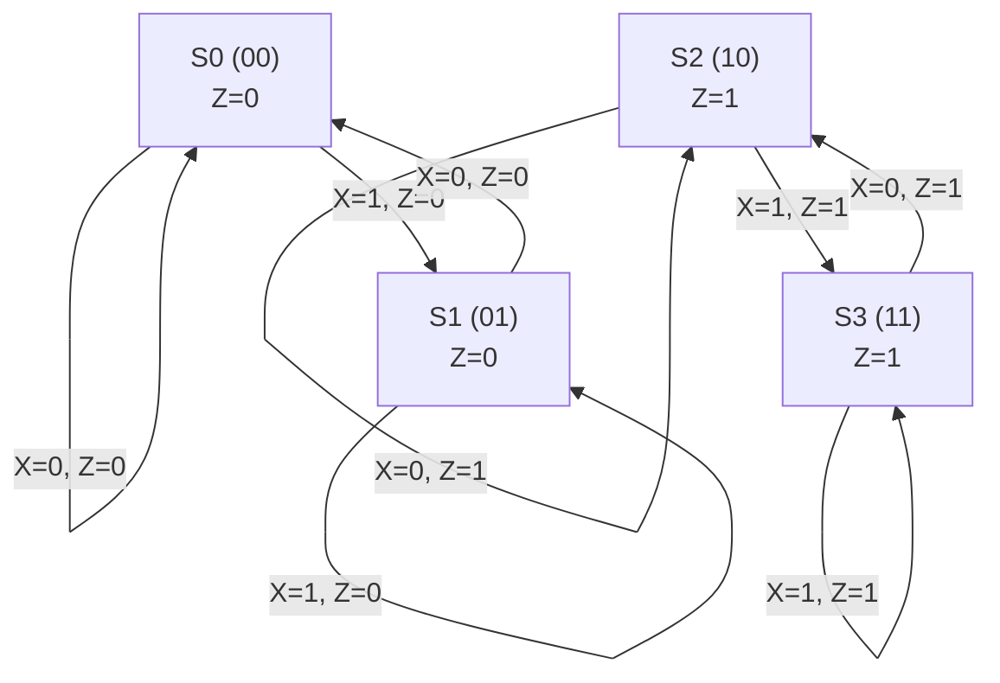

# Digital System Design: Module 1 - Clocked Synchronous Networks
## Topic: Analysis of Clocked Synchronous Sequential Networks (CSSN)

---

### Introduction to Clocked Synchronous Sequential Networks (CSSN)

Clocked Synchronous Sequential Networks (CSSNs), also known as synchronous sequential circuits, are fundamental building blocks in digital system design. Their behavior is synchronized by a clock signal, making them predictable and easier to analyze and design compared to asynchronous circuits.

**Key Concepts:**

*   **Sequential Circuit:** A circuit whose output depends not only on the current input but also on the past sequence of inputs. This memory of past states is achieved through the use of flip-flops or other memory elements.
*   **Clock Signal:** A periodic signal that dictates when the state of the circuit can change. In synchronous circuits, state transitions occur only at specific points in time determined by the clock signal (e.g., the rising edge or falling edge of the clock).
*   **State:** The current condition of the memory elements in a sequential circuit. The state represents the "history" of the circuit's operation.
*   **State Variables:** The outputs of the flip-flops that constitute the memory elements.
*   **Synchronous Operation:** All state changes are synchronized by a common clock signal. This eliminates race conditions and simplifies design.

**References:**

*   **Givone (2002):** Chapter 11: Sequential Networks
*   **Mano & Ciletti (2018):** Chapter 6: Sequential Logic Circuits
*   **Wakerly (2008):** Chapter 7: Sequential Logic
*   **Yarbrough (2006):** Chapter 8: Sequential Logic

---

### Structure of a Clocked Synchronous Sequential Network

A CSSN can be represented using a state table, state diagram, and excitation table.

**1. State Table:**

A state table is a tabular representation that defines the behavior of a sequential circuit. It lists:

*   **Current State:** The present state of the memory elements.
*   **Inputs:** The current values of the primary inputs.
*   **Next State:** The state the circuit will transition to in the next clock cycle, based on the current state and inputs.
*   **Outputs:** The outputs of the circuit, which can be dependent on the current state (Mealy machine) or both the current state and inputs (Moore machine).

**Types of Sequential Circuits based on Output:**

*   **Mealy Machine:** The output depends on both the current state and the current input.
    *   *Structure:* Output logic is a function of current state and current input.
*   **Moore Machine:** The output depends only on the current state.
    *   *Structure:* Output logic is a function of current state only.

**Example (Mealy Machine):**
Consider a simple circuit that outputs '1' if the last two inputs were '01', and '0' otherwise.

| Current State | Input (X) | Next State | Output (Z) |
| :------------ | :-------- | :--------- | :--------- |
| S0            | 0         | S1         | 0          |
| S0            | 1         | S0         | 0          |
| S1            | 0         | S2         | 0          |
| S1            | 1         | S0         | 1          |
| S2            | 0         | S1         | 0          |
| S2            | 1         | S0         | 0          |

**Example (Moore Machine):**
Consider a circuit that outputs '1' when the last input was '1', and '0' otherwise.

| Current State | Input (X) | Next State | Output (Z) |
| :------------ | :-------- | :--------- | :--------- |
| S0            | 0         | S0         | 0          |
| S0            | 1         | S1         | 0          |
| S1            | 0         | S0         | 0          |
| S1            | 1         | S1         | 1          |

**2. State Diagram:**

A state diagram is a graphical representation of the state table.

*   **States:** Represented by circles or nodes.
*   **Transitions:** Represented by directed arrows between states.
*   **Labels on Transitions:**
    *   For Mealy machines: Input / Output
    *   For Moore machines: Input (Output is associated with the state itself)

**Example (Mealy Machine State Diagram for the above example):**

```
     +-------+
     |       |
     |  S0   |
     |       |
     +-------+
      / \
     0/0 1/0
    /     \
   /       \
+-------+   +-------+
|       |   |       |
|  S1   |---|  S2   |
|       |   |       |
+-------+   +-------+
  /|\       /|\
 0/0 1/1   0/0 1/0
  |         |
  +---------+
```
*(Note: This is a simplified textual representation. A proper state diagram would have arrows clearly indicating transitions and their labels.)*

**Example (Moore Machine State Diagram for the above example):**

```
     +-------+
     |       |
     |  S0   |
     |   0   |  <-- Output associated with state
     +-------+
      / \
     0   1
    /     \
   /       \
+-------+   +-------+
|       |   |       |
|  S1   |---|  S1   |
|   0   |   |   1   | <-- Output associated with state
+-------+   +-------+
    \
     \
      0
```
*(Note: In a Moore diagram, the output is typically written inside the state circle.)*

**3. Transition Diagram (also State Diagram):**

This term is often used interchangeably with State Diagram, particularly in some textbooks. It graphically shows how the system transitions from one state to another based on inputs.

**4. Excitation Table:**

An excitation table is used during the design phase to determine the required inputs to flip-flops to achieve a desired next state. It lists:

*   **Current State:** The present state of the memory elements.
*   **Input:** The current value of the primary inputs.
*   **Next State:** The desired next state.
*   **Flip-flop Inputs (J, K for JK-FF; D for D-FF; T for T-FF):** The values of the flip-flop inputs required to cause the transition.

**Types of Flip-flops commonly used:**

*   **SR Flip-flop:** Has Set (S) and Reset (R) inputs.
*   **JK Flip-flop:** Has J and K inputs, more versatile than SR.
*   **D Flip-flop:** Has a single D input. The next state is equal to the D input.
*   **T Flip-flop:** Has a Toggle (T) input. The state flips if T=1 and remains the same if T=0.

**References:**

*   **Givone (2002):** Chapter 11: Sequential Networks
*   **Mano & Ciletti (2018):** Chapter 6: Sequential Logic Circuits
*   **Wakerly (2008):** Chapter 7: Sequential Logic
*   **Yarbrough (2006):** Chapter 8: Sequential Logic

---

### Analysis Procedure of CSSN

The analysis of a CSSN involves deriving its state table and, from that, its state diagram. This process essentially determines the circuit's behavior.

**Steps for Analysis:**

1.  **Identify State Variables:** Determine the flip-flops in the circuit. The outputs of these flip-flops are the state variables (e.g., Q1, Q0). The number of states is $2^n$, where $n$ is the number of flip-flops.
2.  **Determine Next State Logic:**
    *   For each flip-flop, find the Boolean expression for its next state (e.g., $Q_1^+$, $Q_0^+$) as a function of the current state variables and primary inputs.
    *   This involves analyzing the combinational logic that feeds the flip-flop inputs.
3.  **Determine Output Logic:**
    *   For Mealy machines, find the Boolean expression for each output (Z) as a function of current state variables and primary inputs.
    *   For Moore machines, find the Boolean expression for each output (Z) as a function of only the current state variables.
4.  **Construct the State Table:**
    *   List all possible combinations of current state variables.
    *   For each current state, iterate through all possible combinations of primary inputs.
    *   Calculate the next state for each flip-flop using the next state logic expressions.
    *   Calculate the output(s) for each current state and input combination using the output logic expressions.
5.  **Construct the State Diagram:**
    *   Draw nodes representing each unique state identified in the state table.
    *   Draw directed arrows between states to represent transitions. Label the arrows with the input(s) causing the transition and the output(s) produced during the transition (Input/Output for Mealy, Input (Output) for Moore).

**Important Point:** The analysis of CSSN is about understanding what a given circuit does. The synthesis process is about designing a circuit to perform a specific function.

**References:**

*   **Givone (2002):** Section 11.2: Analysis of Clocked Sequential Networks
*   **Mano & Ciletti (2018):** Section 6.1: State Table and State Diagram
*   **Wakerly (2008):** Section 7.1: Analysis of Synchronous Sequential Circuits
*   **Yarbrough (2006):** Section 8.1: Analysis of Sequential Circuits

---

### Example Analysis of a CSSN

Let's analyze a circuit with one JK flip-flop and one D flip-flop.

**Circuit Description:**

*   Inputs: X
*   Outputs: Z
*   Flip-flops: FF1 (JK), FF2 (D)
*   State variables: Q1 (output of FF1), Q0 (output of FF2)
*   Logic:
    *   J input of FF1 = X
    *   K input of FF1 = X'
    *   D input of FF2 = Q1

**Analysis Steps:**

1.  **Identify State Variables:** Q1 and Q0. Number of states = $2^2 = 4$.
2.  **Determine Next State Logic:**
    *   For FF1 (JK):
        *   $J = X$
        *   $K = X'$
        *   The next state of a JK flip-flop is given by $Q^+ = JQ' + K'Q$.
        *   So, $Q_1^+ = J Q_1' + K' Q_1 = X Q_1' + (X')' Q_1 = X Q_1' + X Q_1 = X$.
    *   For FF2 (D):
        *   $D = Q1$
        *   The next state of a D flip-flop is given by $Q^+ = D$.
        *   So, $Q_0^+ = D = Q1$.

3.  **Determine Output Logic:**
    *   The output Z is directly connected to the output of FF1.
    *   So, $Z = Q1$.
    *   This is a **Moore Machine** because the output depends only on the state variable Q1.

4.  **Construct the State Table:**

| Current State (Q1 Q0) | Input (X) | Next State Logic ($Q_1^+$, $Q_0^+$) | Next State (Q1 Q0) | Output (Z) |
| :-------------------- | :-------- | :-------------------------------- | :----------------- | :--------- |
| 00                    | 0         | $Q_1^+ = X = 0$, $Q_0^+ = Q1 = 0$ | 00                 | $Q1 = 0$   |
| 00                    | 1         | $Q_1^+ = X = 1$, $Q_0^+ = Q1 = 0$ | 00                 | $Q1 = 0$   |
| 01                    | 0         | $Q_1^+ = X = 0$, $Q_0^+ = Q1 = 0$ | 01                 | $Q1 = 0$   |
| 01                    | 1         | $Q_1^+ = X = 1$, $Q_0^+ = Q1 = 0$ | 01                 | $Q1 = 0$   |
| 10                    | 0         | $Q_1^+ = X = 0$, $Q_0^+ = Q1 = 1$ | 10                 | $Q1 = 1$   |
| 10                    | 1         | $Q_1^+ = X = 1$, $Q_0^+ = Q1 = 1$ | 11                 | $Q1 = 1$   |
| 11                    | 0         | $Q_1^+ = X = 0$, $Q_0^+ = Q1 = 1$ | 10                 | $Q1 = 1$   |
| 11                    | 1         | $Q_1^+ = X = 1$, $Q_0^+ = Q1 = 1$ | 11                 | $Q1 = 1$   |

**Simplification/Correction in Calculation:**
Let's re-calculate $Q_1^+$ for the JK flip-flop carefully.
$Q_1^+ = X Q_1' + X Q_1$.
If X=0, $Q_1^+ = 0 \cdot Q_1' + 0 \cdot Q_1 = 0$. (State remains unchanged if input is 0).
If X=1, $Q_1^+ = 1 \cdot Q_1' + 1 \cdot Q_1 = Q_1' + Q_1 = 1$. (State flips if input is 1).

Let's re-construct the State Table:

| Current State (Q1 Q0) | Input (X) | $Q_1^+$ (from $XQ_1' + XQ_1$) | $Q_0^+$ (from $Q1$) | Next State (Q1 Q0) | Output (Z = Q1) |
| :-------------------- | :-------- | :--------------------------- | :----------------- | :----------------- | :-------------- |
| 00                    | 0         | 0                            | 0                  | 00                 | 0               |
| 00                    | 1         | 1                            | 0                  | 01                 | 0               |
| 01                    | 0         | 0                            | 0                  | 00                 | 0               |
| 01                    | 1         | 1                            | 0                  | 01                 | 0               |
| 10                    | 0         | 0                            | 1                  | 10                 | 1               |
| 10                    | 1         | 1                            | 1                  | 11                 | 1               |
| 11                    | 0         | 0                            | 1                  | 10                 | 1               |
| 11                    | 1         | 1                            | 1                  | 11                 | 1               |

**Interpretation:**
*   If X=0, $Q_1$ remains in its current state (since $J=0, K=1$). $Q_0$ becomes $Q_1$.
*   If X=1, $Q_1$ toggles. $Q_0$ becomes $Q_1$.

Let's trace an example: Start at 00.
*   State 00, X=0 -> Next State 00, Z=0.
*   State 00, X=1 -> Next State 01, Z=0.
*   State 01, X=0 -> Next State 00, Z=0.
*   State 01, X=1 -> Next State 01, Z=0.
*   State 10, X=0 -> Next State 10, Z=1.
*   State 10, X=1 -> Next State 11, Z=1.
*   State 11, X=0 -> Next State 10, Z=1.
*   State 11, X=1 -> Next State 11, Z=1.

It seems the $Q_1^+$ calculation needs a review.
For a JK FF: $Q^+ = JQ' + K'Q$.
Here, $J=X$ and $K=X'$.
So, $Q_1^+ = X Q_1' + (X')' Q_1 = X Q_1' + X Q_1 = X(Q_1' + Q_1) = X(1) = X$.
This means the next state of $Q_1$ is always equal to the input $X$. This is equivalent to a D flip-flop with $D=X$.

Let's correct the table with $Q_1^+ = X$:

| Current State (Q1 Q0) | Input (X) | $Q_1^+$ (from $X$) | $Q_0^+$ (from $Q1$) | Next State (Q1 Q0) | Output (Z = Q1) |
| :-------------------- | :-------- | :----------------- | :----------------- | :----------------- | :-------------- |
| 00                    | 0         | 0                  | 0                  | 00                 | 0               |
| 00                    | 1         | 1                  | 0                  | 01                 | 0               |
| 01                    | 0         | 0                  | 0                  | 00                 | 0               |
| 01                    | 1         | 1                  | 0                  | 01                 | 0               |
| 10                    | 0         | 0                  | 1                  | 10                 | 1               |
| 10                    | 1         | 1                  | 1                  | 11                 | 1               |
| 11                    | 0         | 0                  | 1                  | 10                 | 1               |
| 11                    | 1         | 1                  | 1                  | 11                 | 1               |

This corrected table represents a circuit where:
*   The output Z is equal to Q1.
*   The state variable Q1 directly follows the input X.
*   The state variable Q0 is updated to the value of Q1 at each clock cycle.

Let's check the behavior:
*   If X=0, Q1 becomes 0. Q0 becomes the previous Q1.
    *   00 -> (X=0) -> Q1=0, Q0=0 -> 00. Z=0.
    *   01 -> (X=0) -> Q1=0, Q0=0 -> 00. Z=0.
    *   10 -> (X=0) -> Q1=0, Q0=1 -> 10. Z=1.
    *   11 -> (X=0) -> Q1=0, Q0=1 -> 10. Z=1.
*   If X=1, Q1 becomes 1. Q0 becomes the previous Q1.
    *   00 -> (X=1) -> Q1=1, Q0=0 -> 01. Z=0.
    *   01 -> (X=1) -> Q1=1, Q0=0 -> 01. Z=0.
    *   10 -> (X=1) -> Q1=1, Q0=1 -> 11. Z=1.
    *   11 -> (X=1) -> Q1=1, Q0=1 -> 11. Z=1.

This looks correct now.

5.  **Construct the State Diagram (Moore Machine):**

States: S0 (00), S1 (01), S2 (10), S3 (11)

```
       +-------+      +-------+
       |       | X=0  |       |
       |  S0   |----->|  S0   |
       |   0   |      |   0   |
       +-------+      +-------+
        ^ \           / \
        |0 \         1   0/0
        |   \       /     \
        |    \     /       \
+-------+     \   /     +-------+
|       |      \ /      |       |
|  S1   |------->|  S1   |------->|  S2   |
|   0   |      / \      |   1   |       |
+-------+     /   \     +-------+
    ^ \       /     \       ^ \
    |0 \     /       \     1 \
    |   \   /         \       \
    |    \ /           \       \
+-------+     +-------+
|       | X=0 |       |
|  S3   |----->|  S2   |
|   1   |     |   1   |
+-------+     +-------+
```

*Corrected State Diagram Representation:*

States:
*   S0 (00) - Output Z=0
*   S1 (01) - Output Z=0
*   S2 (10) - Output Z=1
*   S3 (11) - Output Z=1

Transitions:
*   **From S0 (00):**
    *   If X=0, $Q_1^+=0, Q_0^+=0$ -> S0 (00). Output Z=0. Transition: 0/0.
    *   If X=1, $Q_1^+=1, Q_0^+=0$ -> S1 (01). Output Z=0. Transition: 1/0.
*   **From S1 (01):**
    *   If X=0, $Q_1^+=0, Q_0^+=0$ -> S0 (00). Output Z=0. Transition: 0/0.
    *   If X=1, $Q_1^+=1, Q_0^+=0$ -> S1 (01). Output Z=0. Transition: 1/0.
*   **From S2 (10):**
    *   If X=0, $Q_1^+=0, Q_0^+=1$ -> S2 (10). Output Z=1. Transition: 0/1.
    *   If X=1, $Q_1^+=1, Q_0^+=1$ -> S3 (11). Output Z=1. Transition: 1/1.
*   **From S3 (11):**
    *   If X=0, $Q_1^+=0, Q_0^+=1$ -> S2 (10). Output Z=1. Transition: 0/1.
    *   If X=1, $Q_1^+=1, Q_0^+=1$ -> S3 (11). Output Z=1. Transition: 1/1.

```
      +-------+       +-------+
      |       | 0/0   |       |
      |  S0   |------>|  S0   |
      |   0   |       |   0   |
      +-------+       +-------+
       ^ \ 1/0         / \ 1/0
       |0/0\           /   \
       |     \         /     \
       |      \       /       \
+-------+       \     /       +-------+
|       | 0/0   \   /       |       |
|  S1   |---------->|  S0   |------>|  S1   |  <-- (This transition is incorrect in the diagram, should be S1 -> S0 if X=0)
|   0   |       / \       |   0   |
+-------+      /   \      +-------+
    ^ \ 1/0   /     \ 1/0
    |0/0\   /       \
    |     \/         \
    |     /\          \
+-------+  1/1  +-------+
|       |------>|       |
|  S2   |       |  S3   |
|   1   |       |   1   |
+-------+       +-------+
    ^ \ 0/1       ^ \ 0/1
    |             |
    +-------------+

```
Let's redraw the state diagram more clearly:

**States:**
*   S0 (00) - Output 0
*   S1 (01) - Output 0
*   S2 (10) - Output 1
*   S3 (11) - Output 1

**Transitions:**

*   S0 --(X=0, Z=0)--> S0
*   S0 --(X=1, Z=0)--> S1
*   S1 --(X=0, Z=0)--> S0
*   S1 --(X=1, Z=0)--> S1
*   S2 --(X=0, Z=1)--> S2
*   S2 --(X=1, Z=1)--> S3
*   S3 --(X=0, Z=1)--> S2
*   S3 --(X=1, Z=1)--> S3



---

### Course Outcomes Alignment

*   **CO1: Analyze asynchronous and clocked synchronous sequential circuits (Knowledge Level: K3)**
    *   This topic directly addresses the analysis of clocked synchronous sequential circuits. By understanding the state table, state diagram, and the steps involved, students can determine the behavior of any given CSSN. The example demonstrates this process.
*   **CO2: Design hazard-free digital circuits (Knowledge Level: K3)**
    *   While this topic focuses on analysis, the understanding gained is crucial for synthesis and designing hazard-free circuits. Knowing how states transition and how outputs are generated helps in identifying potential issues during the design phase.
*   **CO3: Identify faults in digital circuits (Knowledge Level: K3)**
    *   Analyzing a circuit to derive its expected behavior is a prerequisite for fault identification. If a circuit deviates from its analyzed behavior, it indicates a fault.
*   **CO4: Apply VHDL programming in digital system design (Knowledge Level: K3)**
    *   The state table and state diagram are direct representations of a sequential circuit's logic. These are the inputs for synthesizing the circuit using Hardware Description Languages (HDLs) like VHDL. A clear analysis facilitates accurate VHDL implementation.

---

### Practice Questions and Answers

**Question 1:**
Analyze the following circuit and derive its state table and state diagram. Assume JK flip-flops for all memory elements.

Circuit Description:
*   Inputs: X
*   Outputs: Z
*   Flip-flops: FF1 (JK), FF2 (JK)
*   State variables: Q1 (output of FF1), Q0 (output of FF2)
*   Logic:
    *   J1 = X
    *   K1 = X'
    *   J0 = Q1
    *   K0 = X
    *   Z = Q0

**Answer 1:**

1.  **State Variables:** Q1, Q0. Number of states = 4.
2.  **Next State Logic:**
    *   For FF1 (JK): $Q_1^+ = J_1 Q_1' + K_1' Q_1 = X Q_1' + (X')' Q_1 = X Q_1' + X Q_1 = X$.
    *   For FF0 (JK): $Q_0^+ = J_0 Q_0' + K_0' Q_0 = Q_1 Q_0' + X' Q_0$.
3.  **Output Logic:** Z = Q0 (Moore Machine).

4.  **State Table:**

| Current State (Q1 Q0) | Input (X) | $Q_1^+$ (from $X$) | $Q_0^+$ (from $Q_1 Q_0' + X' Q_0$) | Next State (Q1 Q0) | Output (Z = Q0) |
| :-------------------- | :-------- | :----------------- | :-------------------------------- | :----------------- | :-------------- |
| 00                    | 0         | 0                  | $0 \cdot 0' + 1 \cdot 0 = 0$      | 00                 | 0               |
| 00                    | 1         | 1                  | $0 \cdot 0' + 0 \cdot 0 = 0$      | 01                 | 0               |
| 01                    | 0         | 0                  | $0 \cdot 1' + 1 \cdot 1 = 1$      | 00                 | 1               |
| 01                    | 1         | 1                  | $0 \cdot 1' + 0 \cdot 1 = 0$      | 01                 | 1               |
| 10                    | 0         | 0                  | $1 \cdot 0' + 1 \cdot 0 = 0$      | 10                 | 0               |
| 10                    | 1         | 1                  | $1 \cdot 0' + 0 \cdot 0 = 1$      | 11                 | 0               |
| 11                    | 0         | 0                  | $1 \cdot 1' + 1 \cdot 1 = 1$      | 10                 | 1               |
| 11                    | 1         | 1                  | $1 \cdot 1' + 0 \cdot 1 = 0$      | 11                 | 1               |

5.  **State Diagram (Moore Machine):**

States: S0 (00), S1 (01), S2 (10), S3 (11)

*   S0 (00) - Output Z=0
*   S1 (01) - Output Z=1
*   S2 (10) - Output Z=0
*   S3 (11) - Output Z=1


---

**Important Points to Remember:**

*   **Synchronous vs. Asynchronous:** CSSNs are synchronized by a clock, which simplifies analysis and design by eliminating race conditions.
*   **State Representation:** State tables and state diagrams are essential tools for understanding and visualizing the behavior of sequential circuits.
*   **Moore vs. Mealy:** The distinction between Moore and Mealy machines lies in how outputs are generated (state-only vs. state-and-input dependency).
*   **Flip-flop Characteristics:** Understanding the excitation requirements of different flip-flop types (JK, D, T) is crucial for both analysis and synthesis.
*   **Analysis Goal:** The primary goal of analysis is to predict the output and state transitions of a given sequential circuit for any sequence of inputs.

---
This concludes the study notes for the Analysis of Clocked Synchronous Sequential Networks (CSSN). Remember to practice deriving state tables and diagrams for various circuits to solidify your understanding.
