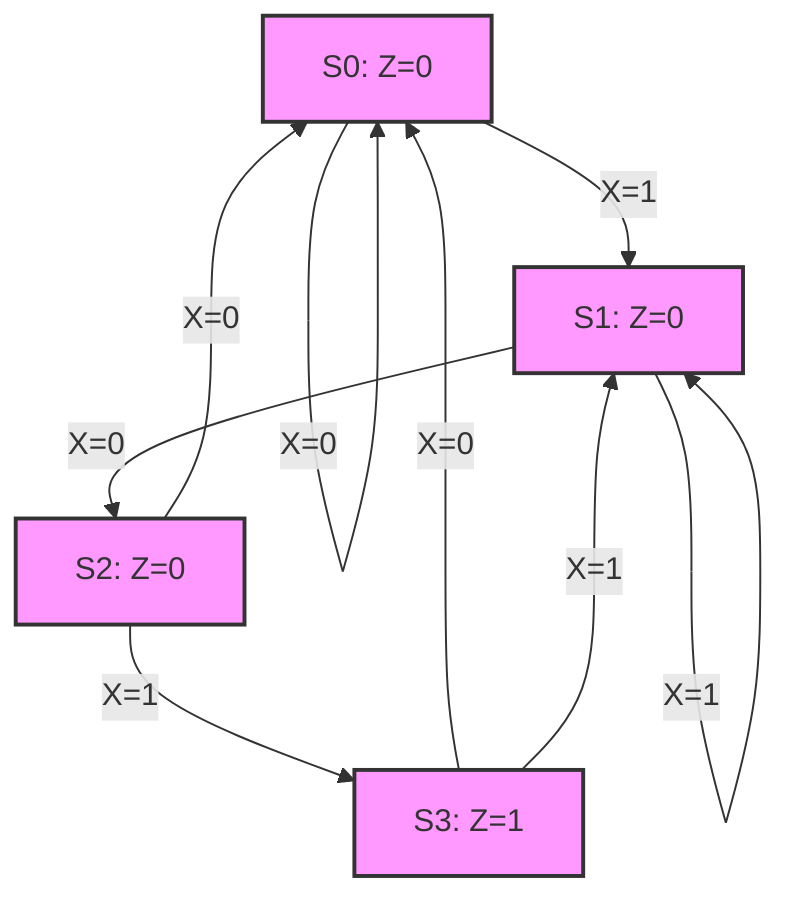

# Digital System Design - Module 2: ASM Chart and its Realization

## Topic: ASM Chart and its Realization

### 1. Introduction to ASM Charts

#### 1.1 What is an ASM Chart?

An **Algorithmic State Machine (ASM) chart** is a graphical tool used to represent the behavior of a sequential digital system. It is a state-transition diagram that specifically addresses the control unit of a sequential circuit. ASM charts combine elements of state diagrams and flowcharts to provide a clear and comprehensive description of the system's operation.

*   **Key Idea:** ASM charts describe how a sequential circuit transitions between states based on present state and input conditions, and what outputs are generated in each state.

#### 1.2 Components of an ASM Chart

An ASM chart consists of three main types of boxes:

*   **State Box:**
    *   Represents a specific state of the sequential system.
    *   Typically a rectangle containing the state name or a symbolic representation (e.g., S0, S1, State_A).
    *   Outputs that are *always* true in that state (Mealy outputs) are listed inside the state box.
    *   *Referenced in:* Givone (Chapter 6), Mano & Ciletti (Chapter 7).

*   **Decision Box:**
    *   Represents a conditional check on input variables.
    *   Typically a diamond shape.
    *   Labeled with the input variable or condition being tested (e.g., X=1, X=0, Ready, Count_Zero).
    *   Branches emerging from the decision box are labeled with the possible outcomes of the condition (e.g., "1", "0", "Yes", "No").
    *   *Referenced in:* Givone (Chapter 6), Mano & Ciletti (Chapter 7).

*   **Output Box (or Conditional Output Box):**
    *   Represents an output that is generated *only* when a specific condition is met.
    *   Typically an oval or rounded rectangle.
    *   Labeled with the output variable and the condition under which it is generated (e.g., Y=1, Done=1).
    *   These outputs are typically associated with the transitions between states and are considered Mealy outputs.
    *   *Referenced in:* Givone (Chapter 6), Mano & Ciletti (Chapter 7).

#### 1.3 ASM Chart Structure and Flow

*   **Transitions:** Arrows connecting the boxes indicate the flow of control.
*   **State Transitions:** An arrow from a state box to another state box, usually labeled with the input condition that causes the transition.
*   **Conditional Outputs on Transitions:** An arrow originating from a decision box or a state box and leading to an output box, indicating that the output is generated when the condition is met *and* the system transitions.
*   **Clocked vs. Unclocked:** While ASM charts conceptually represent state transitions, when realizing them in hardware, these transitions are typically synchronized with a clock signal.

### 2. Relationship between ASM Charts, State Diagrams, and Flowcharts

| Feature         | State Diagram                                    | Flowchart                                    | ASM Chart                                                                    |
| :-------------- | :----------------------------------------------- | :------------------------------------------- | :--------------------------------------------------------------------------- |
| **Purpose**     | Represents state transitions and outputs         | Describes algorithmic steps and decisions    | Combines state transitions, inputs, outputs, and conditional operations      |
| **State Indication** | State name                                       | Not explicitly defined                       | State box (rectangular)                                                      |
| **Input Handling** | Transitions triggered by inputs                  | Decisions based on inputs                    | Decision boxes (diamond) for input evaluation                                |
| **Output Handling** | Outputs on states (Moore) or transitions (Mealy) | Outputs as operations                        | Outputs on states (always true in state) and conditional output boxes (Mealy) |
| **Complexity**  | Can become complex with many states/transitions  | Can become complex with many branches        | Provides a structured way to represent complex sequential behavior             |
| **Application** | General sequential circuits                      | Algorithmic processes                        | Control units of sequential circuits, microprogrammed controllers            |

*   **Key Insight:** ASM charts are more structured and explicit than state diagrams for representing control unit behavior, especially for complex systems. They bridge the gap between high-level algorithmic descriptions and detailed logic circuit implementation.
*   *Referenced in:* Wakerly (Chapter 7), Yarbrough (Chapter 9).

### 3. Steps for Creating an ASM Chart

1.  **Define the System's Functionality:** Clearly understand what the sequential system is supposed to do. What are its inputs, outputs, and desired behaviors?
2.  **Identify States:** Determine the distinct states the system can be in. Each state represents a specific condition or phase of operation.
3.  **Identify Inputs and Outputs:** List all external inputs that influence the system's behavior and all outputs the system generates.
4.  **Determine Transitions:** For each state, identify the conditions (based on inputs) that cause transitions to other states.
5.  **Determine Outputs:** For each state and each transition, specify the outputs that are active.
    *   **Moore Outputs:** Outputs that depend only on the current state. In an ASM chart, these are listed within the state box.
    *   **Mealy Outputs:** Outputs that depend on the current state and the input conditions. In an ASM chart, these are typically shown in output boxes connected to transitions.
6.  **Draw the ASM Chart:** Use the standard symbols (state box, decision box, output box) and arrows to graphically represent the states, transitions, inputs, and outputs. Start from an initial state.
7.  **Add Initial State:** Clearly indicate the starting state of the system.

### 4. Example: A Simple Traffic Light Controller

Let's design an ASM chart for a simple two-phase traffic light controller (e.g., for a single intersection with one road).

**System Description:**
*   Inputs: `Clock`, `Reset`, `Car_Sensor` (detects a car on the side road).
*   Outputs: `Green_NS` (North-South Green), `Yellow_NS` (North-South Yellow), `Red_NS` (North-South Red), `Green_EW` (East-West Green), `Yellow_EW` (East-West Yellow), `Red_EW` (East-West Red).
*   Behavior:
    *   Initially, North-South (NS) is green, and East-West (EW) is red.
    *   The NS light stays green for a fixed duration.
    *   After the NS green duration, it turns yellow for a short duration.
    *   Then, it turns red, and EW turns green.
    *   The EW light stays green for a fixed duration.
    *   After EW green, it turns yellow.
    *   Then, EW turns red, and NS turns green again.
    *   If `Car_Sensor` is active *during* the NS green phase, the NS phase might be shortened to allow the EW phase to start sooner.

**States:**
*   `S0`: NS Green, EW Red
*   `S1`: NS Yellow, EW Red
*   `S2`: NS Red, EW Green
*   `S3`: NS Red, EW Yellow

**Simplified ASM Chart (focusing on state transitions and primary outputs):**

```mermaid
graph TD
    A[S0: NS_Green=1<br>EW_Red=1] -->|Clock & !(Car_Sensor)| B{Timer_NS_Expired?};
    B -- Yes --> C{Car_Sensor?};
    B -- No --> A;
    C -- Yes --> D[S1: NS_Yellow=1<br>EW_Red=1];
    C -- No --> D;
    D -->|Clock| E{Timer_NS_Yellow_Expired?};
    E -- Yes --> F[S2: NS_Red=1<br>EW_Green=1];
    E -- No --> D;
    F -->|Clock| G{Timer_EW_Expired?};
    F -- No --> F;
    G -- Yes --> H[S3: NS_Red=1<br>EW_Yellow=1];
    G -- No --> F;
    H -->|Clock| I{Timer_EW_Yellow_Expired?};
    I -- Yes --> A;
    I -- No --> H;

    style A fill:#f9f,stroke:#333,stroke-width:2px
    style D fill:#f9f,stroke:#333,stroke-width:2px
    style F fill:#f9f,stroke:#333,stroke-width:2px
    style H fill:#f9f,stroke:#333,stroke-width:2px
```

**Explanation:**

*   **S0 (NS Green, EW Red):** The system stays in S0 as long as the `Timer_NS_Expired` condition is false. If the timer expires, it checks the `Car_Sensor`. Regardless of `Car_Sensor`'s state after the timer expires, it transitions to S1 (NS Yellow).
*   **S1 (NS Yellow, EW Red):** Stays here until the `Timer_NS_Yellow_Expired` condition is true, then transitions to S2.
*   **S2 (NS Red, EW Green):** Stays here until `Timer_EW_Expired` is true, then transitions to S3.
*   **S3 (NS Red, EW Yellow):** Stays here until `Timer_EW_Yellow_Expired` is true, then transitions back to S0.

*Note: The timers themselves would be implemented using counters, which are driven by the `Clock`. The ASM chart focuses on the control logic.*

### 5. Realization of ASM Charts into Hardware

ASM charts can be realized into hardware using different methods, primarily involving combinational logic and sequential elements (flip-flops).

#### 5.1 Two Main Implementation Approaches

1.  **Using Flip-Flops and Combinational Logic (Standard Implementation):**
    *   **State Memory:** Flip-flops are used to store the current state of the sequential circuit. The number of flip-flops depends on the number of states ($2^n \ge N_{states}$).
    *   **Next-State Logic:** Combinational logic is used to determine the next state based on the current state and the inputs.
    *   **Output Logic:** Combinational logic is used to generate the outputs based on the current state (Moore) and/or the current state and inputs (Mealy).

    **Hardware Components:**
    *   **Flip-flops (D, JK, T):** Store the state.
    *   **Combinational Logic (AND, OR, NOT gates, MUXes):** Implement next-state and output logic.
    *   **Multiplexers (MUXes):** Often used to select the correct next state or output based on input conditions.

2.  **Using Microprogramming:**
    *   In this approach, the control signals are stored in a **Control Memory** (e.g., ROM or RAM).
    *   Each state in the ASM chart corresponds to a **microinstruction** or a group of microinstructions.
    *   A **Program Counter (PC)** or **State Register** holds the address of the current microinstruction.
    *   The microinstruction contains **control bits** that directly activate output signals and **next-state fields** that determine the address of the next microinstruction.
    *   **Advantages:** Flexibility (easy to change control logic by reprogramming memory), modularity, can handle complex control sequences.
    *   **Disadvantages:** Can be slower than hardwired logic for simpler designs, requires memory hardware.
    *   *Referenced in:* Givone (Chapter 6), Mano & Ciletti (Chapter 7).

#### 5.2 Steps for Realizing an ASM Chart into Hardware (Standard Implementation)

1.  **Determine the Number of States:** Count the number of state boxes in the ASM chart.
2.  **Assign State Codings:** Assign a unique binary code to each state. The number of bits required ($n$) is the smallest integer such that $2^n \ge N_{states}$. Common methods include:
    *   **One-hot encoding:** One flip-flop per state.
    *   **Binary encoding:** Uses the minimum number of flip-flops.
    *   **Gray code encoding:** Can sometimes simplify next-state logic.
    *   *Referenced in:* Givone (Chapter 6), Mano & Ciletti (Chapter 7).
3.  **Create a State Transition Table:** This table lists:
    *   Current State
    *   Inputs
    *   Next State
    *   Outputs
    *   *Referenced in:* Givone (Chapter 6), Mano & Ciletti (Chapter 7).

    **Example (from traffic light):**
    | Current State | Car_Sensor | Timer_NS_Expired | Timer_NS_Yellow_Expired | Timer_EW_Expired | Timer_EW_Yellow_Expired | NS_Green | NS_Yellow | NS_Red | EW_Green | EW_Yellow | EW_Red | Next State |
    | :------------ | :--------- | :--------------- | :---------------------- | :--------------- | :---------------------- | :------- | :-------- | :----- | :------- | :-------- | :----- | :--------- |
    | S0            | 0          | 0                | X                       | X                | X                       | 1        | 0         | 0      | 0        | 0         | 1      | S0         |
    | S0            | 1          | 0                | X                       | X                | X                       | 1        | 0         | 0      | 0        | 0         | 1      | S0         |
    | S0            | X          | 1                | 0                       | X                | X                       | 1        | 0         | 0      | 0        | 0         | 1      | S1         |
    | S1            | X          | X                | 0                       | X                | X                       | 0        | 1         | 0      | 0        | 0         | 1      | S1         |
    | S1            | X          | X                | 1                       | 0                | X                       | 0        | 0         | 1      | 1        | 0         | 0      | S2         |
    | S2            | X          | X                | X                       | 0                | X                       | 0        | 0         | 1      | 1        | 0         | 0      | S2         |
    | S2            | X          | X                | X                       | 1                | 0                       | 0        | 0         | 1      | 0        | 1         | 0      | S3         |
    | S3            | X          | X                | X                       | X                | 0                       | 0        | 0         | 1      | 0        | 1         | 0      | S3         |
    | S3            | X          | X                | X                       | X                | 1                       | 1        | 0         | 0      | 0        | 0         | 1      | S0         |

    *(Note: 'X' denotes "don't care" in this context, usually due to the timing of the signals and the specific transition being considered.)*

4.  **Derive Logic Equations:** From the state transition table, derive Boolean expressions for:
    *   **Next State:** For each state bit, based on current state bits and inputs.
    *   **Outputs:** For each output signal, based on current state bits (and possibly inputs for Mealy outputs).
    *   **Minimization:** Use Karnaugh maps (K-maps) or Quine-McCluskey algorithm to minimize the logic equations for efficiency.
    *   *Referenced in:* Givone (Chapter 6), Mano & Ciletti (Chapter 7).

5.  **Implement the Circuit:** Construct the circuit using flip-flops and minimized combinational logic.

#### 5.3 Example Realization (Traffic Light - Simplified, Binary State Encoding)

Let's assume 2 bits for state encoding for 4 states (S0, S1, S2, S3).
*   S0 = 00
*   S1 = 01
*   S2 = 10
*   S3 = 11

Let the state bits be $Y_1$ (MSB) and $Y_0$ (LSB).
Let the inputs relevant to transitions be `Timer_NS_Exp`, `Timer_NS_Y_Exp`, `Timer_EW_Exp`, `Timer_EW_Y_Exp`.
Let the output signals be `NS_G`, `NS_Y`, `NS_R`, `EW_G`, `EW_Y`, `EW_R`.

**State Transition Table (Simplified for Logic Derivation):**

| Current State ($Y_1Y_0$) | Inputs (example) | Next State ($Y_1'Y_0'$) | Outputs (example) |
| :----------------------- | :--------------- | :---------------------- | :---------------- |
| 00                       | TNS_Exp=0        | 00                      | NS_G=1, EW_R=1    |
| 00                       | TNS_Exp=1        | 01                      | NS_G=1, EW_R=1    |
| 01                       | TNSY_Exp=0       | 01                      | NS_Y=1, EW_R=1    |
| 01                       | TNSY_Exp=1       | 10                      | NS_Y=1, EW_R=1    |
| 10                       | TEW_Exp=0        | 10                      | NS_R=1, EW_G=1    |
| 10                       | TEW_Exp=1        | 11                      | NS_R=1, EW_G=1    |
| 11                       | TEWY_Exp=0       | 11                      | NS_R=1, EW_Y=1    |
| 11                       | TEWY_Exp=1       | 00                      | NS_R=1, EW_Y=1    |

**Deriving Next State Logic:**

We need equations for $Y_1'$ and $Y_0'$.
Focus on transitions:
*   To get to S1 (01): From S0 (00) when TNS_Exp=1. So, $Y_1' = 0$, $Y_0' = 1$ if current state is 00 AND TNS_Exp is 1.
*   To get to S2 (10): From S1 (01) when TNSY_Exp=1. So, $Y_1' = 1$, $Y_0' = 0$ if current state is 01 AND TNSY_Exp is 1.
*   To get to S3 (11): From S2 (10) when TEW_Exp=1. So, $Y_1' = 1$, $Y_0' = 1$ if current state is 10 AND TEW_Exp is 1.
*   To get to S0 (00): From S3 (11) when TEWY_Exp=1. So, $Y_1' = 0$, $Y_0' = 0$ if current state is 11 AND TEWY_Exp is 1.

Using K-maps (or directly from the table):

For $Y_1'$:
When is $Y_1'$ = 1? When moving to S2 (10) or S3 (11).
*   From S1 (01) when TNSY_Exp=1 => State 01, Input TNSY_Exp=1 $\implies Y_1' = 1$.
*   From S2 (10) when TEW_Exp=1 => State 10, Input TEW_Exp=1 $\implies Y_1' = 1$.
*   The existing $Y_1$ is 1 for S2 and S3. If no transition occurs, $Y_1$ should stay 1.
    *   State 10, TEW_Exp=0 $\implies Y_1' = 1$.
    *   State 11, TEWY_Exp=0 $\implies Y_1' = 1$.

Let's consider the logic more formally.
Next state $Y_1'$ is a function of current state $Y_1Y_0$ and inputs.
$Y_1' = (Y_1Y_0 \cdot TNSY\_Exp) + (Y_1\overline{Y_0} \cdot TEW\_Exp) + (Y_1\overline{Y_0} \cdot \overline{TEW\_Exp}) + (\overline{Y_1}Y_0 \cdot TNSY\_Exp)$ -- this gets complicated quickly without proper K-maps.

A simpler way: The next state logic can be viewed as:
For each flip-flop, the input to it (which determines the next state) is:
$D_{Y1} = (\overline{Y1}\overline{Y0} \cdot TNS\_Exp) + (\overline{Y1}Y0 \cdot TNSY\_Exp) + (Y1\overline{Y0} \cdot TEW\_Exp) + (Y1Y0 \cdot TEWY\_Exp)$
$D_{Y0} = (\overline{Y1}\overline{Y0} \cdot TNS\_Exp) + (Y1\overline{Y0} \cdot TEW\_Exp) + (\overline{Y1}Y0 \cdot TNSY\_Exp) + (Y1Y0 \cdot TEWY\_Exp)$ -- This is incorrect, mixing inputs.

Let's re-think the transitions for each state bit:

For $Y_1'$:
*   If current state is 00 ($ \overline{Y1}\overline{Y0} $): $Y_1'$ becomes 0 if TNS_Exp=0, and 0 if TNS_Exp=1. So $Y_1'$ is always 0 in this case.
*   If current state is 01 ($ \overline{Y1}Y0 $): $Y_1'$ becomes 0 if TNSY_Exp=0, and 1 if TNSY_Exp=1. So $Y_1' = Y0 \cdot TNSY\_Exp$.
*   If current state is 10 ($ Y1\overline{Y0} $): $Y_1'$ becomes 1 if TEW_Exp=0, and 1 if TEW_Exp=1. So $Y_1'$ is always 1 in this case.
*   If current state is 11 ($ Y1Y0 $): $Y_1'$ becomes 1 if TEWY_Exp=0, and 0 if TEWY_Exp=1. So $Y_1' = Y0 \cdot \overline{TEWY\_Exp}$.

Combining these:
$Y_1' = (\overline{Y1}Y0 \cdot TNSY\_Exp) + (Y1\overline{Y0}) + (Y1Y0 \cdot \overline{TEWY\_Exp})$
This can be simplified using K-maps or Boolean algebra. For instance, the $Y1\overline{Y0}$ term covers the case when the next state is 10, which is state S2, so $Y_1$ should be 1.

Let's focus on the transitions that *change* the state bits.

$Y_1'$ (Next state $Y_1$):
*   $Y_1'$ is 1 when in state S2 ($Y1\overline{Y0}$), regardless of TEW_Exp.
*   $Y_1'$ is 1 when in state S1 ($\overline{Y1}Y0$) if TNSY_Exp=1.
*   $Y_1'$ is 0 when in state S3 ($Y1Y0$) if TEWY_Exp=1.
*   $Y_1'$ is 0 when in state S0 ($\overline{Y1}\overline{Y0}$).

$D_{Y1} = (Y1 \cdot \overline{Y0}) \lor (\overline{Y1} \cdot Y0 \cdot TNSY\_Exp) \lor (Y1 \cdot Y0 \cdot \overline{TEWY\_Exp})$

$Y_0'$ (Next state $Y_0$):
*   $Y_0'$ is 1 when in state S1 ($\overline{Y1}Y0$) if TNSY_Exp=1.
*   $Y_0'$ is 1 when in state S3 ($Y1Y0$) if TEWY_Exp=1.
*   $Y_0'$ is 0 when in state S0 ($\overline{Y1}\overline{Y0}$).
*   $Y_0'$ is 0 when in state S2 ($Y1\overline{Y0}$), regardless of TEW_Exp.

$D_{Y0} = (\overline{Y1} \cdot Y0 \cdot TNSY\_Exp) \lor (Y1 \cdot Y0 \cdot TEWY\_Exp)$

**Deriving Output Logic:**

Outputs depend on the current state ($Y_1Y_0$). These are Moore outputs for the basic light signals.
*   `NS_G = 1` when state is S0 (00) or S0 after reset. $NS\_G = \overline{Y1} \cdot \overline{Y0}$.
*   `NS_Y = 1` when state is S1 (01). $NS\_Y = \overline{Y1} \cdot Y0$.
*   `NS_R = 1` when state is S2 (10) or S3 (11). $NS\_R = Y1$.
*   `EW_G = 1` when state is S2 (10). $EW\_G = Y1 \cdot \overline{Y0}$.
*   `EW_Y = 1` when state is S3 (11). $EW\_Y = Y1 \cdot Y0$.
*   `EW_R = 1` when state is S0 (00) or S1 (01). $EW\_R = \overline{Y1}$.

**Hardware Implementation:**
*   Two D flip-flops (for $Y_1, Y_0$).
*   Combinational logic (gates, MUXes) to generate $D_{Y1}$ and $D_{Y0}$ based on $Y1, Y0$ and timer inputs.
*   Combinational logic (gates) to generate the output signals based on $Y1, Y0$.

#### 5.4 Realization using Microprogramming (Conceptual)

1.  **Control Store:** A ROM or RAM is used.
2.  **Addresses:** Each state (S0, S1, S2, S3) is assigned an address.
3.  **Microinstruction Format:**
    *   `Output Control Bits`: Bits to activate outputs (e.g., NS_G, EW_R).
    *   `Next State Address`: Bits specifying the address of the next microinstruction (state).
4.  **Controller:**
    *   **Address Register (AR):** Holds the address of the current microinstruction.
    *   **Control ROM/RAM:** Stores microinstructions.
    *   **Sequencer/Decoder:** Decodes the current state and inputs to determine the next address.
    *   **Output Buffers:** To hold the control signals.

**Example Microinstruction Structure (Hypothetical):**

| Address | NS_G | NS_Y | NS_R | EW_G | EW_Y | EW_R | Next Address | Condition |
| :------ | :--- | :--- | :--- | :--- | :--- | :--- | :----------- | :-------- |
| 00 (S0) | 1    | 0    | 0    | 0    | 0    | 1    | 01           | TNS_Exp=0 |
| 00 (S0) | 1    | 0    | 0    | 0    | 0    | 1    | 10           | TNS_Exp=1 |
| 01 (S1) | 0    | 1    | 0    | 0    | 0    | 1    | 01           | TNSY_Exp=0 |
| 01 (S1) | 0    | 1    | 0    | 0    | 0    | 1    | 11           | TNSY_Exp=1 |
| 10 (S2) | 0    | 0    | 1    | 1    | 0    | 0    | 10           | TEW_Exp=0 |
| 10 (S2) | 0    | 0    | 1    | 1    | 0    | 0    | 11           | TEW_Exp=1 |
| 11 (S3) | 0    | 0    | 1    | 0    | 1    | 0    | 11           | TEWY_Exp=0 |
| 11 (S3) | 0    | 0    | 1    | 0    | 0    | 1    | 00           | TEWY_Exp=1 |

*   The sequencer would read the current address, fetch the microinstruction, apply outputs, and then based on the input conditions, load the correct next address into the AR.
*   *Referenced in:* Mano & Ciletti (Chapter 7) for detailed explanation of microprogramming.

### 6. Benefits of Using ASM Charts

*   **Clarity and Readability:** Provides a clear, high-level graphical representation of sequential system behavior, making it easier to understand complex control logic.
*   **Completeness:** Captures states, inputs, outputs, and transitions in a single diagram.
*   **Systematic Design:** Facilitates a structured design process from specification to implementation.
*   **Debugging and Verification:** Allows for easier identification of design flaws and verification of the intended behavior.
*   **Basis for Implementation:** Directly maps to hardware implementation techniques (state machines).
*   **Handling Complexity:** More effective than pure state diagrams for systems with many states and complex decision-making logic.
*   *Referenced in:* Wakerly (Chapter 7).

### 7. Key Concepts to Remember

*   **States:** Represent distinct operational phases.
*   **Transitions:** Define how the system moves between states based on inputs.
*   **Decision Boxes:** Essential for branching based on input conditions.
*   **Output Boxes:** Crucial for defining Mealy outputs on transitions.
*   **State Boxes:** Contain Moore outputs (always true in that state).
*   **Two Implementation Methods:**
    *   **Hardwired Logic:** Flip-flops + Combinational Logic.
    *   **Microprogramming:** Control Memory + Sequencer.
*   **State Transition Table:** A vital intermediate step for logic derivation.
*   **Minimization:** Minimizing logic equations is key for efficient hardware.

### 8. Practice Questions and Exercises

**Question 1:**
What are the three fundamental building blocks of an ASM chart? Briefly describe each.

**Answer 1:**
1.  **State Box:** Represents a state, typically a rectangle, containing the state name and any Moore outputs.
2.  **Decision Box:** Represents a conditional check on an input variable, typically a diamond shape, with branches labeled by the possible input values.
3.  **Output Box (Conditional Output):** Represents an output that is generated only when a specific condition is met, typically an oval or rounded rectangle, showing the output and its condition.

**Question 2:**
Differentiate between Moore and Mealy outputs as they appear on an ASM chart.

**Answer 2:**
*   **Moore Outputs:** Outputs that depend only on the current state of the system. In an ASM chart, they are listed directly inside the **State Box**.
*   **Mealy Outputs:** Outputs that depend on both the current state and the input conditions. In an ASM chart, they are typically shown in **Output Boxes** connected to the transitions, indicating they are generated when that specific transition occurs.

**Question 3:**
Create an ASM chart for a simple sequence detector that detects the sequence '101'. The system has a single input `X` and a single output `Z`. `Z` should be 1 when the sequence '101' is detected, and 0 otherwise. The detector should restart after detecting the sequence or after any incorrect bit. Assume a clock signal is available for state transitions.

**Answer 3:**

**System Description:**
*   Input: `X` (0 or 1)
*   Output: `Z` (1 if '101' detected, 0 otherwise)
*   Clock: Synchronizes state changes.

**States:**
*   `S0`: Initial state, no part of the sequence detected yet.
*   `S1`: Detected '1'.
*   `S2`: Detected '10'.
*   `S3`: Detected '101' (Output Z=1).

**ASM Chart:**



**Explanation:**
*   **S0:** If `X=0`, stay in S0. If `X=1`, go to S1 (detected the first '1'). `Z=0`.
*   **S1:** If `X=0`, go to S2 (detected '10'). If `X=1`, stay in S1 (detected another '1', which can be the start of a new '101'). `Z=0`.
*   **S2:** If `X=1`, go to S3 (detected '101'). `Z=1`. If `X=0`, the sequence is broken, go back to S0.
*   **S3:** The sequence '101' has been detected. If `X=0`, go back to S0. If `X=1`, this '1' could be the start of the next sequence, so go to S1.

**Question 4:**
Consider a system with ASM chart as follows: State `S0` outputs `A=1`, `B=0`. From `S0`, if input `I1=1`, transition to `S1`. If `I1=0`, stay in `S0`. State `S1` outputs `A=0`, `B=1`. From `S1`, if input `I1=0`, transition to `S0`. If `I1=1`, transition to `S1`. If input `I2=1` during state `S1`, output `C=1` on the transition to `S0`.
Draw the ASM chart and identify if outputs A, B, and C are Moore or Mealy.

**Answer 4:**

**ASM Chart:**

```mermaid
graph TD
    A[S0: A=1, B=0] -->|I1=0| A;
    A -->|I1=1| B{S1: A=0, B=1};
    B -->|I1=0, I2=0| A;
    B -->|I1=1| B;
    B -->|I1=0, I2=1| C[C=1];
    C --> A;

    %% Styling
    classDef state fill:#f9f,stroke:#333,stroke-width:2px;
    classDef output fill:#ccf,stroke:#333,stroke-width:2px;
    class A,B state;
    class C output;

    %% Edges with outputs
    linkStyle 2 stroke:#333,stroke-width:2px; %% Transition S0 to S1
    linkStyle 4 stroke:#333,stroke-width:2px; %% Transition S1 to S0 (no C)
    linkStyle 5 stroke:#333,stroke-width:2px; %% Transition S1 to S1
    linkStyle 6 stroke:#333,stroke-width:2px; %% Transition S1 to C
```

**Explanation of the ASM Chart:**
*   **State S0:** Labeled with `A=1, B=0` (Moore outputs). If `I1=0`, stays in S0. If `I1=1`, transitions to S1.
*   **State S1:** Labeled with `A=0, B=1` (Moore outputs).
    *   If `I1=1`, stays in S1.
    *   If `I1=0` AND `I2=0`, transitions back to S0.
    *   If `I1=0` AND `I2=1`, an output `C=1` is generated on the transition to S0. This indicates a Mealy output.

**Output Classification:**
*   **A:** Moore output (depends only on the current state).
*   **B:** Moore output (depends only on the current state).
*   **C:** Mealy output (depends on the current state (S1) and the input condition (I1=0, I2=1)).

---

This comprehensive set of notes covers the definition, components, creation, realization, and benefits of ASM charts, aligning with the learning outcomes and providing practical examples and questions. The references to textbooks ensure the content is grounded in established digital system design principles.
