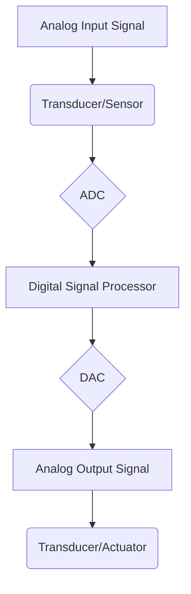

# DIGITAL SIGNAL PROCESSING - Module 1: Introduction to DSP and Discrete Fourier Transform

## 1.1 Introduction to Digital Signal Processing (DSP)

### 1.1.1 What is a Signal?

A signal is a function that conveys information about a physical phenomenon. Signals can be:
*   **Analog:** Continuous in both time and amplitude (e.g., voice, temperature).
*   **Digital:** Discrete in both time and amplitude (e.g., audio on a CD, digital images).

### 1.1.2 What is Digital Signal Processing?

Digital Signal Processing (DSP) is the process of manipulating signals using digital computers or specialized digital signal processors. This involves converting analog signals to digital form, processing them, and then optionally converting them back to analog.

**Key Operations in DSP:**
*   **Filtering:** Removing unwanted frequencies from a signal.
*   **Compression:** Reducing the amount of data needed to represent a signal.
*   **Feature Extraction:** Identifying important characteristics of a signal.
*   **Analysis:** Understanding the properties of a signal.

### 1.1.3 Why DSP? Advantages of Digital over Analog Processing

*   **Flexibility:** Digital systems can be easily reprogrammed to perform different tasks.
*   **Accuracy and Precision:** Digital operations are precise and not prone to drift or noise accumulation as in analog circuits.
*   **Repeatability:** Digital processing produces consistent results.
*   **Storage and Retrieval:** Digital signals can be easily stored and retrieved without degradation.
*   **Cost-Effectiveness:** For complex operations, digital implementation can be more cost-effective than analog.
*   **Computational Power:** Modern DSPs offer immense processing capabilities.

**Referenced Textbooks/Concepts:**
*   **Proakis & Manolakis (Chapter 1):** Provides a foundational overview of DSP, its history, and the evolution of digital signal processors. Introduces the concept of signals and systems.
*   **Oppenheim & Schafer (Chapter 1):** Focuses on the representation of signals and systems, emphasizing the discrete-time nature of signals and the fundamental building blocks of DSP.

### 1.1.4 Basic DSP System Architecture

A typical DSP system involves the following components:

1.  **Input Transducer/Sensor:** Converts a physical phenomenon into an electrical analog signal.
    *   *Example:* Microphone for audio, camera sensor for images.
2.  **Analog-to-Digital Converter (ADC):**
    *   **Sampling:** Converts a continuous-time analog signal into a sequence of discrete-time samples. The sampling rate ($F_s$) is crucial.
    *   **Quantization:** Converts the amplitude of each sample into a discrete level. This introduces quantization error.
    *   **Encoding:** Represents the quantized levels in binary code.
3.  **Digital Signal Processor (DSP):** Performs computations on the digital signal. This is the core of the DSP system.
4.  **Digital-to-Analog Converter (DAC):**
    *   **De-quantization:** Reconstructs the analog amplitude levels from the digital codes.
    *   **Reconstruction Filter:** Smooths the output of the DAC to produce a continuous analog signal.
5.  **Output Transducer:** Converts the processed analog signal back into a human-perceptible form or an action.
    *   *Example:* Speaker for audio, display for images.

**Important Point:** The ADC and DAC are critical interfaces between the analog and digital worlds. The sampling rate of the ADC must be at least twice the highest frequency component in the analog signal (Nyquist-Shannon Sampling Theorem) to avoid aliasing.

### 1.1.5 Types of Signals and Systems

*   **Signals:**
    *   **Continuous-time vs. Discrete-time:** Whether time is continuous or discrete.
    *   **Analog vs. Digital:** Whether amplitude is continuous or discrete.
    *   **Periodic vs. Aperiodic:** Whether a signal repeats itself after a specific interval.
    *   **Energy vs. Power:** Signals with finite energy are energy signals; signals with finite average power are power signals.
    *   **Causal vs. Non-causal:** A signal is causal if it exists only for time $t \ge 0$ (or $n \ge 0$ for discrete-time).
    *   **Stable vs. Unstable:** Relates to system behavior.

*   **Systems:**
    *   **Linear vs. Non-linear:** If a system obeys the superposition principle (additivity and homogeneity).
    *   **Time-Invariant (TI) vs. Time-Varying (TV):** If the system's behavior does not change over time.
    *   **Causal vs. Non-causal:** If the output at any time depends only on past and present inputs.
    *   **Stable vs. Unstable (BIBO - Bounded Input, Bounded Output):** If a bounded input always produces a bounded output.
    *   **Memory vs. Memoryless:** If the output depends only on the current input (memoryless) or also on past inputs (memory).

**Referenced Textbooks/Concepts:**
*   **Proakis & Manolakis (Chapter 2):** Deep dives into the properties of discrete-time signals and systems, including linearity, time-invariance, causality, and stability. The concept of the impulse response ($h[n]$) is introduced as a way to characterize LTI systems.
*   **Oppenheim & Schafer (Chapter 2):** Explores the fundamental properties of discrete-time signals and systems, including convolution for LTI systems.

## 1.2 Discrete Fourier Transform (DFT)

### 1.2.1 Motivation for the DFT

The DFT is a fundamental tool in DSP that allows us to analyze the frequency content of a discrete-time signal. It transforms a finite-duration discrete-time signal from the time domain to the frequency domain. This is crucial for:
*   **Spectral Analysis:** Identifying the frequencies present in a signal.
*   **Filtering:** Designing and implementing filters based on their frequency response.
*   **Convolution:** Efficiently computing the convolution of two signals using the Fast Fourier Transform (FFT) algorithm.

### 1.2.2 Definition of the DFT

For a finite-length discrete-time signal $x[n]$ of length $N$, which is non-zero for $n = 0, 1, \dots, N-1$, its $N$-point DFT is given by:

$$X[k] = \sum_{n=0}^{N-1} x[n] e^{-j 2 \pi k n / N}, \quad \text{for } k = 0, 1, \dots, N-1$$

where:
*   $X[k]$ is the DFT coefficient at frequency index $k$.
*   $x[n]$ is the time-domain sample at time index $n$.
*   $N$ is the number of samples (and the length of the DFT).
*   $e^{-j 2 \pi k n / N}$ are the complex exponential basis functions (twiddle factors).

### 1.2.3 Inverse Discrete Fourier Transform (IDFT)

The IDFT allows us to reconstruct the original time-domain signal from its DFT coefficients:

$$x[n] = \frac{1}{N} \sum_{k=0}^{N-1} X[k] e^{j 2 \pi k n / N}, \quad \text{for } n = 0, 1, \dots, N-1$$

**Important Point:** The DFT essentially decomposes a finite-length discrete-time signal into a sum of complex sinusoids at specific frequencies. The term $e^{-j 2 \pi k n / N}$ represents a complex sinusoid with frequency $k F_s / N$, where $F_s$ is the sampling frequency.

**Referenced Textbooks/Concepts:**
*   **Proakis & Manolakis (Chapter 7):** Introduces the DFT and its properties in detail. It covers the definition, inverse DFT, and the relationship between the continuous-time Fourier Transform and the DFT.
*   **Oppenheim & Schafer (Chapter 7):** Discusses the DFT as a tool for analyzing finite-duration signals. It covers the properties of the DFT and its application in spectrum analysis.
*   **Salivahanan et al. (Chapter 5):** Provides a good introduction to the DFT, including its definition, properties, and applications in areas like convolution.

### 1.2.4 Properties of the DFT

The DFT has several important properties that make it useful for signal analysis and processing. Let $x[n]$ be a signal with DFT $X[k]$, and $y[n]$ be a signal with DFT $Y[k]$.

1.  **Periodicity:** The DFT is periodic with period $N$.
    $X[k+N] = X[k]$

2.  **Linearity:** The DFT of a linear combination of signals is the linear combination of their DFTs.
    If $y[n] = ax[n] + bz[n]$, then $Y[k] = aX[k] + bZ[k]$.

3.  **Time Shifting:** Shifting a signal in time results in a phase shift in the frequency domain.
    If $y[n] = x[n-m]$, then $Y[k] = X[k] e^{-j 2 \pi k m / N}$.
    *Example:* If $x[n] = \{1, 2, 3, 4\}$, $X[k]$ is its DFT. If $y[n] = x[n-1] = \{0, 1, 2, 3\}$, $Y[k] = X[k] e^{-j 2 \pi k / 4}$.

4.  **Frequency Shifting:** Shifting a signal in frequency results in multiplication by a complex exponential in the time domain.
    If $y[n] = x[n] e^{j 2 \pi k_0 n / N}$, then $Y[k] = X[k-k_0]$.

5.  **Time Reversal:** Reversing a signal in time corresponds to reversing its frequency spectrum and conjugation.
    If $y[n] = x[-n]$, then $Y[k] = X[-k] = X[N-k]$ (due to periodicity of $X[k]$).

6.  **Conjugation:** The DFT of the complex conjugate of a signal.
    If $y[n] = x^*[n]$, then $Y[k] = X^*[-k] = X^*[N-k]$.

7.  **Conjugate Symmetry:** If $x[n]$ is real, then $X[k]$ exhibits conjugate symmetry.
    $X[N-k] = X^*[k]$. This implies that the magnitude spectrum $|X[k]|$ is even, and the phase spectrum $\angle X[k]$ is odd.

8.  **Parseval's Theorem (Energy Preservation):** The total energy in the time domain is equal to the total energy in the frequency domain.
    $\sum_{n=0}^{N-1} |x[n]|^2 = \frac{1}{N} \sum_{k=0}^{N-1} |X[k]|^2$

9.  **Convolution Theorem:** Convolution in the time domain is equivalent to multiplication in the frequency domain.
    If $y[n] = x[n] * h[n]$ (circular convolution), then $Y[k] = X[k] H[k]$.
    *   **Circular Convolution:** The result of convolving two sequences of length $N$ to produce a sequence of length $N$. This is what the DFT multiplication property implies.
    *   **Linear Convolution:** The standard convolution for systems. To compute linear convolution using DFT, we need to zero-pad the input sequences to a length greater than or equal to the sum of their lengths minus one.

**Referenced Textbooks/Concepts:**
*   **Proakis & Manolakis (Chapter 7.3):** Details all the key properties of the DFT with mathematical derivations.
*   **Oppenheim & Schafer (Chapter 7.2):** Explains the significance of each DFT property for signal analysis.
*   **Ifeachor & Jervis (Chapter 4):** Presents the DFT properties and their applications, particularly in spectral analysis.

### 1.2.5 Applications of the DFT

1.  **Spectrum Analysis:** Determining the frequency components present in a signal.
    *   *Example:* Analyzing audio signals to identify the fundamental frequency and harmonics.
2.  **Efficient Convolution:** Using the Convolution Theorem and the Fast Fourier Transform (FFT) algorithm for faster computation of linear convolution.
    *   *Example:* Implementing FIR filters by multiplying the input signal's DFT with the filter's frequency response.
3.  **Signal Filtering:** Designing and implementing digital filters.
    *   *Example:* Low-pass filtering to remove high-frequency noise.
4.  **Correlation:** Measuring the similarity between two signals as a function of time delay.
5.  **Data Compression:** Identifying and removing less significant frequency components.
6.  **System Analysis:** Determining the frequency response of a system from its impulse response.

**Referenced Textbooks/Concepts:**
*   **Proakis & Manolakis (Chapter 7.5):** Discusses the application of the DFT in convolution, spectrum analysis, and correlation.
*   **Oppenheim & Schafer (Chapter 7.3):** Explores the use of the DFT for filtering and spectral estimation.
*   **Salivahanan et al. (Chapter 5.4):** Provides examples of DFT applications in convolution and filtering.

## 1.3 Fast Fourier Transform (FFT)

While the DFT itself is a fundamental concept, its direct computation for a large $N$ is computationally intensive ($O(N^2)$ operations). The Fast Fourier Transform (FFT) is a family of efficient algorithms to compute the DFT in $O(N \log N)$ time.

**Key Idea of FFT:** Exploits the symmetry and periodicity of the complex exponentials to break down the $N$-point DFT into smaller DFTs. Common FFT algorithms include:
*   **Decimation-in-Time (DIT) FFT:** Divides the input sequence into even and odd indexed samples.
*   **Decimation-in-Frequency (DIF) FFT:** Divides the output sequence into even and odd indexed samples.

**Note:** A detailed understanding of FFT algorithms is often covered in subsequent modules, but it's important to recognize its existence and its computational advantage over direct DFT computation.

**Referenced Textbooks/Concepts:**
*   **Proakis & Manolakis (Chapter 7.4):** Introduces the concept of FFT and provides an overview of DIT and DIF algorithms.
*   **Oppenheim & Schafer (Chapter 7.3):** Briefly mentions the efficiency of FFT algorithms.

## 1.4 Learning Outcomes & Course Outcomes Alignment

This module directly addresses the following learning outcomes and contributes to course outcomes:

*   **Learning Outcome 1:** Understanding the concept of signals and systems, including their properties, and the fundamentals of DSP.
    *   **CO1: Analyse discrete-time systems using DFT (Knowledge Level: K2)**: This module lays the groundwork by introducing the DFT, its definition, and properties. Subsequent modules will build upon this to use the DFT for system analysis. The understanding of DFT properties like the convolution theorem is crucial for analyzing LTI systems.

*   **Contribution to other COs:**
    *   **CO2 & CO3 (Filter Realization & Design):** The DFT is the bedrock for understanding frequency-domain filter design and analysis. Concepts like the frequency response ($H(e^{j\omega})$), which is the Fourier Transform of the impulse response, are intrinsically linked to the DFT.
    *   **CO4 (Word Length Effects):** While not directly covered in this introductory module, the numerical precision issues that arise in DFT computations (especially FFT) are relevant to understanding word-length effects in digital filters.

## 1.5 Practice Questions & Exercises

**Question 1 (Definition & Properties):**
Given the discrete-time signal $x[n] = \{1, 2, 3, 4\}$ for $n=0, 1, 2, 3$.
(a) Calculate the 4-point DFT of $x[n]$, i.e., $X[k]$ for $k=0, 1, 2, 3$.
(b) Using the properties of the DFT, find the DFT of $y[n] = x[n-1]$ (circularly shifted).

**Answer 1:**
(a)
$X[k] = \sum_{n=0}^{3} x[n] e^{-j 2 \pi k n / 4}$

For $k=0$: $X[0] = x[0]e^0 + x[1]e^0 + x[2]e^0 + x[3]e^0 = 1+2+3+4 = 10$.
For $k=1$: $X[1] = 1e^0 + 2e^{-j\pi/2} + 3e^{-j\pi} + 4e^{-j3\pi/2} = 1 + 2(-j) + 3(-1) + 4(j) = 1 - 2j - 3 + 4j = -2 + 2j$.
For $k=2$: $X[2] = 1e^0 + 2e^{-j\pi} + 3e^{-j2\pi} + 4e^{-j3\pi} = 1 + 2(-1) + 3(1) + 4(-1) = 1 - 2 + 3 - 4 = -2$.
For $k=3$: $X[3] = 1e^0 + 2e^{-j3\pi/2} + 3e^{-j3\pi} + 4e^{-j9\pi/2} = 1 + 2(j) + 3(-1) + 4(-j) = 1 + 2j - 3 - 4j = -2 - 2j$.

So, $X[k] = \{10, -2+2j, -2, -2-2j\}$.

(b) Using the time-shifting property: $Y[k] = X[k] e^{-j 2 \pi k m / N}$.
Here, $m=1$, $N=4$.
$Y[k] = X[k] e^{-j 2 \pi k / 4} = X[k] e^{-j \pi k / 2}$.

$Y[0] = X[0] e^0 = 10 \times 1 = 10$.
$Y[1] = X[1] e^{-j \pi / 2} = (-2+2j) \times (-j) = 2j + 2 = 2+2j$.
$Y[2] = X[2] e^{-j \pi} = (-2) \times (-1) = 2$.
$Y[3] = X[3] e^{-j 3\pi / 2} = (-2-2j) \times (j) = -2j + 2 = 2-2j$.

So, $Y[k] = \{10, 2+2j, 2, 2-2j\}$.

Let's verify the time shift: $y[n] = x[n-1]$ (circularly).
$x[n] = \{1, 2, 3, 4\}$
$y[0] = x[-1] = x[3] = 4$
$y[1] = x[0] = 1$
$y[2] = x[1] = 2$
$y[3] = x[2] = 3$
So, $y[n] = \{4, 1, 2, 3\}$.

Let's calculate the DFT of $y[n]$ directly:
$Y[0] = 4+1+2+3 = 10$.
$Y[1] = 4e^0 + 1e^{-j\pi/2} + 2e^{-j\pi} + 3e^{-j3\pi/2} = 4 + 1(-j) + 2(-1) + 3(j) = 4 - j - 2 + 3j = 2 + 2j$.
$Y[2] = 4e^0 + 1e^{-j\pi} + 2e^{-j2\pi} + 3e^{-j3\pi} = 4 + 1(-1) + 2(1) + 3(-1) = 4 - 1 + 2 - 3 = 2$.
$Y[3] = 4e^0 + 1e^{-j3\pi/2} + 2e^{-j3\pi} + 3e^{-j9\pi/2} = 4 + 1(j) + 2(-1) + 3(-j) = 4 + j - 2 - 3j = 2 - 2j$.
This matches.

**Question 2 (Parseval's Theorem):**
Using the results from Question 1, verify Parseval's theorem for the signal $x[n]$.

**Answer 2:**
Left-hand side (Time Domain Energy):
$\sum_{n=0}^{3} |x[n]|^2 = |1|^2 + |2|^2 + |3|^2 + |4|^2 = 1 + 4 + 9 + 16 = 30$.

Right-hand side (Frequency Domain Energy):
$\frac{1}{N} \sum_{k=0}^{3} |X[k]|^2 = \frac{1}{4} (|10|^2 + |-2+2j|^2 + |-2|^2 + |-2-2j|^2)$
$= \frac{1}{4} (100 + ((-2)^2 + 2^2) + 4 + ((-2)^2 + (-2)^2))$
$= \frac{1}{4} (100 + (4+4) + 4 + (4+4))$
$= \frac{1}{4} (100 + 8 + 4 + 8)$
$= \frac{1}{4} (120) = 30$.

LHS = RHS, so Parseval's theorem is verified.

**Question 3 (Conceptual):**
What is the primary advantage of using the FFT over the direct computation of the DFT? Explain why this is important in practical DSP applications.

**Answer 3:**
The primary advantage of the FFT over direct DFT computation is its significantly improved computational efficiency. The FFT reduces the number of complex multiplications and additions required from $O(N^2)$ to $O(N \log N)$.

This is crucial in practical DSP applications because:
*   **Real-time Processing:** Many DSP applications, such as audio processing, telecommunications, and control systems, require real-time or near real-time processing. The speed advantage of FFT allows these applications to process data as it arrives without significant delay.
*   **Computational Resources:** DSPs and microcontrollers often have limited processing power and memory. The computational savings from FFT enable complex algorithms like spectrum analysis and filtering to be implemented on these resource-constrained platforms.
*   **Data Volume:** Modern digital signals can be very long. The $O(N \log N)$ complexity makes it feasible to analyze and process these large datasets, which would be computationally prohibitive with $O(N^2)$ algorithms.

## 1.6 Important Points to Remember

*   **DSP bridges the analog and digital worlds:** ADC and DAC are essential components.
*   **Sampling rate is critical:** Nyquist-Shannon theorem prevents aliasing.
*   **DFT transforms a finite-length discrete-time signal from time to frequency domain.**
*   **The DFT coefficients $X[k]$ represent the signal's amplitude and phase at specific discrete frequencies.**
*   **DFT properties (linearity, time/frequency shifting, convolution theorem) are powerful tools for signal analysis and processing.**
*   **Parseval's Theorem is crucial for energy calculations in both domains.**
*   **FFT is an efficient algorithm to compute the DFT, enabling real-time and complex DSP operations.**
*   **The DFT analyzes finite-duration signals. For continuous-time signals, we often use windowing techniques to obtain finite-duration segments before applying the DFT.**

This concludes the notes for Module 1: Introduction to DSP and Discrete Fourier Transform. This foundation is essential for understanding more advanced DSP concepts and techniques.

## Videos

| Resource Type | Recommended Video |
| :--- | :--- |
| ⚡ **Quick Concept** | [Watch Summary & Animations](https://www.youtube.com/watch?v=gI-qXk7XojA) |
| 🎓 **Exam Deep Dive** | [Watch Comprehensive University Lecture](https://www.youtube.com/watch?v=Q-tL8_628gE) |
| ✍️ **Problem Solving** | [Watch Solved Examples & Numericals](https://www.youtube.com/watch?v=8XG7U5yN668) |
