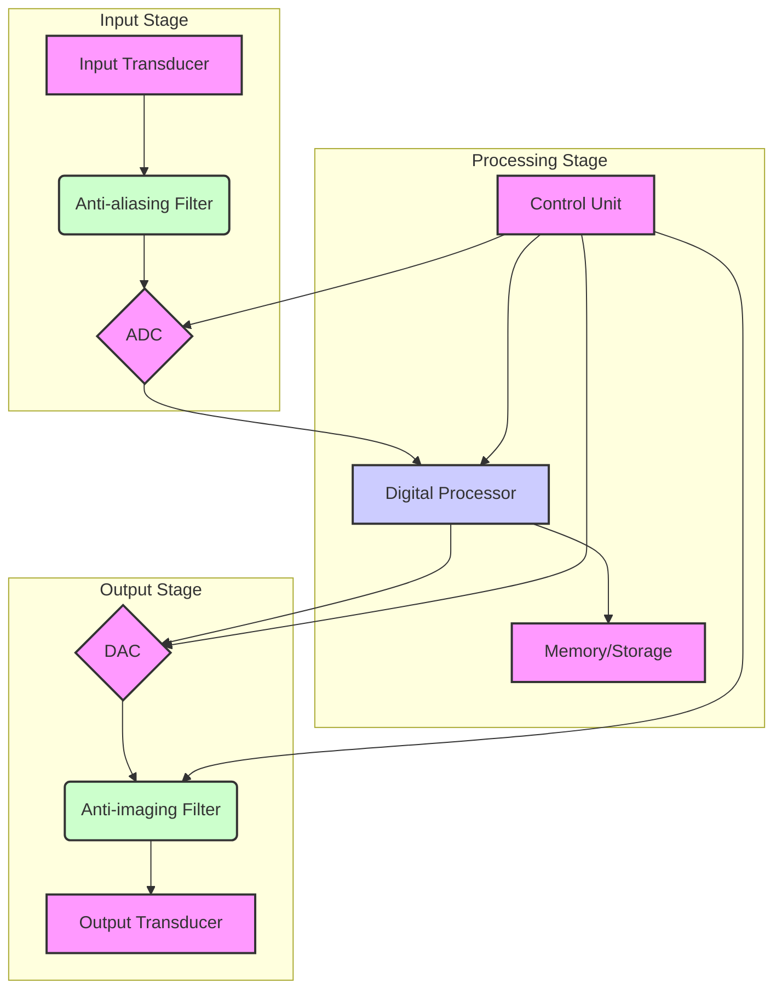

# Digital Signal Processing - Module 1: Introduction to DSP and Discrete Fourier Transform

## Topic: Basic Elements of a DSP System

This module introduces the fundamental concepts of Digital Signal Processing (DSP) and its foundational tool, the Discrete Fourier Transform (DFT). We will begin by understanding what a DSP system is and its essential components.

---

### 1.1 Introduction to Digital Signal Processing (DSP)

Digital Signal Processing deals with the manipulation and analysis of signals using digital computers or specialized digital hardware. Unlike Analog Signal Processing, which operates on continuous-time, analog signals, DSP operates on discrete-time, discrete-amplitude signals (digital signals).

**Why DSP?**

*   **Flexibility:** Digital systems are highly flexible and can be easily reconfigured to perform different tasks.
*   **Accuracy and Precision:** Digital operations are precise and not subject to drift or noise that affects analog components.
*   **Storage and Transmission:** Digital signals can be easily stored, transmitted, and processed without degradation.
*   **Implementation of Complex Algorithms:** DSP allows for the implementation of sophisticated algorithms that are difficult or impossible with analog circuits.
*   **Cost-Effectiveness:** For complex functions, digital implementations can be more cost-effective than analog.

---

### 1.2 Signals and Systems: A Brief Overview

Before delving into DSP systems, it's crucial to understand the basic building blocks: signals and systems.

#### 1.2.1 Signals

A signal is a function that conveys information about a physical phenomenon. In DSP, we primarily deal with **discrete-time signals**.

*   **Continuous-Time Signal:** A signal whose independent variable is continuous (e.g., time, space). Represented as $x(t)$.
    *   **Example:** The voltage across a microphone as a function of time.
*   **Discrete-Time Signal:** A signal whose independent variable is discrete. It's obtained by sampling a continuous-time signal at regular intervals. Represented as $x[n]$, where 'n' is the integer sample index.
    *   **Example:** A sequence of sound pressure readings taken every millisecond.

#### 1.2.2 Systems

A system is a process that transforms an input signal into an output signal. In DSP, we are interested in **discrete-time systems**.

*   **Continuous-Time System:** Processes continuous-time signals.
*   **Discrete-Time System:** Processes discrete-time signals.

**Important Properties of Discrete-Time Systems:**

*   **Linearity:** A system is linear if it satisfies the superposition property:
    *   $T\{ax_1[n] + bx_2[n]\} = aT\{x_1[n]\} + bT\{x_2[n]\}$
    *   This means the system's response to a sum of inputs is the sum of its responses to individual inputs, scaled by the same constants.
*   **Time-Invariance:** A system is time-invariant if the output depends only on the input signal and not on the time at which the input is applied.
    *   If $y[n] = T\{x[n]\}$, then $y[n-k] = T\{x[n-k]\}$ for any integer $k$.
    *   This means shifting the input in time shifts the output in time by the same amount.
*   **Causality:** A system is causal if its output at any given time depends only on present and past input values, not on future input values.
    *   $y[n]$ depends only on $x[n], x[n-1], x[n-2], \dots$.
    *   **Important:** Causal systems are essential for real-time processing.
*   **Stability:** A system is stable if a bounded input produces a bounded output (BIBO stability).
    *   If $|x[n]| \le M$ for all $n$, then $|y[n]| \le N$ for all $n$, where M and N are finite constants.

---

### 1.3 Basic Elements of a DSP System

A typical DSP system consists of several fundamental building blocks that convert a real-world analog signal into a digital format, process it, and then convert it back to an analog signal if needed.

**The core components are:**

1.  **Analog-to-Digital Converter (ADC)**
2.  **Digital Processor (DSP)**
3.  **Digital-to-Analog Converter (DAC)**

**Optional/Supporting Components:**

4.  **Anti-aliasing Filter**
5.  **Anti-imaging Filter (Reconstruction Filter)**
6.  **Input Transducer**
7.  **Output Transducer**
8.  **Memory/Storage**
9.  **Control Unit**

Let's examine each component in detail.

#### 1.3.1 Input Transducer (Optional)

*   **Function:** Converts a physical phenomenon into an electrical signal.
*   **Examples:** Microphones (sound to electrical signal), cameras (light to electrical signal), sensors (temperature, pressure, etc., to electrical signal).
*   **Nature:** Typically produces an analog signal.

#### 1.3.2 Anti-aliasing Filter (Low-Pass Filter)

*   **Purpose:** To prevent aliasing when sampling an analog signal.
*   **Requirement:** This is a crucial preprocessing step.
*   **Operation:** It removes or attenuates frequencies in the analog signal that are above half the sampling frequency ($f_s/2$). This is known as the **Nyquist frequency**.
*   **Why is it needed?** If the input analog signal contains frequencies higher than $f_s/2$, these frequencies will be misinterpreted as lower frequencies after sampling, leading to distortion (aliasing).
*   **Textbook Reference:** Proakis & Manolakis, Chapter 1. Essential for understanding sampling theory.
*   **Example:** In audio processing, if you sample at 8 kHz, you need to filter out frequencies above 4 kHz to avoid aliasing.

#### 1.3.3 Analog-to-Digital Converter (ADC)

*   **Function:** Converts a continuous-time, continuous-amplitude analog signal into a discrete-time, discrete-amplitude digital signal.
*   **Process:** Involves two main steps:
    1.  **Sampling:** Converting the continuous-time signal into a sequence of discrete-time samples. The sampling rate is denoted by $f_s$ (samples per second). The time interval between samples is $T_s = 1/f_s$.
        *   **Ideal Sampling:** $x_s[n] = x(nT_s)$. This is a mathematical model.
        *   **Practical Sampling:** Involves multiplying the analog signal by a train of impulses.
    2.  **Quantization:** Converting the amplitude of each sample (which can be any value within a range) into a finite number of discrete amplitude levels. This process introduces quantization error.
        *   The number of levels is determined by the **resolution** of the ADC, usually measured in **bits**. An N-bit ADC can represent $2^N$ distinct amplitude levels.
*   **Output:** A sequence of binary numbers representing the quantized samples.
*   **Key Parameters:** Sampling rate ($f_s$) and resolution (bits).
*   **Textbook Reference:** Proakis & Manolakis, Chapter 1. This is where the sampling theorem is explained. Oppenheim & Schafer also cover this thoroughly.
*   **Example:**
    *   An analog audio signal might range from -5V to +5V.
    *   If we use a 3-bit ADC, we can represent $2^3 = 8$ levels (e.g., -4, -3, -2, -1, 0, 1, 2, 3, 4 if we consider integer steps).
    *   A sample with an analog value of 3.7V might be quantized to the closest digital level, say '3'.

#### 1.3.4 Digital Processor (DSP)

*   **Function:** Performs various operations on the digital signal according to a specific algorithm. This is the "heart" of the DSP system.
*   **Hardware:** Can be implemented using:
    *   **General-purpose Microprocessors:** Capable of running DSP software.
    *   **Digital Signal Processors (DSPs):** Specialized microprocessors optimized for DSP tasks, often featuring dedicated hardware for multiply-accumulate (MAC) operations.
    *   **Field-Programmable Gate Arrays (FPGAs):** Highly configurable hardware for custom DSP implementations.
    *   **Application-Specific Integrated Circuits (ASICs):** Custom-designed chips for specific DSP applications.
*   **Operations:** Can include filtering, transformations (like DFT), modulation, demodulation, compression, feature extraction, etc.
*   **Textbook Reference:** Covered extensively in all mentioned textbooks when discussing algorithms like FIR/IIR filters and DFT.
*   **Alignment with Course Outcomes:** Directly relates to CO1 (Analyse discrete-time systems using DFT), CO2 (Realise IIR and FIR filters), CO3 (Design of IIR and FIR filters), and CO4 (Analyse effect of word length in digital filters).

#### 1.3.5 Digital-to-Analog Converter (DAC)

*   **Function:** Converts the processed digital signal back into an analog signal.
*   **Process:**
    1.  **De-quantization:** The discrete amplitude levels are converted back to continuous voltage or current values.
    2.  **Reconstruction:** A continuous-time signal is generated from the discrete-time samples.
*   **Output:** An analog signal, typically in the form of a staircase waveform if no reconstruction filter is used.
*   **Textbook Reference:** Proakis & Manolakis, Chapter 1.

#### 1.3.6 Anti-imaging Filter (Reconstruction Filter)

*   **Purpose:** To smooth out the staircase-like output of the DAC and reconstruct the original analog signal (or a close approximation of it).
*   **Operation:** This is a low-pass filter that removes the high-frequency replicas (images) of the signal spectrum that are generated by the DAC process. The cutoff frequency of this filter is typically set to half the sampling frequency ($f_s/2$).
*   **Why is it needed?** The DAC, by converting discrete samples into pulses, creates spectral images of the desired signal. The reconstruction filter eliminates these unwanted images.
*   **Textbook Reference:** Proakis & Manolakis, Chapter 1.
*   **Example:** If the original analog signal had a bandwidth of 4 kHz, and we sampled at 8 kHz, the reconstruction filter would remove frequencies above 4 kHz to recover the original signal's frequency content.

#### 1.3.7 Output Transducer (Optional)

*   **Function:** Converts the processed electrical signal into a physical phenomenon.
*   **Examples:** Speakers (electrical signal to sound), displays (electrical signal to visual), actuators.
*   **Nature:** Receives an analog electrical signal.

#### 1.3.8 Memory/Storage

*   **Function:** Stores input samples, intermediate results, filter coefficients, and output samples.
*   **Importance:** Essential for algorithms that require access to past data or for buffering data.
*   **Types:** RAM, ROM, Flash memory.

#### 1.3.9 Control Unit

*   **Function:** Manages the flow of data and operations within the DSP system. It orchestrates the activities of the other components.
*   **Examples:** Microcontrollers, dedicated control logic.

---

### 1.4 Block Diagram of a General DSP System

Here's a general block diagram illustrating the flow of signal processing:

**Signal Flow:**

1.  **Physical Phenomenon** is sensed by an **Input Transducer**, producing an analog signal.
2.  The analog signal is filtered by an **Anti-aliasing Filter** to remove frequencies above $f_s/2$.
3.  The filtered analog signal is converted to a digital signal by an **ADC** (sampling and quantization).
4.  The digital signal is processed by the **Digital Processor** (e.g., filtering, transformation). This stage often utilizes **Memory** for data and coefficients, managed by a **Control Unit**.
5.  The processed digital signal is converted back to an analog signal by a **DAC**.
6.  The analog signal is smoothed by an **Anti-imaging Filter** to remove spectral images.
7.  The reconstructed analog signal is presented as output by an **Output Transducer**, converting it back to a physical phenomenon.

---

### 1.5 The Discrete Fourier Transform (DFT) - A Glimpse

(This section is an introduction as per the module title. Detailed study will follow in subsequent topics.)

*   **Purpose:** The DFT is a fundamental tool in DSP that transforms a sequence of discrete-time samples from the time domain to the frequency domain. It allows us to analyze the frequency content of a digital signal.
*   **Relationship to Continuous Fourier Transform:** The DFT is the discrete-time equivalent of the Fourier Series (for periodic signals) and the Fourier Transform (for non-periodic signals).
*   **Input:** A finite-length sequence of $N$ discrete-time samples, $x[n]$, where $n = 0, 1, \dots, N-1$.
*   **Output:** A finite-length sequence of $N$ complex numbers, $X[k]$, where $k = 0, 1, \dots, N-1$. Each $X[k]$ represents the amplitude and phase of a specific frequency component present in the input signal.
*   **Formula:**
    $$X[k] = \sum_{n=0}^{N-1} x[n] e^{-j2\pi kn/N}, \quad k = 0, 1, \dots, N-1$$
*   **Inverse DFT (IDFT):** Allows us to reconstruct the time-domain signal from its frequency-domain representation.
    $$x[n] = \frac{1}{N} \sum_{k=0}^{N-1} X[k] e^{j2\pi kn/N}, \quad n = 0, 1, \dots, N-1$$
*   **Relevance to DSP Systems:** DFT is used in spectrum analysis, filter design (especially frequency-domain design), spectral analysis, and in implementing efficient algorithms like the Fast Fourier Transform (FFT).
*   **Alignment with Course Outcomes:** Directly addresses CO1: "Analyse discrete-time systems using DFT (Knowledge Level: K2)". Understanding the DFT is crucial for analyzing the behavior of systems in the frequency domain.

---

### 1.6 Important Points to Remember

*   **Analog vs. Digital:** DSP deals with discrete-time, discrete-amplitude signals.
*   **Sampling:** The process of converting continuous-time to discrete-time. The sampling rate ($f_s$) is critical.
*   **Nyquist-Shannon Sampling Theorem:** To perfectly reconstruct a signal from its samples, the sampling frequency ($f_s$) must be at least twice the highest frequency component present in the signal ($f_s \ge 2f_{max}$).
*   **Aliasing:** Occurs when $f_s < 2f_{max}$, causing high frequencies to appear as lower frequencies. Prevented by anti-aliasing filters.
*   **Quantization:** The process of converting continuous-amplitude samples to discrete levels, introducing quantization error.
*   **Resolution (bits):** Determines the number of quantization levels and thus the accuracy of amplitude representation.
*   **Reconstruction:** The process of converting discrete-time samples back to a continuous-time analog signal. Requires an anti-imaging filter.
*   **DFT:** Transforms time-domain sequences to frequency-domain representations. Essential for spectrum analysis.
*   **Real-time Processing:** Requires causal systems and efficient implementation of DSP algorithms.

---

### 1.7 Practice Questions

**Instructions:** Attempt the following questions to test your understanding of the basic elements of a DSP system.

**Question 1:**
What is the primary function of an anti-aliasing filter in a DSP system?
a) To reconstruct the original analog signal.
b) To prevent high-frequency components from distorting the sampled signal.
c) To convert analog samples to digital values.
d) To amplify the analog signal.

**Question 2:**
If an analog signal contains frequencies up to 6 kHz, what is the minimum sampling rate required to avoid aliasing?
a) 3 kHz
b) 6 kHz
c) 12 kHz
d) 24 kHz

**Question 3:**
The process of converting a continuous-amplitude signal sample into a finite number of discrete amplitude levels is called:
a) Sampling
b) Interpolation
c) Quantization
d) Reconstruction

**Question 4:**
Which component in a DSP system is responsible for performing mathematical operations like filtering or transformations on digital data?
a) ADC
b) DAC
c) Digital Processor
d) Anti-imaging Filter

**Question 5:**
Briefly explain the two main steps involved in the Analog-to-Digital Conversion (ADC) process.

**Question 6:**
What is the purpose of the Anti-imaging Filter (Reconstruction Filter)?

---

### 1.8 Answers to Practice Questions

**Answer 1:**
b) To prevent high-frequency components from distorting the sampled signal.
*   **Explanation:** The anti-aliasing filter is a low-pass filter that removes frequencies above $f_s/2$ (Nyquist frequency) before sampling, thus preventing aliasing.

**Answer 2:**
c) 12 kHz
*   **Explanation:** According to the Nyquist-Shannon Sampling Theorem, the sampling frequency ($f_s$) must be at least twice the maximum frequency component ($f_{max}$) of the signal. Here, $f_{max} = 6$ kHz, so $f_s \ge 2 \times 6$ kHz = 12 kHz.

**Answer 3:**
c) Quantization
*   **Explanation:** Quantization is the step where continuous amplitude values are mapped to discrete levels.

**Answer 4:**
c) Digital Processor
*   **Explanation:** The Digital Processor is the core component that executes algorithms on the digital signal.

**Answer 5:**
The two main steps in the ADC process are:
1.  **Sampling:** Converting the continuous-time analog signal into a sequence of discrete-time samples at regular intervals (determined by the sampling rate $f_s$).
2.  **Quantization:** Converting the amplitude of each discrete sample into a finite number of discrete amplitude levels, which introduces quantization error.

**Answer 6:**
The Anti-imaging Filter (or Reconstruction Filter) is used after the Digital-to-Analog Converter (DAC). Its purpose is to smooth out the staircase-like output of the DAC and remove the high-frequency spectral images (replicas) that are created by the sampling and DAC process. This helps in reconstructing a cleaner analog signal that approximates the original input.

---

This concludes Module 1, Topic: Basic Elements of a DSP System. You should now have a foundational understanding of how a digital signal processing system is structured and the role of each component. This knowledge will be crucial for understanding the subsequent topics, including the Discrete Fourier Transform and its applications.

## Videos

| Resource Type | Recommended Video |
| :--- | :--- |
| ⚡ **Quick Concept** | [Watch Summary & Animations](https://www.youtube.com/watch?v=mc979OhitAg) |
| 🎓 **Exam Deep Dive** | [Watch Comprehensive University Lecture](https://www.youtube.com/watch?v=Q-tL8_628gE) |
| ✍️ **Problem Solving** | [Watch Solved Examples & Numericals](https://www.youtube.com/watch?v=p6Q9_e7_L1w) |
