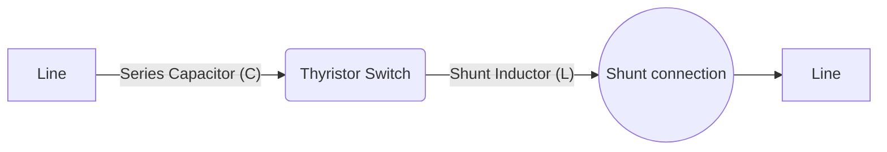
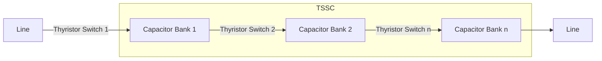

# HVDC AND FACTS: Module 3 - Shunt and Series FACTS Devices: Static Shunt Compensator

## Topic: Static Series Compensators

This module focuses on **Static Series Compensators**, a crucial type of FACTS devices used to improve power transfer capability and stability in AC transmission systems. We will delve into their objectives, operation, and different variable impedance configurations.

### 1. Objectives of Series Compensation

Series compensation is primarily employed to counteract the inductive reactance of the transmission line. By injecting a leading or lagging reactive voltage in series with the line, the **effective reactance** of the line is reduced.

**Key Objectives:**

*   **Increased Power Transfer Capability:** By reducing the net reactance between two buses, the maximum power that can be transferred is increased. This is directly related to the power transfer equation:
    $P_{max} = \frac{V_s V_r}{X_{line} - X_{comp}}$
    where $X_{comp}$ is the compensating reactance.
    *   **Insight:** As $X_{comp}$ increases (becomes more negative with leading compensation), $X_{line} - X_{comp}$ decreases, thus $P_{max}$ increases.

*   **Improved Voltage Profile:** Series compensation can help maintain a more stable voltage profile along the transmission line, especially under heavy loading conditions where line voltage can drop significantly.
    *   **Example:** In long transmission lines, the voltage at the receiving end can be considerably lower than the sending end voltage due to the line's series impedance. Series compensation can boost this voltage.

*   **Enhanced Transient Stability:** By reducing the impedance during fault conditions, the rate of change of power angle is reduced, improving the ability of the system to recover from disturbances.
    *   **Insight:** A lower effective impedance means less change in power angle for a given change in voltage, contributing to stability.

*   **Reduced System Losses:** While not the primary objective, reducing the current for a given power transfer can indirectly lead to reduced I²R losses in the line.

*   **Angle Stabilization:** Series compensation helps to reduce the angle difference between the sending and receiving end voltages, which is critical for maintaining synchronism.

**Relation to Course Outcomes:**
*   **CO3:** Explains the need for FACTS devices (specifically series compensation for power transfer and stability).
*   **CO5:** Interprets series FACTS devices for power system applications (understanding how they improve performance).

### 2. Variable Impedance Type Series Compensators

These devices achieve series compensation by varying their effective impedance injected into the line. The variation is typically achieved through the use of power electronic switching devices.

#### a) GCSC (Gated Controlled Series Capacitor)

**Princ of Operation:**
The GCSC is a Thyristor Controlled Series Capacitor (TCSC) where the compensation is achieved by a fixed capacitor bank in series with a controllable reactance. The controllable reactance is usually provided by a thyristor-controlled reactor (TCR) or a thyristor-switched reactor (TSR). However, the term "Gated Controlled" in GCSC often implies a more fundamental approach using thyristors to control the flow through a series capacitor.

A simplified GCSC configuration can be thought of as a capacitor in series with the line, shunted by a controllable switch (like a thyristor) and an inductor. By controlling the firing angle of the thyristor, the effective impedance seen by the line can be varied.

*   **Operation Modes:**
    *   **Full Bypass:** Thyristor is ON, effectively bypassing the capacitor.
    *   **Partial Bypass:** Thyristor is switched ON and OFF periodically.
    *   **Full Compensation:** Capacitor is always in the circuit.

**Schematic:**
A basic GCSC configuration typically involves:
*   A series capacitor bank ($C$).
*   A thyristor-based switching arrangement. This could be a series thyristor bypass switch or a more complex arrangement.



**Important Note:** The term GCSC is less commonly used than TCSC. Often, the principles described for GCSC are embodied within the TCSC.

#### b) TCSC (Thyristor Controlled Series Capacitor)

**Princ of Operation:**
The TCSC is a FACTS device that provides variable series compensation by connecting a series capacitor in parallel with a thyristor-controlled reactor (TCR) or a thyristor-switched reactor (TSR). This parallel combination is then inserted in series with the transmission line.

*   **Key Components:**
    *   **Series Capacitor Bank ($C$):** Provides the fundamental capacitive reactance.
    *   **Thyristor-Controlled Reactor (TCR):** Consists of reactors in series with inverse parallel thyristors. By controlling the firing angle ($\alpha$) of the thyristors, the fundamental inductive reactance of the TCR can be varied.
    *   **Damping Circuit:** To suppress sub-synchronous oscillations, a damping circuit (often a resistor in series with a capacitor or inductor) may be included.

*   **How it works:**
    1.  **Normal Operation:** The capacitor ($C$) is always in the circuit.
    2.  **Controlling Reactance:** The TCR is connected in parallel with the capacitor. By adjusting the firing angle of the thyristors in the TCR, the effective impedance of the parallel combination can be controlled.
    3.  **Bypassing/Compensation:**
        *   When the TCR is set to provide maximum inductance (large firing angle, close to 180 degrees), it essentially shunts the capacitor. This is akin to bypassing the capacitor.
        *   When the TCR is switched off (firing angle effectively infinity), the full capacitor reactance is present in series.
        *   By varying the firing angle, the effective series capacitive reactance can be continuously adjusted between these limits.

**Schematic:**

```mermaid
graph LR
    A[Line] -- Series Capacitor (C) --> B{Parallel Combination}
    B -- TCR --> C((Shunt connection))
    B -- Connection to Line --> D[Line]
    TCR(Thyristor Controlled Reactor\n(L & Thyristors))
```

*   **Variable Impedance Range:** The TCSC can operate in different modes:
    *   **Capacitive Mode:** The TCR is controlled to absorb reactive power, resulting in a net capacitive reactance.
    *   **Inductive Mode:** The TCR can be switched to provide inductive reactance. This is typically used for rapidly bypassing the capacitor to protect the line against overvoltages or to quickly de-tune the line.
    *   **Resistive Mode (near resonance):** This mode is usually avoided as it can lead to high harmonic currents and potential instability.

**Reference:** Sood (2004) "HVDC and FACTS Controllers" provides detailed discussions on TCSC operation and control. Hingorani & Gyugyi (2000) "Understanding FACTS" also offers excellent insights.

**Relation to Course Outcomes:**
*   **CO5:** Interprets series connected FACTS devices for power system applications (specifically TCSC for its operational modes and impact).
*   **CO6:** Explains the dynamic interconnection mechanisms of FACTS devices (TCSC's parallel connection and controlled switching).

#### c) TSSC (Thyristor Switched Series Capacitor)

**Princ of Operation:**
The TSSC is a simpler form of series compensation compared to TCSC. It uses thyristor-switched capacitor banks to provide discrete steps of capacitive compensation. Instead of continuously varying the reactance like TCSC, TSSC switches pre-defined capacitor banks in or out of the circuit.

*   **Key Components:**
    *   **Series Capacitor Banks ($C_1, C_2, ... C_n$):** Multiple capacitor banks of different ratings.
    *   **Thyristor Switches:** Each capacitor bank is connected in series with a thyristor-based bypass switch.

*   **How it works:**
    1.  **Switching Operation:** By controlling the firing of the thyristor switches associated with each capacitor bank, specific banks can be bypassed (switched out) or inserted (switched in) into the line.
    2.  **Stepped Compensation:** This results in a stepped change in the net series capacitive reactance. For example, if two capacitor banks ($C_1, C_2$) are used, the system can provide three levels of compensation: $C_1$ alone, $C_2$ alone, or $C_1 + C_2$.
    3.  **Bypass Switch:** A thyristor switch is also typically used to bypass the entire TSSC assembly if needed for maintenance or protection.

**Schematic:**



**Comparison with TCSC:**
*   **Simplicity:** TSSC is simpler in construction and control than TCSC.
*   **Cost:** Generally less expensive than TCSC due to the absence of TCRs.
*   **Compensation Level:** Provides discrete steps of compensation, whereas TCSC offers continuous control within a range.
*   **Response Time:** The response time of TSSC is typically slower than TCSC because it involves switching entire capacitor banks.

**Reference:** Padiyar (2007) "FACTS Controllers in Power Transmission and Distribution" likely details the operation of TSSC.

**Relation to Course Outcomes:**
*   **CO5:** Interprets series connected FACTS devices for power system applications (understanding the discrete nature of TSSC compensation).
*   **CO6:** Explains the dynamic interconnection mechanisms of FACTS devices (TSSC's parallel switching of capacitor banks).

### Important Points to Remember

*   **Series compensation reduces the effective impedance of the transmission line.**
*   **The primary goal of series compensation is to increase power transfer capability and improve transient stability.**
*   **TCSC offers continuous control of series reactance by using a parallel combination of a capacitor and a TCR.**
*   **TSSC provides stepped compensation by switching discrete capacitor banks in or out of the circuit using thyristors.**
*   **Sub-synchronous resonance (SSR) is a potential issue with series compensation, and damping circuits are often incorporated in TCSC to mitigate it.** (Refer to Padiyar (1993) "High Voltage DC Transmission" for discussion on resonance phenomena, which can be relevant to AC systems too).
*   **The choice between TCSC and TSSC depends on the required level of control, cost, and performance.**

---

### Practice Questions and Answers

**Question 1:** What are the main objectives of series compensation in AC transmission systems?

**Answer:** The main objectives are to:
1.  Increase power transfer capability.
2.  Improve voltage profile.
3.  Enhance transient stability.
4.  Reduce system angle differences.

**Question 2:** Briefly explain the principle of operation of a Thyristor Controlled Series Capacitor (TCSC).

**Answer:** A TCSC consists of a series capacitor bank in parallel with a Thyristor Controlled Reactor (TCR). By controlling the firing angle of the thyristors in the TCR, the inductive reactance of the TCR can be varied. This allows for continuous variation of the net series capacitive reactance provided by the parallel combination, effectively controlling the impedance of the transmission line.

**Question 3:** Differentiate between a TCSC and a TSSC in terms of their compensation control.

**Answer:**
*   **TCSC:** Provides **continuous** control of series capacitive reactance. It achieves this by varying the firing angle of the thyristors in the Thyristor Controlled Reactor (TCR) connected in parallel with the capacitor.
*   **TSSC:** Provides **stepped** or discrete compensation. It switches pre-defined capacitor banks in or out of the circuit using thyristor switches.

**Question 4:** Why is sub-synchronous resonance (SSR) a concern with series compensated lines, and how can it be mitigated?

**Answer:** SSR is a phenomenon where the electrical network, in combination with series capacitors, creates a circuit that can resonate at frequencies below the fundamental power system frequency (50/60 Hz). If this resonant frequency coincides with the mechanical torsional frequencies of the turbine-generator units, it can lead to dangerous oscillations and damage. Mitigation techniques include:
*   Using Thyristor Controlled Series Capacitors (TCSC) which can be quickly bypassed or detuned.
*   Incorporating damping circuits (e.g., R-C or R-L) in series with the capacitor bank in TCSC.
*   Limiting the amount of series compensation to a certain percentage of the line's natural impedance.

**Question 5:** A transmission line has a series reactance of $X_L = 100$ ohms. If a series compensator provides a capacitive reactance of $X_C = 40$ ohms, what is the new effective reactance of the line, and what is the percentage of compensation?

**Answer:**
*   **Effective Reactance:** $X_{eff} = X_L - X_C = 100 \Omega - 40 \Omega = 60 \Omega$
*   **Percentage of Compensation:** $(\frac{X_C}{X_L}) \times 100\% = (\frac{40 \Omega}{100 \Omega}) \times 100\% = 40\%$

---

## Videos

| Resource Type | Recommended Video |
| :--- | :--- |
| ⚡ **Quick Concept** | [Watch Summary & Animations](https://www.youtube.com/watch?v=33vbFFFn04k) |
| 🎓 **Exam Deep Dive** | [Watch Comprehensive University Lecture](https://www.youtube.com/watch?v=M0mx8S05v60) |
| ✍️ **Problem Solving** | [Watch Solved Examples & Numericals](https://www.youtube.com/watch?v=8XG7U5yN668) |


### Further Reading and References

*   **HVDC and FACTS Controllers** by Vijay K Sood (Springer, 2004): Particularly Chapters related to series compensation.
*   **Understanding FACTS** by N.G. Hingorani and L.Gyugyi (IEEE Press, 2000): Chapters on TCSC and other series FACTS.
*   **FACTS Controllers in Power Transmission and distribution** by K.R.Padiyar (New age international Publishers, 2007): Excellent coverage of TSSC and TCSC.
*   **Flexible AC Transmission systems (FACTS)** by Y.H. Song and A.T.Jones (IEEE Press, 1999): Provides theoretical background and applications.
*   **High Voltage DC Transmission** by K.R.Padiyar (Wiley, 1993): While focused on HVDC, it offers foundational knowledge on power system stability and control that are relevant.

---