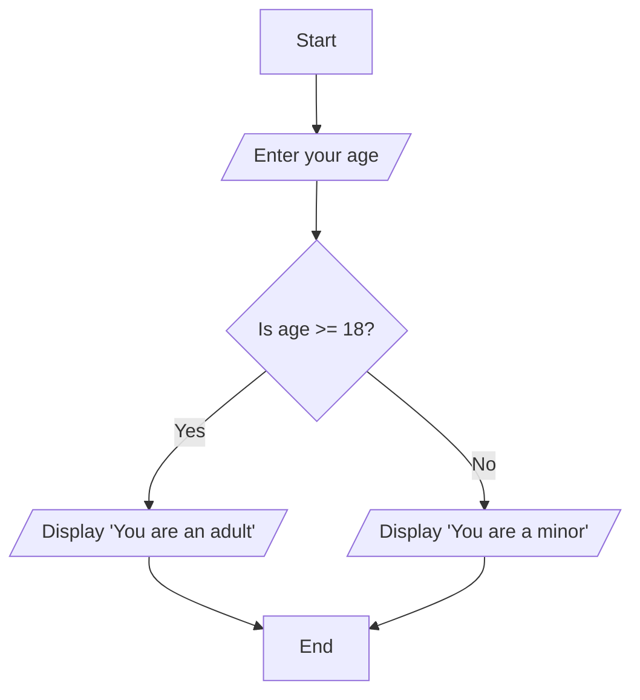

# Algorithmic Thinking with Python - Module 2: Algorithm and Pseudocode Representation

## Topic: Flowcharts - Visualizing the Algorithm

Welcome, everyone! In this module, we're diving deep into how we can represent algorithms – those step-by-step recipes for solving problems – in a clear, visual way. While pseudocode gives us a text-based description, today we're going to explore **flowcharts**. Think of flowcharts as the universal language of problem-solving blueprints. They allow us to map out the logic of a process, making it easy to understand, trace, and even communicate to others, whether they're programmers or not. This is crucial for our Course Outcome 1 (CO1), where we aim to utilize computing as a model for solving real-world problems, and for CO2, where articulating and modeling a problem is key.

### What Exactly is a Flowchart?

At its heart, a flowchart is a graphical representation of an algorithm or a process. It uses standardized symbols to depict different types of operations or steps, connected by arrows that show the direction of the flow of control. It’s like drawing a map of your thought process for solving a problem. Imagine you're giving directions to a friend to find your house – you wouldn't just list street names; you'd tell them when to turn, when to go straight, and when they've arrived. A flowchart does the same for a computer or for our own understanding.

George Pólya, in his seminal work "How to Solve It," emphasizes the importance of understanding the problem and devising a plan. Flowcharts are a fantastic tool for *devising that plan* visually, helping us break down complex problems into manageable steps, aligning perfectly with our goal of articulating problems before solving them (CO2).

### The Building Blocks: Flowchart Symbols

To create a meaningful flowchart, we need a common set of symbols. These symbols aren't arbitrary; they represent specific types of actions or decisions within an algorithm. Let's walk through the essential ones you'll be using:

#### 1. The Start and End Symbols (Terminators)

Every journey needs a beginning and an end, right? In flowcharts, we use the **oval** or **rounded rectangle** shape for this.

*   **Start Symbol:** This marks the very beginning of your algorithm or process. It's where the computation or task kicks off.
*   **End Symbol:** This signifies the termination point of the algorithm. It’s where the process concludes, whether by successfully completing its task or by reaching a defined stopping condition.

**Think of it like this:** When you're baking a cake, the "Start" is when you decide to bake, gather ingredients. The "End" is when the delicious cake is out of the oven and ready to be eaten!

#### 2. The Process Symbol (Arithmetic Calculations & Assignment)

When we need to perform an action, like doing some math or assigning a value to a variable, we use a **rectangle**.

*   **Purpose:** This symbol represents a processing step. This could be an arithmetic calculation (like `sum = num1 + num2`), an assignment operation (like `age = 25`), or any other data manipulation.
*   **Connection to CO3:** This is where we translate our algorithmic steps into operations that a computer can eventually perform. Understanding how to represent calculations correctly is key to translating algorithms into executable programs.

**Example:** If we're calculating the area of a rectangle, a processing step might look like `area = length * width`. This action, this calculation, gets placed inside a rectangle.

#### 3. The Input/Output Symbol (Parallelogram)

We need ways for our algorithms to receive information (input) and to provide results (output). For this, we use a **parallelogram**.

*   **Input:** Represents data being entered into the system. This could be from a user typing on a keyboard, reading from a file, or any other source.
*   **Output:** Represents data being presented or displayed. This could be printing a result to the screen, writing to a file, or sending data to another system.

**Analogy:** Think of a vending machine. When you press buttons to select your drink and insert money, that's an **input** operation. When the drink and change come out, that's an **output** operation. Both are depicted by a parallelogram.

**Example:** `Read 'Enter your name'` (input) or `Display 'Hello, ' + name` (output).

#### 4. The Decision Symbol (Diamond)

This is where the "thinking" or "choice" happens in our algorithm. The **diamond** shape represents a decision point.

*   **Purpose:** It's used for conditional logic, where the flow of the algorithm can branch based on whether a condition is true or false. You'll typically see questions or comparisons inside the diamond, like `Is age >= 18?` or `Is temperature < 0?`.
*   **Flow:** From the diamond, there are usually two or more outgoing arrows, each labeled with the possible outcome of the decision (e.g., "Yes"/"True" and "No"/"False").

**Connection to CO3 & CO4:** Decision-making is fundamental to creating efficient algorithms. This symbol directly supports translating logic into executable programs and understanding problem-solving strategies. This is a concept that frequently appears in exams, testing your ability to correctly map conditional logic.

**Example:** Imagine deciding what to wear. The diamond might ask, "Is it raining?". If "Yes," you go down one path (grab an umbrella). If "No," you go down another (no umbrella needed).

#### 5. The Module Call Symbol (Rectangle with Double Vertical Lines)

As algorithms grow, we often break them down into smaller, reusable parts called modules or subroutines (like functions in Python). This symbol, a **rectangle with double vertical lines on the sides**, represents calling one of these modules.

*   **Purpose:** It indicates that a specific sub-process or function is executed at this point. The actual steps of the called module would be depicted in its own separate flowchart, or defined in code.

**Why use this?** It keeps our main flowcharts clean and manageable, promoting modularity, a core software engineering principle. This relates to CO3, as it helps in structuring and translating complex algorithms.

#### 6. The "For" Loop Symbol (Hexagon)

Loops are essential for repetition. While a general loop might use multiple symbols, a specific **"for" loop** (or sometimes other counted loops) is often represented by a **hexagon**.

*   **Purpose:** This symbol indicates a structured iteration where a block of code is executed a predetermined number of times. It typically contains information about the loop's initialization, condition, and increment/decrement.

**Example:** If you need to print numbers from 1 to 10, a "for" loop is perfect. The hexagon would represent that block of repetition.

#### 7. Flow-Lines (Arrows)

These are the connectors that show the direction of data or control flow.

*   **Purpose:** Arrows connect the different symbols, indicating the sequence of operations and the path the execution takes. They are crucial for understanding the flow of logic.
*   **Convention:** They generally flow from top to bottom and left to right, but can bend to connect symbols.

**Remember this:** Without flow-lines, a flowchart is just a collection of shapes! They are the veins that carry the logic.

#### 8. On-Page Connector (Small Circle)

Sometimes, a flowchart becomes too complex to fit neatly on a single page, or you might want to avoid long, crossing flow-lines. The **on-page connector** (a small circle) helps here.

*   **Purpose:** It’s used to connect different parts of the flowchart *on the same page*. You place a circle at the end of a flow-line, label it (e.g., with a letter or number), and then place another circle with the same label at the point where the flow should resume. The arrow then originates from the second circle.

**Think of it:** Like a quick jump within the same document, allowing you to tidy up your layout without losing the sequence.

#### 9. Off-Page Connector (Home Plate Shape)

When a flowchart is too large to fit on a single page, we use the **off-page connector**.

*   **Purpose:** This symbol (often shaped like a home plate in baseball) indicates that the flowchart continues on another page. You'll label it with the destination page number and potentially a connector symbol on that next page to show where it picks up.

**This is important for:** Managing large, complex processes and making them digestible. It shows how algorithms can be modular not just in terms of subroutines, but also in their documentation.

---

### Connecting Flowcharts to Course Outcomes

Let’s explicitly tie these symbols and concepts back to our course goals:

*   **CO1 (Utilize computing as a model for solving real-world problems):** Flowcharts provide a visual model of how a computer might solve a problem. By drawing a flowchart for a real-world scenario (like managing inventory, calculating a discount, or planning a route), you’re demonstrating how computing principles can be applied to tangible situations.
*   **CO2 (Articulate a problem before attempting to solve it and prepare a clear and accurate model to represent the problem):** The process of creating a flowchart *forces* you to articulate the problem and its solution. You have to think through inputs, outputs, processing steps, and decisions, leading to a clear, accurate, and visual model. It’s a fantastic way to prepare for coding.
*   **CO3 (Utilize effective algorithms to solve the formulated models and translate algorithms into executable programs):** Flowcharts are the direct graphical representation of an algorithm. Once you have a clear flowchart, translating it into Python code becomes much more straightforward. The symbols directly map to Python constructs: rectangles to assignments/operations, parallelograms to `input()` and `print()`, diamonds to `if/elif/else`, and hexagons (or similar logic) to `for` loops.
*   **CO4 (Interpret the problem-solving strategies, a systematic approach to solving computational problems, and essential Python programming skills):** By studying and creating flowcharts, you learn a systematic approach to breaking down problems. You understand the importance of sequence, decisions, and repetition – all fundamental programming concepts. This builds your overall computational thinking skills, which are the bedrock of programming. Maureen Sprankle and Jim Hubbard’s “Problem Solving & Programming Concepts” highlights the importance of such systematic approaches for beginners.

### Examples in Action: Making it Relatable

Let's illustrate with a couple of simple, everyday examples:

**Example 1: Deciding whether to carry an umbrella.**

Let's use our symbols!

1.  **Start** (Oval)
2.  **Input:** `Read 'Is it raining?' (Yes/No)` (Parallelogram)
3.  **Decision:** `Is it raining?` (Diamond)
    *   **Yes Path:**
        *   **Output:** `Display 'Take an umbrella'` (Parallelogram)
        *   Go to **End**
    *   **No Path:**
        *   **Output:** `Display 'No umbrella needed'` (Parallelogram)
        *   Go to **End**
4.  **End** (Oval)

See how the diamond forces a choice, and the arrows show where you go based on that choice? This is direct CO2 and CO3 in action.

**Example 2: Calculating the total cost of items with a discount.**

Suppose we want to calculate the total cost of items, with a 10% discount if the total is over $50.

1.  **Start** (Oval)
2.  **Input:** `Read 'Enter price of item 1'` (Parallelogram) -> Store in `price1`
3.  **Input:** `Read 'Enter price of item 2'` (Parallelogram) -> Store in `price2`
4.  **Process:** `total = price1 + price2` (Rectangle)
5.  **Decision:** `Is total > 50?` (Diamond)
    *   **Yes Path:**
        *   **Process:** `discount_amount = total * 0.10` (Rectangle)
        *   **Process:** `final_cost = total - discount_amount` (Rectangle)
        *   **Output:** `Display 'Your final cost is: ' + final_cost` (Parallelogram)
        *   Go to **End**
    *   **No Path:**
        *   **Output:** `Display 'Your final cost is: ' + total` (Parallelogram)
        *   Go to **End**
6.  **End** (Oval)

Here, we use multiple processing steps (rectangles) and a decision (diamond) to control the outcome. This perfectly illustrates how flowcharts map to algorithms needed for CO3.

### Common Pitfalls and Exam Tips

*   **Inconsistent Symbols:** Always use the correct symbol for the correct operation. Using a rectangle for input/output is a common mistake that will cost you points.
*   **Missing or Incorrect Flow-Lines:** Ensure every symbol is connected, and the arrows point in the correct direction.
*   **Unclear Labels:** Make sure the text inside your symbols is concise and clear. For decisions, label the outgoing paths (e.g., "True," "False," "Yes," "No").
*   **Infinite Loops:** Be careful with loop conditions. A loop that never terminates is a serious problem. Flowcharts help you visualize these conditions.
*   **Overly Complex Flowcharts:** If your flowchart is becoming a tangled mess, consider using on-page or off-page connectors, or perhaps breaking down the process into sub-modules (using the module call symbol). This relates to good algorithm design, as discussed in "Computational Thinking" by G. Venkatesh Madhavan Mukund.

**Exam Tip:** When asked to create a flowchart for a given problem, first jot down the pseudocode or a textual description. Then, systematically translate each part into the appropriate flowchart symbol. Always draw your Start and End symbols first, and then work your way through the logic.

---

### Summary and What to Remember

Flowcharts are powerful visual tools for understanding, designing, and communicating algorithms. They provide a standardized way to map out the steps involved in solving a problem, from simple calculations to complex decision-making and loops. Mastering these symbols and how they connect is fundamental to building a strong foundation in algorithmic thinking and preparing you for translating these logical steps into actual Python code. Remember that each symbol has a specific meaning, and the flow-lines guide you through the process. Practice creating flowcharts for everyday tasks, and you'll find your ability to think algorithmically will grow significantly.

---

## Sample Questions with Answers

**1. Conceptual Question:** Explain the purpose of the diamond-shaped symbol in a flowchart and relate it to a core programming concept.

**Answer:** The diamond-shaped symbol in a flowchart represents a **decision point**. Its purpose is to introduce conditional logic into an algorithm, allowing the flow of execution to branch based on whether a specific condition evaluates to true or false. This directly relates to the core programming concept of **selection** or **conditional execution**, typically implemented using `if`, `elif`, and `else` statements in languages like Python.

**2. Exam-Oriented Question:** Draw a flowchart for a program that asks the user for their age. If the age is 18 or greater, it should display "You are an adult." Otherwise, it should display "You are a minor."

**Answer:**

**Reasoning:**
*   **Start (Oval):** Initiates the process.
*   **Input (Parallelogram):** `/Enter your age/` represents getting the age from the user.
*   **Decision (Diamond):** `{Is age >= 18?}` poses the condition.
*   **Output (Parallelograms):** `/Display 'You are an adult'/` and `/Display 'You are a minor'/` show the respective messages based on the decision.
*   **Flow-Lines (Arrows):** Connect the symbols in sequence, with branches from the decision point.
*   **End (Oval):** Terminates the program.

**3. Conceptual Question:** What is the difference between an on-page connector and an off-page connector in a flowchart, and when would you use each?

**Answer:**
*   An **on-page connector** (typically a small circle) is used to link different parts of a flowchart that are on the *same page*. It helps to avoid cluttered or excessively long flow-lines by allowing you to "jump" from one point to another within the same diagram. You would use it when a process naturally splits and rejoins, or when you want to reorganize the layout for clarity without crossing lines.
*   An **off-page connector** (often shaped like a home plate) is used to indicate that the flowchart continues on a *different page*. You would use this when a flowchart is too large to fit comfortably on a single sheet, or when a sub-process is detailed on a separate, accompanying flowchart. It signals where the main flow is interrupted and where it picks up again.

**4. Exam-Oriented Question:** Identify the symbol used to represent a "for loop" in a flowchart and briefly explain its significance in algorithmic control flow.

**Answer:** The symbol commonly used to represent a "for loop" in a flowchart is a **hexagon**. Its significance in algorithmic control flow is that it signifies a **definite iteration** or a **counted loop**. This means a block of instructions will be executed a specific, predetermined number of times, controlled by an initialization, a condition, and an increment/decrement mechanism. This contrasts with other loops (like `while` loops) which might run based on a condition that could change dynamically throughout execution. The hexagon helps visualize this structured repetition, crucial for tasks like processing lists or performing an action a set number of times.

## Videos

| Resource Type | Recommended Video |
| :--- | :--- |
| ⚡ **Quick Concept** | [Watch Summary & Animations](https://www.youtube.com/watch?v=33vbFFFn04k) |
| 🎓 **Exam Deep Dive** | [Watch Comprehensive University Lecture](https://www.youtube.com/watch?v=M0mx8S05v60) |
| ✍️ **Problem Solving** | [Watch Solved Examples & Numericals](https://www.youtube.com/watch?v=APPIZ2S8YmY) |
