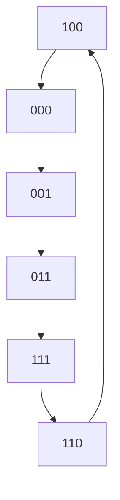

# Module 4: Sequential Logic Circuits - Shift Registers, Ring Counters, and Johnson Counters

Welcome back, everyone! In our journey through Digital Electronics, we’ve explored combinational circuits – those where the output depends solely on the current inputs. But the real magic of digital systems often lies in memory, in the ability to store information and have outputs that depend not just on the present inputs but also on past states. This is where **sequential logic circuits** come into play.

We've already touched upon the building blocks of sequential circuits: **flip-flops**. Remember, flip-flops are bistable multivibrators, meaning they have two stable states, and they can hold a single bit of information. Think of them as tiny memory cells.

Today, we’re going to dive deeper into a very important class of sequential circuits: **Shift Registers**, and then explore two fascinating types of counters derived from them: **Ring Counters** and **Johnson Counters**. These circuits are fundamental to many digital systems, from data transmission and storage to control sequences and timing.

## 1. Shift Registers: The Data Movers

Imagine you have a series of bits that you need to move from one position to another, one step at a time, or maybe all at once. That’s precisely what a shift register does! At its core, a shift register is a cascade of flip-flops, typically D flip-flops or JK flip-flops, where the output of one flip-flop is connected to the input of the next.

### 1.1 The Basic Idea: Shifting Bits

Let's visualize this. If you have four D flip-flops, each triggered by the same clock pulse, you can set up a simple shift register. On each clock pulse, the data present at the input of the first flip-flop is shifted into it. Simultaneously, the data stored in the first flip-flop is transferred to the second, the data in the second to the third, and so on.

**Think of it like a conga line:** On each beat (the clock pulse), everyone takes one step forward, and the person at the front of the line gets a new dancer joining them. The person at the very end of the line leaves. This is a **serial-in, serial-out (SISO)** shift register.

This is a core concept that connects to **CO4: Describe the operation of different flip-flops and implement basic sequential circuits.** We're using flip-flops as the fundamental memory elements and arranging them in a specific sequential manner.

### 1.2 Types of Shift Registers: How Data Enters and Exits

Shift registers are classified based on how data is entered into them and how it's read out.

*   **Serial-In, Serial-Out (SISO):** As we discussed, data enters one bit at a time at the input and exits one bit at a time from the output of the last flip-flop. Great for delaying data or simple serial data transmission.

*   **Serial-In, Parallel-Out (SIPO):** Data enters serially, bit by bit, but all the stored bits can be read out simultaneously from the output of each flip-flop. This is incredibly useful for converting serial data (like from a keyboard or a communication line) into parallel data that a processor can handle more easily. Imagine receiving a whole word character by character, and then being able to read the entire word at once. This is the magic of SIPO.

*   **Parallel-In, Serial-Out (PISO):** This is the reverse of SIPO. You can load all the bits into the register simultaneously at different input lines, and then shift them out one by one, serially. This is how data might be read from parallel memory interfaces and sent out over a serial communication link.

*   **Parallel-In, Parallel-Out (PIPO):** Data can be loaded into the register simultaneously at parallel inputs, and all bits can also be read out simultaneously from parallel outputs. These are often used for temporary storage of parallel data or for very fast data transfer where no shifting is required.

This classification directly relates to the practical applications of these circuits, helping us understand their utility in data handling.

### 1.3 Shift Registers with Parallel Load/Shift Capability

Now, what if we want the flexibility to either load data serially or in parallel, and then shift it? This is where registers with **parallel load/shift** capabilities shine. These are incredibly versatile.

**How do they work?** They use a control signal, often called a **Mode** or **Shift/Load** control.
*   When the control signal is in one state (e.g., '0'), the register behaves as a normal shift register, with data flowing from one flip-flop to the next on each clock pulse.
*   When the control signal is in the other state (e.g., '1'), the parallel inputs are enabled, and the data from these parallel inputs is loaded directly into the flip-flops, overriding the serial shifting action.

To implement this, we often use D flip-flops. The data input to each D flip-flop is a multiplexer (MUX). This MUX selects between the output of the previous flip-flop (for shifting) and the parallel data input line. The control signal dictates which input the MUX selects.

**Let's consider a 4-bit shift register with parallel load:**

*   Each flip-flop (Q0, Q1, Q2, Q3) has a D input.
*   The D input of FF0 is connected to the serial input (SI) or a parallel input (PI0).
*   The D input of FF1 is connected to the output of FF0 (Q0) or a parallel input (PI1).
*   The D input of FF2 is connected to the output of FF1 (Q1) or a parallel input (PI2).
*   The D input of FF3 is connected to the output of FF2 (Q2) or a parallel input (PI3).

We use 2-to-1 multiplexers for each D input (except possibly the first one). If the mode control is '0' (shift), the MUX selects the output of the previous flip-flop. If the mode control is '1' (load), the MUX selects the corresponding parallel input.

**Analogy:** Imagine you have a line of friends holding hands (the shift register). Normally, if one friend wants to pass a message, they whisper it down the line. But if you want to give everyone a new instruction at once, you can just tell each friend individually, and they immediately adopt the new instruction. The "tell individually" action is the parallel load.

This type of register is extremely powerful. It directly supports **CO3: Implement combinational logic circuits for data processing and manipulation.** The multiplexers, which are combinational logic, are integrated with the sequential flip-flops to provide conditional data transfer. This is a great example of how sequential and combinational logic are combined.

**Example Application:** Imagine a system that needs to process data coming in a stream (serial), but occasionally needs to quickly load a pre-defined configuration or status word (parallel). A shift register with parallel load is perfect for this. For instance, in a digital signal processing system, you might receive audio samples serially. However, you might have a control register that needs to be updated with parameters like filter coefficients. You'd load these coefficients in parallel.

## 2. Ring Counter: The Cyclic Shifter

Now, let's take our shift register concept and make it *count*. A **Ring Counter** is a special type of shift register where the output of the last flip-flop is fed back to the input of the first flip-flop.

### 2.1 How it Works: A '1' That Travels

Let's use a 4-bit shift register (made of D flip-flops) again.

1.  **Initialization:** For a ring counter to work, we usually start by loading a single '1' into the first flip-flop and '0's into the rest. So, the state might be `1000`.
2.  **Clock Pulse 1:** On the first clock pulse, the '1' at the input of FF0 gets stored in FF0. The data in FF0 (which is '1') shifts to FF1. The data in FF1 ('0') shifts to FF2, and so on. The '0' from FF3 is fed back to the input of FF0. The state becomes `0100`.
3.  **Clock Pulse 2:** The '0' from FF3 feeds into FF0. FF0 now stores '0'. The '1' from FF0 shifts to FF1. FF1 stores '1'. The '0' from FF1 shifts to FF2. FF2 stores '0'. The '0' from FF2 shifts to FF3. FF3 stores '0'. The state becomes `0010`.
4.  **Clock Pulse 3:** The state becomes `0001`.
5.  **Clock Pulse 4:** The '1' from FF3 is fed back to the input of FF0. The state becomes `1000`.

And the cycle repeats! The single '1' effectively travels around the ring of flip-flops. A ring counter with 'n' flip-flops will have 'n' unique states.

**Analogy:** Imagine you have a circular train track with four stations. At station 1, you have a single passenger. On each "station stop" (clock pulse), the passenger moves to the next station. The passenger from station 4 gets off and a new passenger enters station 1. This continues until the original passenger is back at station 1.

**Connection to Course Outcomes:** This clearly demonstrates **CO4** again, as we're using flip-flops in a specific sequential arrangement to create a counter. The repeating sequence of states is a fundamental characteristic of sequential circuits.

**Key Points about Ring Counters:**
*   **Number of States:** An n-bit ring counter has exactly 'n' distinct states.
*   **Sequence:** The sequence is a single bit circulating.
*   **Asynchronous Inputs:** Be careful with asynchronous preset/clear inputs. If you initialize it to `0000`, it will stay `0000` because no '1' is circulating. Proper initialization is crucial.
*   **Decoders:** A ring counter can be used with decoders to generate unique timing signals for each stage. For example, with a 4-bit ring counter, you can generate four distinct output pulses, one for each state of the counter. This is very useful for controlling sequential operations.

**Example Application:** Think of a simple traffic light controller. You might have four phases: Red, Red-Yellow, Green, Yellow. A 4-bit ring counter could drive these phases. Each flip-flop's output, when decoded, could activate a specific light sequence.

## 3. Johnson Counter (Twisted Ring Counter): The Traveling Pair

The Ring Counter is simple but has a limited number of states (equal to the number of flip-flops). What if we want more states from the same number of flip-flops? We can use a **Johnson Counter**, also known as a **Twisted Ring Counter**.

### 3.1 How it Works: The Twisted Feedback

A Johnson counter is also a shift register, but with a crucial difference in how the feedback is connected. The output of the *last* flip-flop is **inverted** and then fed back to the input of the *first* flip-flop.

Let's use our 4-bit shift register.

1.  **Initialization:** We usually load all '0's. So, the state is `0000`.
2.  **Clock Pulse 1:** The input to FF0 is the inverted output of FF3. Since FF3's output is '0', its inverse is '1'. So, FF0 gets '1'. Data shifts: FF0's '0' goes to FF1, FF1's '0' to FF2, FF2's '0' to FF3. State becomes `1000`.
3.  **Clock Pulse 2:** The input to FF0 is the inverted output of FF3, which is still '0'. So, FF0 stores '0'. The '1' from FF0 shifts to FF1. FF1 stores '1'. The '0's from FF1 and FF2 shift to FF2 and FF3 respectively. State becomes `0100`.
4.  **Clock Pulse 3:** The input to FF0 is inverted output of FF3 ('0'). So, FF0 stores '0'. The '1' from FF1 shifts to FF2. FF2 stores '1'. State becomes `0010`.
5.  **Clock Pulse 4:** The input to FF0 is inverted output of FF3 ('0'). So, FF0 stores '0'. The '1' from FF2 shifts to FF3. FF3 stores '1'. State becomes `0001`.
6.  **Clock Pulse 5:** The input to FF0 is the inverted output of FF3. Now, FF3's output is '1', so its inverse is '0'. FF0 stores '0'. The '1' from FF3 shifts to FF0. FF0 stores '1'. Wait, I made a mistake in tracing the feedback. Let's retrace carefully.

**Let's trace a 4-bit Johnson Counter carefully:**

*   **Initial State:** Assume all flip-flops (FF3, FF2, FF1, FF0) are cleared to 0. Let the output of FF3 be Q3, FF2 be Q2, FF1 be Q1, FF0 be Q0. The input to FF0 is `NOT(Q3)`.

*   **Clock 1:**
    *   Input to FF0 = `NOT(Q3)` = `NOT(0)` = `1`.
    *   D0 = `1`.
    *   Shift: D1 = Q0, D2 = Q1, D3 = Q2.
    *   **After Clock 1:** `Q3 Q2 Q1 Q0` becomes `0 0 0 1`. (Q3 takes input of FF0, which was 1. Q2 takes Q1, Q1 takes Q0, Q0 takes previous Q0 value, which was 0. Oops, this is still wrong. D input of FF0 receives NOT(Q3). The output of FF0 becomes the new Q0. The output of FF1 becomes the new Q1, and so on.)

Let's be super clear. The flip-flops are clocked simultaneously. The new values are determined by the D inputs *before* the clock edge.

*   **Register: D3 D2 D1 D0**
*   **Flip-flops: FF3 FF2 FF1 FF0**
*   **Outputs: Q3 Q2 Q1 Q0**
*   **Inputs to D:**
    *   `D0 = NOT(Q3)` (This is the twisted feedback)
    *   `D1 = Q0` (Shift from FF0)
    *   `D2 = Q1` (Shift from FF1)
    *   `D3 = Q2` (Shift from FF2)

**Initial State:** `Q3 Q2 Q1 Q0 = 0000`

*   **Before Clock 1:**
    *   `D0 = NOT(Q3) = NOT(0) = 1`
    *   `D1 = Q0 = 0`
    *   `D2 = Q1 = 0`
    *   `D3 = Q2 = 0`

*   **After Clock 1:** `Q3 Q2 Q1 Q0 = 0001` (FF0 stored `D0=1`, FF1 stored `D1=0`, FF2 stored `D2=0`, FF3 stored `D3=0`. **Wait, this is wrong again.** The outputs of the flip-flops are Q3, Q2, Q1, Q0. The D inputs are connected as described. The *new* state is what matters. Let's denote the state *after* clocking as `Q3' Q2' Q1' Q0'`).

Let's use a simpler notation: `Current State (Q3 Q2 Q1 Q0) -> Next State (Q3' Q2' Q1' Q0')`

*   **Initial State:** `0000`
*   **Before Clock 1:**
    *   `D0 = NOT(Q3) = NOT(0) = 1`
    *   `D1 = Q0 = 0`
    *   `D2 = Q1 = 0`
    *   `D3 = Q2 = 0`
*   **After Clock 1:**
    *   `Q0' = D0 = 1`
    *   `Q1' = D1 = 0`
    *   `Q2' = D2 = 0`
    *   `Q3' = D3 = 0`
    *   **State:** `0001`

*   **Before Clock 2:** (Current state is `0001`)
    *   `Q3=0, Q2=0, Q1=0, Q0=1`
    *   `D0 = NOT(Q3) = NOT(0) = 1`
    *   `D1 = Q0 = 1`
    *   `D2 = Q1 = 0`
    *   `D3 = Q2 = 0`
*   **After Clock 2:**
    *   `Q0' = D0 = 1`
    *   `Q1' = D1 = 1`
    *   `Q2' = D2 = 0`
    *   `Q3' = D3 = 0`
    *   **State:** `0011`

*   **Before Clock 3:** (Current state is `0011`)
    *   `Q3=0, Q2=0, Q1=1, Q0=1`
    *   `D0 = NOT(Q3) = NOT(0) = 1`
    *   `D1 = Q0 = 1`
    *   `D2 = Q1 = 1`
    *   `D3 = Q2 = 0`
*   **After Clock 3:**
    *   `Q0' = D0 = 1`
    *   `Q1' = D1 = 1`
    *   `Q2' = D2 = 1`
    *   `Q3' = D3 = 0`
    *   **State:** `0111`

*   **Before Clock 4:** (Current state is `0111`)
    *   `Q3=0, Q2=1, Q1=1, Q0=1`
    *   `D0 = NOT(Q3) = NOT(0) = 1`
    *   `D1 = Q0 = 1`
    *   `D2 = Q1 = 1`
    *   `D3 = Q2 = 1`
*   **After Clock 4:**
    *   `Q0' = D0 = 1`
    *   `Q1' = D1 = 1`
    *   `Q2' = D2 = 1`
    *   `Q3' = D3 = 1`
    *   **State:** `1111`

*   **Before Clock 5:** (Current state is `1111`)
    *   `Q3=1, Q2=1, Q1=1, Q0=1`
    *   `D0 = NOT(Q3) = NOT(1) = 0`
    *   `D1 = Q0 = 1`
    *   `D2 = Q1 = 1`
    *   `D3 = Q2 = 1`
*   **After Clock 5:**
    *   `Q0' = D0 = 0`
    *   `Q1' = D1 = 1`
    *   `Q2' = D2 = 1`
    *   `Q3' = D3 = 1`
    *   **State:** `1110`

*   **Before Clock 6:** (Current state is `1110`)
    *   `Q3=1, Q2=1, Q1=1, Q0=0`
    *   `D0 = NOT(Q3) = NOT(1) = 0`
    *   `D1 = Q0 = 0`
    *   `D2 = Q1 = 1`
    *   `D3 = Q2 = 1`
*   **After Clock 6:**
    *   `Q0' = D0 = 0`
    *   `Q1' = D1 = 0`
    *   `Q2' = D2 = 1`
    *   `Q3' = D3 = 1`
    *   **State:** `1100`

*   **Before Clock 7:** (Current state is `1100`)
    *   `Q3=1, Q2=1, Q1=0, Q0=0`
    *   `D0 = NOT(Q3) = NOT(1) = 0`
    *   `D1 = Q0 = 0`
    *   `D2 = Q1 = 0`
    *   `D3 = Q2 = 1`
*   **After Clock 7:**
    *   `Q0' = D0 = 0`
    *   `Q1' = D1 = 0`
    *   `Q2' = D2 = 0`
    *   `Q3' = D3 = 1`
    *   **State:** `1000`

*   **Before Clock 8:** (Current state is `1000`)
    *   `Q3=1, Q2=0, Q1=0, Q0=0`
    *   `D0 = NOT(Q3) = NOT(1) = 0`
    *   `D1 = Q0 = 0`
    *   `D2 = Q1 = 0`
    *   `D3 = Q2 = 0`
*   **After Clock 8:**
    *   `Q0' = D0 = 0`
    *   `Q1' = D1 = 0`
    *   `Q2' = D2 = 0`
    *   `Q3' = D3 = 0`
    *   **State:** `0000` - We are back to the initial state!

The sequence is: `0000 -> 0001 -> 0011 -> 0111 -> 1111 -> 1110 -> 1100 -> 1000 -> 0000`.

**Key Observations for Johnson Counter:**
*   **Number of States:** An n-bit Johnson counter has **2n** distinct states. This is twice the number of states of a ring counter with the same number of flip-flops.
*   **Sequence:** The sequence starts with all zeros. Then, a string of ones propagates from the input. Once all flip-flops are filled with ones, a string of zeros starts propagating from the input (due to the inverted feedback).
*   **Special Initialization:** If you start with `0000`, you get `2n` states. If you start with all ones, you get a different sequence. If you start with a mixed pattern, you might get a shorter cycle or get "stuck" in a state if not properly designed.
*   **Decoding:** Decoding a Johnson counter is simpler than a standard ring counter. For example, to get a pulse for the state `1111`, you just need to AND all the flip-flop outputs. To get a pulse for `0000`, you AND the inverted outputs of all flip-flops.

**Analogy:** Imagine the conga line again. In a ring counter, the person at the end simply leaves, and a new person joins the front. In a Johnson counter, the person at the end turns around (inverts their state/direction), and then they join the front of the line. This "twisting" creates a different pattern of movement.

**Example Application:** Johnson counters are good for applications needing a larger number of sequential states from a minimal number of flip-flops, like generating multiple timing signals or for simple frequency division. They are also used in digital-to-analog converters (DACs) where a binary-weighted resistor ladder is used.

### 3.2 Relationship to Course Outcomes:

Both Ring and Johnson counters are excellent examples of **CO4: Describe the operation of different flip-flops and implement basic sequential circuits.** They show how simple flip-flops, when interconnected in specific ways (serial shift with normal feedback for Ring, and serial shift with inverted feedback for Johnson), create complex sequential behaviors like counting.

These circuits also tie into **CO3: Implement combinational logic circuits for data processing and manipulation.** For example, the inverters used in the Johnson counter are combinational logic gates, and if we were to use decoders to identify specific states of these counters, those decoders would also be combinational circuits.

### 3.3 Important Considerations for Exams:

*   **State Diagrams:** Be prepared to draw state diagrams for Ring and Johnson counters. This is a common exam question. You show the sequence of states and the transitions.
*   **Truth Tables/Sequence Tables:** Listing out the sequence of states for a given number of flip-flops is also frequent. Pay close attention to the initialization and the exact feedback mechanism.
*   **Number of States:** Know that an n-bit ring counter has 'n' states and an n-bit Johnson counter has '2n' states. This is a quick recall point.
*   **Initialization:** Remember that proper initialization is critical for these counters to function as expected. A ring counter initialized to all zeros will remain in the all-zero state.
*   **Decoding:** Understand how to decode specific states of these counters. For example, to detect state `1000` in a 4-bit ring counter, you need a gate that is `Q3 AND NOT(Q2) AND NOT(Q1) AND NOT(Q0)`. For a Johnson counter, detecting `1111` is just `Q3 AND Q2 AND Q1 AND Q0`.

**Recap:**
*   **Shift Registers:** Move bits serially or in parallel. Key types: SISO, SIPO, PISO, PIPO. Parallel load capability adds immense flexibility.
*   **Ring Counter:** A shift register with the last output fed back to the first. Circulates a single '1'. Has 'n' states for 'n' flip-flops.
*   **Johnson Counter:** A shift register with the *inverted* last output fed back to the first. Circulates a pattern of ones and zeros. Has '2n' states for 'n' flip-flops.

These circuits are foundational. Mastering their operation will give you a strong grasp of how sequential logic controls the flow and manipulation of data in digital systems.

## Sample Questions and Answers

**Question 1:** What is the primary difference in the feedback connection between a Ring Counter and a Johnson Counter?
**Answer:** In a Ring Counter, the output of the last flip-flop is fed directly back to the input of the first flip-flop. In a Johnson Counter, the output of the last flip-flop is *inverted* before being fed back to the input of the first flip-flop.

**Question 2:** An 8-bit Ring Counter has how many unique states in its cycle?
**Answer:** An n-bit Ring Counter has 'n' unique states. Therefore, an 8-bit Ring Counter has 8 unique states. The sequence is generated by circulating a single '1' through the 8 flip-flops.

**Question 3:** Explain the advantages of a Johnson Counter over a Ring Counter.
**Answer:** The main advantage of a Johnson Counter is that it can achieve twice the number of states as a Ring Counter using the same number of flip-flops. For an n-bit counter:
*   Ring Counter: 'n' states
*   Johnson Counter: '2n' states
This means that for a required number of states, a Johnson counter can be implemented with fewer flip-flops, leading to potential cost and complexity savings.

**Question 4:** A 4-bit shift register with parallel load capability is controlled by a signal 'Mode'. If 'Mode' is '0', it shifts. If 'Mode' is '1', it loads parallel data. Describe how the D inputs of the flip-flops would be configured.
**Answer:**
Let the flip-flops be FF3, FF2, FF1, FF0, with outputs Q3, Q2, Q1, Q0 respectively, and serial input SI. Let the parallel inputs be PI3, PI2, PI1, PI0.
*   **FF0:** The D input of FF0 (D0) would be connected to a 2-to-1 multiplexer. The MUX would select between SI (if Mode = 0) and PI0 (if Mode = 1).
*   **FF1:** The D input of FF1 (D1) would be connected to a 2-to-1 multiplexer. The MUX would select between Q0 (output of FF0, for shifting, if Mode = 0) and PI1 (if Mode = 1).
*   **FF2:** The D input of FF2 (D2) would be connected to a 2-to-1 multiplexer. The MUX would select between Q1 (output of FF1, for shifting, if Mode = 0) and PI2 (if Mode = 1).
*   **FF3:** The D input of FF3 (D3) would be connected to a 2-to-1 multiplexer. The MUX would select between Q2 (output of FF2, for shifting, if Mode = 0) and PI3 (if Mode = 1).
The 'Mode' signal acts as the select line for all these multiplexers.

**Question 5:** Draw the state transition diagram for a 3-bit Johnson Counter, assuming initialization to `000`.
**Answer:**
A 3-bit Johnson Counter has 2 * 3 = 6 states.
Let the states be represented by `Q2 Q1 Q0`.
The feedback is `D0 = NOT(Q2)`.
The shifts are `D1 = Q0`, `D2 = Q1`.

*   **Initial State:** `000`
*   **Before Clock 1:** `D0 = NOT(0) = 1`, `D1 = 0`, `D2 = 0`.
*   **After Clock 1:** `Q2' Q1' Q0' = 001`. State: `001`.
*   **Before Clock 2:** `Q2=0, Q1=0, Q0=1`. `D0 = NOT(0) = 1`, `D1 = 1`, `D2 = 0`.
*   **After Clock 2:** `Q2' Q1' Q0' = 011`. State: `011`.
*   **Before Clock 3:** `Q2=0, Q1=1, Q0=1`. `D0 = NOT(0) = 1`, `D1 = 1`, `D2 = 1`.
*   **After Clock 3:** `Q2' Q1' Q0' = 111`. State: `111`.
*   **Before Clock 4:** `Q2=1, Q1=1, Q0=1`. `D0 = NOT(1) = 0`, `D1 = 1`, `D2 = 1`.
*   **After Clock 4:** `Q2' Q1' Q0' = 110`. State: `110`.
*   **Before Clock 5:** `Q2=1, Q1=1, Q0=0`. `D0 = NOT(1) = 0`, `D1 = 0`, `D2 = 1`.
*   **After Clock 5:** `Q2' Q1' Q0' = 100`. State: `100`.
*   **Before Clock 6:** `Q2=1, Q1=0, Q0=0`. `D0 = NOT(1) = 0`, `D1 = 0`, `D2 = 0`.
*   **After Clock 6:** `Q2' Q1' Q0' = 000`. State: `000`. (Cycle repeats)

**State Diagram:**
(000) --1--> (001) --1--> (011) --1--> (111) --1--> (110) --1--> (100) --1--> (000)
*(Numbers on arrows indicate the clock pulse number)*

*(Note: Mermaid syntax might not render perfectly in all viewers, but this shows the circular path of states.)*

## Videos

| Resource Type | Recommended Video |
| :--- | :--- |
| ⚡ **Quick Concept** | [Watch Summary & Animations](https://www.youtube.com/watch?v=mc979OhitAg) |
| 🎓 **Exam Deep Dive** | [Watch Comprehensive University Lecture](https://www.youtube.com/watch?v=Q-tL8_628gE) |
| ✍️ **Problem Solving** | [Watch Solved Examples & Numericals](https://www.youtube.com/watch?v=p6Q9_e7_L1w) |
