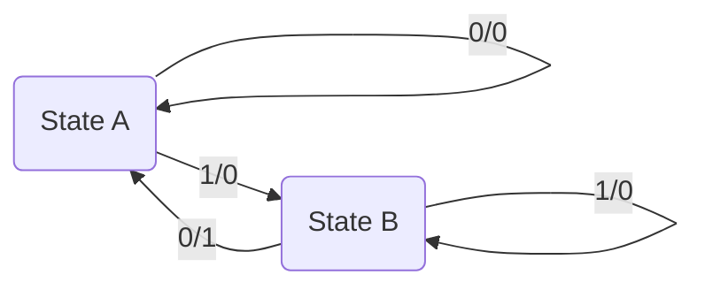
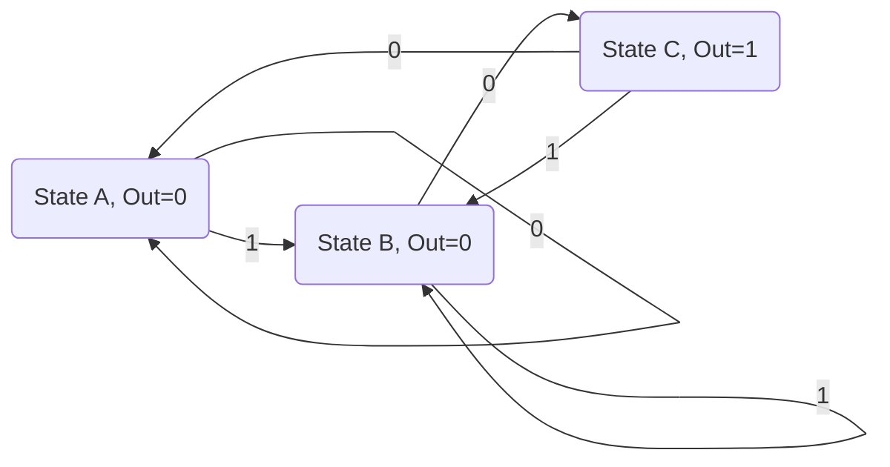
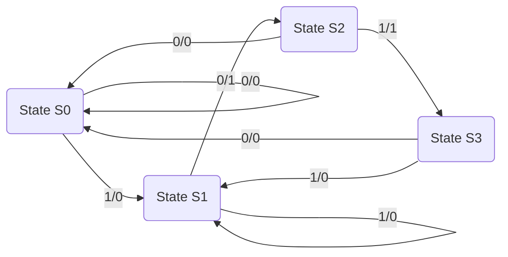

# LOGIC CIRCUIT DESIGN - Module 4: Finite State Machines

## Topic: Finite State Machines - Mealy and Moore Models, State Graphs, State Assignment, State Table, State Reduction

---

### 1. Introduction to Finite State Machines (FSMs)

**Learning Outcome:** Understand the fundamental concepts and terminology associated with Finite State Machines.

**Key Concepts:**

*   **State:** A specific condition or configuration of a sequential logic circuit. The state represents the memory of the circuit's past inputs and determines its future behavior.
*   **Input:** External signals that affect the behavior of the FSM.
*   **Output:** Signals generated by the FSM based on its current state and/or current inputs.
*   **Transition:** A change from one state to another, triggered by specific input conditions.
*   **Alphabet:** The set of all possible input symbols.
*   **State Alphabet:** The set of all possible states.
*   **Output Alphabet:** The set of all possible output symbols.

**Definition:** A Finite State Machine (FSM) is a mathematical model of computation. It consists of a finite number of states, a set of inputs, a set of outputs, and a transition function that dictates how the machine moves from one state to another based on the inputs. FSMs are crucial for designing sequential logic circuits, which have memory and their output depends not only on the current input but also on the past sequence of inputs.

**Reference:**
*   **Floyd, Digital Fundamentals (11th Ed.):** Chapter 12, "State Machines and Related Devices." Floyd introduces FSMs as abstract machines that change their state in response to inputs, emphasizing their role in sequential logic.
*   **Brown, Fundamentals of Digital Logic with Verilog Design (2nd Ed.):** Chapter 9, "Finite State Machines." Brown provides a rigorous introduction to FSMs, their mathematical foundations, and their implementation using Verilog.

---

### 2. Mealy and Moore Models of FSMs

**Learning Outcome:** Differentiate between Mealy and Moore FSM models and understand their characteristic differences in output generation.

**Key Concepts:**

*   **Mealy Model:** The output of a Mealy machine is a function of **both the current state and the current input**.
*   **Moore Model:** The output of a Moore machine is a function of **only the current state**.

**Mealy Model:**

*   **Characteristics:**
    *   Outputs are associated with the transitions between states.
    *   Can produce outputs faster than Moore machines as outputs can change as soon as the input changes (without waiting for the next clock edge if designed that way).
    *   May require fewer states than a Moore machine for the same functionality.
    *   Outputs can be "glitchy" or unstable if they depend directly on input changes.

*   **Representation:**
    *   Output is shown on the transition arcs in state diagrams.
    *   State table has output columns associated with each input combination for a given state.

**Moore Model:**

*   **Characteristics:**
    *   Outputs are associated with the states themselves.
    *   Outputs are stable and only change when the machine transitions to a new state.
    *   Often requires more states than a Mealy machine for the same functionality.
    *   Outputs are synchronized with the clock (in synchronous implementations).

*   **Representation:**
    *   Output is shown within the state circles in state diagrams.
    *   State table has output columns associated with each state, independent of input.

**Comparison:**

| Feature        | Mealy Model                               | Moore Model                               |
| :------------- | :---------------------------------------- | :---------------------------------------- |
| Output depends on | Current state and current input           | Only current state                        |
| Output timing  | Changes with input changes (potentially)  | Changes only on state transition          |
| State count    | Potentially fewer states                  | Potentially more states                   |
| Output stability | Can be less stable ("glitchy")            | More stable                               |
| Design focus   | Transition-oriented                       | State-oriented                            |

**Example:** Consider a circuit that outputs '1' only when the input sequence "10" occurs.

*   **Mealy Machine:**
    *   State A: Initial state. If input is '1', go to State B. If input is '0', stay in State A.
    *   State B: Received '1'. If input is '0', output '1' and go to State A. If input is '1', stay in State B.
    *   *Output '1' is on the transition from B to A on input '0'.*

*   **Moore Machine:**
    *   State A: Initial state. Output '0'. If input is '1', go to State B. If input is '0', stay in State A.
    *   State B: Received '1'. Output '0'. If input is '0', go to State C. If input is '1', stay in State B.
    *   State C: Received "10". Output '1'. If input is '0', go to State A. If input is '1', go to State B.
    *   *Output '1' is associated with State C.*

**Reference:**
*   **Floyd, Digital Fundamentals (11th Ed.):** Chapter 12, discusses both Mealy and Moore machines with illustrative examples of their differences.
*   **Mano & Ciletti, Digital Design (6th Ed.):** Chapter 7, "Sequential Logic Design." Provides a detailed explanation of Mealy and Moore models, including their formal definitions and state diagram representations.

---

### 3. State Graphs (State Diagrams)

**Learning Outcome:** Represent the behavior of an FSM using state graphs (state diagrams).

**Key Concepts:**

*   **States:** Represented by circles or nodes.
*   **Transitions:** Represented by directed arrows between states.
*   **Input-Output Pairs:** Labeled on the transition arrows.
    *   **Mealy:** `Input / Output`
    *   **Moore:** `Input (Output)` - where the output is the output associated with the destination state.

**Definition:** A state graph (or state diagram) is a graphical representation of an FSM. It visually depicts the states of the machine and the transitions between these states, along with the input conditions that cause these transitions and the corresponding outputs.

**Construction of a State Graph:**

1.  **Identify States:** Determine all possible states the machine can be in.
2.  **Identify Transitions:** For each state, determine how the machine transitions to another state (or stays in the same state) for each possible input.
3.  **Associate Outputs:** Determine the output associated with each transition (Mealy) or each state (Moore).

**Example (Continuing the "10" sequence detector):**

**Mealy State Diagram:**

*   `A --0/0--> A`: In State A, if input is 0, stay in A and output 0.
*   `A --1/0--> B`: In State A, if input is 1, go to State B and output 0.
*   `B --0/1--> A`: In State B, if input is 0, go to State A and output 1 (sequence detected).
*   `B --1/0--> B`: In State B, if input is 1, stay in State B and output 0.

**Moore State Diagram:**

*   `A (Out=0) --0--> A`: In State A (output 0), if input is 0, stay in A.
*   `A (Out=0) --1--> B (Out=0)`: In State A (output 0), if input is 1, go to State B (output 0).
*   `B (Out=0) --0--> C (Out=1)`: In State B (output 0), if input is 0, go to State C (output 1).
*   `B (Out=0) --1--> B (Out=0)`: In State B (output 0), if input is 1, stay in State B (output 0).
*   `C (Out=1) --0--> A (Out=0)`: In State C (output 1), if input is 0, go to State A (output 0).
*   `C (Out=1) --1--> B (Out=0)`: In State C (output 1), if input is 1, go to State B (output 0).

**Reference:**
*   **LaMeres, Introduction to Logic Circuits & Logic Design with Verilog (2nd Ed.):** Chapter 8, "State Machines." LaMeres provides a clear explanation of state diagrams as the primary tool for visualizing FSM behavior.
*   **Hall, Digital Circuits and Systems:** Chapter 10, "Sequential Circuits." Hall covers state diagrams as a fundamental tool for analyzing and designing sequential circuits.

---

### 4. State Table

**Learning Outcome:** Create and interpret state tables for FSMs from their state graphs.

**Key Concepts:**

*   **Present State:** The current state of the FSM.
*   **Input:** The current input value(s).
*   **Next State:** The state the FSM will transition to based on the present state and input.
*   **Output:** The output generated by the FSM.

**Definition:** A state table is a tabular representation of an FSM that lists all possible combinations of present states and inputs, along with the corresponding next states and outputs.

**Construction of a State Table (from State Graph):**

1.  **List States:** Enumerate all states.
2.  **List Inputs:** Enumerate all possible input combinations.
3.  **Fill Entries:** For each Present State and Input combination, determine the Next State and Output based on the state graph transitions.

**Example (Continuing the "10" sequence detector):**

**Mealy State Table:**

| Present State | Input (X) | Next State | Output (Y) |
| :------------ | :-------- | :--------- | :--------- |
| A             | 0         | A          | 0          |
| A             | 1         | B          | 0          |
| B             | 0         | A          | 1          |
| B             | 1         | B          | 0          |

**Moore State Table:**

| Present State | Input (X) | Next State | Output |
| :------------ | :-------- | :--------- | :----- |
| A             | 0         | A          | 0      |
| A             | 0         | B          | 0      |
| B             | 0         | C          | 0      |
| B             | 1         | B          | 0      |
| C             | 0         | A          | 1      |
| C             | 1         | B          | 1      |

*Note: In the Moore table, the 'Output' column is often shown separately or associated with the 'Present State' column, as it's solely dependent on the state.*

**Reference:**
*   **Floyd, Digital Fundamentals (11th Ed.):** Chapter 12 provides examples of state tables and how they are derived from state diagrams.
*   **Brown, Fundamentals of Digital Logic with Verilog Design (2nd Ed.):** Chapter 9 explains state tables as the bridge between state diagrams and the implementation of FSMs.

---

### 5. State Reduction

**Learning Outcome:** Apply state reduction techniques to minimize the number of states in an FSM.

**Key Concepts:**

*   **Equivalent States:** Two states are equivalent if, for every possible sequence of inputs, they produce the same output sequence and transition to equivalent states.
*   **State Minimization/Reduction:** The process of finding an equivalent FSM with the minimum number of states. This leads to simpler and more efficient hardware implementation.

**Methods for State Reduction:**

1.  **Implication Table Method:**
    *   **Initialization:** Mark pairs of states as equivalent if they have the same output for all input conditions.
    *   **Iteration:** Iteratively mark pairs of states (Si, Sj) as *not* equivalent if they transition to states (Sk, Sl) that have already been marked as *not* equivalent.
    *   **Grouping:** States that remain unmarked after the process are equivalent and can be combined into a single state.

2.  **State Diagram Observation (for simpler cases):** Visually inspect the state diagram for redundant states that behave identically.

**Algorithm for Implication Table Method:**

1.  **Create an implication table:** A table with pairs of states (Si, Sj) where i < j.
2.  **Initialization:** For each input sequence, compare the outputs and next states for each pair of states (Si, Sj).
    *   If `Output(Si, Input) != Output(Sj, Input)`, then (Si, Sj) are *not* equivalent. Mark this entry in the table.
    *   If `Output(Si, Input) == Output(Sj, Input)` and `NextState(Si, Input) == NextState(Sj, Input)`, then (Si, Sj) are potentially equivalent (no marking needed yet).
    *   If `Output(Si, Input) == Output(Sj, Input)` and `NextState(Si, Input) != NextState(Sj, Input)`, then let `NextState(Si, Input) = Sk` and `NextState(Sj, Input) = Sl`. If (Sk, Sl) are already marked as *not* equivalent, then (Si, Sj) are also *not* equivalent. Mark this entry.
3.  **Iterative Refinement:** Repeat step 2 until no new entries are marked as *not* equivalent.
4.  **Identify Equivalent States:** Any pairs of states (Si, Sj) that are *not* marked in the table are equivalent. Group these equivalent states together.
5.  **Construct Reduced FSM:** Create a new state table and state diagram for the reduced FSM, merging the equivalent states.

**Example: State Reduction of a Moore Machine**

Consider the following Moore state table:

| Present State | Input (X=0) | Input (X=1) | Output |
| :------------ | :---------- | :---------- | :----- |
| S0            | S0          | S1          | 0      |
| S1            | S2          | S1          | 0      |
| S2            | S1          | S0          | 0      |

**Steps:**

1.  **Implication Table:** States are S0, S1, S2. Pairs: (S0, S1), (S0, S2), (S1, S2).
2.  **Initialization:**
    *   (S0, S1): Output(S0)=0, Output(S1)=0. Next states: Next(S0, 0)=S0, Next(S1, 0)=S2. (S0, S2) are not equivalent (assume for now). Next states: Next(S0, 1)=S1, Next(S1, 1)=S1. (S1, S1) are equivalent.
    *   (S0, S2): Output(S0)=0, Output(S2)=0. Next states: Next(S0, 0)=S0, Next(S2, 0)=S1. (S0, S1) are not equivalent. Next states: Next(S0, 1)=S1, Next(S2, 1)=S0. (S1, S0) are not equivalent.
    *   (S1, S2): Output(S1)=0, Output(S2)=0. Next states: Next(S1, 0)=S2, Next(S2, 0)=S1. (S2, S1) are not equivalent. Next states: Next(S1, 1)=S1, Next(S2, 1)=S0. (S1, S0) are not equivalent.

3.  **Iterative Refinement:**
    *   From (S0, S1) not equivalent due to (S0,S2) implication.
    *   From (S0, S2) not equivalent due to (S0,S1) implication.
    *   From (S1, S2) not equivalent due to (S0,S1) implication.

    *Let's re-examine the implications more carefully:*

    **Implication Table Setup:**

    | States  | (S0, S1) | (S0, S2) | (S1, S2) |
    | :------ | :------- | :------- | :------- |
    | **X=0** | O: 0=0   | O: 0=0   | O: 0=0   |
    |         | N: S0->S0 | N: S0->S0 | N: S1->S2 |
    |         | N: S1->S2 | N: S2->S1 | N: S2->S1 |
    | **X=1** | O: 0=0   | O: 0=0   | O: 0=0   |
    |         | N: S0->S1 | N: S0->S1 | N: S1->S1 |
    |         | N: S1->S1 | N: S2->S0 | N: S2->S0 |

    **Implications:**

    *   **(S0, S1):** Outputs are same.
        *   X=0: N(S0,0)=S0, N(S1,0)=S2. Pair (S0, S2) must be equivalent.
        *   X=1: N(S0,1)=S1, N(S1,1)=S1. Pair (S1, S1) are equivalent (trivial).
    *   **(S0, S2):** Outputs are same.
        *   X=0: N(S0,0)=S0, N(S2,0)=S1. Pair (S0, S1) must be equivalent.
        *   X=1: N(S0,1)=S1, N(S2,1)=S0. Pair (S1, S0) must be equivalent.
    *   **(S1, S2):** Outputs are same.
        *   X=0: N(S1,0)=S2, N(S2,0)=S1. Pair (S2, S1) must be equivalent.
        *   X=1: N(S1,1)=S1, N(S2,1)=S0. Pair (S1, S0) must be equivalent.

    *Let's analyze the dependencies. Suppose (S0, S1) are NOT equivalent. This would mean (S0, S2) are NOT equivalent and (S1, S0) are NOT equivalent. Similarly, if (S0, S2) are NOT equivalent, then (S0, S1) and (S1, S0) are NOT equivalent.*

    *This implies that no states can be combined. Let's consider a simpler example where reduction is possible.*

**Example 2: State Reduction**

Moore State Table:

| Present State | Input (X=0) | Input (X=1) | Output |
| :------------ | :---------- | :---------- | :----- |
| S0            | S1          | S2          | 0      |
| S1            | S3          | S1          | 1      |
| S2            | S1          | S3          | 0      |
| S3            | S3          | S3          | 1      |

**Steps:**

1.  **Implication Table:** Pairs: (S0, S1), (S0, S2), (S0, S3), (S1, S2), (S1, S3), (S2, S3).
2.  **Initialization:**
    *   **(S0, S1):** Output(S0)=0, Output(S1)=1. **Not Equivalent**.
    *   **(S0, S2):** Output(S0)=0, Output(S2)=0.
        *   X=0: N(S0,0)=S1, N(S2,0)=S1. Pair (S1, S1) - Equivalent.
        *   X=1: N(S0,1)=S2, N(S2,1)=S3. Pair (S2, S3) must be equivalent.
    *   **(S0, S3):** Output(S0)=0, Output(S3)=1. **Not Equivalent**.
    *   **(S1, S2):** Output(S1)=1, Output(S2)=0. **Not Equivalent**.
    *   **(S1, S3):** Output(S1)=1, Output(S3)=1.
        *   X=0: N(S1,0)=S3, N(S3,0)=S3. Pair (S3, S3) - Equivalent.
        *   X=1: N(S1,1)=S1, N(S3,1)=S3. Pair (S1, S3) must be equivalent.
    *   **(S2, S3):** Output(S2)=0, Output(S3)=1. **Not Equivalent**.

    *Initial Implication Table (marked with X for not equivalent):*

    | States  | (S0, S1) | (S0, S2) | (S0, S3) | (S1, S2) | (S1, S3) | (S2, S3) |
    | :------ | :------- | :------- | :------- | :------- | :------- | :------- |
    | **X=0** | X        |          | X        | X        |          | X        |
    | **X=1** |          |          | X        | X        |          | X        |

    *Dependencies:*
    *   (S0, S2) requires (S2, S3) to be equivalent.
    *   (S1, S3) requires (S1, S3) to be equivalent (trivial).

3.  **Iterative Refinement:**
    *   We marked (S0, S2) as potentially equivalent, which implies (S2, S3) must be equivalent.
    *   We marked (S1, S3) as potentially equivalent, which implies (S1, S3) must be equivalent.
    *   We see that (S2, S3) are NOT equivalent. Therefore, (S0, S2) cannot be equivalent because they depend on (S2, S3) being equivalent. So, (S0, S2) are NOT equivalent.

    *After checking all implications and dependencies, the only potentially equivalent pairs that were not ruled out are (S1, S3). Let's verify the implications for (S1, S3):*
    *   (S1, S3): Outputs are same (1).
        *   X=0: N(S1,0)=S3, N(S3,0)=S3. Pair (S3, S3) - Equivalent.
        *   X=1: N(S1,1)=S1, N(S3,1)=S3. Pair (S1, S3) must be equivalent.
    *   This doesn't help reduce them.

    *Let's retry the Implication Table more systematically.*

    **Implication Table for Example 2:**

    | States  | (S0, S1) | (S0, S2) | (S0, S3) | (S1, S2) | (S1, S3) | (S2, S3) |
    | :------ | :------- | :------- | :------- | :------- | :------- | :------- |
    | **X=0** | O:0!=1(X)| O:0=0    | O:0!=1(X)| O:1!=0(X)| O:1=1    | O:0!=1(X)|
    |         | N:S1,S2  | N:S1,S1  | N:S1,S3  | N:S3,S1  | N:S3,S3  | N:S3,S3  |
    | **X=1** | O:0=0    | O:0=0    | O:0!=1(X)| O:1!=0(X)| O:1=1    | O:0!=1(X)|
    |         | N:S2,S1  | N:S2,S3  | N:S1,S0  | N:S1,S0  | N:S1,S3  | N:S0,S0  |

    **Initial Simplification (based on outputs):**
    *   (S0, S1) - Not Eq.
    *   (S0, S3) - Not Eq.
    *   (S1, S2) - Not Eq.
    *   (S2, S3) - Not Eq.

    **Potentially Equivalent Pairs:** (S0, S2) and (S1, S3).

    **Implications:**
    *   **(S0, S2):** Requires (N(S0,0), N(S2,0)) i.e., (S1, S1) to be equivalent. Trivial.
              Requires (N(S0,1), N(S2,1)) i.e., (S2, S3) to be equivalent. **But (S2, S3) are Not Eq.**
              Therefore, (S0, S2) are **Not Equivalent**.

    *   **(S1, S3):** Requires (N(S1,0), N(S3,0)) i.e., (S3, S3) to be equivalent. Trivial.
              Requires (N(S1,1), N(S3,1)) i.e., (S1, S3) to be equivalent. Trivial.
              Therefore, (S1, S3) are **Equivalent**.

    **Result:** States S1 and S3 are equivalent. We can combine them into a new state, say S1'.

    **Reduced State Table:**

    | Present State | Input (X=0) | Input (X=1) | Output |
    | :------------ | :---------- | :---------- | :----- |
    | S0            | S1'         | S2          | 0      |
    | S1' (S1,S3)   | S1'         | S1'         | 1      |
    | S2            | S1'         | S1'         | 0      |

    *We can now rename S1' to S1 for simplicity.*

    **Final Reduced State Table:**

    | Present State | Input (X=0) | Input (X=1) | Output |
    | :------------ | :---------- | :---------- | :----- |
    | S0            | S1          | S2          | 0      |
    | S1            | S1          | S1          | 1      |
    | S2            | S1          | S1          | 0      |

    *This FSM has 3 states, whereas the original had 4.*

**Reference:**
*   **Floyd, Digital Fundamentals (11th Ed.):** Chapter 12 covers state reduction and equivalence of states.
*   **Mano & Ciletti, Digital Design (6th Ed.):** Chapter 7, "Sequential Logic Design." Discusses state reduction techniques in detail, including the implication table method.
*   **Brown, Fundamentals of Digital Logic with Verilog Design (2nd Ed.):** Chapter 9, "Finite State Machines." Presents state minimization as a key step in efficient FSM design.

---

### 6. State Assignment (State Encoding)

**Learning Outcome:** Understand the importance of state assignment and explore different methods for assigning binary codes to states.

**Key Concepts:**

*   **State Assignment:** The process of assigning unique binary codes (using flip-flops) to each state of an FSM.
*   **Number of Flip-Flops:** If there are $N$ states, at least $\lceil \log_2 N \rceil$ flip-flops are required.
*   **Impact on Logic:** The choice of state assignment significantly affects the complexity of the combinational logic required to implement the FSM (i.e., the logic for flip-flop inputs and the outputs).

**Goals of State Assignment:**

*   **Minimize Hardware:** Reduce the number of gates and the overall circuit complexity.
*   **Improve Performance:** Potentially reduce propagation delays.
*   **Simplify Implementation:** Make the logic equations easier to derive and implement.

**Methods for State Assignment:**

1.  **Natural Assignment (Sequential Assignment):** Assign binary codes sequentially (e.g., 00, 01, 10, 11 for 4 states). This is the simplest but often not optimal.
2.  **One-Hot Assignment:** Assign a unique single '1' bit to each state (e.g., 0001, 0010, 0100, 1000). This uses more flip-flops but can simplify the logic equations.
3.  **Heuristic Methods (e.g., Karnaugh Map-based, Binary Coding, Grouping Method):** These methods aim to find an assignment that minimizes the number of minterms in the logic equations. The goal is to place states that transition frequently between each other into binary codes that differ by only one bit (if possible) or share common bits.

    *   **Grouping Method (based on State Diagram):**
        *   Group states that have many common successors or predecessors.
        *   Group states that transition to the same next states.
        *   Assign binary codes to states within the same group such that they share as many '1's or '0's in their binary representation as possible.

**Example: State Assignment for a 3-State FSM**

Let's consider the reduced 3-state FSM from the previous example. We need at least $\lceil \log_2 3 \rceil = 2$ flip-flops.

**State Table (Reduced):**

| Present State | Input (X=0) | Input (X=1) | Output |
| :------------ | :---------- | :---------- | :----- |
| S0            | S1          | S2          | 0      |
| S1            | S1          | S1          | 1      |
| S2            | S1          | S1          | 0      |

**Possible State Assignments (using 2 flip-flops: Q1, Q0):**

**Assignment 1: Natural Assignment**

*   S0 = 00
*   S1 = 01
*   S2 = 10

**State Table with Binary Codes:**

| Present (Q1 Q0) | Input (X) | Next (Q1' Q0') | Output (Y) |
| :-------------- | :-------- | :------------- | :--------- |
| 00 (S0)         | 0         | 01             | 0          |
| 00 (S0)         | 1         | 10             | 0          |
| 01 (S1)         | 0         | 01             | 1          |
| 01 (S1)         | 1         | 01             | 1          |
| 10 (S2)         | 0         | 01             | 0          |
| 10 (S2)         | 1         | 01             | 0          |

**Deriving Logic Equations:**

*   **Flip-flop inputs:**
    *   $Q1' = X' \cdot Q1 + X \cdot Q2$ (using state names)
    *   $Q0' = X' \cdot Q0 + X \cdot Q0$ (using state names)
    *   Substituting binary codes:
        *   $Q1' = X' \cdot (0) + X \cdot (10_2) = X \cdot Q1$ (assuming Q1 is the MSB)
        *   $Q0' = X' \cdot (00_2) + X \cdot (01_2) = X \cdot Q0 + X \cdot \bar{Q0}$ No this is wrong.

    *Let's use the Karnaugh Maps for each flip-flop input and the output.*

    **For Q1':**
    | Q1 Q0 | X=0 | X=1 |
    | :---- | :-- | :-- |
    | 00    | 0   | 1   |
    | 01    | 0   | 0   |
    | 10    | 0   | 0   |
    | (11)  | -   | -   | (Unused state)

    $Q1' = Q0 \cdot \bar{X}$  (using minimal representation, can be verified with K-map)

    **For Q0':**
    | Q1 Q0 | X=0 | X=1 |
    | :---- | :-- | :-- |
    | 00    | 1   | 0   |
    | 01    | 0   | 0   |
    | 10    | 1   | 1   |
    | (11)  | -   | -   |

    $Q0' = \bar{Q1} \cdot \bar{Q0} \cdot \bar{X} + Q1 \cdot \bar{Q0} \cdot X + Q2 \cdot \bar{Q0} \cdot X$  No, using the table:
    $Q0' = \bar{Q1} \cdot \bar{Q0} \cdot \bar{X} + \bar{Q1} \cdot Q0 \cdot (0+0) + Q1 \cdot \bar{Q0} \cdot X$
    $Q0' = \bar{Q1} \cdot \bar{Q0} \cdot \bar{X} + Q1 \cdot \bar{Q0} \cdot X$

    **For Output Y:**
    | Q1 Q0 | X=0 | X=1 |
    | :---- | :-- | :-- |
    | 00    | 0   | 0   |
    | 01    | 1   | 1   |
    | 10    | 0   | 0   |
    | (11)  | -   | -   |

    $Y = Q0 \cdot \bar{Q1}$

**Assignment 2: Alternative Assignment (Heuristic attempt)**

Notice that S1 and S2 both transition to S1 (which is 01 in Assignment 1). This suggests states that transition to similar states might be good to have similar codes.

Let's try:
*   S0 = 00
*   S1 = 01
*   S2 = 11 (using only 2 bits)

**State Table with Binary Codes:**

| Present (Q1 Q0) | Input (X) | Next (Q1' Q0') | Output (Y) |
| :-------------- | :-------- | :------------- | :--------- |
| 00 (S0)         | 0         | 01             | 0          |
| 00 (S0)         | 1         | 11             | 0          |
| 01 (S1)         | 0         | 01             | 1          |
| 01 (S1)         | 1         | 01             | 1          |
| 11 (S2)         | 0         | 01             | 0          |
| 11 (S2)         | 1         | 01             | 0          |

**Deriving Logic Equations:**

*   **For Q1':**
    | Q1 Q0 | X=0 | X=1 |
    | :---- | :-- | :-- |
    | 00    | 0   | 1   |
    | 01    | 0   | 0   |
    | 11    | 0   | 0   |
    | (10)  | -   | -   |

    $Q1' = \bar{Q1} \cdot \bar{Q0} \cdot X$

*   **For Q0':**
    | Q1 Q0 | X=0 | X=1 |
    | :---- | :-- | :-- |
    | 00    | 1   | 1   |
    | 01    | 0   | 0   |
    | 11    | 1   | 1   |
    | (10)  | -   | -   |

    $Q0' = (\bar{Q1} \cdot \bar{Q0} + Q1 \cdot Q0) \cdot (X + \bar{X})$  No, this is not correct.
    $Q0' = \bar{Q1} \cdot \bar{Q0} + Q1 \cdot Q0$  (from the table)

*   **For Output Y:**
    | Q1 Q0 | X=0 | X=1 |
    | :---- | :-- | :-- |
    | 00    | 0   | 0   |
    | 01    | 1   | 1   |
    | 11    | 0   | 0   |
    | (10)  | -   | -   |

    $Y = Q0 \cdot \bar{Q1}$

**Analysis:** Comparing the complexity of logic for Assignment 1 and Assignment 2:

*   **Assignment 1:**
    *   $Q1' = Q0 \cdot \bar{X}$
    *   $Q0' = \bar{Q1} \cdot \bar{Q0} \cdot \bar{X} + Q1 \cdot \bar{Q0} \cdot X$
    *   $Y = Q0 \cdot \bar{Q1}$

*   **Assignment 2:**
    *   $Q1' = \bar{Q1} \cdot \bar{Q0} \cdot X$
    *   $Q0' = \bar{Q1} \cdot \bar{Q0} + Q1 \cdot Q0$
    *   $Y = Q0 \cdot \bar{Q1}$

The complexity seems comparable, but Assignment 1 for Q0' might be slightly more complex due to the product terms. A good heuristic assignment often leads to simpler equations. The process of finding the optimal assignment can be quite involved.

**Reference:**
*   **Mano & Ciletti, Digital Design (6th Ed.):** Chapter 7, "Sequential Logic Design." Discusses state assignment strategies, including heuristic approaches and their impact on hardware.
*   **Floyd, Digital Fundamentals (11th Ed.):** Chapter 12, covers the need for state assignment and the implications for flip-flop selection.
*   **LaMeres, Introduction to Logic Circuits & Logic Design with Verilog (2nd Ed.):** Chapter 8, "State Machines." Provides practical insights into state assignment and its role in Verilog implementation.

---

### 7. Design Flow of FSMs

**Learning Outcome:** Outline the systematic process for designing FSMs from problem specification to final implementation.

**The FSM Design Process:**

1.  **Problem Specification:** Clearly understand the required functionality of the sequential circuit.
2.  **State Diagram:** Develop a state diagram that graphically represents the behavior of the FSM.
    *   Identify states.
    *   Define transitions based on inputs.
    *   Specify outputs (Mealy or Moore).
3.  **State Table:** Convert the state diagram into a state table.
4.  **State Reduction:** Minimize the number of states in the state table using state reduction techniques to achieve an equivalent FSM with the minimum number of states.
5.  **State Assignment:** Assign unique binary codes to each state. Choose an assignment that aims to minimize hardware complexity.
6.  **Final State Table:** Create a final state table with binary state codes.
7.  **Derive Logic Equations:** From the final state table, derive the Boolean expressions for:
    *   Flip-flop inputs (based on present state and inputs).
    *   Outputs (based on present state and inputs for Mealy, or just present state for Moore).
8.  **Implementation:** Implement the FSM using flip-flops and combinational logic gates (or using HDL for synthesis).

**Reference:**
*   **All textbooks and reference books cover this general design flow.** Floyd, Brown, Mano, LaMeres, and others provide step-by-step guides for FSM design.

---

### 8. Course Outcome Alignment

*   **CO1: Apply the knowledge of digital representation of information and Boolean algebra to deduce optimal digital circuits. (Knowledge Level: K3)**
    *   This module directly applies Boolean algebra to derive logic equations from state tables. Understanding state reduction and state assignment helps in deducing *optimal* (simplified) circuits.
*   **CO2: Design and implement combinational logic circuits, sequential logic circuits and finite state machines. (Knowledge Level: K5)**
    *   This module is entirely dedicated to designing sequential logic circuits (FSMs). Students learn to go from specification to design, which involves designing the underlying combinational logic for flip-flop inputs and outputs.
*   **CO3: Design and implement digital circuits on FPGA using hardware description language (HDL). (Knowledge Level: K5)**
    *   The concepts learned in this module (Mealy/Moore models, state diagrams, state tables) are directly translatable into HDL code (like Verilog or VHDL) for implementation on FPGAs.

---

### 9. Practice Questions and Answers

**Question 1:**
Differentiate between Mealy and Moore machines with respect to output generation. Give one advantage of each.

**Answer 1:**
*   **Mealy Machine:** Output depends on the **current state and the current input**. Advantage: Can potentially react faster to input changes as output can change as soon as input changes.
*   **Moore Machine:** Output depends **only on the current state**. Advantage: Outputs are more stable as they only change upon state transition, typically synchronized with the clock.

**Question 2:**
Draw a state diagram for a Mealy machine that detects the input sequence "101". The output should be '1' when the sequence is detected, and '0' otherwise. Assume the machine starts in an initial state S0.

**Answer 2:**

*   **Explanation:**
    *   S0: Initial state.
    *   S1: Seen '1'.
    *   S2: Seen '10'.
    *   S3: Seen '101' (sequence detected, output 1).
    *   Transitions are labeled as `Input/Output`.

**Question 3:**
Consider the following state table for a Moore machine. Minimize the states.

| Present State | Input (X=0) | Input (X=1) | Output |
| :------------ | :---------- | :---------- | :----- |
| S0            | S1          | S2          | 0      |
| S1            | S0          | S1          | 1      |
| S2            | S0          | S3          | 0      |
| S3            | S0          | S2          | 0      |

**Answer 3:**
Let's use the implication table method.

**Initial State Equivalence (based on output):**
*   (S0, S1): O:0!=1 (Not Eq)
*   (S0, S2): O:0=0 (Potentially Eq)
*   (S0, S3): O:0=0 (Potentially Eq)
*   (S1, S2): O:1!=0 (Not Eq)
*   (S1, S3): O:1!=0 (Not Eq)
*   (S2, S3): O:0=0 (Potentially Eq)

Potentially equivalent pairs: (S0, S2), (S0, S3), (S2, S3).

**Implication Table:**

| States  | (S0, S2) | (S0, S3) | (S2, S3) |
| :------ | :------- | :------- | :------- |
| **X=0** | N:S1,S0  | N:S1,S0  | N:S0,S0  |
|         |          |          |          |
| **X=1** | N:S2,S3  | N:S2,S2  | N:S3,S2  |

**Analysis:**

*   **(S0, S2):** Requires (N(S0,0), N(S2,0)) i.e., (S1, S0) to be equivalent. **But (S1, S0) are Not Eq.** Therefore, (S0, S2) are **Not Equivalent**.
*   **(S0, S3):** Requires (N(S0,0), N(S3,0)) i.e., (S1, S0) to be equivalent. **But (S1, S0) are Not Eq.** Therefore, (S0, S3) are **Not Equivalent**.
*   **(S2, S3):** Requires (N(S2,0), N(S3,0)) i.e., (S0, S0) to be equivalent. Trivial.
              Requires (N(S2,1), N(S3,1)) i.e., (S3, S2) to be equivalent. Trivial.
              Therefore, (S2, S3) are **Equivalent**.

Since (S2, S3) are equivalent, we group them. Let S2' = {S2, S3}.

**Reduced State Table:**

| Present State | Input (X=0) | Input (X=1) | Output |
| :------------ | :---------- | :---------- | :----- |
| S0            | S1          | S2'         | 0      |
| S1            | S0          | S1          | 1      |
| S2' (S2,S3)   | S0          | S2'         | 0      |

This FSM has 3 states.

**Question 4:**
What is the minimum number of flip-flops required to implement an FSM with 5 states?

**Answer 4:**
The minimum number of flip-flops $n$ is determined by $2^n \ge N$, where $N$ is the number of states.
For $N=5$:
$2^1 = 2 < 5$
$2^2 = 4 < 5$
$2^3 = 8 \ge 5$
Therefore, a minimum of **3 flip-flops** are required.

---

### 10. Important Points to Remember

*   **Mealy vs. Moore:** Output dependency on state and/or input is the key difference.
*   **State Diagrams and Tables:** These are essential tools for visualizing and organizing FSM behavior.
*   **State Reduction:** Crucial for efficient hardware implementation. Never skip this step if the FSM can be simplified.
*   **State Assignment:** The choice of binary codes for states impacts the complexity of the combinational logic. Heuristics can help, but optimal assignment can be complex.
*   **Design Flow:** Follow the systematic process from specification to implementation for reliable FSM design.
*   **HDL Translation:** FSM concepts are fundamental for designing sequential circuits using Verilog or VHDL.

---

## Videos

| Resource Type | Recommended Video |
| :--- | :--- |
| ⚡ **Quick Concept** | [Watch Summary & Animations](https://www.youtube.com/watch?v=33vbFFFn04k) |
| 🎓 **Exam Deep Dive** | [Watch Comprehensive University Lecture](https://www.youtube.com/watch?v=M0mx8S05v60) |
| ✍️ **Problem Solving** | [Watch Solved Examples & Numericals](https://www.youtube.com/watch?v=APPIZ2S8YmY) |
