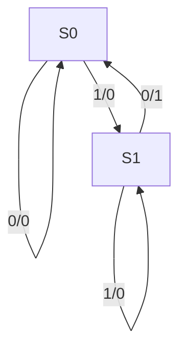
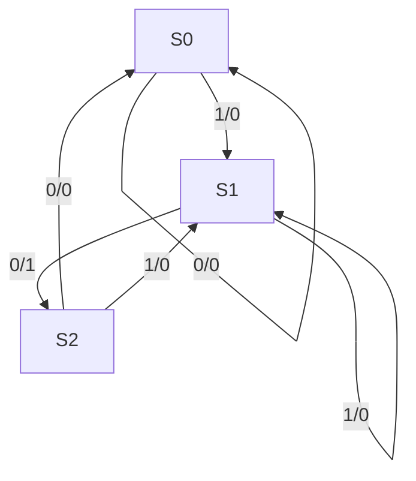

# DIGITAL SYSTEM DESIGN: Module 1 - Clocked Synchronous Networks

## Topic: Modeling of CSSN

---

### 1. Introduction to Clocked Synchronous Sequential Networks (CSSN)

**Definition:** Clocked Synchronous Sequential Networks (CSSNs) are digital circuits whose outputs depend not only on the current inputs but also on the past sequence of inputs. This "memory" is implemented using sequential elements like flip-flops, and their state transitions are synchronized by a common clock signal.

**Importance:** CSSNs are the backbone of most digital systems, from microprocessors to control units. They allow for complex operations, data storage, and state management.

**Key Characteristics:**

*   **Memory Elements:** Utilize flip-flops (e.g., D, T, JK, SR) to store the current state of the system.
*   **Synchronized Operation:** All state changes occur synchronously with the rising or falling edge of a clock signal. This eliminates race conditions and simplifies analysis.
*   **State Transitions:** The next state of the system is determined by the current state and the current inputs.
*   **Output Generation:** The current output is typically a function of the current state and/or current inputs.

**Comparison with Asynchronous Sequential Networks:**

| Feature             | Clocked Synchronous Sequential Networks (CSSN) | Asynchronous Sequential Networks               |
| :------------------ | :--------------------------------------------- | :--------------------------------------------- |
| **Clock Signal**    | Yes, a global clock synchronizes state changes. | No, state changes are triggered by input changes. |
| **Timing**          | Predictable and easier to design/analyze.      | Prone to timing issues (hazards, races).       |
| **Speed**           | Limited by clock frequency and slowest path.   | Potentially faster as it reacts immediately.  |
| **Complexity**      | Generally easier to design and debug.          | More complex to design and analyze due to timing. |
| **Power Consumption** | Can be higher due to the clock signal.        | Can be lower if designed carefully.            |

---

### 2. Modeling of CSSN: State Diagram and State Table

**2.1 State Diagram:**

**Definition:** A state diagram is a graphical representation of a sequential circuit. It consists of nodes representing the states of the circuit and directed edges representing the transitions between states. Each edge is labeled with the input that causes the transition and the output generated during that transition.

**Components:**

*   **States:** Represented by circles (nodes). Each state represents a unique configuration of the flip-flops.
*   **Transitions:** Represented by directed arrows connecting states.
*   **Input:** The condition that triggers a transition.
*   **Output:** The output produced when a transition occurs.

**Example (from Givone, Chapter 7): A simple sequence detector that detects the sequence '10'.**

*   **States:**
    *   S0: Initial state, no part of the sequence detected.
    *   S1: '1' detected, waiting for '0'.
*   **Inputs:** X (0 or 1)
*   **Outputs:** Y (1 if sequence '10' detected, 0 otherwise)

**State Diagram:**



*   **Interpretation:**
    *   From S0, if input is '0', remain in S0, output 0.
    *   From S0, if input is '1', go to S1, output 0.
    *   From S1, if input is '0', go to S0, output 1 (sequence '10' detected).
    *   From S1, if input is '1', remain in S1, output 0.

**2.2 State Table:**

**Definition:** A state table is a tabular representation of a sequential circuit that lists all possible state transitions. It explicitly defines the next state and the output for every combination of current state and input.

**Components:**

*   **Current State:** The present state of the sequential circuit.
*   **Input:** The current input value(s).
*   **Next State:** The state the circuit will transition to based on the current state and input.
*   **Output:** The output produced by the circuit based on the current state and input.

**Types of State Tables:**

*   **Mealy Machine:** The output depends on both the current state and the current input.
*   **Moore Machine:** The output depends only on the current state.

**Example (Mealy Machine for the sequence detector '10'):**

| Current State | Input (X) | Next State | Output (Y) |
| :------------ | :-------- | :--------- | :--------- |
| S0            | 0         | S0         | 0          |
| S0            | 1         | S1         | 0          |
| S1            | 0         | S0         | 1          |
| S1            | 1         | S1         | 0          |

**Example (Moore Machine for the sequence detector '10'):**

A Moore machine for sequence detection typically requires an additional state to indicate the detection of the sequence. Let's redesign for a Moore machine.

*   **States:**
    *   S0: Initial state, no part of the sequence detected.
    *   S1: '1' detected, waiting for '0'.
    *   S2: '10' detected (output state).
*   **Inputs:** X (0 or 1)
*   **Outputs:** Y (1 if sequence '10' detected, 0 otherwise)

**State Diagram (Moore):**



**State Table (Moore Machine):**

| Current State | Output (Y) | Input (X) | Next State |
| :------------ | :--------- | :-------- | :--------- |
| S0            | 0          | 0         | S0         |
| S0            | 0          | 1         | S1         |
| S1            | 0          | 0         | S2         |
| S1            | 0          | 1         | S1         |
| S2            | 1          | 0         | S0         |
| S2            | 1          | 1         | S1         |

**Important Note:** The choice between Mealy and Moore machines depends on the specific requirements of the design. Mealy machines are often more efficient in terms of the number of states, while Moore machines might have simpler output logic. (Mano & Ciletti, Chapter 6)

---

### 3. State Minimization

**Definition:** State minimization is the process of reducing the number of states in a state diagram or state table without changing the overall behavior of the sequential circuit. This leads to simpler and more efficient hardware implementations.

**Key Concepts:**

*   **Equivalent States:** Two states are equivalent if, for every possible input sequence, they produce the same output sequence and transition to equivalent states.
*   **Implied States:** If two states are equivalent, then any state to which they transition for a given input must also be equivalent.

**Methods for State Minimization:**

*   **Implication Table Method:**
    1.  **Initialization:** Create an implication table with entries for each pair of states (Si, Sj). Mark pairs where the outputs are different for any input as non-equivalent.
    2.  **Implication:** For each pair of states (Si, Sj), examine their transitions for each input. If state Si transitions to Sk and state Sj transitions to Sl for an input, and if Sk and Sl are already marked as non-equivalent, then mark (Si, Sj) as non-equivalent.
    3.  **Iteration:** Repeat step 2 until no new pairs can be marked as non-equivalent.
    4.  **Grouping:** Group together states that are not marked as non-equivalent. These groups represent the states of the minimized machine.

*   **Partitioning Method (Deductive method):**
    1.  **Initial Partition:** Partition the states into two sets: those with output 0 and those with output 1 (for Moore machines). For Mealy machines, consider output for each input.
    2.  **Refinement:** Refine the existing partitions based on transitions. If a state transitions to states in different partitions for a given input, it needs to be separated.
    3.  **Iteration:** Repeat the refinement process until no further refinement is possible. The final partitions represent the equivalent states.

**Example (Mano & Ciletti, Chapter 6): Minimizing a state table.**

Consider a state table with states {A, B, C, D, E} and inputs X. Suppose the implication table analysis leads to the conclusion that A is equivalent to C, and B is equivalent to D. Then, we can merge {A, C} into a new state A' and {B, D} into a new state B'. State E remains as E'. The minimized set of states is {A', B', E'}.

**Important Note:** State minimization is crucial for efficient hardware design, reducing the number of flip-flops and logic gates required. (Wakerly, Chapter 5)

---

### 4. State Assignment

**Definition:** State assignment is the process of assigning a unique binary code to each state of the sequential circuit. This assignment directly impacts the complexity of the combinational logic required to implement the flip-flop excitation and output functions.

**Goal:** To find a state assignment that minimizes the amount of combinational logic, potentially by exploiting properties like shared terms in Boolean expressions.

**Methods of State Assignment:**

*   **Binary/Natural Assignment:** Assign binary codes sequentially (000, 001, 010, ...). Simple but may not be optimal.
*   **One-Hot Assignment:** Assign a unique bit position for each state, with only one bit set at a time (e.g., 0001, 0010, 0100, 1000). This simplifies the logic for next-state decoders but requires more flip-flops.
*   **Heuristic Methods:** Various algorithms and guidelines aim to find assignments that minimize logic. These often involve grouping "similar" states (states that transition to similar next states or produce similar outputs) to the same binary codes or codes that differ in only a few bits.

**Key Concepts for Heuristic Assignment:**

*   **Adjacent States:** States that transition to each other or share common next states.
*   **Cube-Core Method:** A systematic approach to finding good state assignments by identifying "core" cubes that can be shared.
*   **Row/Column Pairing:** Techniques involving arranging the state table in a way that visually suggests good adjacencies.

**Example (from Givone, Chapter 7):**

Suppose we have a minimized state table with states {S0, S1, S2}.
If we assign:
*   S0 = 00
*   S1 = 01
*   S2 = 10

And the next-state logic for a particular flip-flop (say D1) is:
D1 = (S1 & X) | S2

If we instead assign:
*   S0 = 00
*   S1 = 10
*   S2 = 01

The next-state logic might change significantly. A good state assignment can simplify these Boolean expressions.

**Important Note:** The effectiveness of state assignment depends on the specific circuit. There's no single "best" method for all cases. Often, experimentation and analysis are needed. (Yarbrough, Chapter 9)

---

### 5. Derivation of Flip-Flop Input Equations and Output Equations

Once the state table is finalized and a state assignment is chosen, we can derive the Boolean equations for the flip-flop inputs and the circuit outputs.

**Steps:**

1.  **Create a Transition Table (Excitation Table):**
    *   List the current states, inputs, and the corresponding assigned binary codes for the states.
    *   Determine the required flip-flop inputs (e.g., D, T, J, K) for each transition based on the chosen flip-flop type and the next-state logic.

2.  **Derive Flip-Flop Input Equations:**
    *   Use Karnaugh Maps (K-maps) or Quine-McCluskey method to simplify the Boolean expressions for each flip-flop input based on the transition table.

3.  **Derive Output Equations:**
    *   For Mealy machines, the output is a function of the current state (assigned binary code) and the current inputs.
    *   For Moore machines, the output is a function of the current state (assigned binary code) only.
    *   Use K-maps or other simplification techniques to derive the output equations.

**Example (Continuing with the sequence detector '10' - Mealy, using D flip-flops):**

**State Assignment:**
*   S0 = 0
*   S1 = 1

**Transition Table (Mealy with D flip-flop):**

| Current State (Q) | Input (X) | Next State (Q+) | D Input | Output (Y) |
| :---------------- | :-------- | :-------------- | :------ | :--------- |
| 0 (S0)            | 0         | 0 (S0)          | 0       | 0          |
| 0 (S0)            | 1         | 1 (S1)          | 1       | 0          |
| 1 (S1)            | 0         | 0 (S0)          | 0       | 1          |
| 1 (S1)            | 1         | 1 (S1)          | 1       | 0          |

**Deriving D Input Equation:**

| Q | X | D |
| :-: | :-: | :-: |
| 0 | 0 | 0 |
| 0 | 1 | 1 |
| 1 | 0 | 0 |
| 1 | 1 | 1 |

From the table, D = Q'X' + QX = X (This is incorrect. Let's re-examine the truth table).
Let's re-evaluate the D input based on the transition.
D input should be equal to the Next State (Q+).

| Q | X | Q+ | D |
| :-: | :-: | :-: | :-: |
| 0 | 0 | 0 | 0 |
| 0 | 1 | 1 | 1 |
| 1 | 0 | 0 | 0 |
| 1 | 1 | 1 | 1 |

The K-map for D:
```
   X\Q | 0 | 1
   -----|---|---
   0   | 0 | 0
   1   | 1 | 1
```
D = X

**Deriving Output Equation (Y):**

| Q | X | Y |
| :-: | :-: | :-: |
| 0 | 0 | 0 |
| 0 | 1 | 0 |
| 1 | 0 | 1 |
| 1 | 1 | 0 |

The K-map for Y:
```
   X\Q | 0 | 1
   -----|---|---
   0   | 0 | 1
   1   | 0 | 0
```
Y = QX'

**Final Equations:**

*   D = X
*   Y = QX'

**Important Note:** The choice of flip-flop type (D, T, JK) can significantly affect the complexity of the input equations. D flip-flops are often preferred for their simplicity in implementation. (Mano & Ciletti, Chapter 6)

---

### 6. Implementation of CSSN

**Definition:** Implementation involves translating the derived Boolean equations into a hardware circuit using logic gates (AND, OR, NOT, XOR) and flip-flops.

**Components of Implementation:**

*   **Flip-Flops:** Store the state of the circuit. The number of flip-flops is determined by the number of states ($N$) as $\lceil \log_2 N \rceil$.
*   **Combinational Logic:** Generates the flip-flop input signals and the circuit output signals. This logic is derived from the Boolean equations.

**Example (Implementing the sequence detector '10' with D flip-flops):**

*   **State Assignment:** S0 = 0, S1 = 1
*   **Flip-Flop:** One D flip-flop (Q)
*   **Equations:** D = X, Y = QX'

**Circuit Diagram:**

```
       +-------+
 X ----|       |
       |       |-----> Y (Output)
 Q ----|  D FF |
       |       |-----> D (Flip-flop Input)
 Clock-|       |
       +-------+

           ^
           |
           ----- D = X
```
This implementation is incorrect. The derivation of D was wrong. Let's re-derive D based on the actual next state Q+.

**Corrected Derivation and Implementation:**

**Transition Table (Mealy with D flip-flop):**

| Current State (Q) | Input (X) | Next State (Q+) | D Input | Output (Y) |
| :---------------- | :-------- | :-------------- | :------ | :--------- |
| 0 (S0)            | 0         | 0 (S0)          | 0       | 0          |
| 0 (S0)            | 1         | 1 (S1)          | 1       | 0          |
| 1 (S1)            | 0         | 0 (S0)          | 0       | 1          |
| 1 (S1)            | 1         | 1 (S1)          | 1       | 0          |

**K-map for D Input:**
```
   X\Q | 0 | 1
   -----|---|---
   0   | 0 | 0
   1   | 1 | 1
```
From this K-map, D = Q'X + QX = X.  Still incorrect. The K-map should reflect the table directly.

Let's build the K-map for D based on Q and X:

| Q | X | D |
| :-: | :-: | :-: |
| 0 | 0 | 0 |
| 0 | 1 | 1 |
| 1 | 0 | 0 |
| 1 | 1 | 1 |

The K-map is:
```
   X\Q | 0 | 1
   -----|---|---
   0   | 0 | 0
   1   | 1 | 1
```
This K-map simplifies to D = X. This is still problematic. The issue might be in the state assignment or the interpretation.

Let's re-check the state diagram and table for the sequence detector '10'.

**State Diagram (Corrected for clarity of transitions):**


**State Table (Mealy):**

| Current State | Input (X) | Next State | Output (Y) |
| :------------ | :-------- | :--------- | :--------- |
| S0            | 0         | S0         | 0          |
| S0            | 1         | S1         | 0          |
| S1            | 0         | S0         | 1          |
| S1            | 1         | S1         | 0          |

**State Assignment:** S0 = 0, S1 = 1. (Using Q for the flip-flop state)

**Transition Table (for D flip-flop):**

| Current State (Q) | Input (X) | Next State (Q+) | D Input (Q+) | Output (Y) |
| :---------------- | :-------- | :-------------- | :----------- | :--------- |
| 0                 | 0         | 0               | 0            | 0          |
| 0                 | 1         | 1               | 1            | 0          |
| 1                 | 0         | 0               | 0            | 1          |
| 1                 | 1         | 1               | 1            | 0          |

**K-map for D:**
```
   X\Q | 0 | 1
   -----|---|---
   0   | 0 | 0
   1   | 1 | 1
```
This K-map indeed simplifies to **D = X**. This seems too simple. Let's verify the logic. If D=X, then the flip-flop output Q will become the input X.
*   If Q=0 (S0) and X=0, then D=0, Q becomes 0 (S0), Y=0. (Correct)
*   If Q=0 (S0) and X=1, then D=1, Q becomes 1 (S1), Y=0. (Correct)
*   If Q=1 (S1) and X=0, then D=0, Q becomes 0 (S0), Y=1. (Correct)
*   If Q=1 (S1) and X=1, then D=1, Q becomes 1 (S1), Y=0. (Correct)

It appears the simple D=X works for this specific Mealy implementation with this state assignment.

**K-map for Y:**
```
   X\Q | 0 | 1
   -----|---|---
   0   | 0 | 1
   1   | 0 | 0
```
This K-map simplifies to **Y = QX'**.

**Circuit Implementation:**

A single D flip-flop.
*   The input D is connected directly to the input X.
*   The output Y is generated by an AND gate with inputs Q (from the flip-flop) and X'.

**Important Considerations for Implementation:**

*   **Flip-Flop Choice:** D, T, JK, SR flip-flops have different excitation tables and implementation complexities. D flip-flops are generally preferred.
*   **Race Conditions:** In CSSNs, the clocking mechanism prevents race conditions. However, careful analysis is still needed to ensure correct operation.
*   **Setup and Hold Times:** For reliable operation, the inputs to the flip-flops must satisfy the setup and hold time requirements relative to the clock edge. This is part of timing analysis.
*   **Fan-in/Fan-out:** The number of gates a gate output can drive (fan-out) and the number of inputs a gate can accept (fan-in) can affect the circuit's performance and must be considered during implementation. (Wakerly, Chapter 5 & 7)

---

### 7. Practice Questions and Exercises

**Question 1:**
Design a Mealy state machine that detects the sequence '110'. The output should be 1 when the sequence is detected, and 0 otherwise.
a) Draw the state diagram.
b) Create the state table.
c) Minimize the states if possible.
d) Perform a binary state assignment.
e) Derive the flip-flop input equations (using D flip-flops) and output equations.

**Question 2:**
Design a Moore state machine that outputs '1' whenever the input sequence has an even number of 1s, and '0' otherwise.
a) Draw the state diagram.
b) Create the state table.
c) Perform a binary state assignment.
d) Derive the flip-flop input equations (using T flip-flops) and output equations.

**Question 3:**
Consider the following state table:

| Current State | Input (X) | Next State | Output (Y) |
| :------------ | :-------- | :--------- | :--------- |
| S0            | 0         | S1         | 0          |
| S0            | 1         | S0         | 0          |
| S1            | 0         | S1         | 1          |
| S1            | 1         | S2         | 0          |
| S2            | 0         | S0         | 0          |
| S2            | 1         | S1         | 1          |

Assume this is a Mealy machine.
a) Draw the state diagram.
b) Minimize the state table using the implication table method.
c) Perform a state assignment for the minimized machine and derive the flip-flop input equations (using JK flip-flops) and output equations.

---

### 8. Answers to Practice Questions

**Answer 1 (Sequence Detector '110' - Mealy):**

*   **States:**
    *   S0: Initial state.
    *   S1: '1' received.
    *   S2: '11' received.
    *   S3: '110' received (output state).

*   **a) State Diagram:**

    ```mermaid
    graph TD
        S0 -- "0/0" --> S0
        S0 -- "1/0" --> S1
        S1 -- "0/0" --> S0
        S1 -- "1/0" --> S2
        S2 -- "0/1" --> S3
        S2 -- "1/0" --> S1
        S3 -- "0/0" --> S0
        S3 -- "1/0" --> S1
    ```

*   **b) State Table:**

    | Current State | Input (X) | Next State | Output (Y) |
    | :------------ | :-------- | :--------- | :--------- |
    | S0            | 0         | S0         | 0          |
    | S0            | 1         | S1         | 0          |
    | S1            | 0         | S0         | 0          |
    | S1            | 1         | S2         | 0          |
    | S2            | 0         | S3         | 1          |
    | S2            | 1         | S1         | 0          |
    | S3            | 0         | S0         | 0          |
    | S3            | 1         | S1         | 0          |

*   **c) Minimization:** This state table is already minimal. All states are distinguishable.

*   **d) State Assignment (3 states require $\lceil \log_2 3 \rceil = 2$ flip-flops):**
    *   S0 = 00
    *   S1 = 01
    *   S2 = 10

*   **e) Flip-Flop Input Equations (using D flip-flops - Q1, Q0):**

    **Transition Table:**

    | Current State (Q1 Q0) | Input (X) | Next State (Q1+ Q0+) | D1 | D0 | Output (Y) |
    | :-------------------- | :-------- | :------------------- | :- | :- | :--------- |
    | 00 (S0)               | 0         | 00                   | 0  | 0  | 0          |
    | 00 (S0)               | 1         | 01                   | 0  | 1  | 0          |
    | 01 (S1)               | 0         | 00                   | 0  | 0  | 0          |
    | 01 (S1)               | 1         | 10                   | 1  | 0  | 0          |
    | 10 (S2)               | 0         | 00                   | 0  | 0  | 1          |
    | 10 (S2)               | 1         | 01                   | 0  | 1  | 0          |

    **K-map for D1:**
    ```
       X\Q1Q0 | 00 | 01 | 10 | 11
       -----|----|----|----|----
       0    | 0  | 0  | 0  | X
       1    | 0  | 1  | 0  | X
    ```
    D1 = Q0X

    **K-map for D0:**
    ```
       X\Q1Q0 | 00 | 01 | 10 | 11
       -----|----|----|----|----
       0    | 0  | 0  | 0  | X
       1    | 1  | 1  | 1  | X
    ```
    D0 = X

    **K-map for Y:**
    ```
       X\Q1Q0 | 00 | 01 | 10 | 11
       -----|----|----|----|----
       0    | 0  | 0  | 1  | X
       1    | 0  | 0  | 0  | X
    ```
    Y = Q1X'

    **Equations:**
    *   D1 = Q0X
    *   D0 = X
    *   Y = Q1X'

**Answer 2 (Even number of 1s - Moore):**

*   **States:**
    *   S0: Even number of 1s seen so far.
    *   S1: Odd number of 1s seen so far.
*   **Output:** Y=1 for S0, Y=0 for S1.

*   **a) State Diagram:**

    ```mermaid
    graph TD
        S0 -- "0/1" --> S0
        S0 -- "1/0" --> S1
        S1 -- "0/0" --> S1
        S1 -- "1/1" --> S0
    ```

*   **b) State Table:**

    | Current State | Output (Y) | Input (X) | Next State |
    | :------------ | :--------- | :-------- | :--------- |
    | S0            | 1          | 0         | S0         |
    | S0            | 0          | 1         | S1         |
    | S1            | 0          | 0         | S1         |
    | S1            | 1          | 1         | S0         |

*   **c) State Assignment (2 states require $\lceil \log_2 2 \rceil = 1$ flip-flop):**
    *   S0 = 0
    *   S1 = 1
    (Using Q for the flip-flop)

*   **d) Flip-Flop Input Equations (using T flip-flops) and Output Equations:**

    **Transition Table:**

    | Current State (Q) | Output (Y) | Input (X) | Next State (Q+) | T Input |
    | :---------------- | :--------- | :-------- | :-------------- | :------ |
    | 0 (S0)            | 1          | 0         | 0 (S0)          | 0       |
    | 0 (S0)            | 0          | 1         | 1 (S1)          | 1       |
    | 1 (S1)            | 0          | 0         | 1 (S1)          | 0       |
    | 1 (S1)            | 1          | 1         | 0 (S0)          | 1       |

    **K-map for T Input:**
    ```
       X\Q | 0 | 1
       -----|---|---
       0   | 0 | 0
       1   | 1 | 1
    ```
    T = X

    **K-map for Output Y:**
    ```
       X\Q | 0 | 1
       -----|---|---
       0   | 1 | 0
       1   | 0 | 1
    ```
    Y = Q' (This is for the output of the flip-flop being the state)
    Y = Q' + QX = Q' + X.  Let's re-check.
    Y depends only on the state. So Y = Q'.
    If Q=0 (S0), Y=1. If Q=1 (S1), Y=0. This is correct.

    **Equations:**
    *   T = X
    *   Y = Q'

**Answer 3 (Minimization and Implementation):**

*   **a) State Diagram:**

    ```mermaid
    graph TD
        S0 -- "0/0" --> S1
        S0 -- "1/0" --> S0
        S1 -- "0/1" --> S1
        S1 -- "1/0" --> S2
        S2 -- "0/0" --> S0
        S2 -- "1/1" --> S1
    ```

*   **b) Minimization (Implication Table):**

    Pairs: (S0,S1), (S0,S2), (S1,S2)

    1.  **Initial Marking (Outputs differ for at least one input):**
        *   (S1, S2): For input 0, S1 output is 1, S2 output is 0. Mark (S1, S2) as dissimilar.

    2.  **Implication:**
        *   (S0, S1):
            *   Input 0: S0 -> S1, S1 -> S1. Implies (S1, S1) which is trivial.
            *   Input 1: S0 -> S0, S1 -> S2. Implies (S0, S2).
        *   (S0, S2):
            *   Input 0: S0 -> S1, S2 -> S0. Implies (S1, S0).
            *   Input 1: S0 -> S0, S2 -> S1. Implies (S0, S1).
        *   (S1, S2): Already marked dissimilar.

    3.  **Iteration:**
        *   From (S0, S1) implies (S0, S2). If (S0, S2) is marked dissimilar, then (S0, S1) is dissimilar.
        *   From (S0, S2) implies (S1, S0). If (S1, S0) is marked dissimilar, then (S0, S2) is dissimilar.

    Let's construct the implication table to be more systematic:

    | Pair   | Input 0  | Input 1  | Dissimilar? |
    | :----- | :------- | :------- | :---------- |
    | (S0,S1)| (S1,S1)  | (S0,S2)  |             |
    | (S0,S2)| (S1,S0)  | (S0,S1)  |             |
    | (S1,S2)| S1=1,S2=0 | S1=0,S2=1 | Yes         |

    Now consider implications for pairs that are not dissimilar yet:

    *   If (S0, S2) is dissimilar:
        *   From (S0, S1) implies (S0, S2), so (S0, S1) is dissimilar.
    *   If (S0, S1) is dissimilar:
        *   From (S0, S2) implies (S0, S1), so (S0, S2) is dissimilar.

    Since (S1, S2) are dissimilar, we must check if any other pairs imply (S1, S2) or (S2, S1).
    *   (S0, S1) implies (S0, S2).
    *   (S0, S2) implies (S1, S0).

    No pair implies (S1, S2). Let's check if (S0,S1) and (S0,S2) are equivalent.
    Consider the implication for (S0,S1) -> (S0,S2). If (S0,S2) implies (S1,S0) or (S0,S1) implies something that leads to dissimilar, then we might mark them.

    Let's restart with a more robust implication table construction.

    **Implication Table:**

    |       | S1    | S2    |
    | :---- | :---- | :---- |
    | **S0**|       |       |
    | **S1**|       | D(1,0)|
    | **S2**|       |       |

    *   **Initial:** Mark dissimilar pairs: (S1, S2) is dissimilar because for input 0, outputs are 1 and 0.

    *   **Step 1:** Check implications that involve dissimilar pairs.
        *   (S0, S1) implies (S0, S2) for input 1. If (S0, S2) were dissimilar, then (S0, S1) would be dissimilar.
        *   (S0, S2) implies (S1, S0) for input 0. If (S1, S0) were dissimilar, then (S0, S2) would be dissimilar.
        *   (S0, S2) implies (S0, S1) for input 1. If (S0, S1) were dissimilar, then (S0, S2) would be dissimilar.

    *   **Step 2:** Assume no other pairs are dissimilar and check further.
        *   If (S0, S1) are equivalent, then (S0, S2) must be equivalent (from S0->S0, S1->S2 for X=1).
        *   If (S0, S2) are equivalent, then (S1, S0) must be equivalent (from S0->S1, S2->S0 for X=0), and (S0, S1) must be equivalent (from S0->S0, S2->S1 for X=1).

    This suggests that if any pair of {S0, S1, S2} is equivalent, they all must be equivalent. However, (S1, S2) are dissimilar. Therefore, no states can be merged. The table is already minimal.

    **Minimized State Table (same as original):** {S0, S1, S2}

*   **c) State Assignment and Derivations (using JK flip-flops - Q1, Q0):**
    *   S0 = 00
    *   S1 = 01
    *   S2 = 10

    **Transition Table:**

    | Current State (Q1 Q0) | Input (X) | Next State (Q1+ Q0+) | J1 | K1 | J0 | K0 | Output (Y) |
    | :-------------------- | :-------- | :------------------- | :- | :- | :- | :- | :--------- |
    | 00 (S0)               | 0         | 01 (S1)              | 0  | 0  | 1  | 0  | 0          |
    | 00 (S0)               | 1         | 00 (S0)              | 0  | 0  | 0  | 0  | 0          |
    | 01 (S1)               | 0         | 01 (S1)              | 0  | 0  | 0  | 0  | 1          |
    | 01 (S1)               | 1         | 10 (S2)              | 1  | 0  | 0  | 1  | 0          |
    | 10 (S2)               | 0         | 00 (S0)              | 0  | 1  | 0  | 0  | 0          |
    | 10 (S2)               | 1         | 01 (S1)              | 0  | 1  | 1  | 0  | 1          |

    **K-maps for JK Inputs and Output Y:**

    **J1:**
    ```
       X\Q1Q0 | 00 | 01 | 10 | 11
       -----|----|----|----|----
       0    | 0  | 0  | 0  | X
       1    | 0  | 1  | 0  | X
    ```
    J1 = Q0X

    **K1:**
    ```
       X\Q1Q0 | 00 | 01 | 10 | 11
       -----|----|----|----|----
       0    | 0  | 0  | 1  | X
       1    | 0  | 0  | 1  | X
    ```
    K1 = Q1

    **J0:**
    ```
       X\Q1Q0 | 00 | 01 | 10 | 11
       -----|----|----|----|----
       0    | 1  | 0  | 0  | X
       1    | 0  | 1  | 1  | X
    ```
    J0 = Q0'X' + Q0X + Q1X

    **K0:**
    ```
       X\Q1Q0 | 00 | 01 | 10 | 11
       -----|----|----|----|----
       0    | 0  | 0  | 0  | X
       1    | 0  | 1  | 0  | X
    ```
    K0 = Q0X

    **Y:**
    ```
       X\Q1Q0 | 00 | 01 | 10 | 11
       -----|----|----|----|----
       0    | 0  | 1  | 0  | X
       1    | 0  | 0  | 1  | X
    ```
    Y = Q0X' + Q1X

    **Equations:**
    *   J1 = Q0X
    *   K1 = Q1
    *   J0 = Q0'X' + Q0X + Q1X
    *   K0 = Q0X
    *   Y = Q0X' + Q1X

---

### 9. Important Points to Remember

*   **CSSNs vs. Asynchronous:** Synchronous systems are easier to design and analyze due to the global clock.
*   **Mealy vs. Moore:** Mealy outputs depend on state and input; Moore outputs depend only on state. Moore machines are generally more robust to glitches but may require more states.
*   **State Minimization:** Essential for efficient hardware; reduces the number of flip-flops and logic gates.
*   **State Assignment:** Crucial for minimizing combinational logic. Heuristic methods are often used.
*   **Flip-Flop Types:** D, T, JK, SR flip-flops offer different trade-offs in terms of implementation complexity and excitation logic.
*   **VHDL/Verilog:** Hardware Description Languages are the standard for modeling and designing CSSNs in modern digital design. (CO4)
*   **Analysis vs. Synthesis:** Modeling and state table derivation are part of the analysis phase, leading to synthesis (implementation).
*   **Clock Skew:** In large synchronous systems, the arrival time of the clock signal at different flip-flops can vary (clock skew), which needs careful timing analysis. (Reference: Abramovici et al. for testing aspects, which implies timing is critical).

---

This comprehensive set of notes covers the modeling of Clocked Synchronous Sequential Networks (CSSNs) by detailing the concepts, methods, and practical aspects relevant to the learning outcomes and course objectives.

## Videos

| Resource Type | Recommended Video |
| :--- | :--- |
| ⚡ **Quick Concept** | [Watch Summary & Animations](https://www.youtube.com/watch?v=mc979OhitAg) |
| 🎓 **Exam Deep Dive** | [Watch Comprehensive University Lecture](https://www.youtube.com/watch?v=M0mx8S05v60) |
| ✍️ **Problem Solving** | [Watch Solved Examples & Numericals](https://www.youtube.com/watch?v=8XG7U5yN668) |
