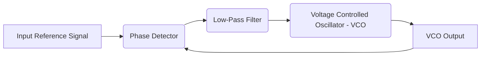

# Linear Integrated Circuits Lab: Module 2 - Astable & Monostable Multivibrator using NE555 Timer IC

## Topic: Study of PLL IC: Free Running, Frequency Lock Range, and Capture Range

This module focuses on the versatile NE555 Timer IC. While primarily known for astable and monostable multivibrator configurations, the NE555 can also be utilized in conjunction with other components to create a Phase-Locked Loop (PLL) circuit. This section delves into the fundamental concepts of a PLL, its free-running state, and the critical parameters of frequency lock range and capture range.

---

### **1. Introduction to Phase-Locked Loops (PLLs)**

**1.1 What is a Phase-Locked Loop?**

A Phase-Locked Loop (PLL) is a feedback control system that generates an output signal whose phase is related to the phase of an input "reference" signal. In simpler terms, it synchronizes the frequency and phase of an oscillator (the Voltage Controlled Oscillator - VCO) with an incoming signal.

**1.2 Block Diagram of a Basic PLL**

A typical PLL consists of three main functional blocks:

*   **Phase Detector (PD):** Compares the phase of the input reference signal with the phase of the VCO output signal. It generates an error voltage proportional to the phase difference.
*   **Low-Pass Filter (LPF):** Filters out high-frequency components and noise from the PD output, producing a smooth DC control voltage.
*   **Voltage Controlled Oscillator (VCO):** An oscillator whose output frequency can be varied by an input control voltage.

**1.3 How a PLL Works (Feedback Mechanism)**

1.  The phase detector receives the input reference signal and the feedback signal from the VCO.
2.  It compares their phases and outputs an "error voltage" that represents the phase difference.
3.  This error voltage is then filtered by the LPF to remove unwanted noise and high-frequency components, producing a DC control voltage.
4.  The DC control voltage is applied to the VCO, which adjusts its output frequency to match the input reference signal's frequency.
5.  This feedback loop continues until the VCO's phase and frequency are locked to the reference signal.

---

### **2. The NE555 Timer as a Component in PLLs**

While not a complete PLL IC itself, the NE555 timer can be configured as a VCO within a PLL system. The NE555's astable mode provides a way to generate a variable frequency output based on external RC components.

**2.1 NE555 in Astable Mode as a VCO**

In astable mode, the NE555 generates a continuous square wave output. The frequency of oscillation in the standard astable configuration is determined by external resistors ($R_A$, $R_B$) and capacitor ($C$).

*   **Key Components:** Resistors ($R_A$, $R_B$), Capacitor ($C$).
*   **Control Voltage Pin (Pin 5):** This pin allows external control of the internal threshold and trigger voltage levels. By applying a voltage to Pin 5, we can alter the charging and discharging time constants of the capacitor, thereby changing the oscillation frequency. This makes the NE555 suitable as a VCO.

**2.2 Configuration for PLL Application**

To use the NE555 as a VCO in a PLL, the control voltage output from the LPF (which is derived from the phase detector) is applied to Pin 5 of the NE555. This voltage then adjusts the frequency of the NE555's output.

---

### **3. Free Running Frequency ($f_0$)**

**3.1 Definition**

The **free-running frequency** ($f_0$) of a PLL is the frequency of the VCO when there is **no input signal** or when the control voltage to the VCO is zero. In the context of the NE555 as a VCO, this is the frequency it would oscillate at with a specific bias on Pin 5 (often when connected to ground or a fixed voltage through a resistor).

**3.2 Calculation (Illustrative for NE555 VCO)**

In a typical NE555 astable configuration used as a VCO, the free-running frequency is determined by the external components connected to Pins 7, 6, and 2, and the voltage applied to Pin 5. The exact formula for the free-running frequency depends on the specific PLL design and how the NE555 is implemented. However, the fundamental principle is that a specific control voltage on Pin 5 corresponds to a particular output frequency.

**Important Note:** The free-running frequency is a crucial parameter for setting the initial operating point of the PLL.

---

### **4. Frequency Lock Range ($f_{LR}$)**

**4.1 Definition**

The **frequency lock range** (also known as the tracking range or pull-in range) of a PLL is the range of frequencies of the input reference signal that the PLL can **track** and maintain lock once it is already locked. If the input frequency deviates beyond this range, the PLL will lose lock.

**4.2 Key Characteristics**

*   **Once Locked:** The PLL is already synchronized.
*   **Tracking:** The VCO's frequency follows changes in the input reference signal.
*   **Upper and Lower Limits:** The lock range has a maximum and minimum frequency that can be tracked.

**4.3 Factors Affecting Lock Range**

*   **Bandwidth of the Low-Pass Filter (LPF):** A wider LPF bandwidth generally allows for a larger lock range.
*   **Gain of the VCO:** Higher VCO gain (change in frequency per change in control voltage) can contribute to a wider lock range.
*   **Characteristics of the Phase Detector:** The type and gain of the phase detector also play a role.

**4.4 Calculation (General Principle)**

The frequency lock range is typically specified as $\pm \Delta f_L$ around the free-running frequency $f_0$. So, the lock range is $f_0 \pm \Delta f_L$.

*   $\Delta f_L$ is influenced by the maximum and minimum control voltages that the phase detector can produce and the VCO's sensitivity to these voltages.

**Example (Conceptual):**

If a PLL has a free-running frequency of 10 kHz and a frequency lock range of $\pm 1$ kHz, it means that once locked, the PLL can track input signals from 9 kHz to 11 kHz. If the input signal is 8 kHz or 12 kHz, the PLL will lose lock.

---

### **5. Frequency Capture Range ($f_{CR}$)**

**5.1 Definition**

The **frequency capture range** (also known as the pull-in range) of a PLL is the range of frequencies of the input reference signal that the PLL can **acquire lock** from an unlocked state. If the input frequency is outside this range, the PLL will not be able to synchronize.

**5.2 Key Characteristics**

*   **Unlocking State:** The PLL starts in an unlocked or unsynchronized state.
*   **Acquisition:** The PLL actively tries to synchronize the VCO with the input signal.
*   **Initial Condition:** The initial frequency difference between the input and VCO is crucial.

**5.3 Relationship to Lock Range**

The capture range is always **smaller** than or equal to the lock range.

*   **Capture Range $\le$ Lock Range**

This is because acquiring lock involves initial frequency pulling, which is often more challenging than simply tracking a signal that is already locked.

**5.4 Factors Affecting Capture Range**

*   **Bandwidth of the Low-Pass Filter (LPF):** A narrower LPF bandwidth can limit the capture range.
*   **Damping Factor of the PLL:** Affects how the PLL settles.
*   **VCO Gain:** Higher VCO gain can aid in capture.

**5.5 Calculation (General Principle)**

The frequency capture range is typically specified as $\pm \Delta f_C$ around the free-running frequency $f_0$. So, the capture range is $f_0 \pm \Delta f_C$.

*   $\Delta f_C$ is generally limited by the bandwidth of the LPF. The wider the LPF bandwidth, the larger the capture range.

**Example (Conceptual):**

If a PLL has a free-running frequency of 10 kHz and a frequency capture range of $\pm 500$ Hz, it means that if the input signal is between 9.5 kHz and 10.5 kHz, the PLL can acquire lock. If the input signal is 9 kHz or 11 kHz, the PLL will not lock. Once locked, it might be able to track a wider range (e.g., up to 11 kHz if the lock range is $\pm 1$ kHz).

---

### **6. Important Points to Remember**

*   **PLL Function:** A PLL is a feedback system that synchronizes an oscillator (VCO) with an input reference signal.
*   **NE555 as VCO:** The NE555 timer in astable mode can function as a VCO by controlling its frequency via Pin 5.
*   **Free Running Frequency ($f_0$):** The VCO's output frequency when no input signal is present or control voltage is zero.
*   **Frequency Lock Range ($f_{LR}$):** The range of input frequencies the PLL can track *after* it has acquired lock.
*   **Frequency Capture Range ($f_{CR}$):** The range of input frequencies the PLL can acquire lock *from an unlocked state*.
*   **Relationship:** Capture Range $\le$ Lock Range.
*   **LPF Bandwidth:** A crucial factor influencing both capture and lock ranges. Wider bandwidth generally leads to larger ranges.
*   **Textbook References:**
    *   *Linear Integrated Circuits* by D. Roy Choudhary and Shail B Jain (New Age International Private Limited) provides foundational knowledge on various ICs, including principles that can be extended to PLL concepts. Chapter 7 on "Timers: IC 555" would be relevant for understanding the NE555's operation. While not explicitly covering PLLs in detail for the NE555, the understanding of its astable operation is key.
    *   *Op-Amps And Linear Integrated Circuits* by Gayakwad (PHI) may offer broader insights into feedback systems and control circuits, which are fundamental to PLLs.
    *   *Introduction to Pspice Using Orcad for Circuits and Electronics* by M. H. Rashid is vital for simulating PLL behavior. You can design a PLL circuit (using NE555 as VCO, a phase detector, and an LPF) and observe its capture and lock characteristics.

---

### **7. Aligning with Course Outcomes**

*   **CO1: Design and implement basic linear integrated circuits using Op Amps. (K4)**
    *   While this module focuses on the NE555, understanding PLLs often involves using op-amps as comparators or in the LPF. This knowledge supports the broader design principles for linear IC circuits.
*   **CO2: Design and implement basic linear integrated circuits using linear ICs. (K4)**
    *   This module directly addresses the design and understanding of circuits involving the NE555 timer, a key linear IC. Understanding how it can be configured for advanced applications like PLLs demonstrates a deep understanding of its capabilities.
*   **CO3: Design and simulate the functioning of basic linear integrated circuits and linear ICs. using simulation tools. (K4)**
    *   This is highly relevant. Students should simulate a PLL circuit using the NE555 as a VCO (perhaps with a phase detector like an XOR gate or a dedicated PLL IC if available in the simulator) in PSpice or a similar tool. They can then inject input signals of varying frequencies and observe:
        *   The free-running frequency of the NE555.
        *   The range of input frequencies for which the PLL locks.
        *   The range of input frequencies for which the PLL acquires lock.
*   **CO4: Effectively troubleshoot a given circuit and analyze it (K4)**
    *   Understanding the parameters like capture and lock range helps in analyzing why a PLL circuit might not be functioning as expected. If a PLL is not locking, it's likely due to the input frequency being outside the capture range, or an issue with the LPF bandwidth or VCO gain, all of which can be analyzed.

---

### **8. Practice Questions and Exercises**

**Question 1:**
Define the term "free running frequency" of a PLL. How is it generally determined in a PLL circuit utilizing an NE555 timer as a VCO?

**Answer:**
The free-running frequency ($f_0$) of a PLL is the frequency of the Voltage Controlled Oscillator (VCO) when there is no input reference signal or when the control voltage to the VCO is zero. In a PLL employing an NE555 timer as a VCO, $f_0$ is determined by the external resistors and capacitor connected to the NE555 in its astable configuration, and the specific voltage applied to Pin 5 (the control voltage input).

**Question 2:**
Differentiate between the frequency lock range and the frequency capture range of a PLL. Which of these is typically larger, and why?

**Answer:**
*   **Frequency Lock Range ($f_{LR}$):** The range of input frequencies that the PLL can *track* and maintain synchronization with, once it is already locked.
*   **Frequency Capture Range ($f_{CR}$):** The range of input frequencies from which the PLL can *acquire* synchronization, starting from an unlocked state.

The **frequency lock range is typically larger than the frequency capture range** ($f_{LR} \ge f_{CR}$). This is because acquiring lock from an unlocked state requires overcoming initial frequency differences and is often a more demanding process than simply tracking a signal that is already synchronized. The capture process is often limited by the bandwidth of the low-pass filter.

**Question 3:**
A PLL has a free-running frequency of 50 kHz. If its frequency lock range is $\pm 5$ kHz and its frequency capture range is $\pm 2$ kHz, describe the behavior of the PLL for the following input frequencies:
a) 47 kHz
b) 52 kHz
c) 44 kHz
d) 56 kHz

**Answer:**
*   **a) 47 kHz:** This frequency is within the capture range ($\pm 2$ kHz, so 48 kHz to 52 kHz). The PLL will likely acquire lock. Since it's also within the lock range ($\pm 5$ kHz, so 45 kHz to 55 kHz), it will remain locked.
*   **b) 52 kHz:** This frequency is at the upper edge of the capture range and also within the lock range. The PLL will acquire lock and remain locked.
*   **c) 44 kHz:** This frequency is outside the capture range ($\pm 2$ kHz) and also outside the lock range ($\pm 5$ kHz). The PLL will not be able to acquire lock.
*   **d) 56 kHz:** This frequency is outside the capture range ($\pm 2$ kHz) but within the lock range ($\pm 5$ kHz). If the PLL was already locked at 50 kHz, it *might* be able to track this frequency. However, if it's starting from an unlocked state, it will not be able to acquire lock because it's outside the capture range. In a practical scenario where it's already locked, it will likely lose lock and go out of range.

**Exercise (Simulation-Based):**

Using a circuit simulation software (like PSpice):
1.  Design an NE555 timer circuit in astable mode. Determine the resistor and capacitor values to achieve a free-running frequency of approximately 10 kHz.
2.  Incorporate this NE555 as the VCO in a simplified PLL. For the phase detector, you could use an XOR gate, and for the LPF, a simple RC filter. Assume a square wave input for the phase detector.
3.  Measure the free-running frequency of the NE555 when connected to the LPF output (which can be simulated with a DC voltage source corresponding to the LPF's average output for zero phase error).
4.  Apply input sine waves with varying frequencies to the PLL. Identify and record the range of input frequencies for which the PLL output synchronizes with the input (capture range).
5.  Once locked, vary the input frequency further and determine the range of frequencies the PLL can track without losing lock (lock range).

---

## Videos

| Resource Type | Recommended Video |
| :--- | :--- |
| ⚡ **Quick Concept** | [Watch Summary & Animations](https://www.youtube.com/watch?v=gI-qXk7XojA) |
| 🎓 **Exam Deep Dive** | [Watch Comprehensive University Lecture](https://www.youtube.com/watch?v=M0mx8S05v60) |
| ✍️ **Problem Solving** | [Watch Solved Examples & Numericals](https://www.youtube.com/watch?v=p6Q9_e7_L1w) |
