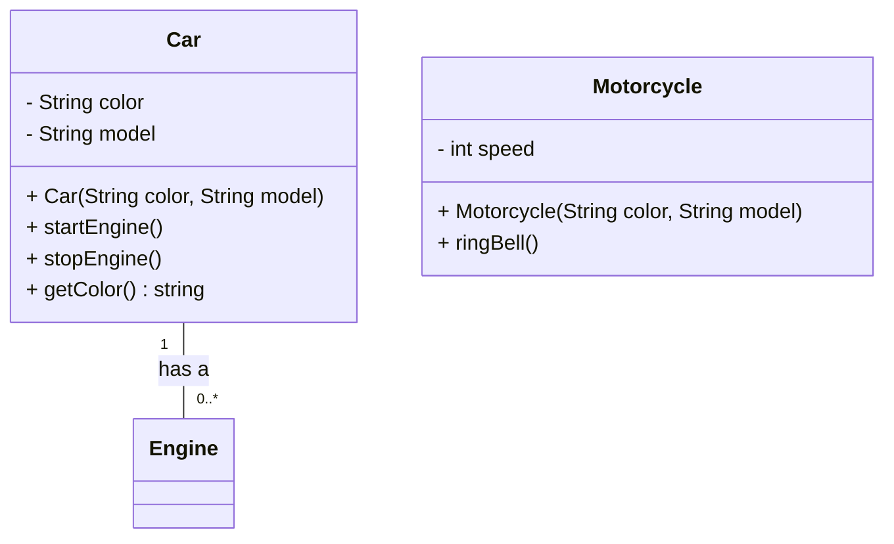
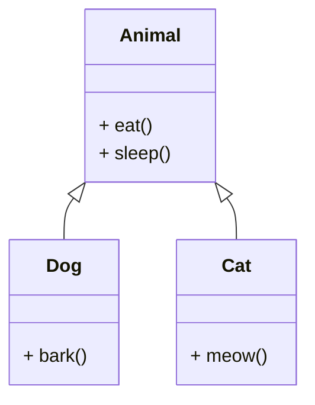

# Object-Oriented Programming: Module 1 - Introduction

## 1. Introduction to Object-Oriented Programming (OOP)

This module introduces the fundamental concepts of Object-Oriented Programming (OOP) and its paradigm shift from traditional procedural programming. We will explore why OOP is a popular and powerful approach to software development.

### Learning Outcomes Covered:

*   **Summarize the object-oriented concepts - classes, objects, constructors, data hiding, inheritance and polymorphism and to illustrate it using UML diagrams.** (CO1, K2)

### Key Concepts and Definitions:

*   **Programming Paradigm:** A fundamental style of computer programming. OOP is one such paradigm.
*   **Procedural Programming:** Focuses on a sequence of instructions (procedures or functions) to manipulate data.
    *   *Example:* C, Pascal, Fortran.
    *   *Limitations:* Difficulty in managing complex systems, data and functions are often separate, leading to maintenance challenges.
*   **Object-Oriented Programming (OOP):** A programming paradigm based on the concept of "objects," which can contain data (in the form of fields, often known as attributes or properties) and code (in the form of procedures, often known as methods).
    *   *Core Idea:* To model real-world entities as software objects.
    *   *Benefits:*
        *   **Modularity:** Code is organized into independent objects.
        *   **Reusability:** Objects can be reused in different programs.
        *   **Maintainability:** Easier to update and debug code.
        *   **Scalability:** Better suited for large and complex projects.
        *   **Data Security:** Achieved through data hiding.

### Important Points to Remember:

*   OOP is a way of thinking about and structuring your programs.
*   It aims to make software development more manageable and efficient.

---

## 2. Fundamental Concepts of OOP

OOP is built upon several core principles that enable its power and flexibility.

### Learning Outcomes Covered:

*   **Summarize the object-oriented concepts - classes, objects, constructors, data hiding, inheritance and polymorphism and to illustrate it using UML diagrams.** (CO1, K2)

### Key Concepts and Definitions:

#### 2.1. Class

*   **Definition:** A blueprint or a template for creating objects. It defines the properties (data members) and behaviors (member functions or methods) that all objects of that type will have.
*   **Analogy:** A "Car" blueprint defines attributes like color, model, and methods like start(), stop(), accelerate().
*   **In Java:** Defined using the `class` keyword.

#### 2.2. Object

*   **Definition:** An instance of a class. It is a concrete entity created from the class blueprint. Objects have state (values of their data members) and behavior (defined by their methods).
*   **Analogy:** Individual cars manufactured from the "Car" blueprint are objects. Each car can have a different color, model, etc., but they all share the same fundamental characteristics defined by the blueprint.
*   **In Java:** Created using the `new` keyword.

#### 2.3. Constructors

*   **Definition:** A special type of method that is automatically called when an object of a class is created. Its primary purpose is to initialize the object's data members.
*   **Characteristics:**
    *   Has the same name as the class.
    *   Does not have a return type (not even `void`).
    *   Can be overloaded (multiple constructors with different parameter lists).
*   **Types:**
    *   **Default Constructor:** Provided by the compiler if no constructor is explicitly defined. Initializes numeric types to 0, boolean to false, and object references to null.
    *   **Parameterized Constructor:** Takes arguments to initialize the object with specific values.
*   **Example (Conceptual):**
    ```java
    class Car {
        String color;
        String model;

        // Constructor
        Car(String carColor, String carModel) {
            color = carColor;
            model = carModel;
        }
    }
    ```
    *   `Car myCar = new Car("Red", "Sedan");` // Creates an object `myCar` using the parameterized constructor.

#### 2.4. Data Hiding (Encapsulation)

*   **Definition:** The bundling of data (attributes) and the methods that operate on that data within a single unit (the class). It also involves restricting direct access to some of the object's components.
*   **Key Principle:** "Information Hiding" – The internal state of an object is protected from outside interference and misuse.
*   **Access Modifiers (in Java):**
    *   `public`: Accessible from anywhere.
    *   `private`: Accessible only within the same class.
    *   `protected`: Accessible within the same class, same package, and subclasses.
    *   `default` (no modifier): Accessible within the same package.
*   **Benefits:**
    *   **Control:** The class designer can control how the data is accessed and modified, ensuring data integrity.
    *   **Maintainability:** Internal implementation can be changed without affecting code that uses the class, as long as the public interface remains the same.
*   **Example (Conceptual):**
    ```java
    class BankAccount {
        private double balance; // Data is private

        public void deposit(double amount) {
            if (amount > 0) {
                balance += amount; // Method controls access to balance
                System.out.println("Deposit successful. New balance: " + balance);
            } else {
                System.out.println("Deposit amount must be positive.");
            }
        }

        public double getBalance() {
            return balance; // Public method to view balance
        }
    }
    ```

#### 2.5. Inheritance

*   **Definition:** A mechanism that allows a new class (subclass or derived class) to inherit properties and behaviors from an existing class (superclass or base class). This promotes code reuse and establishes an "is-a" relationship.
*   **Analogy:** A "SportsCar" `is-a` "Car". It inherits all properties and behaviors of a "Car" and can also have its own unique features (e.g., turbo boost).
*   **Key Concepts:**
    *   **Superclass (Base Class):** The class whose properties are inherited.
    *   **Subclass (Derived Class):** The class that inherits properties.
    *   **"is-a" Relationship:** If class A inherits from class B, then an object of class A "is a" type of class B.
*   **In Java:** Achieved using the `extends` keyword.
*   **Example (Conceptual):**
    ```java
    class Vehicle { // Superclass
        void startEngine() {
            System.out.println("Engine started.");
        }
    }

    class Motorcycle extends Vehicle { // Subclass
        void ringBell() {
            System.out.println("Bell ringing.");
        }
    }
    ```
    *   A `Motorcycle` object can call `startEngine()` because it inherits it from `Vehicle`.

#### 2.6. Polymorphism

*   **Definition:** The ability of an object to take on many forms. In OOP, it typically refers to the ability of a method to perform different actions depending on the object that invokes it.
*   **Meaning:** "Many forms."
*   **Key Types:**
    *   **Compile-time Polymorphism (Method Overloading):** When multiple methods in the same class have the same name but different parameter lists. The compiler determines which method to call based on the arguments provided.
        *   *Example:* A `print()` method that can print an integer, a string, or a double.
    *   **Run-time Polymorphism (Method Overriding):** When a subclass provides a specific implementation of a method that is already defined in its superclass. The actual method called is determined at runtime based on the object's type.
        *   *Requirement:* The method in the subclass must have the same name, return type, and parameter list as the method in the superclass.
        *   *In Java:* Achieved through inheritance and dynamic method dispatch.
*   **Example (Conceptual - Overriding):**
    ```java
    class Animal {
        void makeSound() {
            System.out.println("Some generic animal sound.");
        }
    }

    class Dog extends Animal {
        @Override // Indicates method overriding
        void makeSound() {
            System.out.println("Woof!");
        }
    }

    class Cat extends Animal {
        @Override
        void makeSound() {
            System.out.println("Meow!");
        }
    }
    ```
    *   If you have an `Animal` reference pointing to a `Dog` object, calling `makeSound()` will execute the `Dog`'s version. If it points to a `Cat` object, it executes the `Cat`'s version.

### Important Points to Remember:

*   **Classes** are templates, **objects** are instances.
*   **Constructors** initialize objects.
*   **Data Hiding** protects data using access modifiers, primarily `private`.
*   **Inheritance** allows code reuse and "is-a" relationships using `extends`.
*   **Polymorphism** enables methods to behave differently based on the object type.

---

## 3. Illustrating OOP Concepts with UML Diagrams

Unified Modeling Language (UML) is a standardized graphical notation for visualizing, specifying, constructing, and documenting the artifacts of a software-intensive system. It's particularly useful for representing OOP concepts.

### Learning Outcomes Covered:

*   **Summarize the object-oriented concepts - classes, objects, constructors, data hiding, inheritance and polymorphism and to illustrate it using UML diagrams.** (CO1, K2)

### Key Concepts and Definitions:

*   **UML Class Diagram:** A type of diagram that shows the static structure of a system by displaying its classes, their attributes, operations (methods), and the relationships among objects.
*   **UML Notation for Classes:**
    *   A rectangle divided into three sections:
        *   **Top:** Class name.
        *   **Middle:** Attributes (data members).
        *   **Bottom:** Operations (methods).
    *   **Access Modifiers:**
        *   `+` for `public`
        *   `-` for `private`
        *   `#` for `protected`
        *   (no symbol) for `default`

*   **UML Notation for Relationships:**
    *   **Association:** A general relationship between classes. Typically represented by a solid line.
        *   *Example:* A `Customer` *has a* `CreditCard`.
    *   **Aggregation:** A "has-a" relationship where one class is part of another, but can exist independently. Represented by a hollow diamond at the "whole" end.
        *   *Example:* A `Department` *has* `Employees` (employees can exist without the department).
    *   **Composition:** A stronger "has-a" relationship where one class is part of another, and cannot exist independently. Represented by a filled diamond at the "whole" end.
        *   *Example:* A `House` *has* `Rooms` (rooms cease to exist if the house is destroyed).
    *   **Inheritance (Generalization):** An "is-a" relationship. Represented by a hollow arrowhead pointing from the subclass to the superclass.
        *   *Example:* `Dog` --|> `Animal` (Dog is a type of Animal).
    *   **Dependency:** A relationship where one class depends on another (e.g., uses its methods). Represented by a dashed arrow.
    *   **Realization (Interface Implementation):** Similar to inheritance but for interfaces. Represented by a dashed line with a hollow arrowhead pointing to the interface.

### Illustrating OOP Concepts with UML:

#### 3.1. Class and Object Representation:


*   **Explanation:**
    *   `Car` is a class with private attributes `color` and `model`.
    *   It has a public constructor and public methods `startEngine()`, `stopEngine()`, and `getColor()`.
    *   `Motorcycle` inherits from `Car` (implied by showing `Car` and `Motorcycle` and potentially a directed line if it were explicit inheritance).
    *   The diagram shows an association between `Car` and an abstract `Engine` (if Engine were also a class).

#### 3.2. Inheritance Representation:


*   **Explanation:**
    *   `Dog` and `Cat` inherit from `Animal` (shown by the hollow arrow pointing to `Animal`).
    *   `Dog` and `Cat` have their own specific methods (`bark()`, `meow()`) and can also use the inherited methods (`eat()`, `sleep()`).

#### 3.3. Polymorphism Representation:

*   While UML doesn't directly diagram "polymorphism" in a single diagram element, method overriding is shown by methods with the same name and signature in a superclass and subclass. The *usage* of polymorphism is often shown through sequence diagrams.
*   **In Class Diagrams:**
    ```mermaid
    classDiagram
        class Animal {
            + void makeSound()
        }
        class Dog {
            + void makeSound()
        }
        class Cat {
            + void makeSound()
        }
        Animal <|-- Dog
        Animal <|-- Cat
    ```
    *   The presence of `makeSound()` in both `Animal` and its subclasses implies that a `Dog` object or `Cat` object will execute its own version when `makeSound()` is called through an `Animal` reference.

### Important Points to Remember:

*   UML provides a visual language for OOP.
*   Class diagrams are essential for understanding the structure of OOP systems.
*   Arrows and symbols in UML convey specific relationships between classes.

---

## 4. Practice Questions and Exercises

These questions will help you test your understanding of the fundamental OOP concepts.

### Questions:

1.  **Define:** What is the difference between a class and an object? Provide an analogy from the real world to explain this difference.
2.  **Explain:** What is the purpose of a constructor in OOP? List the characteristics of a constructor.
3.  **Differentiate:** Explain the concept of data hiding. What access modifier is typically used for data members to achieve data hiding, and why?
4.  **Identify:** In the context of inheritance, what is the relationship between a superclass and a subclass? Use an example to illustrate.
5.  **Define:** What does "polymorphism" mean in OOP? Briefly explain the difference between method overloading and method overriding.
6.  **UML:** Draw a simple UML class diagram for a `Book` class with attributes `title` (String) and `pages` (int), and a method `getPages()` (int).
7.  **UML:** Extend the previous `Book` diagram. Create a `Magazine` class that inherits from `Book` and has an additional attribute `issueNumber` (int). Show this inheritance in the UML diagram.
8.  **Concept Application:** Imagine you are designing a system for a library. Identify at least two classes you might need and describe their potential attributes and methods. How would you represent the relationship between them (e.g., association, aggregation)?

### Answers:

1.  **Class:** A blueprint or template for creating objects. It defines the structure and behavior.
    **Object:** An instance of a class. It is a concrete entity created from the blueprint.
    **Analogy:** A cookie cutter (class) and the cookies made from it (objects). The cutter defines the shape, but each cookie is a separate, tangible item.
2.  **Purpose:** To initialize the state of an object when it is created. It ensures that an object starts with valid values.
    **Characteristics:** Same name as the class, no return type, can be overloaded.
3.  **Data Hiding:** Restricting direct access to an object's data members from outside the class. This protects the data from unintended modification and allows the class designer to control access. The `private` access modifier is typically used to achieve data hiding.
4.  **Relationship:** A subclass inherits properties (attributes and methods) from its superclass. The subclass can add its own unique features or modify inherited ones.
    **Example:** `Car` (superclass) and `ElectricCar` (subclass). `ElectricCar` inherits attributes like `color` and methods like `startEngine()` from `Car`, but it also has its own specific attributes like `batteryCapacity` and methods like `chargeBattery()`.
5.  **Polymorphism:** The ability of an object to take on many forms. In programming, it means that a single interface can represent different underlying forms (data types) or that a method can behave differently depending on the object it's acting upon.
    *   **Method Overloading:** Methods with the same name but different parameter lists within the same class. Resolved at compile time.
    *   **Method Overriding:** A subclass provides a specific implementation for a method already defined in its superclass. Resolved at runtime.
6.  **UML for Book:**
    ```mermaid
    classDiagram
        class Book {
            - String title
            - int pages
            + Book(String title, int pages)
            + getPages() int
        }
    ```
7.  **UML for Book and Magazine (Inheritance):**
    ```mermaid
    classDiagram
        class Book {
            - String title
            - int pages
            + Book(String title, int pages)
            + getPages() int
        }
        class Magazine {
            - int issueNumber
            + Magazine(String title, int pages, int issueNumber)
            + getIssueNumber() int
        }
        Book <|-- Magazine
    ```
8.  **Library System Example:**
    *   **Class 1: `Book`**
        *   **Attributes:** `title` (String), `author` (String), `isbn` (String), `isBorrowed` (boolean).
        *   **Methods:** `borrowBook()`, `returnBook()`, `displayDetails()`.
    *   **Class 2: `Member`**
        *   **Attributes:** `memberId` (String), `name` (String), `borrowedBooks` (List<Book>).
        *   **Methods:** `borrowBook(Book book)`, `returnBook(Book book)`, `displayBorrowedBooks()`.
    *   **Relationship:** An `Association` or `Aggregation` between `Member` and `Book`. A `Member` can borrow multiple `Book`s. If `borrowedBooks` is a list of `Book` objects held by the `Member`, it's a form of aggregation.

---

## Videos

| Resource Type | Recommended Video |
| :--- | :--- |
| ⚡ **Quick Concept** | [Watch Summary & Animations](https://www.youtube.com/watch?v=mc979OhitAg) |
| 🎓 **Exam Deep Dive** | [Watch Comprehensive University Lecture](https://www.youtube.com/watch?v=F_4HkL5r4n0) |
| ✍️ **Problem Solving** | [Watch Solved Examples & Numericals](https://www.youtube.com/watch?v=APPIZ2S8YmY) |


## 5. References and Further Reading

This module's content is foundational to understanding Object-Oriented Programming. The following textbooks and reference books provide deeper insights and practical examples, particularly in Java.

### Textbooks:

*   **Java: The Complete Reference by Herbert Schildt (Tata McGraw Hill, 8/e, 2011.)**
    *   *Key Areas Covered:* This book is comprehensive and covers all core Java features. It provides excellent explanations of classes, objects, inheritance, polymorphism, and encapsulation. Chapter 6 ("Classes, Objects, and Methods") and Chapter 7 ("More Classes and Methods") are particularly relevant.
*   **Fundamentals of Software Engineering, by Rajib Mall (PHI, 4th edition, 2014.)**
    *   *Key Areas Covered:* While broader than just OOP, this book provides context on software engineering principles and paradigms, helping you understand *why* OOP is beneficial. It might touch upon OO design principles.
*   **Java How to Program, Early Objects by Paul Deitel, Harvey Deitel (Pearson, 11th Edition, 2018.)**
    *   *Key Areas Covered:* This is an excellent textbook for beginners and those focused on Java. It emphasizes an "early objects" approach, meaning it introduces classes and objects from the beginning. Chapters 1-5 and especially Chapter 6 ("Classes and Objects") and Chapter 7 ("More on Classes and Objects") are directly related to this module's content.

### Reference Books:

*   **Programming JAVA a Primer by Balagurusamy E (McGraw Hill, 5/e, 2014.)**
    *   *Key Areas Covered:* A good introductory text for Java, covering fundamental OOP concepts with clear examples. Chapters 3 ("Object-Oriented Concepts"), 4 ("Java Language Fundamentals"), and 5 ("Control Statements") are relevant.
*   **Introduction to Java Programming by Y. Daniel Liang (Pearson, 7/e, 2013.)**
    *   *Key Areas Covered:* Another strong introductory text. Chapters focusing on classes, objects, inheritance, and polymorphism will be most helpful.
*   **Head First Java by Sierra K. (O'Reilly, 2/e, 2005.)**
    *   *Key Areas Covered:* Known for its engaging and visual learning style, this book makes complex OOP concepts accessible. It's great for building intuition about classes, objects, and how they interact. The early chapters are dedicated to these concepts.

---

This concludes Module 1. You have been introduced to the core principles of Object-Oriented Programming: classes, objects, constructors, data hiding, inheritance, and polymorphism, along with how to visualize them using UML. These concepts form the bedrock for all subsequent modules in this course.