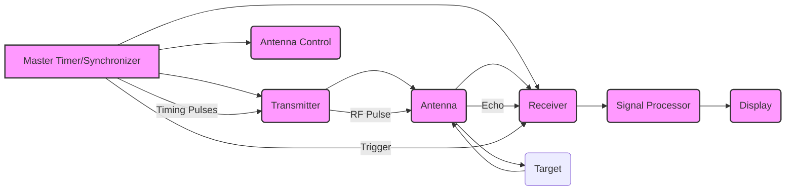

## SATELLITE AND RADAR COMMUNICATION

### Module 3: Basics of Radar: Introduction

### Topic: Radar Block Diagram and Operation

---

### 1. Introduction to Radar (CO3: K2)

**Definition:** RADAR stands for **R**adio **D**etection **A**nd **R**anging. It is an electromagnetic system used for detecting the presence, range, velocity, and other characteristics of objects (targets) by emitting electromagnetic radiation (radio waves or microwaves) and observing the reflected waves.

**Key Principle:** Radar operates on the principle of transmitting a pulse of electromagnetic energy and then listening for the echoes that are reflected back from an object. The time taken for the echo to return indicates the range to the object.

**Applications of Radar:**

*   **Military:** Target detection, tracking, navigation, fire control, early warning.
*   **Civilian:**
    *   **Air Traffic Control (ATC):** Tracking aircraft.
    *   **Weather Forecasting:** Detecting precipitation (rain, snow, hail), wind speed and direction.
    *   **Navigation:** Ship and aircraft navigation, maritime surveillance.
    *   **Remote Sensing:** Earth observation, mapping, environmental monitoring.
    *   **Automotive:** Adaptive cruise control, collision avoidance.
    *   **Law Enforcement:** Speed detection (speed guns).

**Historical Context (Mentioned in Skolnik and Edde):** The development of radar gained significant momentum during World War II for military applications. Early radar systems were relatively crude but proved instrumental.

---

### 2. Basic Radar System Block Diagram (CO3: K2)

A typical radar system can be broken down into several key functional blocks. Understanding this block diagram is crucial to grasping how a radar system operates.

**(Refer to Skolnik, Chapter 2 for detailed block diagrams and components)**

**Explanation of Components:**

*   **Master Timer/Synchronizer:**
    *   **Function:** The "brain" of the radar system. It controls the timing and sequencing of all radar operations. It generates precisely timed pulses that trigger the transmitter, control the antenna's direction (if mechanically scanned), and initiate the receiver's listening period.
    *   **Key Task:** Ensures that the transmitter is only active during the transmission of a pulse and that the receiver is active during the "listen" period for echoes. It also synchronizes the display with the transmitted pulses.

*   **Transmitter:**
    *   **Function:** Generates the high-power radio frequency (RF) or microwave pulses that are radiated into space.
    *   **Key Components:**
        *   **Oscillator (e.g., Magnetron, Klystron, TWT):** Generates the RF signal.
        *   **Modulator:** Shapes the RF signal into pulses with specific duration and repetition rate.
        *   **Power Amplifier:** Amplifies the pulsed RF signal to high power levels.
    *   **Output:** High-power RF pulses.

*   **Antenna:**
    *   **Function:** Radiates the transmitted pulses into space and collects the weak reflected echoes from the target. It also determines the radar's beamwidth and directivity.
    *   **Types:** Parabolic reflector, phased array, horn antenna, etc.
    *   **Key Characteristics:** Gain, beamwidth, directivity, polarization.
    *   **Dual Function:** Typically, the same antenna is used for both transmitting and receiving, switching between these modes using a **Duplexer**.

*   **Duplexer (Not explicitly shown as a separate block but implicitly between Antenna and Transmitter/Receiver):**
    *   **Function:** A high-power switch that connects the antenna to either the transmitter or the receiver. It protects the sensitive receiver from the high-power transmitted pulse while allowing it to receive the weak reflected echoes.
    *   **Types:** Gas discharge tubes, solid-state switches.

*   **Receiver:**
    *   **Function:** Detects and amplifies the weak reflected echoes received by the antenna.
    *   **Key Stages:**
        *   **Low-Noise Amplifier (LNA):** Amplifies the weak echo signal with minimal added noise.
        *   **Mixer:** Shifts the received RF signal to a lower intermediate frequency (IF) for easier processing.
        *   **IF Amplifier:** Further amplifies the signal at the IF.
        *   **Demodulator:** Extracts the information (amplitude, phase, frequency) from the IF signal.
    *   **Output:** A processed signal containing information about the targets.

*   **Signal Processor:**
    *   **Function:** Processes the received signals to extract meaningful information about the targets, such as range, velocity, and angle. This is where the "intelligence" of the radar is derived.
    *   **Key Operations:**
        *   **Filtering:** Removing unwanted noise and clutter (unwanted echoes from the ground, rain, etc.).
        *   **Detection:** Deciding whether a received signal corresponds to a target or is just noise.
        *   **Range Measurement:** Calculating the distance based on the time delay of the echo.
        *   **Doppler Processing:** Measuring the frequency shift of the echo to determine the target's velocity (for Doppler radars).
        *   **Tracking:** Estimating the target's trajectory over time.
    *   **Examples:** Matched filtering, pulse compression, Doppler filters, Constant False Alarm Rate (CFAR) processors.

*   **Display:**
    *   **Function:** Presents the processed radar information to the operator in a visually understandable format.
    *   **Types:**
        *   **PPI (Plan Position Indicator):** A circular display showing a map-like representation of targets relative to the radar. Range is shown radially from the center, and azimuth is shown angularly.
        *   **RHI (Range Height Indicator):** Shows targets in terms of range and elevation.
        *   **A-scope:** Displays signal amplitude versus range.
        *   **B-scope:** Displays signal amplitude versus range, with the display intensity indicating amplitude.
        *   **Digital Displays:** Modern radars use computer-generated displays.

*   **Antenna Control (Optional but crucial for scanning radars):**
    *   **Function:** Directs the antenna's beam to scan a specific volume of space or to track a particular target.
    *   **Mechanisms:** Mechanical rotation/elevation, electronic beam steering (in phased arrays).

---

### 3. Radar Operation (CO3: K2)

The operation of a radar system can be described in a step-by-step manner:

1.  **Timing and Synchronization:** The **Master Timer** generates a periodic pulse that initiates the radar cycle.

2.  **Pulse Transmission:**
    *   The timer triggers the **Transmitter**.
    *   The **Transmitter** generates a high-power RF pulse of a specific duration (e.g., microseconds) and repetition frequency (PRF - pulses per second).
    *   The **Duplexer** connects the **Antenna** to the **Transmitter**.
    *   The **Antenna** radiates the RF pulse into space in a focused beam.

3.  **Propagation and Reflection:**
    *   The transmitted pulse travels through the atmosphere at the speed of light ($c \approx 3 \times 10^8$ m/s).
    *   If the pulse encounters a target, a portion of its energy is reflected back towards the radar.

4.  **Echo Reception:**
    *   The **Antenna** collects the weak reflected echoes.
    *   The **Duplexer** switches from transmitting to receiving mode and connects the **Antenna** to the **Receiver**.

5.  **Signal Reception and Amplification:**
    *   The **Receiver**'s **LNA** amplifies the weak echo signal.
    *   The signal is then mixed down to an IF and further amplified by the **IF Amplifier**.

6.  **Signal Processing:**
    *   The **Signal Processor** analyzes the amplified echo signal.
    *   **Range Determination:** The time delay ($\tau$) between the transmission of the pulse and the reception of the echo is measured. The range ($R$) to the target is calculated using the formula: $R = \frac{c \tau}{2}$. The factor of 2 accounts for the round trip journey of the pulse.
    *   **Detection:** The processor determines if the received signal is strong enough to be classified as a target echo (distinguishing it from noise and clutter).
    *   **Velocity Measurement (Doppler Radar):** If the radar is a Doppler radar, the processor analyzes the frequency shift (Doppler shift) of the echo, which is proportional to the target's radial velocity.
    *   **Angle Determination:** The direction from which the echo is received by the antenna provides information about the target's azimuth and elevation.

7.  **Display and Output:**
    *   The processed information (range, velocity, angle) is presented to the operator on the **Display**. This allows the operator to see the location and movement of targets.

**Important Note on Pulse Repetition Frequency (PRF):**

*   **Definition:** The number of pulses transmitted per second.
*   **Impact on Range:** A higher PRF allows for more frequent updates on targets, leading to better tracking. However, it also introduces the problem of **range ambiguity**. If the time between pulses is less than the time it takes for an echo from a distant target to return, the system might interpret the echo as coming from a closer target that was transmitted in a later pulse.
*   **Relationship:** The maximum unambiguous range ($R_{max}$) is determined by the PRF: $R_{max} = \frac{c}{2 \times PRF}$.

**Important Note on Pulse Width ($\tau_{p}$):**

*   **Definition:** The duration of a single transmitted pulse.
*   **Impact on Range Resolution:** The range resolution of a radar is its ability to distinguish between two closely spaced targets. It is primarily determined by the pulse width: Resolution $\approx \frac{c \tau_{p}}{2}$. A shorter pulse width leads to better range resolution.
*   **Trade-off:** Shorter pulses generally have lower peak power, which can reduce the detection range. This is why techniques like pulse compression are employed.

---

### 4. Key Concepts and Definitions (CO3: K2)

*   **Radar Cross-Section (RCS):** A measure of how detectable an object is by radar. It's the effective area of the target that reflects radar energy back to the radar. Measured in dBsm (decibels squared meters).
*   **Clutter:** Unwanted radar echoes from sources other than the target of interest, such as the ground, rain, sea, birds, or chaff.
*   **Range Resolution:** The minimum distance between two targets on the same bearing that can be distinguished as separate targets.
*   **Azimuth Resolution:** The ability to distinguish between two targets at the same range but at different bearings. It is determined by the antenna beamwidth.
*   **Elevation Resolution:** Similar to azimuth resolution but in the vertical plane.
*   **Doppler Effect:** The change in frequency of the reflected wave due to the relative motion between the radar and the target. Used to measure target velocity.
*   **Pulse Compression:** A technique used to transmit a long pulse (for higher energy) and then process it to achieve the range resolution of a short pulse. This improves both the signal-to-noise ratio (SNR) and range resolution.

---

### 5. Practice Questions and Exercises with Answers

**Question 1:**
A radar system transmits a pulse of 1 microsecond (µs) duration. What is the approximate range resolution of this radar system?

**Answer 1:**
Range Resolution $\approx \frac{c \tau_{p}}{2}$
where $c \approx 3 \times 10^8$ m/s and $\tau_{p} = 1 \times 10^{-6}$ s.
Range Resolution $\approx \frac{(3 \times 10^8 \text{ m/s}) \times (1 \times 10^{-6} \text{ s})}{2} = \frac{300 \text{ m}}{2} = 150 \text{ m}$.
The approximate range resolution is 150 meters.

**Question 2:**
If a radar system has a PRF of 1000 Hz, what is its maximum unambiguous range?

**Answer 2:**
Maximum Unambiguous Range ($R_{max}$) $= \frac{c}{2 \times PRF}$
where $c \approx 3 \times 10^8$ m/s and $PRF = 1000$ Hz.
$R_{max} = \frac{3 \times 10^8 \text{ m/s}}{2 \times 1000 \text{ Hz}} = \frac{3 \times 10^8}{2 \times 10^3} \text{ m} = \frac{3 \times 10^5}{2} \text{ m} = 1.5 \times 10^5 \text{ m} = 150 \text{ km}$.
The maximum unambiguous range is 150 kilometers.

**Question 3:**
Describe the main function of the Master Timer in a radar system.

**Answer 3:**
The Master Timer (or Synchronizer) is the central control unit of the radar system. Its main function is to generate precisely timed pulses that coordinate the operation of all other radar components. This includes triggering the transmitter to emit RF pulses, controlling the receiver's listening periods, and synchronizing the display with the transmitted pulses. It ensures the correct sequencing and timing of the entire radar cycle.

**Question 4:**
Why is a Duplexer necessary in a radar system that uses a single antenna for both transmission and reception?

**Answer 4:**
A Duplexer is necessary to protect the highly sensitive receiver from the extremely high power of the transmitted pulse. Without it, the transmitted pulse would overwhelm and potentially damage the receiver. The duplexer acts as a high-speed switch, connecting the antenna to the transmitter during the transmit phase and to the receiver during the receive phase, allowing the same antenna to be used for both functions.

---

### 6. Important Points to Remember

*   **Radar is a "round trip" system:** The time for the signal to travel to the target and back is key to determining range.
*   **The Duplexer is critical:** It protects the receiver from the transmitter.
*   **Timing is everything:** The Master Timer dictates the operation of the entire radar.
*   **Range resolution is limited by pulse width:** Shorter pulses give better resolution but can mean lower transmit energy.
*   **Maximum unambiguous range is limited by PRF:** Higher PRF means better update rates but potentially ambiguous range measurements.
*   **The display provides human-readable information:** It translates raw signals into a useful format for operators.
*   **Clutter is a major challenge:** Signal processing techniques are vital to separate target echoes from unwanted clutter.

---

## Videos

| Resource Type | Recommended Video |
| :--- | :--- |
| ⚡ **Quick Concept** | [Watch Summary & Animations](https://www.youtube.com/watch?v=gI-qXk7XojA) |
| 🎓 **Exam Deep Dive** | [Watch Comprehensive University Lecture](https://www.youtube.com/watch?v=F_4HkL5r4n0) |
| ✍️ **Problem Solving** | [Watch Solved Examples & Numericals](https://www.youtube.com/watch?v=8XG7U5yN668) |

### 7. Textual References and Alignment with Course Outcomes

*   **Pratt & Allnutt (Satellite Communications):** While this book primarily focuses on satellite communications, the fundamental principles of electromagnetic wave propagation and signal processing are relevant. Concepts like signal-to-noise ratio (SNR) and system design considerations can be implicitly understood.
*   **Skolnik (Introduction to Radar Systems):** This is the primary textbook for understanding radar fundamentals. Chapter 2 directly covers the basic radar system block diagram and operation, aligning perfectly with **CO3**. The details on transmitters, receivers, antennas, and signal processing support **CO3**.
*   **Edde (Radar: Principles, Technology, Applications):** Similar to Skolnik, Edde provides a comprehensive overview of radar systems, their components, and their operation, supporting **CO3**.
*   **Ha (Digital Satellite Communications):** Focuses on digital aspects of satellite communication but reinforces general communication system principles.
*   **Pritchard (Satellite Communications Systems Engineering):** Again, primarily satellite focused, but system engineering principles are transferable.
*   **Kinsley & Quegan (Understanding Radar Systems):** Offers a deep dive into radar principles, processing techniques, and applications, strongly supporting **CO3**.

**Alignment with Course Outcomes:**

*   **CO1: Illustrate the principles of satellite communication (Knowledge Level: K2):** While this topic focuses on radar, the underlying principles of electromagnetic wave transmission, reception, and signal processing are common to both satellite and radar communication systems. Understanding the basic signal path in radar can provide context for similar paths in satellite systems.
*   **CO2: Design and analysis of satellite link (Knowledge Level: K3):** Similar to CO1, the concepts of signal strength, noise, and processing gain encountered in radar analysis are directly applicable to satellite link analysis, albeit with different specific parameters.
*   **CO3: Illustrate Radar Fundamentals like Radar Equation and Applications (Knowledge Level: K2):** This entire topic is dedicated to the fundamentals of radar, including its block diagram and operational principles. The discussion of components like the transmitter, receiver, and antenna, and the basic operational steps, directly addresses this outcome. The principles discussed lay the groundwork for understanding the Radar Equation itself, which will likely be covered in subsequent topics.
*   **CO4: Compare various types of Radars and tracking techniques (Knowledge Level: K2):** While this specific topic doesn't delve into comparing radar types, understanding the basic radar block diagram is a prerequisite for understanding how different types of radars (e.g., pulsed, continuous wave, Doppler) modify these components or their operation to achieve specific functionalities.

This set of notes provides a foundational understanding of how a radar system functions by dissecting its core components and their interconnected roles.