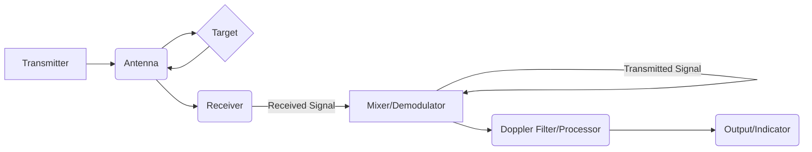

# SATELLITE AND RADAR COMMUNICATION

## Module 4: CW and Frequency Modulated Radar: Doppler Effect

### Topic: Block Diagram and Characteristics (Approaching/ Receding Targets)

---

### **Introduction to Doppler Radar**

This module focuses on Continuous Wave (CW) and Frequency Modulated (FM) radar systems, specifically exploring the application of the Doppler effect for target detection and measurement. We will delve into the fundamental principles, block diagrams, and the characteristics of these radars when dealing with approaching and receding targets.

---

### **1. The Doppler Effect in Radar**

**Definition:** The Doppler effect is the change in frequency of a wave in relation to an observer who is moving relative to the wave source.

**Key Concept:** In radar, the transmitted signal is reflected by a moving target. The relative motion between the radar and the target causes a shift in the frequency of the received signal compared to the transmitted signal. This frequency shift is known as the Doppler shift.

**Formula for Doppler Shift ($f_d$):**

$f_d = \frac{2Rv_r}{\lambda}$

Where:
*   $f_d$ = Doppler shift frequency (Hz)
*   $R$ = Range to the target (meters)
*   $v_r$ = Radial velocity of the target (m/s) (positive for approaching, negative for receding)
*   $\lambda$ = Wavelength of the transmitted signal (meters)

**Relationship with Speed of Light ($c$):**

$\lambda = \frac{c}{f_t}$

Where:
*   $c$ = Speed of light (approximately $3 \times 10^8$ m/s)
*   $f_t$ = Transmitted signal frequency (Hz)

**Substituting $\lambda$:**

$f_d = \frac{2Rv_r}{\frac{c}{f_t}} = \frac{2f_t v_r}{c}$

**Crucial Insight:** The Doppler shift is directly proportional to the radial velocity ($v_r$) of the target. This is the fundamental principle that allows Doppler radars to measure target speed.

---

### **2. Continuous Wave (CW) Radar**

**Principle:** CW radar transmits a continuous, unmodulated electromagnetic wave. The receiver continuously listens for the reflected signal.

**Advantages:**
*   Simple transmitter design.
*   Can achieve very high average power, leading to good detection range.
*   Excellent velocity resolution.

**Disadvantages:**
*   Cannot measure range directly without modifications (e.g., using pulsed CW or FMCW).
*   Suffers from strong clutter (e.g., stationary objects) if not properly addressed, as stationary targets produce zero Doppler shift.

**Block Diagram of a Simple CW Radar:**



**Explanation of Components:**
*   **Transmitter:** Generates the continuous, unmodulated RF signal.
*   **Antenna:** Transmits the RF signal and receives the reflected signal. Often a single antenna for both transmission and reception, or separate transmit and receive antennas.
*   **Target:** The object of interest that reflects the radar signal.
*   **Receiver:** Amplifies the weak received signal.
*   **Mixer/Demodulator:** The core of a CW radar. It mixes the received signal with a portion of the transmitted signal (often from a local oscillator or a sample of the transmitted signal). This heterodyning process produces the Doppler frequency as the output. If the received signal frequency is $f_t + f_d$ and the reference frequency is $f_t$, the mixer output will contain $f_d$.
*   **Doppler Filter/Processor:** Filters the mixed signal to isolate the Doppler frequencies. This can be a bank of filters to identify targets at different velocities. For range, additional techniques are needed.
*   **Output/Indicator:** Displays the detected targets and their velocities.

**Characteristics with Approaching/Receding Targets:**

*   **Approaching Target:** The received signal frequency ($f_r$) will be higher than the transmitted frequency ($f_t$). The Doppler shift ($f_d = f_r - f_t$) will be **positive**.
*   **Receding Target:** The received signal frequency ($f_r$) will be lower than the transmitted frequency ($f_t$). The Doppler shift ($f_d = f_r - f_t$) will be **negative**.

**Example:** If a CW radar transmits at 10 GHz ($10^{10}$ Hz) and detects an approaching car moving at 30 m/s radially towards the radar, the Doppler shift can be calculated:

$f_d = \frac{2 \times 10^{10} \times 30}{3 \times 10^8} = \frac{60 \times 10^{10}}{3 \times 10^8} = 20 \times 10^2 = 2000$ Hz (or 2 kHz).

The receiver would detect a signal at approximately 10 GHz + 2 kHz.

---

### **3. Frequency Modulated Continuous Wave (FMCW) Radar**

**Principle:** FMCW radar transmits a continuous wave whose frequency is varied linearly with time, typically in a sawtooth or triangular pattern. This modulation allows for both velocity and range measurement simultaneously.

**Key Concept: Beat Frequency ($f_b$)**
The difference in frequency between the transmitted and received signals at any given instant is called the beat frequency ($f_b$). This beat frequency is related to both the range and the velocity of the target.

**Block Diagram of an FMCW Radar:**

```mermaid
graph LR
    A[Voltage Controlled Oscillator (VCO)] -- Transmitted Frequency Sweep --> B(Antenna);
    B --> C{Target};
    C --> B;
    B --> D(Receiver);
    D -- Received Signal --> E(Mixer);
    A -- Transmitted Frequency Reference --> E;
    E -- Beat Signal --> F(Low Pass Filter);
    F --> G(Analog to Digital Converter - ADC);
    G --> H(Signal Processor/FFT);
    H --> I(Range & Velocity Output);
```

**Explanation of Components:**
*   **Voltage Controlled Oscillator (VCO):** Generates the continuously sweeping RF signal. The sweep rate and bandwidth are critical parameters.
*   **Antenna:** Transmits and receives.
*   **Target:** Reflects the signal.
*   **Receiver:** Amplifies the received signal.
*   **Mixer:** Mixes the received signal with the transmitted signal (or a reference derived from it). The output is the beat frequency.
*   **Low Pass Filter:** Removes high-frequency components from the mixer output, leaving the beat frequency.
*   **Analog to Digital Converter (ADC):** Converts the analog beat signal into digital data for processing.
*   **Signal Processor/FFT:** Performs Fast Fourier Transform (FFT) or other signal processing techniques to analyze the beat signal. For range, the FFT of the beat signal reveals the beat frequency. For velocity, the Doppler shift is observed as a shift in the FFT spectrum, or through specific processing techniques.
*   **Range & Velocity Output:** Displays the detected range and velocity of targets.

**FMCW with Sawtooth Sweep (Up-Chirp):**

*   **Transmission:** The frequency sweeps upwards from $f_{start}$ to $f_{end}$ over a time period $T_{sweep}$. The rate of frequency change (sweep rate, $S$) is:
    $S = \frac{f_{end} - f_{start}}{T_{sweep}} = \frac{\Delta f}{T_{sweep}}$ (Hz/s)
*   **Received Signal:** The received signal is a delayed version of the transmitted signal. If a target is at range $R$, the time delay $\tau$ is:
    $\tau = \frac{2R}{c}$
*   **Beat Frequency ($f_{b,range}$):** During the up-chirp, the transmitted frequency at the time of reception is higher than the received frequency by a certain amount. The beat frequency is:
    $f_{b,range} = S \times \tau = \frac{\Delta f}{T_{sweep}} \times \frac{2R}{c}$
    This equation shows that the beat frequency is directly proportional to the range ($R$).
*   **Doppler Effect:** If the target is moving, a Doppler shift ($f_d$) is also present.
*   **Total Beat Frequency during Up-Chirp ($f_{bu}$):**
    $f_{bu} = f_{b,range} + f_d$ (for approaching target)
    $f_{bu} = f_{b,range} - f_d$ (for receding target, assuming $f_d$ is magnitude)
    *Note: The sign convention for $f_d$ needs to be carefully considered in the mixer output.*

**FMCW with Sawtooth Sweep (Down-Chirp):**

To uniquely determine both range and velocity, FMCW radars often use two sweeps: an up-chirp and a down-chirp.

*   **Down-Chirp:** The frequency sweeps downwards.
*   **Beat Frequency ($f_{bd}$):** During the down-chirp, the received signal will have a lower frequency than the transmitted signal at the point of mixing.
    $f_{bd} = f_{b,range} - f_d$ (for approaching target)
    $f_{bd} = f_{b,range} + f_d$ (for receding target)

**Range and Velocity Determination:**

By measuring the beat frequencies during both up and down chirps ($f_{bu}$ and $f_{bd}$), we can solve for range ($R$) and velocity ($v_r$):

*   **Sum of beat frequencies:**
    $f_{bu} + f_{bd} = (f_{b,range} + f_d) + (f_{b,range} - f_d) = 2f_{b,range}$
    $f_{b,range} = \frac{f_{bu} + f_{bd}}{2}$
    Since $f_{b,range} = S \times \frac{2R}{c}$, we can solve for Range ($R$):
    $R = \frac{c}{2S} \times f_{b,range} = \frac{c \times T_{sweep}}{4 \Delta f} \times (f_{bu} + f_{bd})$

*   **Difference of beat frequencies:**
    $f_{bu} - f_{bd} = (f_{b,range} + f_d) - (f_{b,range} - f_d) = 2f_d$
    $f_d = \frac{f_{bu} - f_{bd}}{2}$
    Since $f_d = \frac{2f_t v_r}{c}$, we can solve for Velocity ($v_r$):
    $v_r = \frac{c}{2f_t} \times f_d = \frac{c}{4f_t} \times (f_{bu} - f_{bd})$

**Characteristics with Approaching/Receding Targets in FMCW:**

*   **Approaching Target:** The Doppler shift ($f_d$) is positive.
    *   During up-chirp: $f_{bu} = f_{b,range} + f_d$ (higher beat frequency than range-only).
    *   During down-chirp: $f_{bd} = f_{b,range} - f_d$ (lower beat frequency than range-only).
*   **Receding Target:** The Doppler shift ($f_d$) is negative.
    *   During up-chirp: $f_{bu} = f_{b,range} - f_d$ (lower beat frequency than range-only).
    *   During down-chirp: $f_{bd} = f_{b,range} + f_d$ (higher beat frequency than range-only).

**Example (FMCW):**
Consider an FMCW radar with:
*   $f_t = 10$ GHz
*   $\Delta f = 100$ MHz ($100 \times 10^6$ Hz)
*   $T_{sweep} = 50 \mu s$ ($50 \times 10^{-6}$ s)
*   Sweep rate $S = \frac{100 \times 10^6}{50 \times 10^{-6}} = 2 \times 10^{12}$ Hz/s

Target at $R = 100$ m, approaching with $v_r = 50$ m/s.

1.  **Calculate time delay $\tau$:**
    $\tau = \frac{2R}{c} = \frac{2 \times 100}{3 \times 10^8} = \frac{200}{3 \times 10^8} \approx 0.667 \times 10^{-6}$ s

2.  **Calculate range beat frequency $f_{b,range}$:**
    $f_{b,range} = S \times \tau = (2 \times 10^{12}) \times (0.667 \times 10^{-6}) \approx 1.334 \times 10^6$ Hz (1.334 MHz)

3.  **Calculate Doppler frequency $f_d$:**
    $f_d = \frac{2f_t v_r}{c} = \frac{2 \times 10^{10} \times 50}{3 \times 10^8} = \frac{100 \times 10^{10}}{3 \times 10^8} \approx 3.333 \times 10^3$ Hz (3.333 kHz)

4.  **Calculate beat frequencies for up and down chirps:**
    *   Approaching target: $f_d$ is positive.
        $f_{bu} = f_{b,range} + f_d = 1.334 \times 10^6 + 3.333 \times 10^3 \approx 1.337 \times 10^6$ Hz
        $f_{bd} = f_{b,range} - f_d = 1.334 \times 10^6 - 3.333 \times 10^3 \approx 1.331 \times 10^6$ Hz

5.  **Verify by calculating R and $v_r$ from beat frequencies:**
    *   Sum: $f_{bu} + f_{bd} = 1.337 \times 10^6 + 1.331 \times 10^6 = 2.668 \times 10^6$ Hz
        $f_{b,range} = \frac{2.668 \times 10^6}{2} = 1.334 \times 10^6$ Hz (Matches!)
        $R = \frac{c \times T_{sweep}}{4 \Delta f} \times (f_{bu} + f_{bd}) = \frac{(3 \times 10^8) \times (50 \times 10^{-6})}{4 \times (100 \times 10^6)} \times (2.668 \times 10^6)$
        $R = \frac{1.5 \times 10^4}{4 \times 10^8} \times (2.668 \times 10^6) = 0.375 \times 10^{-4} \times (2.668 \times 10^6) \approx 100$ m (Matches!)

    *   Difference: $f_{bu} - f_{bd} = 1.337 \times 10^6 - 1.331 \times 10^6 = 0.006 \times 10^6$ Hz = 6000 Hz
        $f_d = \frac{6000}{2} = 3000$ Hz (Close to 3.333 kHz, due to rounding in intermediate steps)
        $v_r = \frac{c}{4f_t} \times (f_{bu} - f_{bd}) = \frac{3 \times 10^8}{4 \times 10^{10}} \times (6000) = 0.75 \times 10^{-2} \times 6000 \approx 45$ m/s (Close to 50 m/s, again due to rounding).

---

### **4. Characteristics and Applications**

| Characteristic       | CW Radar                                         | FMCW Radar                                                                    |
| :------------------- | :----------------------------------------------- | :---------------------------------------------------------------------------- |
| **Primary Function** | Velocity Measurement                             | Range and Velocity Measurement                                                |
| **Complexity**       | Simple transmitter, but requires complex filtering for range. | More complex transmitter (VCO), mixer, and signal processing.                 |
| **Range Measurement**| Not directly possible. Requires additional modulation or pulse techniques. | Directly possible by analyzing beat frequency.                                |
| **Velocity Measurement**| Directly by measuring Doppler shift.            | Directly by measuring Doppler shift component from beat frequencies.           |
| **Clutter Rejection**| Can be challenging for stationary targets (zero Doppler). Requires filters to remove low Doppler frequencies. | Can reject stationary clutter by observing beat frequencies other than zero. |
| **Applications**     | Speed guns, missile fuzes, air traffic control (velocity), intrusion alarms. | Automotive radar (ACC, collision avoidance), level sensing, short-range surveillance, altimeters. |

---

### **5. Handling Approaching vs. Receding Targets**

*   **CW Radar:**
    *   **Approaching:** Positive Doppler shift ($f_d > 0$). The received signal frequency is $f_t + f_d$.
    *   **Receding:** Negative Doppler shift ($f_d < 0$). The received signal frequency is $f_t - |f_d|$.
    *   A simple CW radar system would receive a higher frequency for approaching targets and a lower frequency for receding targets, relative to the transmitted frequency. The magnitude of the frequency difference indicates the speed, and the sign (higher/lower) indicates the direction.

*   **FMCW Radar:**
    *   **Approaching:**
        *   Up-chirp: Beat frequency $f_{bu} = f_{b,range} + f_d$.
        *   Down-chirp: Beat frequency $f_{bd} = f_{b,range} - f_d$.
        *   The beat frequency during the up-chirp is *higher* than expected for range alone, and lower during the down-chirp.
    *   **Receding:**
        *   Up-chirp: Beat frequency $f_{bu} = f_{b,range} - f_d$.
        *   Down-chirp: Beat frequency $f_{bd} = f_{b,range} + f_d$.
        *   The beat frequency during the up-chirp is *lower* than expected for range alone, and higher during the down-chirp.
    *   The differences ($f_{bu} - f_{bd}$) are crucial for distinguishing between approaching and receding targets and accurately determining velocity.

---

### **6. Learning Outcome Mapping**

*   **CO1 (Illustrate principles of satellite communication):** While this module focuses on radar, the underlying principle of frequency modulation and wave propagation has parallels in satellite communication, particularly in FDM/FM techniques and Doppler shift due to satellite motion. However, the direct application here is in radar.
*   **CO2 (Design and analysis of satellite link):** Not directly applicable to this specific radar module.
*   **CO3 (Illustrate Radar Fundamentals like Radar Equation and Applications):** This module directly illustrates radar fundamentals by explaining the Doppler effect, its relation to velocity, and the fundamental principles of CW and FMCW radar. Applications like speed guns and automotive radar are also touched upon.
*   **CO4 (Compare various types of Radars and tracking techniques):** This module compares CW and FMCW radar, highlighting their strengths, weaknesses, and operational principles, which is a form of comparing radar types.

---

### **7. Key Points to Remember**

*   **Doppler Effect:** The fundamental principle for velocity measurement in CW and FMCW radars.
*   **Radial Velocity:** Doppler shift is directly proportional to the component of target velocity along the radar's line of sight.
*   **CW Radar:** Excellent for velocity measurement but not direct range.
*   **FMCW Radar:** Can measure both range and velocity simultaneously using frequency sweeps.
*   **Beat Frequency:** The output of the mixer in FMCW radar, which contains information about range and velocity.
*   **Sawtooth/Triangular Sweep:** Common modulation schemes in FMCW radar.
*   **Two-Chirp FMCW:** Essential for resolving range and velocity ambiguity and distinguishing between approaching and receding targets.
*   **Approaching Target:** Positive Doppler shift, higher received frequency (CW), higher beat frequency during up-chirp (FMCW).
*   **Receding Target:** Negative Doppler shift, lower received frequency (CW), lower beat frequency during up-chirp (FMCW).

---

### **8. Practice Questions and Answers**

**Question 1:** A CW radar transmits at a frequency of 24 GHz. What is the Doppler shift produced by a target moving directly towards the radar at a speed of 20 m/s?
    *(Knowledge Level: K2 - CO3)*

**Answer 1:**
Using the Doppler shift formula: $f_d = \frac{2f_t v_r}{c}$
$f_d = \frac{2 \times (24 \times 10^9 \, \text{Hz}) \times (20 \, \text{m/s})}{3 \times 10^8 \, \text{m/s}}$
$f_d = \frac{2 \times 24 \times 20}{3} \times 10^{9-8} \, \text{Hz}$
$f_d = \frac{960}{3} \times 10^1 \, \text{Hz}$
$f_d = 320 \times 10 \, \text{Hz}$
$f_d = 3200 \, \text{Hz} = 3.2 \, \text{kHz}$

**Question 2:** In an FMCW radar with a sawtooth sweep, what is the relationship between the beat frequency ($f_b$) and the target's range ($R$) when only considering the frequency sweep and not the Doppler effect?
    *(Knowledge Level: K2 - CO3)*

**Answer 2:**
The beat frequency ($f_b$) due to range is directly proportional to the range ($R$) and the sweep rate ($S$), and inversely proportional to the speed of light ($c$).
$f_{b,range} = S \times \tau = S \times \frac{2R}{c}$
So, $f_b \propto R$.

**Question 3:** An FMCW radar uses a single sawtooth sweep (up-chirp) and detects a beat frequency ($f_{bu}$) of 10 kHz. If the radar transmitted at 77 GHz, and the target is approaching, how does this beat frequency compare to the beat frequency that would be observed if the target were stationary at the same range?
    *(Knowledge Level: K2 - CO3)*

**Answer 3:**
For an approaching target, the Doppler shift ($f_d$) is positive. The beat frequency during an up-chirp is given by $f_{bu} = f_{b,range} + f_d$.
If the target were stationary at the same range, the Doppler shift would be zero, so the beat frequency would be $f_{b,stationary} = f_{b,range}$.
Since $f_d > 0$ for an approaching target, $f_{bu} = f_{b,range} + f_d > f_{b,range}$.
Therefore, the detected beat frequency ($f_{bu} = 10$ kHz) will be **higher** than the beat frequency that would be observed if the target were stationary at the same range.

**Question 4:** Explain why FMCW radars often use two chirps (e.g., up-chirp and down-chirp) instead of just one to measure both range and velocity.
    *(Knowledge Level: K2 - CO4)*

**Answer 4:**
A single chirp FMCW radar produces a beat frequency that is a combination of the range-dependent beat frequency and the Doppler shift: $f_b = f_{b,range} \pm f_d$. This single equation has two unknowns ($R$ and $v_r$, through $f_{b,range}$ and $f_d$), making it impossible to solve for both uniquely.
By using two chirps with opposite frequency sweep directions (e.g., up-chirp and down-chirp), we obtain two different beat frequencies:
For an approaching target:
*   Up-chirp: $f_{bu} = f_{b,range} + f_d$
*   Down-chirp: $f_{bd} = f_{b,range} - f_d$
By solving these two linear equations, we can uniquely determine both $f_{b,range}$ (and thus $R$) and $f_d$ (and thus $v_r$). This two-chirp method resolves the ambiguity and allows for accurate measurement of both range and radial velocity.

---

## Videos

| Resource Type | Recommended Video |
| :--- | :--- |
| ⚡ **Quick Concept** | [Watch Summary & Animations](https://www.youtube.com/watch?v=gI-qXk7XojA) |
| 🎓 **Exam Deep Dive** | [Watch Comprehensive University Lecture](https://www.youtube.com/watch?v=M0mx8S05v60) |
| ✍️ **Problem Solving** | [Watch Solved Examples & Numericals](https://www.youtube.com/watch?v=8XG7U5yN668) |


### **8. References**

*   **Pratt, T., & Allnutt, J. (2021). *Satellite Communications* (3rd ed.). Wiley.** (While primarily on satellite comms, principles of wave transmission, modulation, and Doppler shifts due to satellite motion are relevant in a broader sense.)
*   **Skolnik, M. I. (2017). *Introduction to Radar Systems* (2nd ed.). Tata McGraw-Hill.** (This is a core textbook for radar systems, providing in-depth coverage of CW and FMCW radar, Doppler principles, block diagrams, and target characteristics.)
*   **Edde, B. (2004). *Radar: Principles, Technology, Applications*. Pearson.** (Offers insights into radar principles and applications, including Doppler radar.)
*   **Kinsley, S., & Quegan, S. (1999). *Understanding Radar Systems*. John Wiley & Sons.** (Provides foundational understanding of radar systems, which is applicable to the Doppler effect and radar types discussed here.)

---