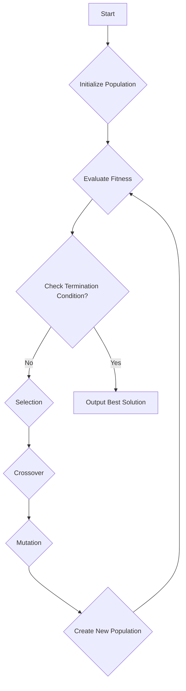

# Operations Research: Module 3 - Non-Linear Programming & Introduction to Evolutionary Algorithms

## Topic: Solving Simple Problems using Genetic Algorithms (GA)

This module introduces non-linear programming concepts and then delves into evolutionary algorithms, specifically focusing on solving simple problems using Genetic Algorithms (GA).

### Learning Outcomes Covered:

*   **Understand the basic principles of Genetic Algorithms.** (Implicitly supports CO4)
*   **Apply GA to solve simple optimization problems.** (Directly supports CO4)

### Course Outcomes Addressed:

*   **CO4: To apply evolutionary algorithms for optimization problems (Knowledge Level: K2, K3)**

---

### 1. Introduction to Genetic Algorithms (GA)

Genetic Algorithms are a class of **evolutionary algorithms** that mimic the process of natural selection and evolution. They are particularly effective for solving complex optimization and search problems where traditional methods might struggle.

**Key Concepts:**

*   **Evolutionary Computation:** A subfield of Artificial Intelligence that uses principles of evolution to solve computational problems.
*   **Natural Selection:** The process where organisms with traits better suited to their environment tend to survive and reproduce more offspring.
*   **Survival of the Fittest:** The principle that the most adaptable individuals are most likely to survive.
*   **Biologically Inspired:** GA is inspired by Darwin's theory of evolution, including concepts like chromosomes, genes, reproduction, mutation, and crossover.

**Why use GA?**

*   Suitable for complex, non-linear, and multi-modal objective functions.
*   Can handle problems with discrete or continuous variables.
*   Robust to noisy or incomplete data.
*   Can explore a large search space effectively.

**Reference:**
*   *Soft Computing Fundamentals and Applications* by Dilip K. Pratikar (2015) provides a good overview of soft computing techniques, including GA.
*   *Operations Research-Principles and Applications* by Srinivasan, G. (2017) might touch upon optimization techniques that GA can be applied to, even if not explicitly detailing GA.

---

### 2. Core Components of a Genetic Algorithm

A GA operates on a population of potential solutions, iteratively improving them through a series of genetic operators.

**2.1 Representation (Encoding)**

*   **Chromosome/Individual:** A single potential solution to the problem.
*   **Gene:** A basic unit of information within a chromosome, representing a part of the solution.
*   **Encoding Schemes:** How a potential solution is represented as a chromosome.
    *   **Binary Encoding:** The most common. Each gene is a binary digit (0 or 1). This is suitable for problems with discrete variables or for representing logical conditions.
        *   *Example:* If we are trying to find the optimal combination of items (with presence/absence), a binary string can represent this. `10110` could mean item 1 is included, item 2 is not, item 3 is included, etc.
    *   **Real-valued Encoding:** Used for problems with continuous variables. Each gene is a real number within a specified range.
        *   *Example:* If optimizing a function `f(x, y)`, a chromosome could be `[x_value, y_value]`.
    *   **Permutation Encoding:** Used for problems where the order matters, like the Traveling Salesperson Problem (TSP). The chromosome is a permutation of a set of items.
        *   *Example:* For TSP with cities A, B, C, D, a chromosome `[B, D, A, C]` represents a tour visiting cities in that order.

**2.2 Population Initialization**

*   The GA starts with an initial population of chromosomes.
*   This population is usually generated randomly, ensuring diversity.
*   The size of the population is a crucial parameter that affects convergence speed and solution quality.

**2.3 Fitness Function**

*   **Fitness:** A measure of how good a particular chromosome (solution) is.
*   The fitness function directly relates to the objective function of the optimization problem.
*   **Maximization Problems:** Fitness is often directly proportional to the objective function value.
*   **Minimization Problems:** Fitness is often the inverse of the objective function value (e.g., `1 / objective_function_value`) or some transformation to make it a maximization problem.

**Important Point to Remember:** The fitness function is the bridge between the problem's objective and the GA's evolutionary process.

**2.4 Genetic Operators**

These operators are applied to the current population to generate the next generation.

*   **Selection:**
    *   **Purpose:** To choose individuals from the current generation that will participate in reproduction, favoring those with higher fitness.
    *   **Methods:**
        *   **Roulette Wheel Selection:** The probability of selecting an individual is proportional to its fitness. Imagine a roulette wheel where each segment's size corresponds to an individual's fitness.
        *   **Tournament Selection:** A subset of individuals is randomly chosen, and the fittest among them is selected. This is repeated to select more individuals.
        *   **Rank Selection:** Individuals are ranked based on their fitness, and selection probability is based on rank, not raw fitness values. This prevents premature convergence caused by a few very fit individuals dominating the population.

*   **Crossover (Recombination):**
    *   **Purpose:** To combine genetic material from two parent chromosomes to create one or more offspring. This allows for the exploration of new solution combinations.
    *   **Types (for Binary Encoding):**
        *   **Single-Point Crossover:** A random point is chosen in the chromosomes, and the genetic material after that point is swapped between the parents.
            ```
            Parent 1: 1101 | 0100
            Parent 2: 1000 | 1110
            --------------------
            Offspring 1: 1101 | 1110
            Offspring 2: 1000 | 0100
            ```
        *   **Two-Point Crossover:** Two random points are chosen, and the segment between them is swapped.
        *   **Uniform Crossover:** Each gene is swapped with a certain probability (e.g., 50%).

*   **Mutation:**
    *   **Purpose:** To introduce random changes into the chromosomes. This prevents the algorithm from getting stuck in local optima and maintains diversity.
    *   **Types (for Binary Encoding):**
        *   **Bit Flip Mutation:** A randomly selected gene (bit) is flipped from 0 to 1 or 1 to 0.
            ```
            Chromosome: 11010100
            Mutated (at 3rd bit): 11110100
            ```
    *   **Mutation Rate:** A small probability that determines how often mutation occurs.

**Important Point to Remember:** Crossover combines good features, while mutation introduces new variations.

---

### 3. The Genetic Algorithm Process (Flowchart)



**Algorithm Steps:**

1.  **Initialization:** Create an initial population of `N` chromosomes, usually randomly.
2.  **Fitness Evaluation:** Calculate the fitness of each chromosome in the population.
3.  **Termination Check:** If a termination condition is met (e.g., maximum number of generations reached, desired fitness achieved), stop and output the best chromosome found.
4.  **Selection:** Select chromosomes from the current population to be parents for the next generation, based on their fitness.
5.  **Crossover:** Apply crossover to pairs of selected parents with a certain probability (`crossover_rate`) to create offspring.
6.  **Mutation:** Apply mutation to the offspring with a low probability (`mutation_rate`).
7.  **New Population:** Form the next generation by replacing the old population with the newly created offspring (or a mix of parents and offspring, depending on the elitism strategy).
8.  **Repeat:** Go back to step 2.

**Elitism:** A strategy where the best chromosome(s) from the current generation are directly copied to the next generation, ensuring that the best solution found so far is not lost.

---

### 4. Solving Simple Problems Using GA

Let's illustrate with a simple example.

**Problem:** Maximize the function $f(x) = x^2$ for $x$ in the range [0, 31].

**Step 1: Representation (Encoding)**

Since $x$ is an integer in the range [0, 31], we can use binary encoding. The range [0, 31] requires $2^5 = 32$ possible values, so we need 5 bits.
*   $x = 0$ is represented by `00000`.
*   $x = 31$ is represented by `11111`.

A chromosome will be a 5-bit binary string.

**Step 2: Initialization**

Let's assume a population size of 4. We randomly generate 4 chromosomes (binary strings):

*   Chromosome 1: `01011`
*   Chromosome 2: `11001`
*   Chromosome 3: `10100`
*   Chromosome 4: `00110`

**Step 3: Fitness Evaluation**

The fitness function is $f(x) = x^2$. We need to decode the binary string to its integer value first.

*   **Chromosome 1 (`01011`):**
    *   Decimal value: $0 \times 16 + 1 \times 8 + 0 \times 4 + 1 \times 2 + 1 \times 1 = 8 + 2 + 1 = 11$
    *   Fitness: $f(11) = 11^2 = 121$

*   **Chromosome 2 (`11001`):**
    *   Decimal value: $1 \times 16 + 1 \times 8 + 0 \times 4 + 0 \times 2 + 1 \times 1 = 16 + 8 + 1 = 25$
    *   Fitness: $f(25) = 25^2 = 625$

*   **Chromosome 3 (`10100`):**
    *   Decimal value: $1 \times 16 + 0 \times 8 + 1 \times 4 + 0 \times 2 + 0 \times 1 = 16 + 4 = 20$
    *   Fitness: $f(20) = 20^2 = 400$

*   **Chromosome 4 (`00110`):**
    *   Decimal value: $0 \times 16 + 0 \times 8 + 1 \times 4 + 1 \times 2 + 0 \times 1 = 4 + 2 = 6$
    *   Fitness: $f(6) = 6^2 = 36$

**Fitness Values:** [121, 625, 400, 36]

**Step 4: Termination Check**

Let's say our termination condition is 10 generations. We haven't reached it yet.

**Step 5: Selection (Roulette Wheel)**

Calculate total fitness: $121 + 625 + 400 + 36 = 1182$

Calculate selection probabilities:
*   Chr 1: $121 / 1182 \approx 0.102$
*   Chr 2: $625 / 1182 \approx 0.529$
*   Chr 3: $400 / 1182 \approx 0.338$
*   Chr 4: $36 / 1182 \approx 0.030$

Cumulative probabilities:
*   Chr 1: 0.102
*   Chr 2: 0.102 + 0.529 = 0.631
*   Chr 3: 0.631 + 0.338 = 0.969
*   Chr 4: 0.969 + 0.030 = 0.999 (rounding might cause slight deviation)

Generate 4 random numbers (between 0 and 1) for selection:
*   R1 = 0.75 (Selects Chr 2)
*   R2 = 0.20 (Selects Chr 2)
*   R3 = 0.50 (Selects Chr 2)
*   R4 = 0.90 (Selects Chr 3)

Selected Parents: Chr 2, Chr 2, Chr 2, Chr 3. (This demonstrates how fitter individuals are selected more often).

**Step 6: Crossover**

Let's use single-point crossover with a rate of 0.7. We pair the selected parents: (Chr 2, Chr 2) and (Chr 3, Chr 2).

*   **Pair 1 (Chr 2, Chr 2):** `11001` and `11001`. Crossover will produce identical offspring.
    *   Let's assume a random crossover point at index 3 (after the 3rd bit):
        ```
        Parent 1: 110 | 01
        Parent 2: 110 | 01
        ------------------
        Offspring 1: 110 | 01 (11001)
        Offspring 2: 110 | 01 (11001)
        ```

*   **Pair 2 (Chr 3, Chr 2):** `10100` and `11001`. Assume crossover point at index 2.
    ```
    Parent 1: 10 | 100
    Parent 2: 11 | 001
    ------------------
    Offspring 3: 10 | 001 (10001)
    Offspring 4: 11 | 100 (11100)
    ```
    (Note: Crossover probability is applied to pairs. If the random number for a pair is > 0.7, crossover doesn't happen, and offspring are clones of parents.)

**Step 7: Mutation**

Let's use bit-flip mutation with a rate of 0.1 (per bit). We apply this to the offspring.

*   **Offspring 1 (`11001`):** No mutation occurs (assume random chance).
*   **Offspring 2 (`11001`):** No mutation occurs.
*   **Offspring 3 (`10001`):** Assume a mutation at the 3rd bit (0 -> 1). Becomes `10101`.
*   **Offspring 4 (`11100`):** Assume no mutation.

Mutated Offspring: `11001`, `11001`, `10101`, `11100`.

**Step 8: Create New Population**

The new population for Generation 2 is:
*   Chromosome 5: `11001` (decimal 25, fitness 625)
*   Chromosome 6: `11001` (decimal 25, fitness 625)
*   Chromosome 7: `10101` (decimal 21, fitness $21^2 = 441$)
*   Chromosome 8: `11100` (decimal 28, fitness $28^2 = 784$)

**Generation 2 Population:** [`11001`, `11001`, `10101`, `11100`]

**Continue Iterations:** Repeat steps 3-8 for the new population. We can see that the fitness values are increasing, and the chromosomes are getting closer to `11111` (decimal 31, fitness 961).

---

### 5. Practice Questions

**Question 1:**
Consider the problem of maximizing the function $f(x) = x$ for $x$ in the range [0, 7]. We are using GA with a population size of 4, binary encoding, and 3 bits per chromosome.
Initial Population:
*   Chr 1: `101`
*   Chr 2: `011`
*   Chr 3: `110`
*   Chr 4: `001`

a) Calculate the fitness of each chromosome.
b) If roulette wheel selection is used and the random numbers generated for selection are 0.85, 0.30, 0.95, 0.60, what individuals will be selected as parents?
c) If single-point crossover with a rate of 0.8 is applied to pairs (Chr 1, Chr 3) and (Chr 2, Chr 4), and the crossover points are at index 2 for the first pair and index 1 for the second pair, what are the offspring?
d) If bit-flip mutation occurs with a rate of 0.1 and the following mutations happen in the offspring:
    *   Offspring 1 (from Chr 1, Chr 3) mutates at the 1st bit.
    *   Offspring 2 (from Chr 2, Chr 4) does not mutate.
    What is the new population for the next generation?

**Answer 1:**

a) **Fitness Calculation:**
    *   Range [0, 7] requires 3 bits ($2^3 = 8$).
    *   Chr 1 (`101`): Decimal $1 \times 4 + 0 \times 2 + 1 \times 1 = 5$. Fitness $f(5) = 5$.
    *   Chr 2 (`011`): Decimal $0 \times 4 + 1 \times 2 + 1 \times 1 = 3$. Fitness $f(3) = 3$.
    *   Chr 3 (`110`): Decimal $1 \times 4 + 1 \times 2 + 0 \times 1 = 6$. Fitness $f(6) = 6$.
    *   Chr 4 (`001`): Decimal $0 \times 4 + 0 \times 2 + 1 \times 1 = 1$. Fitness $f(1) = 1$.
    *   Fitness Values: [5, 3, 6, 1]

b) **Selection:**
    *   Total Fitness: $5 + 3 + 6 + 1 = 15$.
    *   Probabilities:
        *   Chr 1: $5/15 \approx 0.333$
        *   Chr 2: $3/15 = 0.200$
        *   Chr 3: $6/15 = 0.400$
        *   Chr 4: $1/15 \approx 0.067$
    *   Cumulative Probabilities:
        *   Chr 1: 0.333
        *   Chr 2: 0.333 + 0.200 = 0.533
        *   Chr 3: 0.533 + 0.400 = 0.933
        *   Chr 4: 0.933 + 0.067 = 1.000
    *   Random Numbers: 0.85, 0.30, 0.95, 0.60
    *   Selection Mapping:
        *   0.85 falls between 0.533 and 0.933 -> Selects Chr 3
        *   0.30 falls between 0.333 and 0.533 -> Selects Chr 2
        *   0.95 falls between 0.933 and 1.000 -> Selects Chr 4
        *   0.60 falls between 0.533 and 0.933 -> Selects Chr 3
    *   Selected Parents: Chr 3, Chr 2, Chr 4, Chr 3. (To form 2 pairs, we can take first two and last two: (Chr 3, Chr 2) and (Chr 4, Chr 3)).

c) **Crossover:**
    *   Pair 1 (Chr 3, Chr 2): `110` and `011`. Crossover point at index 2.
        ```
        Parent 1: 11 | 0
        Parent 2: 01 | 1
        -----------------
        Offspring 1a: 11 | 1 (111)
        Offspring 1b: 01 | 0 (010)
        ```
    *   Pair 2 (Chr 4, Chr 3): `001` and `110`. Crossover point at index 1.
        ```
        Parent 1: 0 | 01
        Parent 2: 1 | 10
        -----------------
        Offspring 2a: 0 | 10 (010)
        Offspring 2b: 1 | 01 (101)
        ```
    *   The offspring are: `111`, `010`, `010`, `101`.

d) **Mutation:**
    *   Assume the mutations occur on the first offspring generated from each pair.
    *   Offspring 1a (`111`): Mutates at 1st bit (1 -> 0). Becomes `011`.
    *   Offspring 2a (`010`): Does not mutate. Remains `010`.
    *   The new population consists of the mutated offspring and potentially the other offspring (depending on how the new population is formed. Assuming elitism or just replacing). If we replace the original population with these two offspring, the new population would be `011` and `010`.
    *   If we generate 4 offspring per generation and replace the 4 parents, the new population would be: `011` (mutated 1a), `010` (unmutated 1b), `010` (unmutated 2a), `101` (unmutated 2b).
    *   **New Population:** [`011`, `010`, `010`, `101`] (Fitness: 3, 2, 2, 5)

**Question 2:**
What are the advantages of using Genetic Algorithms over traditional optimization methods for certain types of problems? (Refer to CO4)

**Answer 2:**
Genetic Algorithms offer several advantages for specific problem types:
*   **Robustness to Non-linearity and Non-differentiability:** GA can handle objective functions that are complex, non-linear, or even discontinuous, where gradient-based methods might fail. (Supports CO4)
*   **Global Search Capability:** Unlike local search methods that can get trapped in local optima, GA's probabilistic nature and population-based approach allow it to explore a wider search space and find a global optimum. (Supports CO4)
*   **Handling of Constraints:** While requires careful encoding or penalty functions, GA can be adapted to handle constrained optimization problems. (Supports CO4)
*   **Parallelism:** The operations on different individuals within a population can often be performed in parallel, leading to potential speedups. (Supports CO4)
*   **No Gradient Information Required:** GA does not need derivative information of the objective function, making it suitable for problems where derivatives are difficult or impossible to compute. (Supports CO4)

---

### 6. Important Points to Remember

*   **Encoding is Crucial:** The choice of representation (binary, real-valued, permutation) significantly impacts the GA's performance.
*   **Fitness Function:** Must accurately reflect the problem's objective. For minimization, it needs to be transformed into a maximization problem.
*   **Parameter Tuning:** GA performance is sensitive to parameters like population size, crossover rate, and mutation rate. These often require experimentation.
*   **Convergence:** GA aims to converge towards optimal or near-optimal solutions. Understanding termination conditions is important.
*   **GA is a Heuristic:** While powerful, it doesn't guarantee finding the absolute global optimum, especially for very complex problems, but it often finds very good solutions.
*   **Elitism:** Consider using elitism to preserve the best solutions found across generations.

---

## Videos

| Resource Type | Recommended Video |
| :--- | :--- |
| ⚡ **Quick Concept** | [Watch Summary & Animations](https://www.youtube.com/watch?v=423c-v3_2X8) |
| 🎓 **Exam Deep Dive** | [Watch Comprehensive University Lecture](https://www.youtube.com/watch?v=9GMBpZZtjXM) |
| ✍️ **Problem Solving** | [Watch Solved Examples & Numericals](https://www.youtube.com/watch?v=KzE_56Hk5B8) |


### 7. Textbook and Reference Material Integration

*   **Srinivasan, G. (2017) & Gupta & Hira (2008) & Vohra & Arora (2021):** These general Operations Research textbooks would likely cover optimization problems that GA can be applied to, such as those found in linear programming or even some non-linear programming scenarios. They establish the need for optimization techniques.
*   **Pratikar (2015):** This book is likely to provide direct coverage of GA principles, its components, and potentially some introductory examples, aligning well with the learning outcomes.
*   **Rao (2nd ed.) & Hillier & Leiberman (11th ed.) & Ravindran, Phillips, Solberg (1987) & Goel & Mittal (1999):** These references, particularly those focused on optimization, will provide the theoretical underpinnings for problems that GA can solve. While they might not detail GA itself, they will cover the types of objective functions and constraints that GA is designed to handle, thus supporting the application context of CO4. For example, they might discuss non-linear functions or combinatorial optimization problems where GA excels.

---

This comprehensive set of notes covers the fundamental aspects of solving simple problems using Genetic Algorithms, directly addressing CO4 and building a foundation for applying evolutionary algorithms in optimization.