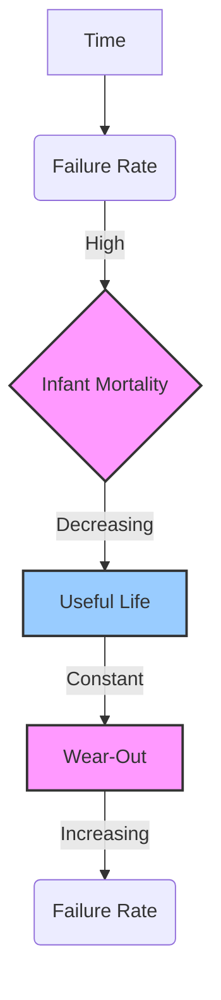

This is a comprehensive set of study notes for the topic "Reliability Engineering" within Module 4 of Industrial and Systems Engineering. These notes are structured to cover the provided learning outcomes and align with the specified textbooks and course outcomes.

---

# Industrial and Systems Engineering: Module 4 - Quality Management

## Topic: Reliability Engineering

**Knowledge Level Alignment:** This topic primarily contributes to **CO1 (Implement various tools and techniques)** and **CO6 (Implement different quality control techniques)**, as reliability engineering involves systematic approaches and data analysis for product/system performance. While not explicitly stated, understanding reliability is foundational for good quality management.

---

### 1. Introduction to Reliability Engineering

**Definition:** Reliability engineering is a branch of engineering that focuses on ensuring that a product, system, or component performs its intended function without failure for a specified period under given conditions. It is concerned with the probability of failure-free operation.

**Importance:**
*   **Customer Satisfaction:** Reliable products lead to happier customers and reduced complaints.
*   **Cost Reduction:** Minimizes warranty costs, repair costs, and downtime.
*   **Safety:** Crucial for systems where failure can lead to injury or loss of life (e.g., aerospace, medical devices).
*   **Reputation:** Builds brand loyalty and a positive company image.
*   **Operational Efficiency:** Ensures continuous operation of manufacturing systems and services.

**Referenced Textbooks:**
*   **M. T. Telsang, "Industrial Engineering & Production Management":** Discusses the role of reliability in overall production efficiency and quality.
*   **R. Paneerselvam, "Production and Operations Management":** Covers reliability as a key aspect of product design and life cycle management.
*   **B. Mahadevan, "Operations Management: Theory and Practice":** Emphasizes reliability in the context of service operations and product availability.

---

### 2. Causes of Failures

Failures in products and systems can arise from various sources. Understanding these causes is crucial for designing for reliability and implementing preventative measures.

#### **2.1 Intrinsic Causes (Design & Manufacturing Related)**

These are failures originating from inherent flaws in the design or manufacturing process.

*   **Design Defects:**
    *   **Inadequate Stress Analysis:** Designing components without fully understanding the stresses they will endure.
    *   **Material Selection:** Using materials that are not suitable for the operating environment or expected loads.
    *   **Component Overstressing:** Designing a system where individual components are pushed beyond their limits.
    *   **Poor Design for Manufacturability:** Designing components that are difficult to produce consistently, leading to variations.
    *   **Lack of Redundancy:** Not incorporating backup systems for critical functions.
*   **Manufacturing Defects:**
    *   **Poor Workmanship:** Errors made during assembly or fabrication (e.g., improper soldering, loose connections).
    *   **Material Imperfections:** Using materials with inherent flaws or contaminants.
    *   **Process Variations:** Inconsistent manufacturing processes leading to variations in product quality (e.g., inconsistent heat treatment, improper machining tolerances).
    *   **Contamination:** Introduction of foreign particles or substances during manufacturing.
    *   **Assembly Errors:** Incorrect assembly sequences or damage to components during assembly.

#### **2.2 Extrinsic Causes (Environmental & Operational Related)**

These are failures caused by external factors during the product's life cycle.

*   **Environmental Factors:**
    *   **Temperature Extremes:** Exposure to high or low temperatures beyond design limits.
    *   **Humidity and Moisture:** Corrosion, electrical shorts.
    *   **Vibration and Shock:** Mechanical stress leading to fatigue or physical damage.
    *   **Corrosive Atmospheres:** Chemical degradation of materials.
    *   **Radiation:** Degradation of materials and electronic components.
*   **Operational Factors:**
    *   **User Misuse:** Operating the product outside its intended parameters or incorrect usage.
    *   **Improper Maintenance:** Lack of or incorrect maintenance procedures.
    *   **Overloading:** Exceeding the designed load capacity.
    *   **Power Surges/Fluctuations:** Damage to electrical components.

**Referenced Textbooks:**
*   **Montegomery, "Statistical Quality Control":** Provides detailed explanations of how process variations and external factors contribute to product failures.
*   **Philips E. Hicks, "Industrial Engineering and Management – A new perspective":** Discusses the impact of operational factors and human errors on system reliability.

---

### 3. The Bathtub Curve

The Bathtub Curve is a graphical representation of the failure rate of a product or system over its entire life cycle. It typically consists of three distinct periods:

#### **3.1 Infant Mortality (Early Life Failures)**

*   **Shape:** High initial failure rate that rapidly decreases over time.
*   **Causes:** Primarily due to design flaws, manufacturing defects, and assembly errors (intrinsic causes). These are often "weak" units that fail early.
*   **Example:** A newly manufactured electronic device failing within the first few hours of operation due to a faulty component.
*   **Mitigation:** Burn-in testing, rigorous quality control during manufacturing.

#### **3.2 Useful Life (Constant Failure Rate)**

*   **Shape:** A period of relatively constant, low failure rate.
*   **Causes:** Failures during this period are often random and unpredictable, caused by external factors or sudden, unexpected events (extrinsic causes).
*   **Example:** A machine component failing due to an unexpected power surge or a random material defect that wasn't apparent initially.
*   **Mitigation:** Regular preventative maintenance, monitoring operating conditions, quality assurance.

#### **3.3 Wear-Out (Late Life Failures)**

*   **Shape:** Failure rate begins to increase significantly as the product or system ages.
*   **Causes:** Degradation of materials, fatigue, wear and tear due to prolonged use (extrinsic causes becoming dominant).
*   **Example:** An engine part failing due to accumulated wear and tear after years of service, or a plastic component becoming brittle and cracking.
*   **Mitigation:** Scheduled replacement of components, planned obsolescence considerations, predictive maintenance.

**Important Points to Remember:**
*   The curve assumes a consistent operating environment and usage pattern.
*   The duration and shape of each phase can vary significantly based on the product type and industry.

**Referenced Textbooks:**
*   **M. T. Telsang, "Industrial Engineering & Production Management":** Explains the bathtub curve in the context of product life cycles and maintenance strategies.
*   **Montegomery, "Statistical Quality Control":** Provides statistical models and methods for analyzing failure rates and fitting the bathtub curve.

---

### 4. System Reliability

System reliability is the probability that a system composed of multiple components will perform its intended function. The reliability of a system is generally lower than the reliability of its individual components.

#### **4.1 Series Systems**

*   **Definition:** A system where all components must function correctly for the system to function. If even one component fails, the entire system fails.
*   **Formula:** $R_{system} = R_1 \times R_2 \times R_3 \times ... \times R_n$
    *   Where $R_i$ is the reliability of component $i$.
*   **Example:** A simple electrical circuit where a switch, a resistor, and a light bulb are connected in series. All must work for the bulb to light up.
*   **Implication:** Reliability decreases rapidly as the number of components in series increases.

#### **4.2 Parallel Systems (Redundancy)**

*   **Definition:** A system where the system functions as long as at least one of its components functions. If one component fails, another can take over.
*   **Formula for Two Identical Components:** $R_{system} = 1 - (1 - R)^2$
    *   Where $R$ is the reliability of each component.
*   **Formula for 'n' Identical Components:** $R_{system} = 1 - (1 - R)^n$
*   **Example:** Two engines powering an aircraft. If one engine fails, the other can keep the aircraft flying.
*   **Implication:** Parallel systems significantly increase reliability, especially when components have high individual reliability.

#### **4.3 Mixed Systems**

*   **Definition:** Systems that combine series and parallel configurations.
*   **Analysis:** The reliability is calculated by breaking down the system into series and parallel subsystems and applying the respective formulas.

**Example of a Mixed System:**
Consider a system with two parallel components (A and B), and this parallel combination is in series with a third component (C).
*   Reliability of the parallel subsystem (A and B): $R_{AB} = 1 - (1 - R_A)(1 - R_B)$
*   Overall system reliability (series with C): $R_{system} = R_{AB} \times R_C$

**Referenced Textbooks:**
*   **M. T. Telsang, "Industrial Engineering & Production Management":** Provides introductory concepts of system reliability and calculations for series and parallel systems.
*   **R. Paneerselvam, "Production and Operations Management":** Discusses the application of reliability in designing robust production systems with redundancy.

---

### 5. Life Testing

Life testing (also known as reliability testing or endurance testing) is the process of subjecting products or components to specific conditions to determine their useful life and failure patterns.

#### **5.1 Objectives of Life Testing:**

*   **Estimate Reliability:** Determine the probability of successful operation over a given time.
*   **Identify Failure Modes:** Understand how and why products fail.
*   **Determine Product Life:** Estimate the average or characteristic life of a product.
*   **Validate Design Improvements:** Test the effectiveness of design changes aimed at improving reliability.
*   **Support Warranty Policies:** Provide data for setting warranty periods.
*   **Compare Competitive Products:** Evaluate the reliability of different designs or manufacturers.

#### **5.2 Types of Life Testing:**

*   **Accelerated Life Testing (ALT):**
    *   **Description:** Products are subjected to higher stress levels (e.g., higher temperature, voltage, load) than normally encountered to induce failures in a shorter time.
    *   **Purpose:** To predict long-term reliability quickly.
    *   **Considerations:** Requires knowledge of the relationship between stress and failure rate (e.g., using Arrhenius model for temperature).
    *   **Example:** Testing a car tire by running it at higher speeds and on rougher surfaces.
*   **Usability Testing / Field Testing:**
    *   **Description:** Products are tested under normal operating conditions in a real-world environment.
    *   **Purpose:** To gather data on actual usage patterns and environmental influences.
    *   **Considerations:** Can be time-consuming and expensive.
    *   **Example:** Providing beta versions of software to users, or testing a new appliance in selected households.
*   **Destructive vs. Non-Destructive Testing:**
    *   **Destructive:** The test causes the product to fail. Useful for understanding failure mechanisms but only one sample is tested per failure mode.
    *   **Non-Destructive:** The product can be used after the test. Allows for multiple tests on the same item, but may not reveal all failure modes.

#### **5.3 Key Metrics in Life Testing:**

*   **Mean Time Between Failures (MTBF):** Average time a repairable system operates between consecutive failures. Relevant for the useful life phase.
*   **Mean Time To Failure (MTTF):** Average time a non-repairable item operates before its first failure.
*   **Failure Rate ($\lambda$):** The number of failures per unit of time.
*   **Reliability Function R(t):** The probability that a product will operate successfully up to time 't'.

**Referenced Textbooks:**
*   **M. T. Telsang, "Industrial Engineering & Production Management":** Discusses various testing methods and their importance in quality assurance.
*   **Montegomery, "Statistical Quality Control":** Provides statistical methodologies for analyzing life test data, estimating reliability parameters, and designing life tests.
*   **Krajewski, Malhotra, Srivastava, Ritzman, "Operations Management: Processes and Supply Chains":** Touches upon product testing and validation as part of the operations process.

---

### 6. Relationship to Other Quality Concepts (Briefly)

*   **Quality Planning:** Reliability is a key aspect planned for during the design phase.
*   **Quality Control:** Life testing and monitoring failure rates are forms of QC.
*   **Quality Assurance:** Reliability engineering processes contribute to the overall QA system.
*   **Total Quality Management (TQM):** A customer-focused approach that inherently values reliability as a critical quality characteristic.
*   **ISO Standards (e.g., ISO 9000 series):** Emphasize processes that support reliable product development and manufacturing.
*   **Six Sigma:** A data-driven methodology that aims to reduce defects and variability, which directly improves reliability.
*   **Quality Circles:** Can be involved in identifying and resolving reliability issues at the shop floor level.

---

### Practice Questions and Answers

**Question 1:** A system consists of three components in series. The reliabilities of the components are $R_A = 0.95$, $R_B = 0.92$, and $R_C = 0.90$. What is the reliability of the system?
**Answer:** For components in series, the system reliability is the product of individual reliabilities.
$R_{system} = R_A \times R_B \times R_C = 0.95 \times 0.92 \times 0.90 = 0.7866$
The system reliability is 0.7866 or 78.66%.

**Question 2:** Two identical components, each with a reliability of $R = 0.85$, are used in a parallel configuration. What is the reliability of this parallel system?
**Answer:** For two identical components in parallel, the system reliability is $R_{system} = 1 - (1 - R)^2$.
$R_{system} = 1 - (1 - 0.85)^2 = 1 - (0.15)^2 = 1 - 0.0225 = 0.9775$
The system reliability is 0.9775 or 97.75%.

**Question 3:** Briefly explain the three phases of the Bathtub Curve and the primary causes of failures in each phase.
**Answer:**
*   **Infant Mortality:** High initial failure rate, decreasing rapidly. Caused by design and manufacturing defects.
*   **Useful Life:** Low and constant failure rate. Caused by random external events.
*   **Wear-Out:** Increasing failure rate. Caused by aging, wear and tear.

**Question 4:** What is the main purpose of Accelerated Life Testing (ALT)?
**Answer:** The main purpose of ALT is to predict long-term reliability of a product in a shorter period by subjecting it to higher-than-normal stress levels.

**Question 5:** A critical system has components X and Y in parallel, and this combination is in series with component Z. If $R_X = 0.98$, $R_Y = 0.99$, and $R_Z = 0.95$, calculate the system reliability.
**Answer:**
First, calculate the reliability of the parallel combination of X and Y:
$R_{XY} = 1 - (1 - R_X)(1 - R_Y) = 1 - (1 - 0.98)(1 - 0.99) = 1 - (0.02)(0.01) = 1 - 0.0002 = 0.9998$
Now, this parallel combination is in series with Z. So, the system reliability is:
$R_{system} = R_{XY} \times R_Z = 0.9998 \times 0.95 = 0.94981$
The system reliability is approximately 0.9498 or 94.98%.

---

### Highlighted Points to Remember

*   **Reliability** is the probability of failure-free operation over a specified period.
*   Failures can be **intrinsic** (design/manufacturing) or **extrinsic** (environmental/operational).
*   The **Bathtub Curve** illustrates failure rates: Infant Mortality (decreasing), Useful Life (constant), and Wear-Out (increasing).
*   **Series Systems** require all components to work; their reliability is the product of individual reliabilities (lowers overall reliability).
*   **Parallel Systems** require at least one component to work; their reliability is calculated as $1 - (1-R)^n$ (increases overall reliability).
*   **Life Testing** (especially Accelerated Life Testing) is crucial for estimating and improving reliability.
*   Reliability is a cornerstone of good **quality management** and impacts customer satisfaction, costs, and safety.

---

These notes provide a foundational understanding of Reliability Engineering within the context of Quality Management in Industrial and Systems Engineering, aligning with the specified learning outcomes and course outcomes.

## Videos

| Resource Type | Recommended Video |
| :--- | :--- |
| ⚡ **Quick Concept** | [Watch Summary & Animations](https://www.youtube.com/watch?v=uDlaoV2V-bU) |
| 🎓 **Exam Deep Dive** | [Watch Comprehensive University Lecture](https://www.youtube.com/watch?v=r_GkEaC4T70) |
| ✍️ **Problem Solving** | [Watch Solved Examples & Numericals](https://www.youtube.com/watch?v=x1U7Hw4K0mU) |
