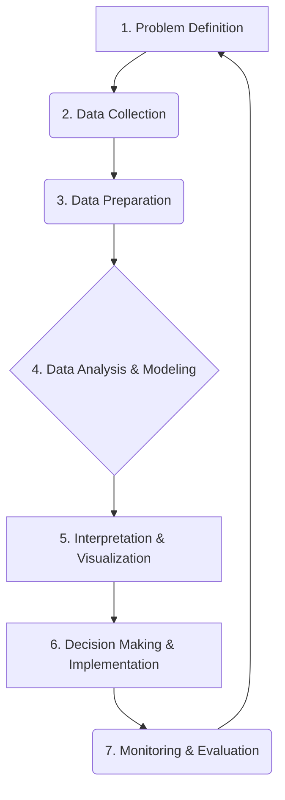

# INTRODUCTION TO BUSINESS ANALYTICS

## Module 1: Introduction to Business Analytics: Why Analytics

### Topic: Framework for Data Driven Decision Making

This module introduces the foundational concepts of business analytics, emphasizing its role as a competitive strategy and its importance in modern decision-making. This topic specifically delves into the structured approach to making decisions informed by data.

---

### 1. Learning Outcomes Covered:

*   **Understanding the Fundamentals of Business Analytics:** This topic lays the groundwork for understanding what business analytics is and why it's crucial.
*   **Importance of Analytics in Decision Making and Problem Solving:** The framework directly addresses how analytics transforms decision-making from intuition-based to data-driven.
*   **Application of Descriptive Analytics in Decision Making:** While not the sole focus, understanding the framework inherently involves recognizing where descriptive analytics fits in the initial stages.
*   **Data Visualization and Various Types of Visual Charts:** The framework necessitates the ability to present and interpret data visually.
*   **Apply Simple Linear Regression Model in Predictive Analytics Problems:** This framework sets the stage for understanding the need for predictive models.
*   **Understand the Basic Concepts in Prescriptive Analytics:** The framework highlights the ultimate goal of moving towards prescriptive actions.
*   **Understand the Essence of Business Performance Management and Analytics in Business Support Functions:** The framework demonstrates how data-driven decisions impact overall business performance.

---

### 2. Key Concepts and Definitions:

*   **Business Analytics (BA):** The systematic computational analysis of historical and current data to provide insights and support for business decision making. It involves the use of statistical analysis, data mining, predictive modeling, and other analytical techniques to gain a better understanding of business operations and to identify opportunities for improvement. (Sharda, Delen, & Turban, 2018)

*   **Data-Driven Decision Making (DDDM):** A process that involves using data to guide and inform strategic and operational decisions. It moves away from relying solely on intuition, experience, or gut feelings.

*   **Framework for Data-Driven Decision Making:** A structured, systematic approach or methodology that organizations follow to leverage data for making informed and effective decisions. This framework typically involves a series of steps that guide the process from identifying a problem or opportunity to implementing and monitoring the solution.

*   **Analytics Process Model:** A conceptual model that outlines the steps involved in applying analytics to solve business problems. (Prasad & Acharya, 2016)

*   **Key Performance Indicators (KPIs):** Measurable values that demonstrate how effectively a company is achieving key business objectives.

*   **Descriptive Analytics:** The use of data aggregation and data mining to provide insights into the past. It answers the question: "What happened?" (Kumar, 2017)
    *   *Example:* Sales reports showing the total revenue generated last quarter.

*   **Diagnostic Analytics:** Builds on descriptive analytics to understand why something happened. It involves digging deeper into the data to find root causes. It answers the question: "Why did it happen?"
    *   *Example:* Analyzing why sales declined in a specific region, perhaps due to a new competitor or a marketing campaign failure.

*   **Predictive Analytics:** Uses statistical models, data mining techniques, and machine learning to predict future outcomes. It answers the question: "What is likely to happen?"
    *   *Example:* Forecasting future sales based on historical trends and market conditions.

*   **Prescriptive Analytics:** Uses optimization and simulation algorithms to advise on possible outcomes and to identify the best course of action. It answers the question: "What should we do?"
    *   *Example:* Recommending the optimal pricing strategy to maximize profit, considering various market factors.

---

### 3. The Framework for Data-Driven Decision Making:

A common and effective framework for data-driven decision making can be broken down into several key stages. While the exact terminology might vary slightly across different texts, the core process remains consistent. This framework is essential for understanding how BA is applied in practice.

#### Stage 1: Problem Definition and Understanding

*   **Objective:** Clearly articulate the business problem or opportunity that needs to be addressed.
*   **Key Activities:**
    *   Identify the specific business question or goal.
    *   Define the scope of the problem.
    *   Determine the desired outcome or what constitutes success.
    *   Understand the business context and constraints.
*   **Relation to Course Outcomes:** Directly supports CO1 and CO2 by emphasizing the business context for analytics.
*   **Textbook Reference:** Sharda, Delen, & Turban (2018) highlight the importance of aligning analytics initiatives with business objectives.

#### Stage 2: Data Collection and Acquisition

*   **Objective:** Gather relevant data from various sources.
*   **Key Activities:**
    *   Identify data sources (internal databases, external data providers, surveys, web analytics, social media, etc.).
    *   Determine the type and volume of data required.
    *   Ensure data is accessible and in a usable format.
*   **Relation to Course Outcomes:** Essential for all stages, as data is the foundation of analytics.
*   **Textbook Reference:** Prasad & Acharya (2016) discuss various data sources and the challenges of data acquisition.

#### Stage 3: Data Preparation and Cleaning

*   **Objective:** Transform raw data into a usable and consistent format for analysis.
*   **Key Activities:**
    *   **Data Cleaning:** Handling missing values, removing duplicates, correcting errors, and addressing inconsistencies.
    *   **Data Transformation:** Converting data formats, normalizing or standardizing values, creating new variables (feature engineering).
    *   **Data Integration:** Combining data from multiple sources.
*   **Relation to Course Outcomes:** Crucial for ensuring the quality of insights, impacting all subsequent analytics applications.
*   **Textbook Reference:** Kumar (2017) emphasizes data quality as a critical success factor. Maheshwari (2017) provides detailed techniques for data cleaning.

#### Stage 4: Data Analysis and Modeling

*   **Objective:** Apply analytical techniques to extract insights and build models.
*   **Key Activities:**
    *   **Exploratory Data Analysis (EDA):** Using descriptive statistics and data visualization to understand data patterns, identify relationships, and detect anomalies. This is where descriptive analytics is heavily used.
    *   **Applying Analytical Techniques:** Implementing statistical methods, machine learning algorithms, and optimization techniques based on the problem type.
    *   **Model Building:** Developing predictive or prescriptive models.
*   **Relation to Course Outcomes:** Directly supports CO2, CO3, CO4, CO5, and CO6 by detailing the analytical steps.
*   **Textbook Reference:**
    *   *Descriptive Analytics:* Kumar (2017) details various descriptive statistics and their application.
    *   *Data Visualization:* Laursen & Thorlund (2017) discuss how to effectively visualize data for insights. Evans (2019) covers various charting techniques.
    *   *Predictive Analytics:* Kumar (2017) and Prasad & Acharya (2016) cover regression and other predictive modeling techniques.
    *   *Prescriptive Analytics:* Sharda, Delen, & Turban (2018) introduce optimization concepts.

#### Stage 5: Interpretation and Visualization of Results

*   **Objective:** Understand the findings from the analysis and communicate them effectively.
*   **Key Activities:**
    *   Interpreting model outputs and statistical results.
    *   Creating meaningful visualizations (charts, graphs, dashboards) to communicate insights to stakeholders.
    *   Translating technical findings into business language.
*   **Relation to Course Outcomes:** Directly supports CO4 by emphasizing the communication of insights. CO2 is supported by making findings understandable for decision-making.
*   **Textbook Reference:** Laursen & Thorlund (2017) and Evans (2019) provide extensive guidance on data visualization.

#### Stage 6: Decision Making and Implementation

*   **Objective:** Use the insights and model recommendations to make informed decisions and implement them.
*   **Key Activities:**
    *   Evaluating the insights and recommendations against business objectives.
    *   Making strategic or operational decisions based on the data.
    *   Implementing the chosen course of action.
*   **Relation to Course Outcomes:** Directly supports CO1 and CO2 by bridging analysis to business strategy and decision making. CO7 is relevant as these decisions impact business performance.
*   **Textbook Reference:** Sharda, Delen, & Turban (2018) emphasize the managerial perspective and the integration of analytics into business processes.

#### Stage 7: Monitoring and Evaluation

*   **Objective:** Track the impact of the implemented decisions and iterate as needed.
*   **Key Activities:**
    *   Monitoring key performance indicators (KPIs) related to the decision.
    *   Evaluating the effectiveness of the implemented solution.
    *   Gathering feedback and identifying areas for improvement.
    *   Refining models or processes based on new data or outcomes.
*   **Relation to Course Outcomes:** Supports CO2 and CO7 by ensuring continuous improvement and effective business performance management.
*   **Textbook Reference:** Prasad & Acharya (2016) discuss the iterative nature of analytics projects and the importance of feedback loops.

---

### 4. Visualizing the Framework:

The framework can be visualized as a cyclical or iterative process, emphasizing that data-driven decision-making is not a one-time event but an ongoing cycle of learning and improvement.

---

### 5. Examples of the Framework in Action:

**Scenario: An E-commerce Company Wants to Reduce Customer Churn**

1.  **Problem Definition:** Reduce the rate at which existing customers stop purchasing from the company by 15% within the next six months.
2.  **Data Collection:** Gather data on customer demographics, purchase history, website activity (visits, time spent, cart abandonment), customer service interactions, marketing campaign responses, and competitor activities.
3.  **Data Preparation:** Clean the data by handling missing customer contact information, standardizing product categories, and creating new features like "customer tenure" or "average order value."
4.  **Data Analysis & Modeling:**
    *   **Descriptive:** Analyze churned customers' characteristics. Identify common patterns (e.g., customers who haven't purchased in 3 months, those with low engagement).
    *   **Diagnostic:** Investigate why certain customer segments churned (e.g., analyze negative customer service feedback, compare pricing with competitors).
    *   **Predictive:** Build a churn prediction model using logistic regression or decision trees to identify customers at high risk of churning.
    *   **Prescriptive:** Develop a strategy based on predictions. Recommend targeted retention offers (discounts, personalized recommendations) for high-risk customers.
5.  **Interpretation & Visualization:** Create a dashboard showing the predicted churn rate by customer segment. Visualize the key factors contributing to churn. Present findings to the marketing and sales teams.
6.  **Decision Making & Implementation:** Decide to implement a targeted email campaign offering a special discount to customers flagged as high-risk by the predictive model.
7.  **Monitoring & Evaluation:** Track the churn rate of the targeted group versus a control group. Monitor the response rate to the retention offers and customer feedback. Adjust the campaign offers based on results.

---

### 6. Practice Questions/Exercises:

**Question 1:**
A retail company is experiencing a decline in sales for a particular product line. Which stage of the data-driven decision-making framework would be most critical for understanding *why* this decline is happening?

**(a) Data Collection**
**(b) Data Preparation**
**(c) Data Analysis and Modeling (specifically diagnostic analytics)**
**(d) Decision Making and Implementation**

**Question 2:**
Which type of analytics answers the question "What should we do?"

**(a) Descriptive Analytics**
**(b) Diagnostic Analytics**
**(c) Predictive Analytics**
**(d) Prescriptive Analytics**

**Question 3:**
Describe the main objective of the "Data Preparation and Cleaning" stage in the framework. Why is it important?

**Question 4:**
Provide an example of a business decision that could be informed by predictive analytics.

---

### 7. Answers to Practice Questions:

**Answer 1:**
**(c) Data Analysis and Modeling (specifically diagnostic analytics)**
Diagnostic analytics is designed to uncover the root causes of past events, making it the most appropriate stage for understanding *why* sales have declined.

**Answer 2:**
**(d) Prescriptive Analytics**
Prescriptive analytics goes beyond predicting the future to recommending specific actions to achieve desired outcomes.

**Answer 3:**
The main objective of the "Data Preparation and Cleaning" stage is to transform raw, potentially messy data into a clean, consistent, and usable format suitable for analysis. This is crucial because the quality of insights derived from data is directly dependent on the quality of the data itself. Poor data quality can lead to inaccurate analyses, flawed models, and ultimately, poor decision-making. This stage ensures accuracy, reliability, and efficiency in subsequent analytical processes.

**Answer 4:**
An example of a business decision informed by predictive analytics could be:
A telecommunications company using predictive analytics to identify customers who are likely to switch to a competitor in the next three months. Based on this prediction, the company can proactively offer targeted incentives (e.g., discounts, improved service plans, loyalty rewards) to these high-risk customers to retain them.

---

### 8. Important Points to Remember:

*   **Data is the foundation:** High-quality data is essential for effective data-driven decision-making.
*   **Iterative Process:** The framework is often cyclical, requiring continuous monitoring, evaluation, and refinement.
*   **Business Alignment:** Analytics efforts must always be aligned with clear business objectives.
*   **Communication is Key:** Insights derived from data need to be communicated clearly and concisely to stakeholders.
*   **Evolution of Analytics:** Understanding the progression from descriptive to prescriptive analytics is crucial for leveraging data's full potential.
*   **Managerial Perspective:** Business analytics is not just about technical skills; it's about applying those skills to solve business problems and drive strategic value (Sharda, Delen, & Turban, 2018).

---

### 9. Alignment with Course Outcomes:

*   **CO1 (Fundamentals & Competitive Strategy):** The framework demonstrates how data-driven decision-making forms the backbone of competitive strategies in modern organizations.
*   **CO2 (Importance in Decision Making & Problem Solving):** The framework explicitly outlines how analytics supports informed decision-making and problem-solving across business functions.
*   **CO3 (Descriptive Analytics):** The "Data Analysis and Modeling" stage highlights the initial use of descriptive analytics to understand current and past situations.
*   **CO4 (Data Visualization):** The "Interpretation and Visualization of Results" stage emphasizes the critical role of visualization in communicating data insights effectively.
*   **CO5 (Predictive Analytics):** The framework sets the context for the need for predictive models, which are developed and used in the analysis stage.
*   **CO6 (Prescriptive Analytics):** The framework points towards prescriptive analytics as the ultimate goal of using data to recommend actions.
*   **CO7 (Business Performance Management):** The "Monitoring and Evaluation" stage directly relates to managing business performance and understanding the impact of data-informed decisions.

---

This comprehensive set of notes provides a foundational understanding of the framework for data-driven decision-making, integrating concepts from the specified textbooks and aligning with the course's learning and outcome objectives.

## Videos

| Resource Type | Recommended Video |
| :--- | :--- |
| ⚡ **Quick Concept** | [Watch Summary & Animations](https://www.youtube.com/watch?v=uDlaoV2V-bU) |
| 🎓 **Exam Deep Dive** | [Watch Comprehensive University Lecture](https://www.youtube.com/watch?v=r_GkEaC4T70) |
| ✍️ **Problem Solving** | [Watch Solved Examples & Numericals](https://www.youtube.com/watch?v=KzE_56Hk5B8) |
