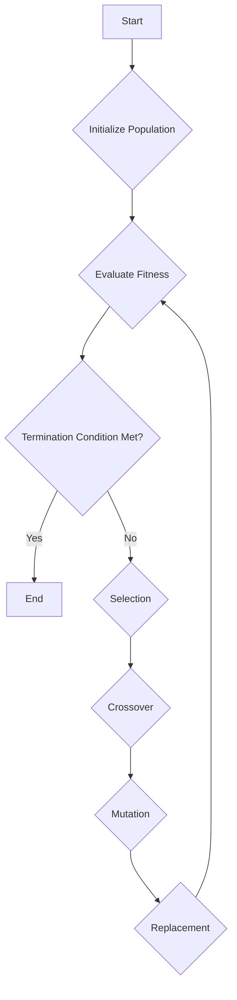

# OPTIMIZATION TECHNIQUES: Module 4: Introduction to Genetic Algorithm

## Topic: Basic GA Framework

### 1. Introduction to Genetic Algorithms (GAs)

Genetic Algorithms (GAs) are a class of evolutionary algorithms inspired by the process of natural selection. They are powerful heuristic search methods used to find approximate solutions to optimization and search problems, especially those that are complex, non-linear, or have a large search space. GAs are particularly useful for problems where traditional optimization methods might struggle.

**Key Concept:** GAs mimic the principles of biological evolution, such as inheritance, mutation, selection, and crossover, to iteratively improve a population of potential solutions.

**Learning Outcome Covered:** This topic introduces the fundamental concepts of GAs, which are a "modern method of optimization" as per CO4. The framework itself is a method for approaching optimization problems.

**Reference:**
*   **Rao, S.S. (2011):** While Rao's book focuses heavily on classical optimization techniques, it often introduces metaheuristics like GAs as extensions for handling complex problems, particularly in Chapter 15 ("Heuristic Optimization Methods"). It emphasizes their ability to escape local optima.
*   **Deb, K. (2012):** Deb's book is a cornerstone for evolutionary computation. It provides a comprehensive theoretical and practical introduction to GAs, detailing their components and how they work.

---

### 2. The Basic GA Framework: A Step-by-Step Overview

The basic GA framework consists of a series of interconnected steps that are executed iteratively.

**Key Concept:** The GA operates on a population of candidate solutions, referred to as "chromosomes" or "individuals." Each individual represents a potential solution to the problem.

#### 2.1. Initialization

The process begins by creating an initial population of candidate solutions. This population is typically generated randomly to ensure a diverse exploration of the search space.

*   **Population Size (N):** The number of individuals in the population. A larger population generally leads to better exploration but requires more computational resources.
*   **Encoding:** Solutions are encoded into a genetic representation, most commonly a binary string (chromosome). Each bit in the chromosome represents a parameter or a feature of the solution.
    *   **Example:** For a function $f(x) = x^2$ where $x$ is an integer between 0 and 15, a chromosome could be a 4-bit binary string representing $x$. For example, binary `0101` (decimal 5) represents $x=5$.
*   **Random Generation:** The initial population is usually generated randomly.

**Learning Outcome Covered:** This step is foundational to applying GAs as a "modern method of optimization" (CO4).

**Reference:**
*   **Deb, K. (2012):** Chapter 2 of Deb's book extensively discusses various encoding schemes, including binary, integer, and real-valued encodings, and the process of initializing a population.

#### 2.2. Fitness Evaluation

Each individual in the current population is evaluated based on a "fitness function." This function quantifies how good a particular solution is. For maximization problems, fitness is directly related to the objective function value. For minimization problems, the objective function is usually transformed into a fitness measure (e.g., by taking the reciprocal or subtracting from a large constant).

*   **Fitness Function:** A function that assigns a score to each individual, indicating its suitability.
*   **Objective Function:** The function that needs to be optimized (minimized or maximized).
*   **Mapping:** The objective function is mapped to the fitness function.
    *   **Maximization:** Fitness = Objective Function
    *   **Minimization:** Fitness = $1 / (\text{Objective Function} + \epsilon)$ or Fitness = Max_Objective - Objective (where $\epsilon$ is a small positive constant to avoid division by zero).

**Learning Outcome Covered:** This step is crucial for all optimization problems, as it defines how solutions are measured against the problem's goals. It directly supports CO4 by enabling the evaluation of solutions found using GAs.

**Reference:**
*   **Rao, S.S. (2011):** Discusses fitness functions in the context of evolutionary algorithms, emphasizing the transformation required for minimization problems.
*   **Deb, K. (2012):** Chapter 3 is dedicated to fitness evaluation and discusses various methods for designing effective fitness functions.

#### 2.3. Selection

In this step, individuals are selected from the current population to become "parents" for the next generation. Selection is based on their fitness, meaning fitter individuals have a higher probability of being chosen. This ensures that better solutions are more likely to propagate their genetic material to subsequent generations.

*   **Selection Methods:**
    *   **Roulette Wheel Selection:** Individuals are selected with a probability proportional to their fitness. Imagine a roulette wheel where each individual occupies a slice proportional to its fitness.
    *   **Tournament Selection:** A small subset of individuals is randomly chosen, and the fittest among them is selected. This process is repeated to select parents.
    *   **Rank Selection:** Individuals are ranked based on their fitness, and selection probability is assigned based on rank, not absolute fitness value. This prevents premature convergence due to super-fit individuals dominating early on.
    *   **Stochastic Universal Sampling:** A more advanced method that aims to reduce sampling error by selecting multiple individuals in one go.

**Learning Outcome Covered:** Selection is a core evolutionary operator that drives the search towards better solutions, thus supporting CO4.

**Example:** Consider a population with fitness values: A=10, B=5, C=15, D=20. Total fitness = 50.
*   **Roulette Wheel Probabilities:**
    *   A: 10/50 = 0.2
    *   B: 5/50 = 0.1
    *   C: 15/50 = 0.3
    *   D: 20/50 = 0.4

**Reference:**
*   **Deb, K. (2012):** Chapter 4 provides detailed explanations and comparisons of various selection strategies.
*   **Rao, S.S. (2011):** Might briefly touch upon selection as a mechanism for survival of the fittest.

#### 2.4. Genetic Operators (Reproduction)

Once parents are selected, genetic operators are applied to create offspring, which form the next generation. The primary operators are crossover and mutation.

##### 2.4.1. Crossover (Recombination)

Crossover combines genetic material from two parent chromosomes to create one or more offspring chromosomes. This allows for the exploration of new regions in the search space by combining potentially good features from different parents.

*   **Crossover Probability ($P_c$):** The probability that crossover will occur between two selected parents. Typically high (e.g., 0.7 to 0.95).
*   **Crossover Methods:**
    *   **Single-Point Crossover:** A random crossover point is chosen, and the genetic material after that point is swapped between the two parents.
        *   **Example:** Parent 1: `11010|01101` Parent 2: `00101|10010` -> Offspring 1: `1101010010` Offspring 2: `0010101101`
    *   **Two-Point Crossover:** Two crossover points are chosen, and the genetic material between these points is swapped.
    *   **Uniform Crossover:** Each gene in the offspring is determined by a coin flip, choosing from the corresponding genes of the parents.
    *   **Arithmetic Crossover (for real-valued encoding):** Offspring are generated as a linear combination of parents, e.g., Offspring1 = $\alpha \times$ Parent1 + $(1-\alpha) \times$ Parent2.

**Learning Outcome Covered:** Crossover is a key operator for generating new solutions and exploring the search space, contributing to CO4.

**Reference:**
*   **Deb, K. (2012):** Chapter 5 is dedicated to crossover operators, detailing various types and their applications.

##### 2.4.2. Mutation

Mutation introduces random changes into the chromosomes of offspring. This is crucial for maintaining genetic diversity within the population and preventing premature convergence to local optima. It allows the GA to explore new areas of the search space that might not be reachable through crossover alone.

*   **Mutation Probability ($P_m$):** The probability that a gene (or bit) in a chromosome will be mutated. Typically low (e.g., 0.001 to 0.05).
*   **Mutation Methods:**
    *   **Bit Flip Mutation (for binary encoding):** A randomly selected bit is flipped from 0 to 1 or 1 to 0.
        *   **Example:** Chromosome: `1101001101` Mutated Chromosome: `1101101101` (The 5th bit flipped)
    *   **Swap Mutation (for permutation encoding):** Two randomly selected genes are swapped.
    *   **Random Resetting (for integer/real-valued encoding):** A gene is replaced with a randomly generated value within its allowed range.

**Learning Outcome Covered:** Mutation ensures exploration and diversity, preventing local optima, which is essential for effective optimization via modern techniques (CO4).

**Reference:**
*   **Deb, K. (2012):** Chapter 6 covers mutation operators and their importance in GA performance.

#### 2.5. Replacement (Population Update)

After generating offspring, they replace individuals in the current generation to form the new population. There are several strategies for this:

*   **Generational Replacement:** The entire parent population is replaced by the offspring population.
*   **Steady-State Replacement:** Only a few individuals (usually the worst ones) in the parent population are replaced by the new offspring. This maintains some of the good individuals from the previous generation.

**Learning Outcome Covered:** This step completes the cycle of generating a new generation, contributing to the overall "modern method of optimization" (CO4).

**Reference:**
*   **Deb, K. (2012):** Chapter 7 discusses different replacement strategies and their impact on convergence.

#### 2.6. Termination Condition

The iterative process of selection, crossover, and mutation continues until a predefined termination condition is met.

*   **Common Termination Conditions:**
    *   **Maximum Number of Generations:** The algorithm stops after a fixed number of iterations.
    *   **Target Fitness Value:** The algorithm stops when a solution with a satisfactory fitness level is found.
    *   **No Improvement:** The algorithm stops if the best fitness value in the population has not improved for a specified number of generations.
    *   **Convergence:** The population becomes too homogeneous, and there is little diversity left.

**Learning Outcome Covered:** Termination is crucial for any algorithm to know when to stop searching and provide a solution, applicable to all course outcomes requiring a solution. Specifically relevant to CO4 as it defines the end of the search process for a modern method.

---

### 3. The Basic GA Cycle

The entire GA process can be summarized as a cycle:

1.  **Initialize** population.
2.  **Evaluate** fitness of each individual.
3.  **Check Termination:** If satisfied, **stop** and return the best individual found.
4.  **Select** parents based on fitness.
5.  **Apply Crossover** to parents to create offspring.
6.  **Apply Mutation** to offspring.
7.  **Replace** old population with new population (offspring).
8.  Go back to Step 2.

**Diagrammatic Representation:**

**Important Point to Remember:** The GA is an iterative process that progressively refines a population of solutions.

---

### 4. GA for Different Optimization Problems

The basic GA framework is versatile and can be applied to a wide range of optimization problems.

*   **Unconstrained Nonlinear Optimization:** This is a primary application area where GAs excel at finding global optima for complex, non-convex functions.
    *   **Example:** Finding the minimum of the Rosenbrock function: $f(x, y) = (1-x)^2 + 100(y-x^2)^2$.
        *   **Encoding:** $x$ and $y$ can be encoded as real-valued numbers or binary strings.
        *   **Fitness:** For minimization, fitness would be inversely proportional to $f(x, y)$.
    *   **CO3 Alignment:** GAs can be used to find solutions for nonlinear unconstrained optimization problems (Knowledge Level: K3) by treating them as a search problem.
    *   **CO4 Alignment:** GAs are a prime example of "modern methods of optimization" applied to these problems (Knowledge Level: K3).

*   **Constrained Optimization:** Constraints can be handled by modifying the fitness function (penalty methods) or by designing specialized operators.
    *   **Penalty Methods:** Add a penalty term to the objective function if an individual violates a constraint.
        *   **Example:** For minimizing $f(x)$ subject to $g(x) \le 0$, the penalized objective could be $f(x) + P(x)$, where $P(x) = 0$ if $g(x) \le 0$ and $P(x)$ is a large positive value if $g(x) > 0$.

*   **Combinatorial Optimization:** Problems involving discrete choices, such as the Traveling Salesperson Problem (TSP) or scheduling problems.
    *   **Example (TSP):** Find the shortest route visiting a set of cities exactly once.
        *   **Encoding:** A permutation of cities, e.g., `[City1, City3, City2, City4]`.
        *   **Fitness:** Inverse of the total tour length.
    *   **CO4 Alignment:** GAs are very effective for combinatorial optimization problems (Knowledge Level: K3).
    *   **CO2 Alignment:** While GAs aren't the *direct* method for shortest path algorithms (like Dijkstra's), they can be used to find good solutions for variations of TSP or route planning problems that can be framed as optimization tasks.

**Important Point to Remember:** The choice of encoding and genetic operators is crucial for effectively applying GAs to different problem types.

---

### 5. Practice Questions and Exercises

**Question 1:**
Explain the role of each of the following in the basic GA framework:
a) Initialization
b) Fitness Function
c) Selection
d) Crossover
e) Mutation

**Answer 1:**
a) **Initialization:** Creates the first generation of candidate solutions, typically randomly, to cover the search space.
b) **Fitness Function:** Evaluates the quality or performance of each candidate solution, guiding the search towards better solutions.
c) **Selection:** Chooses individuals from the current population to be parents for the next generation, favoring fitter individuals.
d) **Crossover:** Combines genetic material from two parents to create new offspring, exploring new solution combinations.
e) **Mutation:** Introduces random changes in offspring to maintain genetic diversity and prevent premature convergence to local optima.

---

**Question 2:**
Consider a maximization problem with the following objective function values for a population of 4 individuals:
Individual A: 75
Individual B: 30
Individual C: 90
Individual D: 60

Calculate the probabilities of selection for each individual using Roulette Wheel Selection.

**Answer 2:**
Total Fitness = 75 + 30 + 90 + 60 = 255

Probabilities:
*   Individual A: 75 / 255 ≈ 0.294
*   Individual B: 30 / 255 ≈ 0.118
*   Individual C: 90 / 255 ≈ 0.353
*   Individual D: 60 / 255 ≈ 0.235

---

**Question 3:**
Given two parent chromosomes for a binary-encoded problem:
Parent 1: `11010110`
Parent 2: `00111001`

Perform single-point crossover with the crossover point after the 4th bit. Show the two resulting offspring.

**Answer 3:**
Parent 1: `1101|0110`
Parent 2: `0011|1001`

Offspring 1 (Parent 1 prefix + Parent 2 suffix): `11011001`
Offspring 2 (Parent 2 prefix + Parent 1 suffix): `00110110`

---

**Question 4:**
If a chromosome `011010` undergoes bit flip mutation at the 3rd bit and the 6th bit, what is the resulting chromosome?

**Answer 4:**
Original Chromosome: `011010`
Mutation at 3rd bit (flips 1 to 0): `010010`
Mutation at 6th bit (flips 0 to 1): `010011`

Resulting Chromosome: `010011`

---

**Question 5:**
Explain why mutation is important in a Genetic Algorithm.

**Answer 5:**
Mutation is crucial because it introduces new genetic material and maintains diversity within the population. Without mutation, the GA might converge prematurely to a local optimum, as the population could become too homogeneous and lack the variation needed to explore other promising regions of the search space. Mutation allows the algorithm to escape local optima and discover potentially better global solutions.

---

### 6. Important Points to Remember

*   **Stochastic Nature:** GAs are probabilistic algorithms; repeated runs on the same problem may yield slightly different results.
*   **Parameter Tuning:** The performance of a GA is highly dependent on parameter settings (population size, crossover probability, mutation probability). These often require experimentation.
*   **Encoding is Key:** The way solutions are represented (encoded) significantly impacts the GA's effectiveness.
*   **Fitness Function Design:** A well-designed fitness function is critical for guiding the search correctly.
*   **Local vs. Global Optima:** GAs are designed to find global optima, especially for complex, non-convex problems, but they don't guarantee finding the absolute best solution.

---

### 7. Alignment with Course Outcomes

*   **CO1 (Formulate the real world problem as Linear Programming Problem):** While GAs aren't directly LP solvers, understanding optimization frameworks (like GA) helps in appreciating the need for mathematical modeling and may inform how real-world problems can be simplified or transformed for different solution methods. (Indirect relevance to the *application* of optimization techniques).
*   **CO2 (Apply different methods of Game Theory, Network Tree and Shortest Path):** GAs can be applied to complex variations of network problems or routing problems that might not have efficient deterministic algorithms, thus providing solutions in these domains.
*   **CO3 (Find solutions for Nonlinear unconstrained optimization problems):** GAs are particularly well-suited for this. The basic GA framework is the fundamental approach for tackling such problems.
*   **CO4 (Apply modern methods of optimization for solving optimization problems):** The entire module and this topic are a direct instantiation of CO4. Genetic Algorithms are a cornerstone of modern heuristic and evolutionary optimization techniques.

---

This concludes the study notes for the Basic GA Framework. Remember to practice by applying these concepts to simple optimization problems.

## Videos

| Resource Type | Recommended Video |
| :--- | :--- |
| ⚡ **Quick Concept** | [Watch Summary & Animations](https://www.youtube.com/watch?v=uDlaoV2V-bU) |
| 🎓 **Exam Deep Dive** | [Watch Comprehensive University Lecture](https://www.youtube.com/watch?v=A182z4Z_H3U) |
| ✍️ **Problem Solving** | [Watch Solved Examples & Numericals](https://www.youtube.com/watch?v=e_Nl2Q2yK8c) |
